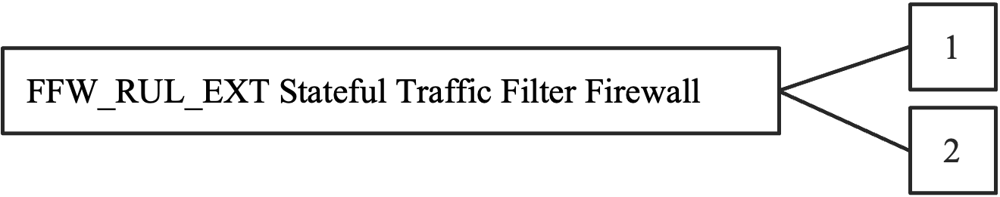

:toc:
:toclevels: 3
:toc-title!:
:toc-placement!:
:data-uri:
:revnumber: 1.5 Draft
:revdate: 03-10-2022

= PP-Module for Stateful Traffic Filter Firewalls

Version: {revnumber}

Date: {revdate}

== Acknowledgements 

This PP-Module was developed by the Network international Technical Community with representatives from industry, Government agencies, Common Criteria Test Laboratories, and members of academia.

== Preface

=== Objectives of Document

This document presents the Common Criteria (CC) PP-Module to express the security functional requirements (SFRs) and security assurance requirements (SARs) for a Stateful Traffic Filter Firewall in addition to the Base-PP for a Network Device specified below. Evaluation Activities for the Base-PP are given in [SD-ND] and the additional Evaluation Activities that specify the actions the evaluator performs to determine whether a product satisfies the additional SFRs captured within this PP-Module are described in [SD-FW].

=== Scope of Document

The scope of the PP-Module within the development and evaluation process is described in the Common Criteria for Information Technology Security Evaluation [CC]. In particular, a PP-Module defines the additional IT security requirements of a generic type of TOE and specifies the functional and assurance security measures to be offered by that TOE to meet stated requirements. A PP-Configuration results from the combination of at least one PP-Module with its Base-PPs, without any additional content (for details see [CC1], section 9.6).

=== Intended Readership

The target audiences of this PP-Module are developers, CC consumers, system integrators, evaluators and schemes.

Although the PP-Configuration, PP-Module and SDs may contain minor editorial errors, PP-Modules are recognized as living documents and the iTCs are dedicated to ongoing updates and revisions. Please report any issues to the NDFW iTC.

=== Related Documents

**Common Criteria**footnote:[For details see http://www.commoncriteriaportal.org/]

[width="100%",cols="16%,84%",]
|===
|[CC1] |Common Criteria for Information Technology Security Evaluation, +
Part 1: Introduction and General Model, +
CCMB-2017-04-001, Version 3.1 Revision 5, April 2017.
|[CC2] |Common Criteria for Information Technology Security Evaluation, +
Part 2: Security Functional Components, +
CCMB-2017-04-002, Version 3.1 Revision 5, April 2017.
|[CC3] |Common Criteria for Information Technology Security Evaluation, +
Part 3: Security Assurance Components, +
CCMB-2017-04-003, Version 3.1 Revision 5, April 2017.
|[CEM] |Common Methodology for Information Technology Security Evaluation, +
Evaluation Methodology, +
CCMB-2017-04-004, Version 3.1, Revision 5, April 2017.
|[Exact Conformance Addendum] |CC and CEM addenda, Exact Conformance, Selection-Based SFRs, Optional SFRs, May 2017, Version 0.5
|===

*Other Documents*

[width="100%",cols="16%,84%",]
|===
|[PP-ND] |collaborative Protection Profile for Network Devices, Version 2.2e, 27-March-2020
|[SD-FW] |Evaluation Activities for Stateful Traffic Filter Firewalls PP-Module, Version 1.4 + Errata 20200625, June 2020
|[SD-ND] |Evaluation Activities for Network Device cPP, Version 2.2, 20 December 2019
|===

=== Revision History

[width="100%",cols="17%,19%,63%,1%",options="header",]
|===
|*Version* |*Date* |*Description* |
|1.5 | |Addressing comments from CCMB |
|1.4e |25-June-2020 |Added link to allowed-with list for FW Module in chap. |
|1.4 |6-April-2020 |Version for NDcPP V2.2e |
|1.3 |27-September-2019 |Release version |
|1.2 |19-July-2019 |Integration of comments |
|1.1 |05-April-2019 |Updated PP-Module version of FWcPP |
|1.0 |26-November-2018 |First PP-Module version of FWcPP |
|===

== Contents

toc::[]

Figures / Tables

link:#_Ref527558222[Figure 1: Protected Communications SFR Architecture]

link:#_Toc37084886[Figure 2: Management SFR Architecture]

link:#_Ref527558234[Figure 3: Firewall Rules SFR Architecture]

link:#_Ref443331358[Table 1: Additional SFRs for Distributed TOEs]

link:#_Ref397359830[Table 2: SFRs and Auditable Events]

link:#_Ref397655544[Table 3: TOE Optional SFRs and Auditable Events]

link:#_Toc456887395[Table 4: SFR Dependencies Rationale for Mandatory SFRs]

link:#_Toc456887396[Table 5: SFR Dependencies Rationale for Optional SFRs]

link:#_Toc37084893[Table 6: SFR Coverage Mapping for Mandatory SFRs]

link:#_Toc37084894[Table 7: SFR Coverage Mapping for Optional SFRs]

link:#_Toc37084895[Table 8: SFR Sufficiency Rationale]

:sectnums: all
:sectnumlevels: 4

== Introduction

The scope of this PP-Module is to describe the security functionality of a firewall device in terms of [CC] and to define functional and assurance requirements for such products. This PP-Module is intended for use with the following Base-PPs:

* Collaborative Protection Profile for Network Device (NDcPP) version 2.2e

This Base-PP is valid because a firewall exists on the edge of a private network providing security and traffic filtering. This is functionality that typically will be implemented by a network device.

=== PP-Module Introduction

This chapter provides introduction to the PP-Module which consists of sections of the current document.

==== PP-Module Reference Identification

PP-Module Reference: PP-Module for Stateful Traffic Filter Firewalls

PP-Module Version: {revnumber}

PP-Module Date: {revdate}

Base-PP on which the PP-Module relies: collaborative Protection Profile for Network Devices, Version 2.2e, 27-March-2020

==== PP-Module TOE Overview

This PP-Module defines requirements for the evaluation of Stateful Traffic Filter Firewalls in addition to the requirements of the Base-PP which specifies requirements on network devices in general. A Stateful Traffic Filter Firewall shall be regarded as a specific type of network device which provides the security functions of residual information protection and stateful traffic filtering, in addition to those that are expected of all generic network devices. Occurrences of the term 'Network Device' in the Base-PP shall be read as 'Stateful Traffic Filter Firewall' when used in conjunction with this PP-Module, as a TOE that conforms to this PP-Module will also conform to the Base-PP. Such products are generally boundary protection devices, such as dedicated firewalls, routers, or perhaps even switches designed to control the flow of information between attached networks. While in some cases, firewalls implementing security features serve to segregate two distinct networks – a trusted or protected enclave and an untrusted internal or external network such as the Internet – that is only one of many possible applications. It is common for firewalls to have multiple physical network connections enabling a wide range of possible configurations and network information flow policies.

No requirements related to virtualization are contained in this document because this topic is covered in the related Base-PP [PP-ND, 1.2].

An introduction to distributed TOEs is contained in the related Base-PP [PP-ND, 3].

==== PP-Module TOE Use Cases

The combination of the Base-PP and this PP-Module specifically addresses firewalls that perform network layer 3 and 4 stateful traffic filtering. A Stateful Traffic Filter Firewall is a device composed of hardware and software that is connected to two or more distinct networks and has an infrastructure role in the overall enterprise network.

Stateful traffic filtering is the idea that the firewall would keep track of the state of each connection through it and have the ability to drop packets that do not appear to belong to a valid flow. Information such as the TCP sequence number, ACKs, IP options are also kept by storing the metrics in dynamic state tables. Other considerations in the decision to accept, drop, or log packets are source and destination IP addresses and ports, or when the source or destination addresses are inconsistent with the configured interfaces.

Network devices that are marketed and sold as Stateful Traffic Filter Firewalls may also provide additional functionality, such as application filtering. To be evaluated against this PP-Module, a conformant TOE must claim conformance to a PP-Configuration that includes this PP-Module. Any product functionality that is not addressed by that PP-Configuration is considered to be outside the scope of evaluation and are not assessed as part of the evaluation process. In the future, additional PP-Modules may be created and included in PP-Configurations that provide a method to make security claims in relation to this additional functionality.

This PP-Module may be used in PP-Configurations together with other PP-Modules in the future, to provide additional features such as application filtering.

==== Consistency Rationale

The PP-Module specifies only one Base-PP and fully inherits the conformance claim of the Base-PP.

The PP-Module specifies a TOE type which is a specific instantiation ('Stateful Traffic Filter Firewall') of the more general TOE type defined in the Base-PP ('Network Device'). The PP-Module does not interpret any element of the Base-PP except for the impact of the more strict TOE type definition.

The PP-Module specifies only additional threats which are independent from the threats of the Base-PP and does not refine or interpret any threat defined in the Base-PP. The additional threats are mapped only to additional SFRs specified in this PP-Module (not to any SFRs defined in the Base-PP) as well as some supporting SFRs (FAU_GEN.1, FMT_SMF.1/FFW) that extend existing SFRs in the Base-PP to cover the needs of the SFRs additionally defined in this PP-Module. So Base-PP and PP-Module are fully consistent regarding the threat definition.

The PP-Module specifies no additional assumptions compared to the Base-PP and does not refine or interpret any assumption defined in the Base-PP. The assumption A.NO_THRU_TRAFFIC_PROTECTION defined in the Base-PP applies to the interfaces defined in the Base-PP only, though. The Base-PP and PP-Module therefore do not conflict with each other.

The PP-Module does not specify any additional Organizational Security Policies and does not refine or interpret any Organizational Security Policy defined in the Base-PP.

The Base-PP does not define explicit Objectives for the TOE, but maps threats and Organisational Security Policies directly to SFRs. In this PP-Module, explicit security objectives for the TOE are defined and mapped to the additional threats for the PP-Module (the TOE security objectives are then mapped to the additional SFRs in this PP-Module). The mapping of SPD to implicit TOE security objectives as in the Base-PP continues to hold, and this PP-Module only adds security objectives. Therefore, the security objectives for the TOE defined in this PP-Module do not contradict the security objectives for the TOE in the Base-PP.

The PP-Module does not specify any additional Security Objectives for the Environment and does not refine or interpret any Security Objectives for the Environment defined in the Base-PP. So Base-PP and PP-Module are consistent in this regard.

This PP-Module specifies only additional SFRs which are independent from the SFRs of the Base-PP except for the additional audit events specified for FAU_GEN.1 and the additional security management capabilities specified in FMT_SMF.1/FFW. The SFRs in the PP-Module add additional functionality, but do not overlap with the functionality or objects in the SFRs from the Base-PP. The PP-Module does not refine or modify any SFRs defined in the Base-PP. Therefore, the PP-Module is consistent with the Base-PP with regard to the SFRs.

All in all, this rationale demonstrates that a TOE can meet the TOE type descriptions provided in the Base-PP and in the PP-Module. A TOE can satisfy all the Base-PPs and the PP-Module SFRs. This consistency rationale demonstrates that the unions of the SPD, the objectives and the SFRs from the Base-PP and from the PP-Module do not lead to any contradiction. Due to the clear separation between the requirements of the Base-PP and the requirements of this PP-Module any correspondence tables would be trivial and have therefore been omitted.

== CC Conformance

=== PP-Module Conformance Claim

As defined by the references [CC1], [CC2] and [CC3], this PP-Module:

* conforms to the requirements of Common Criteria v3.1, Release 5
* is Part 2 extended, Part 3 conformant
* does not claim conformance to any PP, PP-Module or PP-Configuration.

This PP-Module inherits Exact Conformance as required from the specified Base-PP and as defined in [Exact Conformance Addendum]. This means that STs must claim exact conformance to PP-Configurations including this PP-Module and its Base-PP. The evaluation activities from [SD-FW] & [SD-ND] shall be used for the evaluation.

The 'FW Module allowed-with list' that specifies the packages and PP-Modules to which exact conformance can be claimed in conjunction with this Module, can be found at https://github.com/ND-iTC/PP-Module-FW/blob/main/FW_PP_Module_allowed_with_list.adoc .

== Introduction to Distributed TOEs

All considerations provided in the Base-PP about Distributed TOEs apply.

=== Allocation of Requirements in Distributed TOEs

All allocations of requirements in distributed TOEs as defined in the Base-PP apply. For the additional SFRs defined in this PP-Module the allocations specified in the table below apply. For a distributed TOE, the SFRs in this PP-Module need to be met by the TOE as a whole, but not all SFRs will necessarily be implemented by all components. The following categories are defined in order to specify when each SFR must be implemented by a component:

* *All Components (“All”)* – All components that comprise the distributed TOE must independently satisfy the requirement.
* *At least one Component (“One”)* – This requirement must be fulfilled by at least one component within the distributed TOE.
* *Feature Dependent (“Feature Dependent”)* – These requirements will only be fulfilled where the feature is implemented by the distributed TOE component (note that the requirement to meet the PP-Module as a whole requires that at least one component implements these requirements if they are specified in section 6).

Table 1 specifies how each of the additional SFRs in this PP-Module must be met, using the categories above.

[width="100%",cols="50%,25%,25%",options="header",]
|===
|*Requirement* |*Description* |*Distributed TOE SFR Allocation*
|FDP_RIP.2 |Full Residual Information Protection |Feature Dependent
|FFW_RUL_EXT.1 |Stateful traffic filtering |One
|FFW_RUL_EXT.2 |Stateful filtering of dynamic protocols |Feature Dependent
|FMT_SMF.1/FFW |Specification of Management Functions |Feature Dependent
|===
[#_Ref443331358]#Table 1: Additional SFRs for Distributed TOEs#

The ST for a distributed TOE must include a mapping of SFRs to each of the components of the TOE. (Note that this deliverable is examined as part of the ASE_TSS.1 and AVA_VAN.1 Evaluation Activities as described in [SD-ND, 5.1.2] and [SD-ND, 5.6.1.1] respectively.) The ST for a distributed TOE may also introduce a “minimum configuration” and identify components that may have instances added to an operational configuration without affecting the validity of the CC certification. [SD-ND, A.9 (was B.4)] describes Evaluation Activities relating to these equivalency aspects of a distributed TOE (and hence what is expected in the ST).

== Security Problem Definition

A Stateful Traffic Filter Firewall (defined to be a device that filters layers 3 and 4 (IP and TCP/UDP) network traffic optimized through the use of stateful packet inspection) is intended to provide a minimal, baseline set of requirements that are targeted at mitigating well defined and described threats.

It has the ability to match packets to a known active (and allowed) connection to permit them and drop others. The firewall often serves as a boundary device between two separate network security domains, and, as such, must provide a minimal set of common security functionality. These functional requirements define authorized communication with the firewall, audit capabilities, user access, update processes, and self-test procedures for critical components.

=== Threats 

The threats for the Stateful Traffic Filter Firewall are grouped according to functional areas of the device in the sections below. The description of each threat is then followed by a rationale describing how it is addressed by the SFRs in section 6 and Appendix A.

The threats defined in the Base-PP are not replicated here because they are fully covered by SFRs in the Base-PP.

==== Unauthorized Disclosure of Information

Devices on a protected network may be exposed to threats presented by devices located outside the protected network, which may attempt to conduct unauthorized activities. If known malicious external devices are able to communicate with devices on the protected network, or if devices on the protected network can establish communications with those external devices, then those internal devices may be susceptible to the unauthorized disclosure of information.

From an infiltration perspective, Stateful Traffic Filter Firewalls serve to limit access to only specific _destination_ network addresses and ports within a protected network. With these limits, general network port scanning can be prevented from reaching protected networks or machines, and access to information on a protected network can be limited to that obtainable from specifically configured ports on identified network nodes (e.g., web pages from a designated corporate web server). Additionally, access can be limited to only specific _source_ addresses and ports so that specific networks or network nodes can be blocked from accessing a protected network thereby further limiting the potential disclosure of information.

From an exfiltration perspective, Stateful Traffic Filter Firewalls serve to limit how network nodes operating on a protected network can connect to and communicate with other networks limiting how and where they can disseminate information. Specific external networks can be blocked altogether or egress could be limited to specific addresses and/or ports. Alternately, egress options available to network nodes on a protected network can be carefully managed in order to, for example, ensure that outgoing connections are routed through authorized proxies or filters to further mitigate inappropriate disclosure of data through extrusion.

===== T.NETWORK_DISCLOSURE

An attacker may attempt to “map” a subnet to determine the machines that reside on the network, and obtaining the IP addresses of machines, as well as the services (ports) those machines are offering. This information could be used to mount attacks to those machines via the services that are exported.

SFR Rationale:

* Requirements to prevent unauthorised disclosure of network information are defined in FFW_RUL_EXT.1 and FFW_RUL_EXT.2 supported by FMT_SMF.1/FFW.

==== Inappropriate Access to Services

Devices located outside the protected network may seek to exercise services located on the protected network that are intended to only be accessed from inside the protected network. Devices located outside the protected network may, likewise, offer services that are inappropriate for access from within the protected network.

From an ingress perspective, Stateful Traffic Filter Firewalls can be configured so that only those network servers intended for external consumption are accessible and only via the intended ports. This serves to mitigate the potential for network entities outside a protected network to access network servers or services intended only for consumption or access inside a protected network.

From an egress perspective, Stateful Traffic Filter Firewalls can be configured so that only specific external services (e.g., based on destination port) can be accessed from within a protected network. For example, access to external mail services can be blocked to enforce corporate policies against accessing uncontrolled e-mail servers. Note that the effectiveness of a Stateful Traffic Filter Firewall is rather limited in this regard since external servers can offer their services on alternate ports – this is where an Application Filter Firewall offers more reliable protection, for example.

===== T.NETWORK_ACCESS

With knowledge of the services that are exported by machines on a subnet, an attacker may attempt to exploit those services by mounting attacks against those services.

SFR Rationale:

* Requirements to prevent unauthorised access to protected devices and services are defined in FFW_RUL_EXT.1 and FFW_RUL_EXT.2 supported by FMT_SMF.1/FFW

==== Misuse of Services

Devices located outside a “protected” network, while permitted to access particular _public_ services offered inside the protected network, may attempt to conduct inappropriate activities while communicating with those allowed public services. Certain services offered from within a protected network may also represent a risk when accessed from outside the protected network. It should be noted that the firewall simply enforces rules that are specified for a network interface. The notion of a protected or trusted network is an abstraction that is useful when constructing the ruleset.

From an ingress perspective, it is generally assumed that entities operating on external networks are not bound by the use policies for a given protected network. Nonetheless, Stateful Traffic Filter Firewalls can log policy violations that might indicate violation of publicized usage statements for publicly available services.

From an egress perspective, Stateful Traffic Filter Firewalls can be configured to help enforce and monitor protected network use policies. As explained in the other threats, a Stateful Traffic Filter Firewall can serve to limit dissemination of data, access to external servers, and even disruption of services – all of these could be related to the use policies of a protected network and as such are subject in some regards to enforcement. Additionally, Stateful Traffic Filter Firewalls can be configured to log network usages that cross between protected and external networks and as a result can serve to identify potential usage policy violations.

===== T.NETWORK_MISUSE

An attacker may attempt to use services that are exported by machines in a way that is unintended by a site’s security policies. For example, an attacker might be able to use a service to “anonymize” the attacker’s machine as they mount attacks against others.

SFR Rationale:

* Requirements to prevent network misuse traffic are defined in FFW_RUL_EXT.1 and FFW_RUL_EXT.2 supported by FMT_SMF.1/FFW
* Requirements to prevent the unintended dissemination of data from packets after deletion are defined in FDP_RIP.2

==== Malicious Traffic

A Stateful Traffic Filter Firewall also provides protections against malicious or malformed packets. It will protect against attacks like modification of connection state information and replay attacks. These attacks could cause the firewall, or the devices it protects, to grant unauthorized access or even create a Denial of Service.

===== T.MALICIOUS_TRAFFIC

An attacker may attempt to send malformed packets to a machine in hopes of causing the network stack or services listening on UDP/TCP ports of the target machine to crash.

SFR Rationale:

* Requirements to prevent malformed traffic are defined in FFW_RUL_EXT.1

=== Assumptions

All Assumptions of the Base-PP apply also to this PP-Module. A.NO_THRU_TRAFFIC_PROTECTION is still operative, but only for the interfaces in the TOE that are defined by the Base-PP and not the PP-Module. This PP-Module extends the Base-PP threats (in section 4.1) to deal with traffic passing through the firewall, and addresses these additional threats with the TOE Security Objectives in section 5.1 and the SFRs (FDP_RIP.2, FFW_RUL_EXT.1, FFW_RUL_EXT.2, FMT_SMF.1/FFW) in section 6 and Appendix A.

=== Organizational Security Policy

An organizational security policy is a set of rules, practices, and procedures imposed by an organization to address its security needs. All organizational security policies of the Base-PP apply also to this PP-Module. No additional policies are defined.

== Security Objectives 

=== Security Objectives for the TOE

The following subsections describe objectives for the TOE. Since the Base-PP does not specify any Objectives for the TOE this section contains only additional Objectives for the TOE related to the PP-Module but independent from the Base-PP.

==== O.RESIDUAL_INFORMATION

The TOE shall implement measures to ensure that any previous information content of network packets sent through the TOE is made unavailable either upon deallocation of the memory area containing the network packet or upon allocation of a memory area for a newly arriving network packet or both.

==== O.STATEFUL_TRAFFIC_FILTERING

The TOE shall perform stateful traffic filtering on network packets that it processess. For this the TOE shall support the definition of stateful traffic filtering rules that allow to permit or drop network packets. The TOE shall support assignment of the stateful traffic filtering rules to each distinct network interface. The TOE shall support the processing of the applicable stateful traffic filtering rules in an administratively defined order. The TOE shall deny the flow of network packets if no matching stateful traffic filtering rule is identified.

Depending on the implementation, the TOE might support the stateful traffic filtering of Dynamic Protocols (optional).

=== Security Objectives for the Operational Environment

All objectives for the Operational Environment of the Base-PP apply also to this PP-Module. OE.NO_THRU_TRAFFIC_PROTECTION is still operative, but only for the interfaces in the TOE that are defined by the Base-PP and not the PP-Module.

===  Security Objectives Rationale 

==== Coverage for Objectives for the TOE

The following table provides a mapping of the objectives for the TOE to threats and policies, showing that each objective is covered by at least one threat or policy.

[width="100%",cols="51%,49%",]
|===
|*Objective for the TOE* |*Threat*
|O.RESIDUAL_INFORMATION |T.NETWORK_MISUSE
|O.STATEFUL_TRAFFIC_FILTERING |T.NETWORK_DISCLOSURE, T.NETWORK_ACCESS, T.NETWORK_MISUSE, T.MALICIOUS_TRAFFIC
|===

==== Coverage for Objectives for the Operational Environment

The following table provides a mapping of objectives for the operational environment to assumptions, showing that each objective for the operational environment is at least covered by one assumption or OSP.

[width="100%",cols="51%,49%",]
|===
|*Objective for the Operational Environment* |*Assumptions and OSPs*
|OE.PHYSICAL |A.PHYSICAL_PROTECTION
|OE.NO_GENERAL_PURPOSE |A.LIMITED_FUNCTIONALITY
|OE.TRUSTED_ADMIN |A.TRUSTED_ADMINISTRATOR
|OE.UPDATES |A.REGULAR_UPDATES
|OE.ADMIN_CREDENTIALS_SECURE |A.ADMIN_CREDENTIALS_SECURE
|OE.COMPONENTS_RUNNING |A.COMPONENTS_RUNNING
|OE.RESIDUAL_INFORMATION |A.RESIDUAL_INFORMATION
|===

==== Sufficiency for Objectives for the TOE

The following rationale provides justification that the security objectives are suitable to counter each individual threat and that each security objective tracing back to a threat, when achieved, actually contributes to the removal of that threat:

[width="100%",cols="40%,60%",options="header",]
|===
|*Threat* |*Rationale for security objectives to remove Threats*
|T.NETWORK_DISCLOSURE |The TOE prevents unauthorized disclosure of network information by the ability to define, assign and process stateful traffic filtering rules which can be used to deny unintended flow of information as defined in O.STATEFUL_TRAFFIC_FILTERING.
|T.NETWORK_ACCESS |The TOE prevents unauthorized access to protected devices and services by the ability to define, assign and process stateful traffic filtering rules as defined in O.STATEFUL_TRAFFIC_FILTERING.
|T.NETWORK_MISUSE a|
The TOE prevents network misuse traffic by the ability to define, assign and process stateful traffic filtering as defined in O.STATEFUL_TRAFFIC_FILTERING.

The TOE prevents the unintended dissemination of data from packets after deletion by making any previous information content of network packets sent through the TOE unavailable either upon deallocation of the memory area containing the network packet or upon allocation of a memory area for a (new?) network packet (or both) as defined in O.RESIDUAL_INFORMATION.

|T.MALICIOUS_TRAFFIC |The TOE prevents malformed traffic passing through the TOE by the ability to define, assign and process stateful traffic filtering rules as defined in O.STATEFUL_TRAFFIC_FILTERING.
|===

==== Sufficiency for Objectives for the Operational Environment

The following rationale provides justification that the security objectives for the environment are suitable to cover each individual assumption, that each security objective for the environment that traces back to an assumption about the environment of use of the TOE, when achieved, actually contributes to the environment achieving consistency with the assumption, and that if all security objectives for the environment that trace back to an assumption are achieved, the intended usage is supported:

[width="100%",cols="50%,50%",options="header",]
|===
|*Assumption* |*Rationale for security objectives for the environment*
|A.PHYSICAL_PROTECTION |The assumption that the TOE is physically protected against all unauthorized access attempts is addressed by the corresponding requirement in OE.PHYSICAL.
|A.LIMITED_FUNCTIONALITY |The assumption that the TOE does not provide any general purpose computing capabilities is addressed by the corresponding requirement in OE.NO_GENERAL_PURPOSE.
|A.TRUSTED_ADMINISTRATOR |The assumption that the Security Administrator is trusted is addressed by the corresponding requirement in OE.TRUSTED_ADMIN.
|A.REGULAR_UPDATES |The assumption that the devices firmware and software is updated regularly is addressed by the corresponding requirement in OE.UPDATES.
|A.ADMIN_CREDENTIALS_SECURE |The assumption that the Security Administrator’s credentials are protected by the platform they are stored on is addressed by the corresponding requirement in OE.ADMIN_CREDENTIALS_SECURE.
|A.COMPONENTS_RUNNING |The assumption that each component of a distributed system is functioning properly is satisfied by the fact that this is specified as an expectation by OE.COMPONENTS_RUNNING.
|A.RESIDUAL_INFORMATION |The assumption that the Security Administrator must ensure that there is no unauthorized access possible for sensitive residual information is addressed by the corresponding requirement in OE.RESIDUAL_INFORMATION.
|===

== Security Functional Requirements 

The individual SFRs are specified in the sections below. SFRs in this section are mandatory SFRs that any conformant TOE must meet. Additional optional SFRs may also be adopted from those listed in Appendix A.

For chapters 6.3 to 6.5 information is provided in each chapter whether the PP-Module specifies additional SFRs not existent in the Base-PP or whether the definitions in the PP-Module impact SFRs already existing in the Base-PP. The ST author has full discretion to complete all other assignments/selections, include/exclude optional SFRs/etc. of the Base-PP as desired because this PP-Module doesn’t impact them.

For a distributed TOE, the ST author should reference Table 1 for guidance on how each SFR should be met. The table details whether SFRs should be met by all TOE components, by at least one TOE component or whether they are dependent upon the feature being implemented by the TOE component. The ST for a distributed TOE must include a mapping of SFRs to each of the components of the TOE. (Note that this deliverable is examined as part of the ASE_TSS.1 and AVA_VAN.1 Evaluation Activities as described in [SD-ND, 5.1.2] and [SD-ND, 5.6.1.1] respectively.

The Evaluation Activities defined in [SD-ND] and [SD-FW] describe actions that the evaluator will take in order to determine compliance of a particular TOE with the SFRs. The content of these Evaluation Activities will therefore provide more insight into deliverables required from TOE Developers.

=== Conventions

The conventions used in descriptions of the SFRs are as follows:

* Unaltered SFRs are stated in the form used in [CC2] or their extended component definition (ECD);
* Refinement made in the PP: the refinement text is indicated with *bold text* and +++<del>+++strikethroughs+++</del>+++;
* Selection wholly or partially completed in the PP: the selection values (i.e. the selection values adopted in the PP or the remaining selection values available for the ST) are indicated with +++<u>+++underlined text.+++</u>+++
+
e.g. ‘[selection: _disclosure, modification, loss of use_]’ in [CC2] or an ECD might become ‘+++<u>+++disclosure’+++</u>+++ (completion) or ‘[selection: +++<u>+++disclosure+++</u>+++, +++<u>+++modification+++</u>+++]’ (partial completion) in the PP;
* Assignment wholly or partially completed in the PP: indicated with _italicized text_;
* Assignment completed within a selection in the PP: the completed assignment text is indicated with _+++<u>+++italicized and underlined text+++</u>+++_
+

e.g. [selection: _change_default, query, modify,
delete, [assignment: other operations]_
]’ in [CC2] or an ECD might become ‘+++<u>+++change_default+++</u>+++, _+++<u>+++select_tag_’+++</u>+++ (completion of both selection and assignment) or ‘[selection: +++<u>+++change_default+++</u>+++, _+++<u>+++select_tag, select_value+++</u>+++_]’ (partial completion of selection, and completion of assignment) in the PP;

* Iteration: indicated by adding a string starting with ‘/’ (e.g. ‘FCS_COP.1/Hash’).

Extended SFRs are identified by having a label ‘EXT’ at the end of the SFR name.

Where compliance to RFCs is referred to in SFRs, this is intended to be demonstrated by completing the corresponding Evaluation Activities in [SD-FW] and [SD-ND] for the relevant SFR.

=== SFR Architecture

An overview of the SFR Architecture can be found in the Base-PP [PP-ND, 6.2]. The figure about Protected Communications SFR Architecture in the Base-PP needs to be replaced by Figure 1 below because the PP-Module adds protection of packet contents (FDP_RIP.2). In addition to the SFR Architecture described in the Base-PP, Figure 3 below needs to be considered since it reflects the Firewall Rules SFR Architecture.

SFRs in Appendix A can be included in the ST if they are provided by the TOE, but are not mandatory in order for a TOE to claim conformance to this PP-Module.

[#_Ref527558222]#Figure 1: Protected Communications SFR Architecture#

[#_Toc37084886]#Figure 2: Management SFR Architecture#

[#_Ref527558234]#Figure 3: Firewall Rules SFR Architecture#

=== Security Audit (FAU)

For FAU there are no new SFRs defined in this PP-Module but there is an impact on SFRs existing already in the Base-PP as follows.

==== Security Audit Data Generation (FAU_GEN)

The SFRs of the FAU class as specified in the Base-PP apply also for this PP-Module. The table in the Base-PP specifying the auditable events and additional audit record contents for FAU_GEN.1 shall be amended by the following entries. Support of all auditable events defined in the table below is mandatory.

[width="100%",cols="44%,28%,28%",options="header",]
|===
|*Requirement* |*Auditable Events* |*Additional Audit Record Contents*
|FDP_RIP.2 |None. |None.
|FFW_RUL_EXT.1 |Application of rules configured with the ‘log’ operation a|
Source and destination addresses

Source and destination ports

Transport Layer Protocol

TOE Interface

|FMT_SMF.1/FFW |All management activities of TSF data (including creation, modification and deletion of firewall rules). |None.
|===

[#_Ref397359830]#Table 2: SFRs and Auditable Events#

*_Application Note {counter:appnote_count}_*

_Additional audit events will apply to the TOE depending on the optional requirements adopted from Appendix A. The ST author must therefore include the relevant additional events specified in Table 3 when the optional SFR FFW_RUL_EXT.2 is claimed._

=== User Data Protection (FDP)

This section requires the TOE to ensure that it does not reuse old packet information when transmitting new packets. The SFRs in this chapter are additional SFRs defined in this PP-Module which are not present in the Base-PP.

==== Residual information protection (FDP_RIP)

===== FDP_RIP.2 Full Residual Information Protection

*FDP_RIP.2 Full Residual Information Protection*

*FDP_RIP.2.1* The TSF shall ensure that any previous information content of a resource is made unavailable upon the [selection: _allocation of the resource to, deallocation of the resource from_] all objects.

*_Application Note {counter:appnote_count}_*

_“Resources” in the context of this requirement are network packets being sent through (as opposed to “to”, as is the case when a security administrator connects to the TOE) the TOE. The concern is that once a network packet is sent, the buffer or memory area used by the packet still contains data from that packet, and that if that buffer is re-used, those data might remain and make their way into a new packet._

=== Firewall (FFW)

The SFRs in this chapter are additional SFRs defined in this PP-Module which are not present in the Base-PP.

==== Stateful Traffic Filter Firewall (FFW_RUL_EXT)

To address the issues associated with unauthorized disclosure of information, inappropriate access to services, misuse of services, disruption or denial of services, and network-based reconnaissance, compliant TOE’s will implement a stateful traffic filtering capability. That capability will restrict the flow of network traffic between protected networks and other attached networks based on network addresses and ports of the network nodes originating (source) and/or receiving (destination) applicable network traffic as well as on established connection information.

Stateful packet inspection is used to aid in the performance of packet flow through the TOE. Rather than apply the ruleset against each packet that is processed at a TOE interface, the TOE will determine whether a packet belongs to an “approved” established connection. The minimum set of attributes that are used to determine whether a packet is part of an established session are mandated for TCP and UDP, and the ST author is allowed to expand the attributes considered for TCP sessions, and add the ICMP protocol if they desire.

Compliant TOEs will implement the ability to log the flow of network traffic. Specifically, the TOE will provide the means for administrators to configure firewall specific firewall rules to ‘log’ when network traffic is found to match the configured rule. As a result, matching a firewall rule configured to ‘log’ will result in informative event logs whenever a match occurs.

===== FFW_RUL_EXT.1 Stateful Traffic Filtering

*FFW_RUL_EXT.1 Stateful Traffic Filtering*

*FFW_RUL_EXT.1.1* The TSF shall perform stateful traffic filtering on network packets processed by the TOE.

*_Application Note {counter:appnote_count}_*

_This element identifies the policy (stateful traffic filtering) that is applied to the network packets that are processed at the TOE’s interfaces. Every packet that is received at a TOE’s interface either has the ruleset that expresses this policy applied, or it is determined that the packet belongs to an established connection. The remaining elements in this component provide the details of the policy._

_This requirement is to be enforced even if the network interface is saturated/overwhelmed with network traffic._

_It is important to note that the TOE, which also includes the underlying platform, cannot permit network packets to flow unless the ruleset contains a rule that permits the flow, or the packet is deemed to belong to an established connection that has been permitted to flow. This principle must hold true during TOE startup, and upon failures the TOE may encounter._

*FFW_RUL_EXT.1.2* The TSF shall allow the definition of stateful traffic filtering rules using the following network protocol fields:

* _ICMPv4_
** _Type_
** _Code_
* _ICMPv6_
** _Type_
** _Code_
* _IPv4_
** _Source address_
** _Destination Address_
** _Transport Layer Protocol_
* _IPv6_
** _Source address_
** _Destination Address_
** _Transport Layer Protocol_
** _[selection: IPv6 Extension header type [assignment: list of fields in IPv6 extension header], no other field]_
* _TCP_
** _Source Port_
** _Destination Port_
* _UDP_
** _Source Port_
** _Destination Port_

_and distinct interface._

*_Application Note {counter:appnote_count}_*

_This element identifies the various attributes that are applicable when constructing rules to be enforced by this requirement – the applicable interface is a property of the TOE and the rest of the identified attributes are defined in the associated RFCs. Note that the ‘Transport Layer Protocol’ is the IPv4/IPv6 field that identifies the applicable protocol, such as TCP, UDP, ICMP, or GRE. IPv6 extension headers are defined in RFC 2460 and the ST author may specify which fields within each supported extension header, if any may be used as attributes in the construction of an inspection rule. Also, ‘Interface’ identified above is the external port where the applicable network traffic was received or will be sent._

*FFW_RUL_EXT.1.3* The TSF shall allow the following operations to be associated with stateful traffic filtering rules: permit or drop with the capability to log the operation.

*_Application Note {counter:appnote_count}_*

_This element defines the operations that can be associated with rules used to match network traffic. Note that the data to be logged is identified in the Security Audit requirements in Table 2._

*FFW_RUL_EXT.1.4* The TSF shall allow the stateful traffic filtering rules to be assigned to each distinct network interface.

*_Application Note {counter:appnote_count}_*

_This element identifies where rules can be assigned. Specifically, a conforming TOE must be able to assign filtering rules to each of its available and distinct network interfaces that handle layer 3 and 4 network traffic. A distinct network interface can be physical or logical but it does not necessarily required to be visible from the network perspective (e.g. it does not need to have an IP address assigned to it)._

_Note that there could be a separate ruleset for each interface or alternately a shared ruleset that somehow associates rules with specific interfaces._

*FFW_RUL_EXT.1.5* The TSF shall:

[loweralpha]
. accept a network packet without further processing of stateful traffic filtering rules if it matches an allowed established session for the following protocols: [.underline]#TCP, UDP, [selection: _ICMP, no other protocols_]# based on the following _network packet attributes:_
[arabic]
.. _TCP: source and destination addresses, source and destination ports, sequence number, Flags;_
.. _UDP: source and destination addresses, source and destination ports;_
.. _[selection: ‘ICMP: source and destination addresses, type, [selection: code, [assignment: list of matching attributes]]’, no other protocols]._
. Remove existing traffic flows from the set of established traffic flows based on the following: [selection: _session inactivity timeout, completion of the expected information flow_].

*_Application Note {counter:appnote_count}_*

_This element requires that the protocols be identified for which the TOE can determine and manage the state such that sessions can be established and are used to make traffic flow decisions as opposed to fully processing the configured rules. This element also requires that applicable attributes used to determine whether a network packet matches and established session are identified._

_If ICMP is selected as a protocol the source and destination addresses are required to be considered when determining if a packet belongs to an established “connection”. The type and code attributes may be used to provide a more robust capability in determining whether an ICMP packet is what is expected in an established connection flow. For example, one would not expect echo replies to be part of a flow if an echo request had not been received. The open assignment in the selection for ICMP attributes is left for implementations that may use IPv6 attributes._

_Item b) in this element requires specification of how the firewall can determine that established information flows should be removed from the set of established information flows by observing events such as the termination of a TCP session initiated by either endpoint with FIN flags in the TCP packet. If protocols are handled differently, it is expected that the ST would identify those differences._

*FFW_RUL_EXT.1.6* The TSF shall enforce the following default stateful traffic filtering rules on all network traffic:

[loweralpha]
. _The TSF shall drop and be capable of [selection: counting, logging] packets which are invalid fragments;_
. _The TSF shall drop and be capable of [selection: counting, logging] fragmented packets which cannot be re-assembled completely;_
. _The TSF shall drop and be capable of logging packets where the source address of the network packet is defined as being on a broadcast network;_
. _The TSF shall drop and be capable of logging packets where the source address of the network packet is defined as being on a multicast network;_
. _The TSF shall drop and be capable of logging network packets where the source address of the network packet is defined as being a loopback address;_
. _The TSF shall drop and be capable of logging network packets where the source or destination address of the network packet is defined as being unspecified (i.e. 0.0.0.0) or an address “reserved for future use” (i.e. 240.0.0.0/4) as specified in RFC 5735 for IPv4;_
. _The TSF shall drop and be capable of logging network packets where the source or destination address of the network packet is defined as an “unspecified address” or an address “reserved for future definition and use” (i.e. unicast addresses not in this address range: 2000::/3) as specified in RFC 3513 for IPv6;_
. _The TSF shall drop and be capable of logging network packets with the IP options: Loose Source Routing, Strict Source Routing, or Record Route specified; and_
. _[selection: [assignment: other default rules enforced by the TOE], no other rules]._

*_Application Note {counter:appnote_count}_*

_It is currently permissible for the TOE to require the administrator to configure the default rules as part of the initial setup process. Future revisions of this PP-Module may require that the TOE implements these default rules without the need to apply configuration._

*FFW_RUL_EXT.1.7* The TSF shall be capable of dropping and logging according to the following rules:

[loweralpha]
. _The TSF shall drop and be capable of logging network packets where the source address of the network packet is equal to the address of the network interface where the network packet was received;_
. _The TSF shall drop and be capable of logging network packets where the source or destination address of the network packet is a link-local address;_
. _The TSF shall drop and be capable of logging network packets where the source address of the network packet does not belong to the networks associated with the network interface where the network packet was received._

*_Application Note {counter:appnote_count}_*

_Note that these rules may be configured; they do not need to be permanently-enabled default rules._

*FFW_RUL_EXT.1.8* The TSF shall process the applicable stateful traffic filtering rules in an administratively defined order.

*_Application Note {counter:appnote_count}_*

_This element requires that an administrator is able to define the order in which configured filtering rules are processed for matches. The filtering rules are only applicable when an allowed session has not been established or a dynamic rule has been created._

*FFW_RUL_EXT.1.9* The TSF shall deny packet flow if a matching rule is not identified.

*_Application Note {counter:appnote_count}_*

_This element requires that, except when a packet is part of an established session, the behavior is always to deny network traffic when no rules apply. In this case there are no other operations required, though they are not necessarily prohibited (e.g. auditing of this event is not required but is also not prohibited)._

*FFW_RUL_EXT.1.10* The TSF shall be capable of limiting an administratively defined number of _half-open TCP connections. In the event that the configured limit is reached, new connection attempts shall be dropped and the drop event shall be [selection: counted, logged]_.

*_Application Note {counter:appnote_count}_*

_A half-open TCP connection is one that has not completed the full three-way handshake as defined in RFC 793. Incomplete TCP connections i.e. those that have completed the SYN and SYN-ACK portions of the three-way handshake consume valuable resources in end hosts and stateful traffic filtering devices in the traffic path and, in sufficient volume, can lead to a denial of service condition. To protect itself, and any targeted protected services, compliant TOEs are expected to be capable of limiting the number of half-open TCP connections._

=== Security Management (FMT)

In this chapter management functions are specified that shall be supported by the TOE in addition to the ones specified in (and selected from) the Base-PP.

==== Specification of Management Functions (FMT_SMF)

===== FMT_SMF.1 Specification of Management Functions

*FMT_SMF.1/FFW Specification of Management Functions*

*FMT_SMF.1.1/FFW* The TSF shall be capable of performing the following management functions:

* _Ability to configure firewall rules;_

*_Application Note {counter:appnote_count}_*

_This management function needs to be supported by the TSF in addition to the ones specified in (and selected from) FMT_SMF.1.1 in the Base-PP._

== Security Assurance Requirements

The Security Assurance Requirements are fully inherited from the Base-PP. The evaluation activities from [SD-FW] & [SD-ND] shall be used for the evaluation.

== Optional Requirements

As indicated in the introduction to this PP-Module, the baseline requirements (those that must be performed by the TOE) are contained in the body of this PP-Module. Additionally, there are optional requirements specified in this Appendix.

The optional requirements in this Appendix comprise requirements that can be included in the ST, but are not mandatory for a TOE to claim conformance to a PP-Configuration that includes this PP-Module.

If a TOE fulfils any of the optional requirements, the vendor is encouraged to add the related functionality to the ST. However, inclusion of these options is not necessary to implement the related functionality to conform to the PP-Module requirements, regardless of whether or not the product implements the functionality.

=== Audit Events for Optional SFRs

Support of all auditable events defined in the table below is mandatory for every optional SFR in the table below that is added to the Security Target.

[width="100%",cols="43%,29%,28%",options="header",]
|===
|*Requirement* |*Auditable Events* |*Additional Audit Record Contents*
|FFW_RUL_EXT.2 a|
Dynamical definition of rule

Establishment of a session

|None
|===
[#_Ref397655544]#Table 3: TOE Optional SFRs and Auditable Events#

=== Firewall (FFW)

The SFRs in this chapter are additional SFRs defined in this PP-Module which are not present in the Base-PP.

==== Stateful Traffic Filter Firewall (FFW_RUL)

=====  FFW_RUL_EXT.2 Stateful Filtering of Dynamic Protocols

*FFW_RUL_EXT.2 Stateful Filtering of Dynamic Protocols*

*FFW_RUL_EXT.2.1* The TSF shall dynamically define rules or establish sessions allowing network traffic to flow for the following network protocols [selection: _FTP, SIP, H.323: [assignment: other supported protocols]_].

*_Application Note {counter:appnote_count}_*

_This element requires the specification of more complex protocols that require the firewall to allow network traffic flow even though an existing rule does not explicitly allow the flow. This SFR should be added if one or more of the listed protocols is supported but cannot be handled by using standard rules of the firewall according to FFW_RUL_EXT.1._

_For example, the FTP protocol requires both a control connection and a data connection if a Security Administrator is to transfer files. While there are well-known ports involved, port 21 (control port on FTP server) and port 20 (data port on server in active mode), there are random ports > 1023 used on the client side. In passive mode, the FTP server may use a random port >1023 instead of port 20. The data connection is initiated by the client in passive mode, and imitated by the FTP server in active mode._

_For these types of protocols, the establishment of a “new” connection is allowed, even though the ruleset may appear to deny it (e.g., since a rule cannot predict which random port will be used by the client or potentially the server, the default rule to deny may appear to apply). The TSF could create a dynamic rule that governs the traffic flow, or the TSF could implicitly allow the new connection to be established based on expectations of the protocol implementation as specified in the RFC or equivalent standard._

_It is important to note that there is no expectation that any network packets be inspected beyond layer 4 (TCP/UDP). This requirement simply requires that the ST author specify the conditions under which a rule is dynamically inserted into the firewall to allow expected connections with unpredictable UDP/TCP ports to correctly be established._

_If the ST Author includes additional protocols they must identify the RFC or equivalent standard that specifies the behavior of the protocol, as is done for FTP above._

== Selection-Based Requirements

There are no selection-based requirements defined for this PP-Module. This chapter is only kept for consistency with the structure of the Base-PP.

== Extended Component Definitions

This appendix contains the definitions for the extended requirements that are used in the PP-Module, including those used in Appendix A.

(Note: formatting conventions for selections and assignments in this Appendix are those in [CC2].)

===  Firewall (FFW)

==== Stateful Traffic Filter Firewall (FFW_RUL_EXT)

*Family Behaviour*

This requirement is used to specify the behavior of a Stateful Traffic Filter Firewall. The network protocols that the TOE can filter, as well as the attributes that can be used by an administrator to construct a ruleset are identified in this component. How the ruleset is processed (i.e., ordering) is specified, as well as any expected default behavior on the part of the TOE.

*Component levelling*

FFW_RUL_EXT.1 Stateful traffic filtering requires the TOE to filter network traffic based on a ruleset configured by an authorized administrator.

*Management: FFW_RUL_EXT.1*

The following actions could be considered for the management functions in FMT:

[loweralpha]
. enable/disable a ruleset on a network interface
. configure a ruleset
. specifying rules that govern the use of resources

*Audit: FFW_RUL_EXT.1*

The following actions should be auditable if FAU_GEN Security audit data generation is included in the PP/ST:

[loweralpha]
. Minimal:

* Dynamical definition of rule
* Establishment of a session

FFW_RUL_EXT.2 Dynamic stateful traffic filtering requires the TOE to dynamically define rules or to establish sessions allowing network traffic to flow for some network protocols.

*Management: FFW_RUL_EXT.2*

The following actions could be considered for the management functions in FMT:

[loweralpha]
. configure the supported algorithms

*Audit: FFW_RUL_EXT.2*

The following actions should be auditable if FAU_GEN Security audit data generation is included in the PP/ST:

[loweralpha]
. Minimal:

* Result (i.e., drop, allow) of applying a rule in the ruleset to a network packet
* Configuration of the ruleset
* Indication of packets dropped due to too much network traffic

=====  FFW_RUL_EXT.1 Stateful Traffic Filtering

*FFW_RUL_EXT.1 Stateful Traffic Filtering*

Hierarchical to: No other components

Dependencies: None

*FFW_RUL_EXT.1.1* The TSF shall perform stateful traffic filtering on network packets processed by the TOE.

*FFW_RUL_EXT.1.2* The TSF shall allow the definition of stateful traffic filtering rules using the following network protocol fields: [assignment: _list of attributes supported by the ruleset_].

*FFW_RUL_EXT.1.3* The TSF shall allow the following operations to be associated with stateful traffic filtering rules: permit or drop with the capability to log the operation.

*FFW_RUL_EXT.1.4* The TSF shall allow the stateful traffic filtering rules to be assigned to each distinct network interface.

*FFW_RUL_EXT.1.5* The TSF shall:

[loweralpha]
. accept a network packet without further processing of stateful traffic filtering rules if it matches an allowed established session for the following protocols: [assignment: _list of supported protocols for which state is maintained_] based on the following network packet attributes: [assignment: _list of attributes associated with each of the protocols_].
. Remove existing traffic flows from the set of established traffic flows based on the following: [selection: _session inactivity timeout, completion of the expected information flow_].

*FFW_RUL_EXT.1.6* The TSF shall enforce the following default stateful traffic filtering rules on all network traffic: [assignment: _list of default rules that are applied to network traffic flow_].

*FFW_RUL_EXT.1.7* The TSF shall be capable of dropping and logging according to the following rules: [assignment: _list of specific rules that the TOE is capable of enforcing_]

*FFW_RUL_EXT.1.8* The TSF shall process the applicable stateful traffic filtering rules in an administratively defined order.

*FFW_RUL_EXT.1.9* The TSF shall deny packet flow if a matching rule is not identified.

*FFW_RUL_EXT.1.10* The TSF shall be capable of limiting an administratively configured number of [assignment: _rules governing the use of resources_].

=====  FFW_RUL_EXT.2 Stateful Filtering of Dynamic Protocols

*FFW_RUL_EXT.2 Stateful Filtering of Dynamic Protocols*

Hierarchical to: No other components

Dependencies: FFW_RUL_EXT.1

*FFW_RUL_EXT.2.1* The TSF shall dynamically define rules or establish sessions allowing network traffic to flow for the following network protocols [assignment: _list of supported protocols_].

== Entropy Documentation and Assessment

No additional entropy documentation or assessment requirements are defined for this PP-Module.

== Rationales

=== SFR Dependencies Analysis

The dependencies between SFRs implemented by the TOE are addressed as follows.

[width="100%",cols="51%,25%,24%",options="header",]
|===
|*SFR* |*Dependencies* |*Rationale Statement*
|FDP_RIP.2 |None |N/A
|FFW_RUL_EXT.1 |None |N/A
|FMT_SMF.1/FFW |None |N/A
|===
[#_Toc456887395]#Table 4: SFR Dependencies Rationale for Mandatory SFRs#

[width="100%",cols="51%,25%,24%",options="header",]
|===
|*SFR* |*Dependencies* |*Rationale Statement*
|FFW_RUL_EXT.2 |FFW_RUL_EXT.1 |Satisfied by FFW_RUL_EXT.1
|===
[#_Toc456887396]#Table 5: SFR Dependencies Rationale for Optional SFRs#

=== SFR Coverage Mapping

The following tables provide a mapping of mandatory and optional SFRs to the security objectives, showing that each SFR addresses at least one security objective.

[width="100%",cols="53%,47%",options="header",]
|===
|*SFR* |*Objectives*
|FDP_RIP.2 |O.RESIDUAL_INFORMATION
|FFW_RUL_EXT.1 |O.STATEFUL_TRAFFIC_FILTERING
|FMT_SMF.1/FFW |O.STATEFUL_TRAFFIC_FILTERING
|===
[#_Toc37084893]#Table 6: SFR Coverage Mapping for Mandatory SFRs#

[width="100%",cols="53%,47%",options="header",]
|===
|*SFR* |*Objectives*
|FFW_RUL_EXT.2 |O.STATEFUL_TRAFFIC_FILTERING
|===
[#_Toc37084894]#Table 7: SFR Coverage Mapping for Optional SFRs#

=== SFR Sufficiency Rationale

The following rationale provides justification for each security objective for the TOE, showing that the SFRs are suitable to meet and achieve the security objectives:

[width="100%",cols="53%,47%",options="header",]
|===
|*Objectives* |*Rationale*
|O.RESIDUAL_INFORMATION |The requirements on making residual information of network packets unavailable are defined in FDP_RIP.2. The SFR completely covers the objective.
|O.STATEFUL_TRAFFIC_FILTERING a|
The requirements on performing stateful traffic filtering on network packets, the support of the definition of stateful traffic filtering rules, the assignment of the stateful traffic filtering rules to each distinct network interface, the processing of the applicable stateful traffic filtering rules in an administratively defined order and on denying the flow of network packets if no matching stateful traffic filtering rule is identified are defined in FFW_RUL_EXT.1.

The requirements on stateful traffic filtering of Dynamic Protocols are defined in FFW_RUL_EXT.2 (optional).

The requirement on providing the ability to define firewall rules is defined in FMT_SMF.1/FFW.

|===
[#_Toc37084895]#Table 8: SFR Sufficiency Rationale#

== Glossary 

[width="100%",cols="40%,60%,",options="header",]
|===
|*Term* |*Meaning* |
| | |
|*Assurance* |Grounds for confidence that a TOE meets the SFRs [CC1]. |
| | |
|*Target of Evaluation* |A set of software, firmware and/or hardware possibly accompanied by guidance. [CC1] |
|*TOE Security Functionality (TSF)* |A set consisting of all hardware, software, and firmware of the TOE that must be relied upon for the correct enforcement of the SFRs. [CC1] |
| | |
|===

See [CC1] for other Common Criteria abbreviations and terminology.

== Acronyms 

[width="100%",cols="15%,85%",options="header",]
|===
|*Acronym* |*Meaning*
|*CC* |Common Criteria
|*FTP* |File Transfer Protocol
|*GRE* |Generic Routing Encapsulation
|*ICMP* |Internet Control Message Protocol
|*IP* |Internet Protocol
|*PP* |Protection Profile
|*RFC* |Request for Comments
|*SFR* |Security Functional Requirement
|*SIP* |Session Initiation Protocol
|*SPD* |Security Problem Definition
|*ST* |Security Target
|*TCP* |Transmission Control Protocol
|*TOE* |Target of Evaluation
|*TSF* |TOE Security Functionality
|*UDP* |User Datagram Protocol
|===
