:toc:
:toclevels: 3
:toc-title!:
:toc-placement!:
:revnumber: 2.2e
:revdate: 23-03-2020

= collaborative Protection Profile for Network Devices

Version: {revnumber}

Date: {revdate}

== Acknowledgements

This collaborative Protection Profile (cPP) was developed by the Network Device international Technical Community (ND iTC) with representatives from industry, Government agencies, Common Criteria Test Laboratories, and members of academia.

== Preface

=== Objectives of Document

This document presents the Common Criteria (CC) collaborative Protection Profile (cPP) to express the Security Functional Requirements (SFRs) and Security Assurance Requirements (SARs) for a Network Device (ND). The Evaluation Activities (EA) that specify the actions the evaluator performs to determine if a product satisfies the SFRs captured within this cPP are described in the Supporting Document (SD) [SD].

=== Scope of Document

The scope of the cPP within the development and evaluation process is described in the Common Criteria for Information Technology Security Evaluation [CC]. In particular, a cPP defines the IT security requirements of a generic type of TOE and specifies the functional and assurance security measures to be offered by that TOE to meet stated requirements [CC1, Section C.1].

=== Intended Readership

The target audiences of this cPP are developers, CC consumers, system integrators, evaluators and schemes.

Although the cPP and SD may contain minor editorial errors, cPPs are recognized as living documents and the iTCs are dedicated to ongoing updates and revisions. Please report any issues to the ND iTC.

=== Related Documents

**Common Criteria**footnote:[For details see http://www.commoncriteriaportal.org/]

[cols=",",]
|===
|[CC1] |Common Criteria for Information Technology Security Evaluation, +
Part 1: Introduction and General Model, +
CCMB-2017-04-001, Version 3.1 Revision 5, April 2017.
|[CC2] |Common Criteria for Information Technology Security Evaluation, +
Part 2: Security Functional Components, +
CCMB-2017-04-002, Version 3.1 Revision 5, April 2017.
|[CC3] |Common Criteria for Information Technology Security Evaluation, +
Part 3: Security Assurance Components, +
CCMB-2017-04-003, Version 3.1 Revision 5, April 2017.
|[CEM] |Common Methodology for Information Technology Security Evaluation, +
Evaluation Methodology, +
CCMB-2017-04-004, Version 3.1, Revision 5, April 2017.
|===

*Other Documents*

[cols=",",]
|===
|[SD] |Evaluation Activities for Network Device cPP, Version 2.2e
|===

=== Revision History

[cols=",,",options="header",]
|===
|*Version* |*Date* |*Description*
|2.2e | 23-Mar-2020 | Updated vND description. Released for use
|2.2 |20-Dec-2019 |Released for use
|2.1 |24-Sep-2018 |Released for use
|2.0 |5-May-2017 |Released for use
|1.1 | 21-Jul-2016 |Updated draft published for public review
|1.0 |27-Feb-2015 |Released for use
|0.4 |26-Jan-2015 |Incorporated comments received from the CCDB review
|0.3 |17-Oct-2014 |Draft version released to accompany CCDB review of Supporting Document.
|0.2 |13-Oct-2014 |Internal draft in response to public review comments, for iTC review
|0.1 |05-Sep-2014 |Draft published for Public review
|===

*Table of Contents*

toc::[]

Figures / Tables

link:#_Ref567439821[Figure 1: vND evaluated configuration Case 1]

link:#_Ref557439821[Figure 2: vND evaluated configuration Case 2]

link:#_Toc456887371[Figure 3: Generalized Distributed TOE Model 16]

link:#_Ref17189087[Figure 4: Non-distributed TOE use case 16]

link:#_Toc456887372[Figure 5: Basic distributed TOE use case 17]

link:#_Ref443655034[Figure 6: Distributed TOE use case with Management Component out of scope 18]

link:#_Toc456887375[Figure 7: Management Component required to fulfil cPP requirements 18]

link:#_Toc456887376[Figure 8: Distributed Network Devices plus Management Component required to fulfil cPP requirements 19]

link:#_Toc456887377[Figure 9: Distributed TOE extended through equivalency argument 19]

link:#_Ref463365882[Figure 10: Unsupported Enterprise Management use case 20]

link:#_Toc456887379[Figure 11: Unsupported use case with Multiple Management Components 21]

link:#_Ref476931288[Figure 12: Distributed TOE registration using channel satisfying FPT_ITT.1 or FTP_ITC.1 22]

link:#_Ref476931310[Figure 13: Distributed TOE registration using channel satisfying FTP_TRP.1/Join 22]

link:#_Ref476931325[Figure 14: Distributed TOE registration without a registration channel 23]

link:#_Toc456887383[Figure 15: Joiner enablement options for Distributed TOEs 23]

link:#_Ref399516751[Figure 16: Protected Communications SFR Architecture 44]

link:#_Ref399517041[Figure 17: Administrator Authentication SFR Architecture 45]

link:#_Toc27125738[Figure 18: Correct Operation SFR Architecture 45]

link:#_Toc27125739[Figure 19: Trusted Update and Audit SFR Architecture 46]

link:#_Ref399850426[Figure 20: Management SFR Architecture 47]

link:#_Ref443496257[Figure 21: Distributed TOE SFR Architecture 47]

link:#_Ref443331358[Table 1: Security Functional Requirements for Distributed TOEs 28]

link:#_Ref397359830[Table 2: Security Functional Requirements and Auditable Events 51]

link:#_Ref237676489[Table 3: Security Assurance Requirements 79]

link:#_Ref397655544[Table 4: TOE Optional SFRs and Auditable Events 84]

link:#_Ref397655557[Table 5: Selection-Based SFRs and Auditable Events 97]

link:#_Toc456887395[Table 6: SFR Dependencies Rationale for Mandatory SFRs 168]

link:#_Toc456887396[Table 7: SFR Dependencies Rationale for Optional SFRs 169]

link:#_Toc27041928[Table 8: SFR Dependencies Rationale for Selection-Based SFRs 172]

:sectnums: all
:sectnumlevels: 4

== PP Introduction

=== PP Reference Identification

PP Reference: collaborative Protection Profile for Network Devices

PP Version: 2.2e

PP Date: 23-March-2020

=== TOE Overview

This is a Collaborative Protection Profile (cPP) whose Target of Evaluation (TOE) is a Network Device (ND). It provides a minimal set of security requirements expected by all Network Devices that target the mitigation of a set of defined threats. This baseline set of requirements will be built upon by future cPPs to provide an overall set of security solutions for networks up to carrier and enterprise scale. A Network Device in the context of this cPP is a device that is connected to a network and has an infrastructure role within that network. The TOE may be standalone or distributed, where a distributed TOE is one that requires multiple distinct components to operate as a logical whole in order to fulfil the requirements of this cPP (a more extensive description of distributed Network Device TOEs is given in section 3).

When discussing a ND in this document, it refers to a Network Device or a component of a distributed Network Device unless it is expressly stated otherwise.

Under this cPP, NDs may be physical or virtualized. A physical Network Device (pND) consists of network device functionality implemented inside a physical chassis with physical network connections. The network device functionality may be implemented in either hardware or software or both. For pNDs, the TOE encompasses the entire device—including both the network device functionality and the physical chassis.   There is no distinction between TOE and TOE Platform.

A virtual Network Device (vND) is a software implementation of network device functionality that runs inside a virtual machine (VM) on either general purpose or purpose-built hardware.  The TOE consists of all software within the VM—in particular, the network device functionality and the operating system on which it runs. This cPP supports two evaluated configuration options.

Case 1, illustrated in Figure 1, is where the TOE is represented by the vND alone. The evaluated configuration includes the vND and the Virtualisation System (VS) where the VS encompasses the virtual hardware abstraction, the hypervisor or virtual machine manager (VMM), all supporting software and the physical chassis.

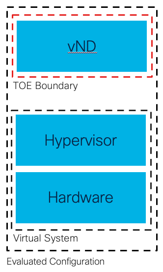

[#_Ref567439821 .anchor]_Figure 1: vND evaluated configuration Case 1_

Case 2, illustrated in Figure 2, is where the vND is evaluated as a pND.

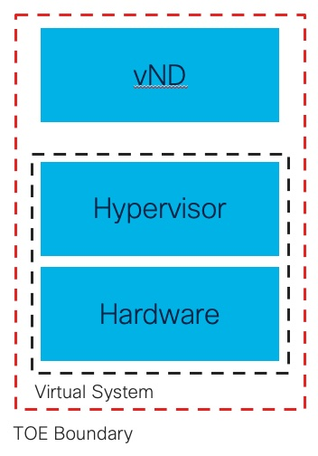

[#_Ref557439821 .anchor]_Figure 2: vND evaluated configuration Case 2_

To evaluate a vND as a pND means that:

* The VS is considered part of the ND's software stack, and thus is part of the TOE and must satisfy the relevant SFRs (e.g. by treating hypervisor Administrators as Security Administrators).
* vNDs that can run on multiple VSs must be tested on each claimed VS unless the developer can successfully argue equivalence.
* The physical hardware is likewise included in the TOE (as in the example included above). Therefore, vNDs must also be tested for each claimed hardware platform unless the developer can successfully argue equivalence.
* There is only one vND instance for each physical hardware platform.  The exception being a where components of the distributed TOE run inside more than one virtual machine (VM) on a single VS.
* There are no other guest VMs on the physical platform providing non-network device functionality.

This cPP does not cover software-only NDs. We define software-only NDs as network device functionality implemented as an application or service running on an operating system. A software-only ND that runs on an operating system inside a VM does not qualify as a vND unless the operating system is considered part of the TOE.

The intent of this document is to define the baseline set of common security functionality expected by all Network Devices, regardless of their ultimate security purpose or any additional security functionality the device may employ. This baseline set includes securing any remote management path, providing identification and authentication services for both local and remote logins, auditing security-related events, cryptographically validating the source of any update, and offering some protection against common network-based attacks.

The aim is that any Network Device that meets this cPP will “behave well” on the network and can be trusted to do no harm. To accomplish this, the Network Device is expected to employ standards-based tunnelling protocols to include IPsec, TLS/DTLS, or SSH to protect the communication paths to external entities, and in the case of a distributed TOE, to protect the communications between the TOE components. For most of the allowed secure channel protocol selections it is also required that X.509 certificates be used for authentication purposes; use of certificates is supported as an option for code signing/digital signatures.

Additional security functionality that a Network Device may employ is outside the scope of this cPP, and such functionality will be specified in other device-type specific cPPs. Also, considered out of scope are virus and emailing scanning, intrusion detection/prevention capabilities and Network Address Translation (NAT) as a security function. It is expected that this cPP will be updated to expand the desired security functionality to increase resiliency, allow for varying implementations (such as software-only Network Devices), and keep current with technology enhancements. At this time, however, Exact Conformancefootnote:[Exact Conformance is specified as a subset of Strict Conformance – see the definition in section 2.] with the cPP is required, and no additional functionality will be evaluated.

=== TOE Use Cases

The essence of the requirements for Network Device TOEs is that the devices can be remotely managed in a secure manner and that any software updates applied are from a trusted source.

Examples of Network Devices that are covered by requirements in this cPP include physical and virtualised routers, firewalls, VPN gateways, IDSs, and switches. Where such devices include significant additional functionality with its own distinct security requirements, then a separate cPP may be created to be used for those devices, with that cPP containing a superset of the Network Device cPP requirements.

Examples of devices that connect to a network but are not included to be evaluated against this cPP include mobile devices and end-user workstations.

== CC Conformance

As defined by the references [CC1], [CC2] and [CC3], this cPP:

* Conforms to the requirements of Common Criteria v3.1, Release 5
* Is Part 2 extended, Part 3 conformant
* Does not claim conformance to any other PP.

The methodology applied for the cPP evaluation is defined in [CEM]. This cPP satisfies the following Assurance Families: APE_CCL.1, APE_ECD.1, APE_INT.1, APE_OBJ.1, APE_REQ.1 and APE_SPD.1.

In order to be conformant to this cPP, a TOE must demonstrate Exact Conformance. Exact Conformance, as a subset of Strict Conformance as defined by the CC, is defined as the Security Target (ST) containing all of the Security Functional Requirements in section 6 (these are the mandatory SFRs) of this cPP, and potentially SFRs from Appendix A (these are optional SFRs) or Appendix B (these are selection-based SFRs, some of which will be mandatory according to the selections made in other SFRs) of this cPP. While iteration is allowed, no additional requirements (from the CC parts 2 or 3, or definitions of extended components not already included in this cPP) are allowed to be included in the ST. Further, no SFRs in section 6 of this cPP are allowed to be omitted.

While for SFRs the use of mandatory, optional and selection-based SFRs allows some customization when modelling the TOE, this does not work for the SPD in chapter 4 and the security objectives in chapter 5. Some parts in these chapters are marked as "(applies to ... only)" (e.g. "(applies to distributed TOEs only)", "(applies to vNDs only)"). These parts only need to be included in the ST for TOEs that comply with the corresponding conditions (i.e. parts marked as "(applies to distributed TOEs only)" only need to be included in STs for distributed TOEs and shall be omitted otherwise).

The packages to which exact conformance can be claimed in conjunction with this PP are specified in the ‘Allowed Packages’ list at https://ccusersforum.onlyoffice.com/products/files/doceditor.aspx?fileid=5615628&action=view. The PP-Modules that are allowed to specify this cPP as a base-PP are specified in the ‘Allowed PP-Modules list at https://ccusersforum.onlyoffice.com/products/files/doceditor.aspx?fileid=5615628&action=view

== Introduction to Distributed TOEs

This cPP includes support for distributed Network Device TOEs. Network Devices can sometimes be composed of multiple components operating as a logical whole. Oftentimes we see this architecture when dealing with products where a centralized management console is used to provide administration to dispersed components.

Distributed TOEs might consist of combinations of different and similar/same types TOE components where 'type' is referring to the intended use of a component inside the overall TOE. TOE component types could for example be sensors (e.g. for IDS components) or TOE component acting as central nodes managing other nodes.

There are a number of different architectures; but fundamentally, they are variations of the following model where the SFRs of this cPP can only be fulfilled if the two components are deployed and operate together.

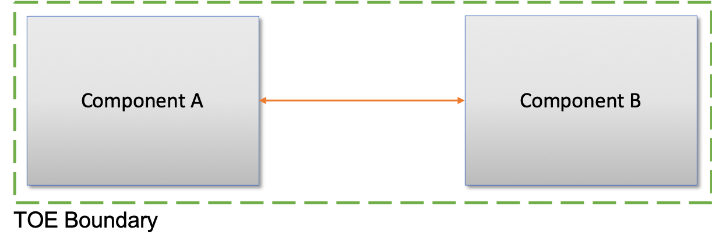

[#_Toc456887371 .anchor]###Figure 3 : Generalized Distributed TOE Model

Some Network Devices are designed to operate alongside a Management Component. A Network Device that operates in this manner, but still satisfy all SFRs in the cPP without the Management Component will not be considered a distributed TOE. It will be certified according to this cPP without the Management Component.

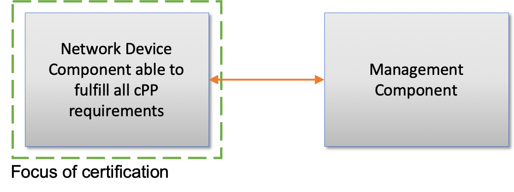

[#_Ref17189087 .anchor]####Figure 4 : Non-distributed TOE use case

=== Supported Distributed TOE Use Cases

The following discussion provides guidance over the supported distributed TOE use cases in this version of the cPP.

*Case 1: cPP requirements can only be fulfilled if several TOE components work together*

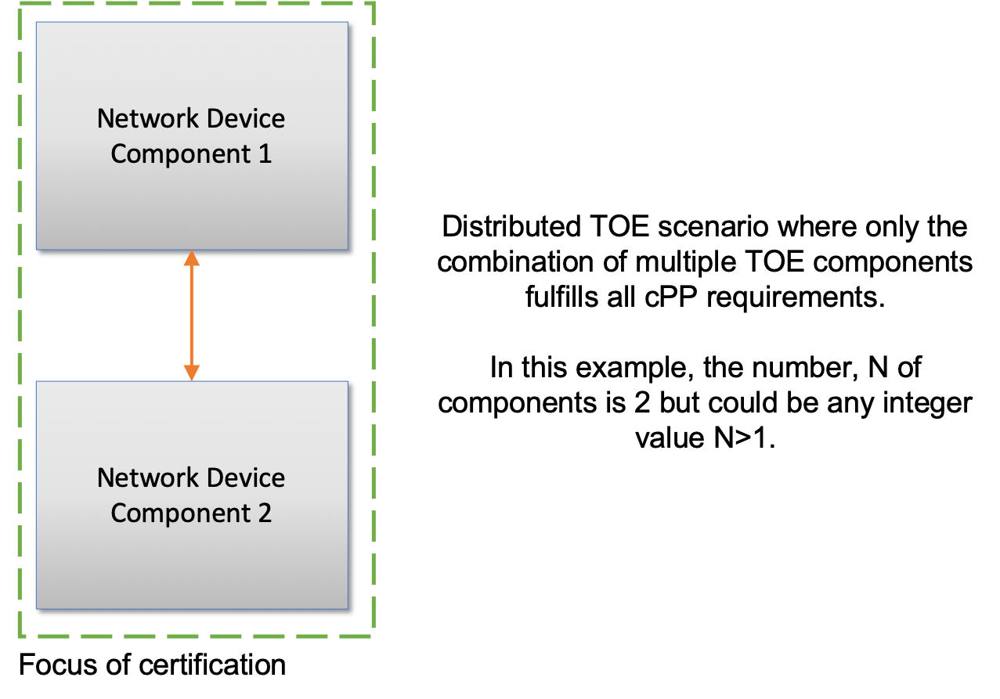

[#_Toc456887372 .anchor]####Figure 5: Basic distributed TOE use case

The first and most basic use case is where multiple interconnected Network Device components need to operate together to fulfil the requirements of the cPP. To be considered a distributed TOE, a minimum of 2 interconnected components are required.

*Case 2: cPP requirements can be fulfilled without Management component.*

A Network Device may require more than one component in order to fulfil all of the requirements of the cPP. In addition to the components required to fulfil the cPP a Management Component may also be offered for use with the TOE. In this case, certification shall not include the Management Component. This situation is depicted in Figure 6.

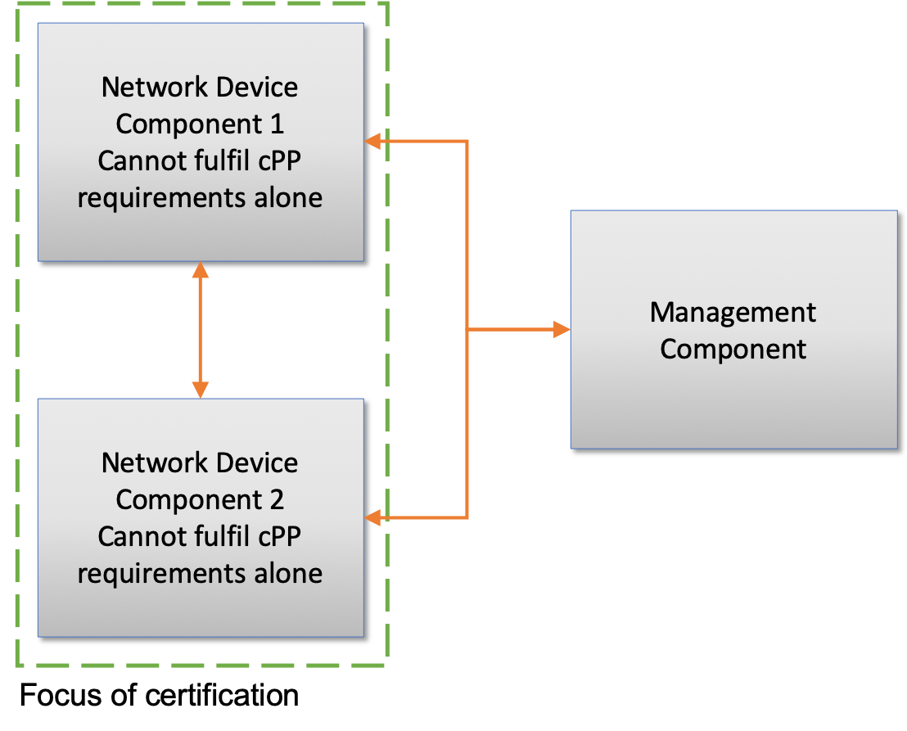

[#_Ref443655034 .anchor]####Figure 6: Distributed TOE use case with Management Component out of scope

For the case depicted in Figure 6, the Management Component may be certified separately according to a different (c)PP.

*Case 3: cPP requirements cannot be fulfilled without Management Component*

A Network Device that requires the Management Component to satisfy all SFRs of the cPP shall be considered to be a distributed TOE and be certified according to this cPP together with the Management Component.

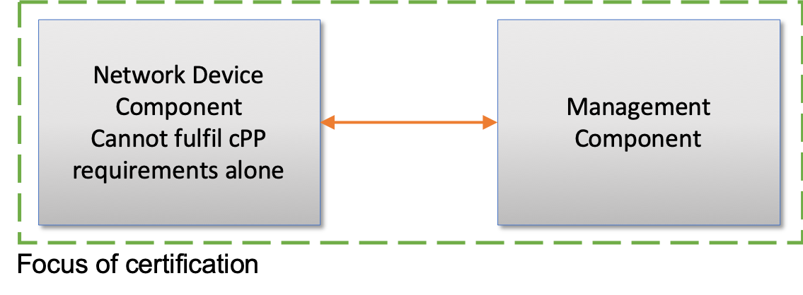

[#_Toc456887375 .anchor]####Figure 7: Management Component required to fulfil cPP requirements

A Management Component may also be considered part of the distributed TOE alongside multiple distributed Network Devices if it is required to fulfil all SFRs of this cPP.

image:extracted-media/media/d_toe_6.png[image,width=349,height=276]

[#_Toc456887376 .anchor]####Figure 8: Distributed Network Devices plus Management Component required to fulfil cPP requirements

Where several Network Devices are managed by one Management Component, the TOE may also be considered to be distributed but the focus of the certification should be restricted to the simplest combination of Network Device and Management Component. By the use of an equivalency argument, the combination of multiple Network Devices together with one Management Component can then be regarded as certified solutionfootnote:[[SD, B.4] describes how to define the components of a distributed TOE in terms of a “minimum configuration” and allowance for iteration of equivalent components.].

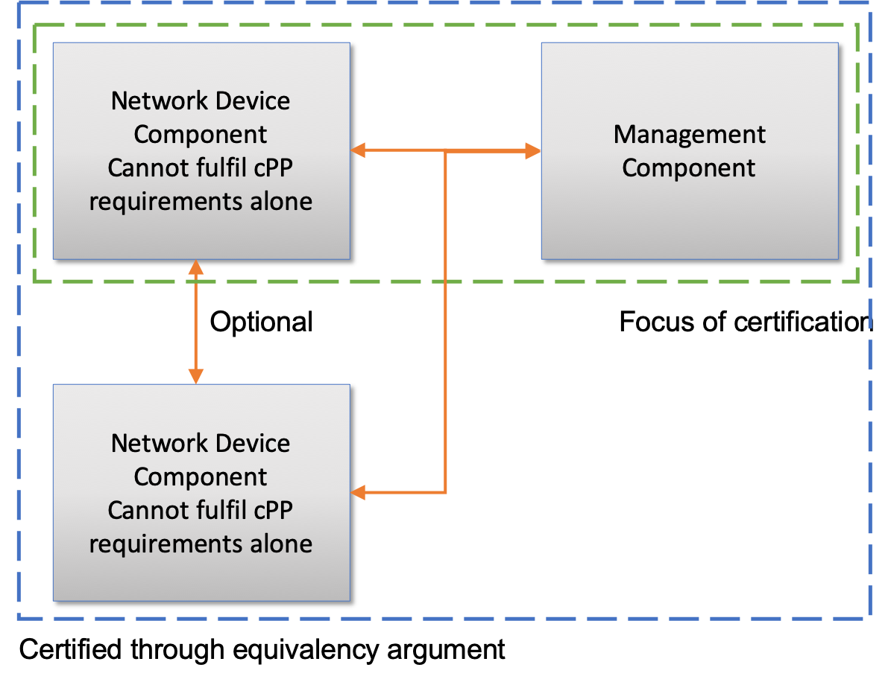

[#_Toc456887377 .anchor]####Figure 9: Distributed TOE extended through equivalency argument

In this model the individual Network Device components rely on functionality within the Management Component to fulfil the requirements of this cPP and therefore a direct relationship between Network Device components themselves is optional.

More than one Management Component may be used if it is for the sole purpose of redundancy.

=== Unsupported Distributed TOE Use Cases

The following discussion provides guidance for the distributed TOE use cases that are not supported by this version of the cPP.

*Case 4: cPP requirements depend on using Management Component shared with other components outside the distributed TOE*

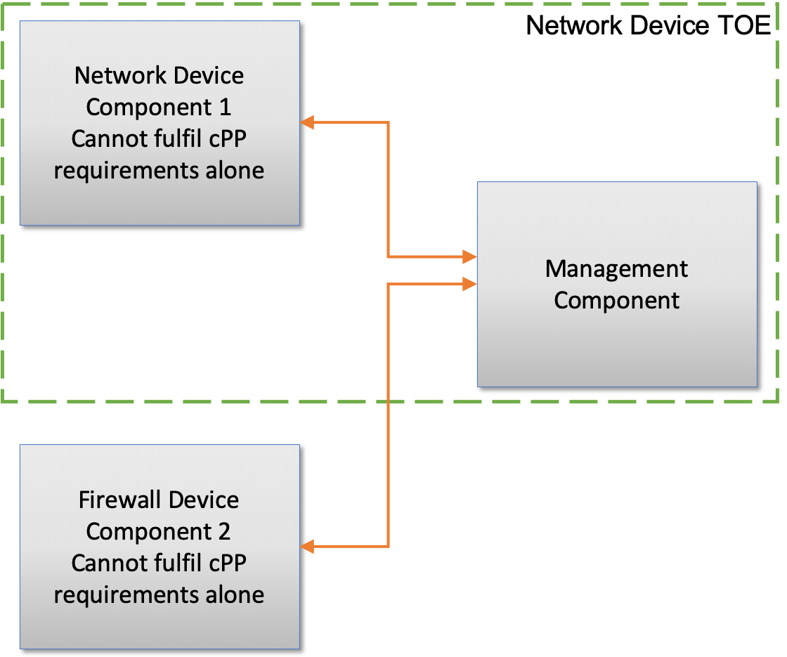

[#_Ref463365882 .anchor]####Figure 10: Unsupported Enterprise Management use case

Although apparently similar to Use Case 3 above, in this case a single Management Component is shared between the distributed Network Device TOE and another distinct product (Figure 8 shows an example in which the other product is a Firewall device). In this case the Management Component is considered to be an “Enterprise Manager” (a central management component for different types of devices), and this use case is not supported by this version of the cPP. A similar situation would apply if any other Network Device TOE component was shared with another product.

*Case 5: cPP requirements cannot be fulfilled without multiple Management Components*

The case where one device, distributed TOE or combination of TOEs according to Case 3 above are managed by more than one Management Component (except for the purpose of redundancy) is not covered by this version of the cPP. This means that - except for the purpose of redundancy - a single Management Component cannot be partitioned into multiple internal, independent components.

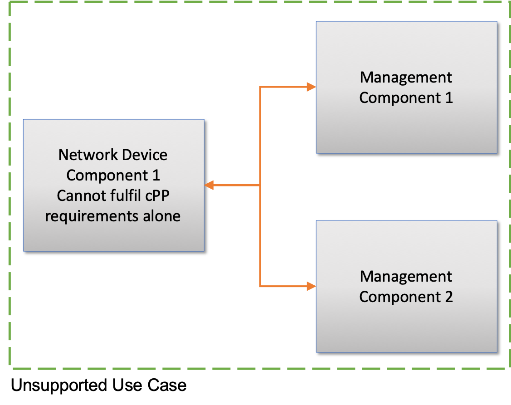

[#_Toc456887379 .anchor]####Figure 11: Unsupported use case with Multiple Management Components

=== Registration of Components of a Distributed TOE

When dealing with a distributed TOE, a number of separate components need to be brought together in the operational environment in order to create the TOE: this requires that trusted communications channels are set up between certain pairs of components (it is assumed that all components need to communicate with at least one other component, but not that all components need to communicate with all other components).

The underlying model for creation of the TOE is to have a ‘registration process’ in which components ‘join’ the TOE. The registration process starts with two components, one of which (the ‘joiner’) is about to join an existing TOE by registering with the other (the ‘gatekeeper’). The two components will use one or more specified authentication and communication channel options so that the components authenticate each other and protect any sensitive data that is transmitted during the registration process (e.g. a key might be sent by a gatekeeper to the joiner as a result of the registration). The following figures illustrate the three supported registration models. Figure 10 illustrates a distributed TOE registration approach which uses an instance of FPT_ITT.1 or FTP_ITC.1 to protect the registration exchange.

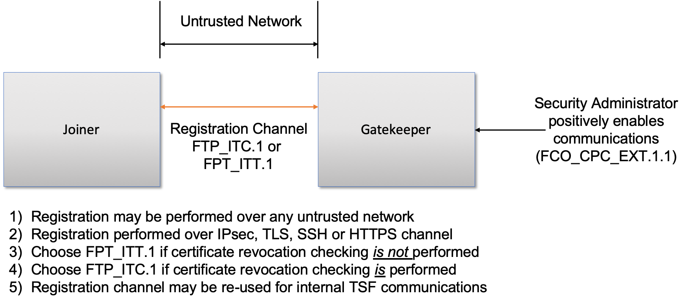

[#_Ref476931288 .anchor]####Figure 12: Distributed TOE registration using channel satisfying FPT_ITT.1 or FTP_ITC.1

The second approach (Figure 13) utilises an alternative registration channel and supports use-cases where the channel relies on environmental security constraints to provide the necessary protection of the registration exchange.

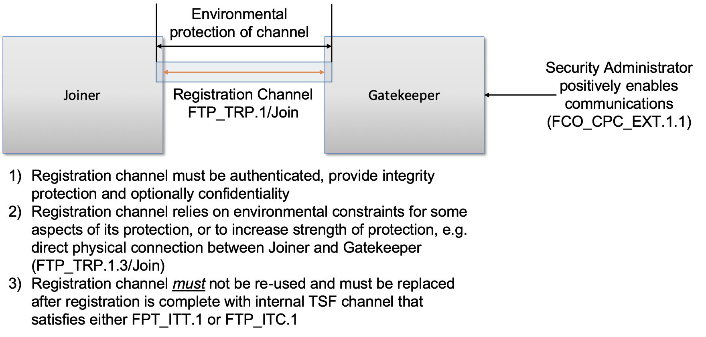

[#_Ref476931310 .anchor]####Figure 13: Distributed TOE registration using channel satisfying FTP_TRP.1/Join

The final approach (Figure 14) supports use-cases where registration is performed manually through direct configuration of both the joiner and gatekeeper devices. Once configured, the two components establish an internal TSF channel that satisfies FPT_ITT.1 or FTP_ITC.1.

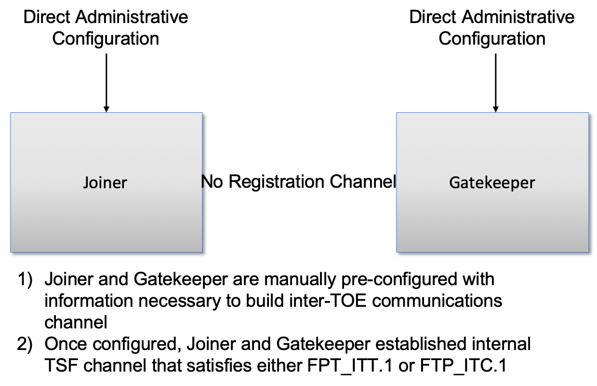

[#_Ref476931325 .anchor]####Figure 14: Distributed TOE registration without a registration channel

In each case, during the registration process, the Security Administrator must positively enable the joining components before it can act as part of the TSF. The following figure illustrates the approaches that this enablement step may take;

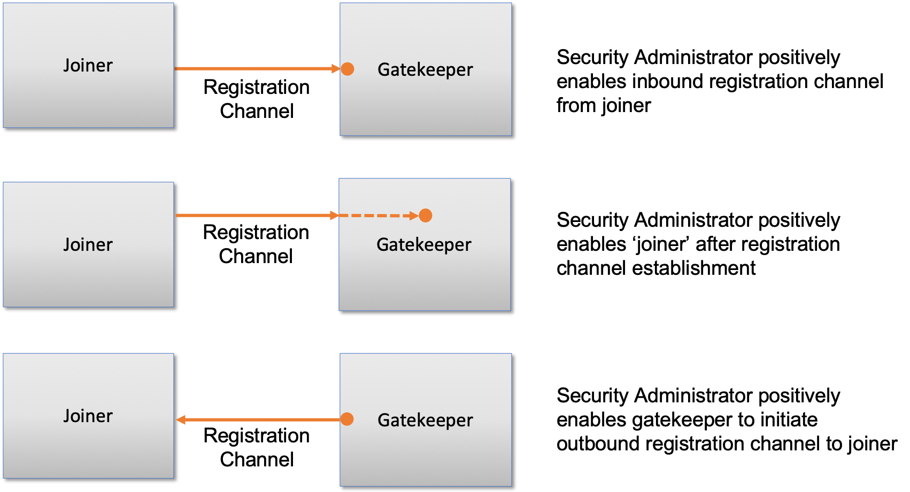

[#_Toc456887383 .anchor]####Figure 15: Joiner enablement options for Distributed TOEs

Note that in the case where no registration channel is required, that is the joiner and gatekeeper are directly configured (Figure 14), enablement is implied as part of this direct configuration process.

After registration, the components will communicate between themselves using a normal SSH/TLS/DTLS/IPsec/HTTPS channel (which is specified in an ST as an instance of FTP_ITC.1 or FPT_ITT.1 in terms of section 6 and appendix A). This channel for inter-component communications is specified at the top level with the new (extended) SFR FCO_CPC_EXT.1 (see section A.6.1) and is in addition to the other communication channels required for communication with entities outside the TOE (which are specified in an ST as instances of FTP_ITC.1 and FTP_TRP.1).

=== Allocation of Requirements in Distributed TOEs

For a distributed TOE, the security functional requirements in this cPP need to be met by the TOE as a whole, but not all SFRs will necessarily be implemented by all components. The following categories are defined in order to specify when each SFR must be implemented by a component:

* *All Components (“All”)* – All components that comprise the distributed TOE must independently satisfy the requirement.
* *At least one Component (“One”)* – This requirement must be fulfilled by at least one component within the distributed TOE.
* *Feature Dependent (“Feature Dependent”)* – These requirements will only be fulfilled where the feature is implemented by the distributed TOE component (note that the requirement to meet the cPP as a whole requires that at least one component implements these requirements if they are specified in section 6).

Table 1 specifies how each of the SFRs in this cPP must be met, using the categories above.

[cols=",,",options="header",]
|===
|*Requirement* |*Description* |*Distributed TOE SFR Allocation*
|FAU_GEN.1 |Audit Data Generation |All
|FAU_GEN.2 |User Identity Association |All
|FAU_GEN_EXT.1 |Security Audit Data Generation for Distributed TOE component |All
|FAU_STG_EXT.1 |Protected Audit Event Storage |All
|FAU_STG.1 |Protected Audit Trail Storage |Feature Dependent
|FAU_STG_EXT.2/LocSpace |Counting Lost Audit Data |Feature Dependent
|FAU_STG_EXT.3/LocSpace |Display warning for local storage space |Feature Dependent
|FAU_STG_EXT.4 |Protected Local Audit Event Storage for Distributed TOEs |Feature Dependent
|FAU_STG_EXT.5 |Protected Remote Audit Event Storage for Distributed TOEs |Feature Dependent
|FCO_CPC_EXT.1 |Communication Partner Control |All
|FCS_CKM.1 |Cryptographic Key Generation |Onefootnote:[Each component of a distributed TOE will be required either to perform on-board key generation and (if the TOE uses X.509 certificates as in Appendix B.4.1) RFC 2986 Certificate Request generation, or else to receive its keys and certificates, generated on some other component of the TOE, using a secure registration channel at the point where the component is joined to the TOE. (subsequent changes of keys and certificates may then use the post-registration inter-component secure channel). Certificate request generation will be required from either the component that generates the key or the component that receives the key.]
|FCS_CKM.2 |Cryptographic Key Establishment |All
|FCS_CKM.4 |Cryptographic Key Destruction |All
|FCS_COP.1/DataEncryption |Cryptographic Operation (AES Data Encryption/Decryption) |All
|FCS_COP.1/SigGen |Cryptographic Operation (Signature Verification) |All
|FCS_COP.1/Hash |Cryptographic Operation (Hash Algorithm) |All
|FCS_COP.1/KeyedHash |Cryptographic Operation (Keyed Hash Algorithm) |All
|FCS_DTLSC_EXT.1 |DTLS client |Feature Dependent
|FCS_DTLSC_EXT.2 |DTLS client with mutual authentication |Feature Dependent
|FCS_DTLSS_EXT.1 |DTLS server |Feature Dependent
|FCS_DTLSS_EXT.2 |DTLS server with mutual authentication |Feature Dependent
|FCS_HTTPS_EXT.1 |HTTPS Protocol |Feature Dependent
|FCS_IPSEC_EXT.1 |IPsec Protocol |Feature Dependent
|FCS_NTP_EXT.1 |NTP Protocol |Feature Dependent
|FCS_SSHC_EXT.1 |SSH Client |Feature Dependent
|FCS_SSHS_EXT.1 |SSH Server |Feature Dependent
|FCS_TLSC_EXT.1 |TLS Client |Feature Dependent
|FCS_TLSC_EXT.2 |TLS Client with authentication |Feature Dependent
|FCS_TLSS_EXT.1 |TLS Server |Feature Dependent
|FCS_TLSS_EXT.2 |TLS Server with mutual authentication |Feature Dependent
|FCS_RBG_EXT.1 |Random Bit Generation |All
|FIA_AFL.1 |Authentication Failure Management |One
|FIA_PMG_EXT.1 |Password Management |One
|FIA_UIA_EXT.1 |User Identification and Authentication |One
|FIA_UAU_EXT.2 |Password-based Authentication Mechanism |One
|FIA_UAU.7 |Protected Authentication Feedback |Feature Dependent
|FIA_X509_EXT.1/Rev |X.509 Certification Validation |Feature Dependent
|FIA_X509_EXT.1/ITT |X.509 Certification Validation |Feature Dependent
|FIA_X509_EXT.2 |X.509 Certificate Authentication |Feature Dependent
|FIA_X509_EXT.3 |Certificate Requests |Feature Dependent^5^
|FMT_MOF.1/ManualUpdate |Trusted Update - Management of Security Functions behaviour |All
|FMT_MOF.1/Services |Trusted Update - Management of TSF Data |Feature Dependent
|FMT_MOF.1/Functions |Management of security functions behaviour |Feature Dependent
|FMT_MTD.1/CoreData |Management of TSF Data |All
|FMT_MTD.1/CryptoKeys |Management of TSF Data |Feature Dependent
|FMT_SMF.1 |Specification of Management Functions |Feature Dependent
|FMT_SMR.2 |Restrictions on Security Roles |One
|FPT_SKP_EXT.1 |Protection of TSF Data (for reading of all symmetric keys) |All
|FPT_APW_EXT.1 |Protection of Administrator Passwords |Feature Dependent
|FPT_TST_EXT.1 |Testing (Extended) |All
|FPT_ITT.1 |Basic internal TSF data transfer protection |Feature Dependentfootnote:[To protect inter-TSF data transfer, FPT_ITT.1 or FTP_ITC.1 must be fulfilled by each distributed TOE component. This is in addition to an iteration of FTP_ITC.1 to protect communications with external entities.]
|FPT_STM_EXT.1 |Reliable Time Stamps |All
|FPT_TUD_EXT.1 |Trusted Update |All
|FPT_TUD_EXT.2 |Trusted Update based on Certificates |Feature Dependent
|FTA_SSL.3 |TSF-initiated Termination |Feature Dependent
|FTA_SSL.4 |User-Initiated Termination |Feature Dependent
|FTA_SSL_EXT.1 |TSF-Initiated Session Locking |Feature Dependent
|FTA_TAB.1 |Default TOE Access Banner |One
|FTP_ITC.1 |Inter-TSF Trusted Channel (Refinement) |One
|FTP_TRP.1/Admin |Trusted Path (Refinement) |One
|FTP_TRP.1/Join |Trusted Path |Feature Dependent
|FMT_MOF.1/ManualUpdate |Management of security functions behaviour |Feature Dependent
|FMT_MOF.1/AutoUpdate |Management of security functions behaviour |Feature Dependent
|===

[#_Ref443331358 .anchor]####Table 1: Security Functional Requirements for Distributed TOEs

The ST for a distributed TOE must include a mapping of SFRs to each of the components of the TOE. (Note that this deliverable is examined as part of the ASE_TSS.1 and AVA_VAN.1 Evaluation Activities as described in [SD, 5.1.2] and [SD, 5.6.1.1] respectively.) The ST for a distributed TOE may also introduce a ‘minimum configuration’ and identify components that may have instances added to an operational configuration without affecting the validity of the CC certification. [SD, B.4] describes Evaluation Activities relating to these equivalency aspects of a distributed TOE (and hence what is expected in the ST).

== Security Problem Definition

A Network Device has a network infrastructure role that it is designed to provide. In doing so, the Network Device communicates with other Network Devices and other network entities (i.e. entities not defined as Network Devices because they do not have an infrastructure role) over the network. At the same time, it must provide a minimal set of common security functionality expected by all Network Devices. The security problem to be addressed by a compliant Network Device is defined as this set of common security functionality that addresses the threats that are common to Network Devices, as opposed to those that might be targeting the specific functionality of a specific type of Network Device. The set of common security functionality addresses communication with the Network Device, both authorized and unauthorized, the ability to perform valid and secure updates, the ability to audit device activity, the ability to securely store and utilize device and Administrator credentials and data, and the ability to self-test critical device components for failures.

=== Threats

The threats for the Network Device are grouped according to functional areas of the device in the sections below. The description of each threat is then followed by a rationale describing how it is addressed by the SFRs in section 6, appendix A, and appendix B.

==== Communications with the Network Device

A Network Device communicates with other Network Devices and other network entities. The endpoints of this communication can be geographically and logically distant and may pass through a variety of other systems. The intermediate systems may be untrusted providing an opportunity for unauthorized communication with the Network Device or for authorized communication to be compromised. The security functionality of the Network Device must be able to protect any critical network traffic (administration traffic, authentication traffic, audit traffic, etc.). The communication with the Network Device falls into two categories: authorized communication and unauthorized communication.

Authorized communication includes network traffic allowable by policy destined to and originating from the Network Device as it was designed and intended. This includes critical network traffic, such as Network Device administration and communication with an authentication or audit logging server, which requires a secure channel to protect the communication. The security functionality of the Network Device includes the capability to ensure that only authorized communications are allowed and the capability to provide a secure channel for critical network traffic. Any other communication with the Network Device is considered unauthorized communication. (Network traffic traversing the Network Device but not ultimately destined for the device, e.g. packets that are being routed, are not considered to be ‘communications with the Network Device’ – cf. A.NO_THRU_TRAFFIC_PROTECTION in section 4.2.3.)

The primary threats to Network Device communications addressed in this cPP focus on an external, unauthorized entity attempting to access, modify, or otherwise disclose the critical network traffic. A poor choice of cryptographic algorithms or the use of non-standardized tunnelling protocols along with weak Administrator credentials, such as an easily guessable password or use of a default password, will allow a threat agent unauthorized access to the device. Weak or no cryptography provides little to no protection of the traffic allowing a threat agent to read, manipulate and/or control the critical data with little effort. Non-standardized tunnelling protocols not only limit the interoperability of the device but lack the assurance and confidence standardization provides through peer review.

===== T.UNAUTHORIZED_ADMINISTRATOR_ACCESS

Threat agents may attempt to gain Administrator access to the Network Device by nefarious means such as masquerading as an Administrator to the device, masquerading as the device to an Administrator, replaying an administrative session (in its entirety, or selected portions), or performing man-in-the-middle attacks, which would provide access to the administrative session, or sessions between Network Devices. Successfully gaining Administrator access allows malicious actions that compromise the security functionality of the device and the network on which it resides.

SFR Rationale:

* The Administrator role is defined in FMT_SMR.2 and the relevant administration capabilities are defined in FMT_SMF.1 and FMT_MTD.1/CoreData, with optional additional capabilities in FMT_MOF.1/Services and FMT_MOF.1/Functions
* The actions allowed before authentication of an Administrator are constrained by FIA_UIA_EXT.1, and include the advisory notice and consent warning message displayed according to FTA_TAB.1
* The requirement for the Administrator authentication process is described in FIA_UAU_EXT.2
* Locking of Administrator sessions is ensured by FTA_SSL_EXT.1 (for local sessions), FTA_SSL.3 (for remote sessions), and FTA_SSL.4 (for all interactive sessions)
* The secure channel used for remote Administrator connections is specified in FTP_TRP.1/Admin
* (Malicious actions carried out from an Administrator session are separately addressed by T.UNDETECTED_ACTIVITY)
* (Protection of the Administrator credentials is separately addressed by T.PASSWORD_CRACKING).

===== T.WEAK_CRYPTOGRAPHY

Threat agents may exploit weak cryptographic algorithms or perform a cryptographic exhaust against the key space. Poorly chosen encryption algorithms, modes, and key sizes will allow attackers to compromise the algorithms, or brute force exhaust the key space and give them unauthorized access allowing them to read, manipulate and/or control the traffic with minimal effort.

SFR Rationale:

* Requirements for key generation and key distribution are set in FCS_CKM.1 and FCS_CKM.2 respectively
* Requirements for use of cryptographic schemes are set in FCS_COP.1/DataEncryption, FCS_COP.1/SigGen, FCS_COP.1/Hash, and FCS_COP.1/KeyedHash
* Requirements for random bit generation to support key generation and secure protocols (see SFRs resulting from T.UNTRUSTED_COMMUNICATION_CHANNELS) are set in FCS_RBG_EXT.1
* Management of cryptographic functions is specified in FMT_SMF.1

===== T.UNTRUSTED_COMMUNICATION_CHANNELS

Threat agents may attempt to target Network Devices that do not use standardized secure tunnelling protocols to protect the critical network traffic. Attackers may take advantage of poorly designed protocols or poor key management to successfully perform man-in-the-middle attacks, replay attacks, etc. Successful attacks will result in loss of confidentiality and integrity of the critical network traffic, and potentially could lead to a compromise of the Network Device itself.

SFR Rationale:

* The general use of secure protocols for identified communication channels is described at the top level in FTP_ITC.1 and FTP_TRP.1/Admin; for distributed TOEs the requirements for inter-component communications are addressed by the requirements in FPT_ITT.1
* Requirements for the use of secure communication protocols are set for all the allowed protocols in FCS_DTLSC_EXT.1, FCS_DTLSC_EXT.2, FCS_DTLSS_EXT.1, FCS_DTLSS_EXT.2, FCS_HTTPS_EXT.1, FCS_IPSEC_EXT.1, FCS_SSHC_EXT.1, FCS_SSHS_EXT.1, FCS_TLSC_EXT.1, FCS_TLSC_EXT.2, FCS_TLSS_EXT.1, FCS_TLSS_EXT.2
* Optional and selection-based requirements for use of public key certificates to support secure protocols are defined in FIA_X509_EXT.1, FIA_X509_EXT.2, FIA_X509_EXT.3

===== T.WEAK_AUTHENTICATION_ENDPOINTS

Threat agents may take advantage of secure protocols that use weak methods to authenticate the endpoints, e.g. a shared password that is guessable or transported as plaintext. The consequences are the same as a poorly designed protocol, the attacker could masquerade as the Administrator or another device, and the attacker could insert themselves into the network stream and perform a man-in-the-middle attack. The result is the critical network traffic is exposed and there could be a loss of confidentiality and integrity, and potentially the Network Device itself could be compromised.

SFR Rationale:

* The use of appropriate secure protocols to provide authentication of endpoints (as in the SFRs addressing T.UNTRUSTED_COMMUNICATION_CHANNELS) are ensured by the requirements in FTP_ITC.1 and FTP_TRP.1/Admin; for distributed TOEs the authentication requirements for endpoints in inter-component communications are addressed by the requirements in FPT_ITT.1
* Additional possible special cases of secure authentication during registration of distributed TOE components are addressed by FCO_CPC_EXT.1 and FTP_TRP.1/Join.

==== Valid Updates

Updating Network Device software and firmware is necessary to ensure that the security functionality of the Network Device is maintained. The source and content of an update to be applied must be validated by cryptographic means; otherwise, an invalid source can write their own firmware or software updates that circumvents the security functionality of the Network Device. Methods of validating the source and content of a software or firmware update by cryptographic means typically involve cryptographic signature schemes where hashes of the updates are digitally signed.

Unpatched versions of software or firmware leave the Network Device susceptible to threat agents attempting to circumvent the security functionality using known vulnerabilities. Non-validated updates or updates validated using non-secure or weak cryptography leave the updated software or firmware vulnerable to threat agents attempting to modify the software or firmware to their advantage.

===== T.UPDATE_COMPROMISE

Threat agents may attempt to provide a compromised update of the software or firmware which undermines the security functionality of the device. Non-validated updates or updates validated using non-secure or weak cryptography leave the update firmware vulnerable to surreptitious alteration.

SFR Rationale:

* Requirements for protection of updates are set in FPT_TUD_EXT.1
* Additional optional use of certificate-based protection of signatures can be specified using FPT_TUD_EXT.2, supported by the X.509 certificate processing requirements in FIA_X509_EXT.1, FIA_X509_EXT.2 and FIA_X509_EXT.3
* Requirements for management of updates are defined in FMT_SMF.1 and (for manual updates) in FMT_MOF.1/ManualUpdate, with optional requirements for automatic updates in FMT_MOF.1/AutoUpdate

==== Audited Activity

Auditing of Network Device activities is a valuable tool for Administrators to monitor the status of the device. It provides the means for Administrator accountability, security functionality activity reporting, reconstruction of events, and problem analysis. Processing performed in response to device activities may give indications of a failure or compromise of the security functionality. When indications of activity that impact the security functionality are not generated and monitored, it is possible for such activities to occur without Administrator awareness. Further, if records are not generated and retained, reconstruction of the network and the ability to understand the extent of any compromise could be negatively affected. Additional concerns are the protection of the audit data that is recorded from alteration or unauthorized deletion. This could occur within the TOE, or while the audit data is in transit to an external storage device.

Note this cPP requires that the Network Device generate the audit data and have the capability to send the audit data to a trusted network entity (e.g., a syslog server).

===== T.UNDETECTED_ACTIVITY

Threat agents may attempt to access, change, and/or modify the security functionality of the Network Device without Administrator awareness. This could result in the attacker finding an avenue (e.g., misconfiguration, flaw in the product) to compromise the device and the Administrator would have no knowledge that the device has been compromised.

SFR Rationale:

* Requirements for basic auditing capabilities are specified in FAU_GEN.1 and FAU_GEN.2, with timestamps provided according to FPT_STM_EXT.1 and if applicable, protection of NTP channels in FCS_NTP_EXT.1
* Requirements for protecting audit records stored on the TOE are specified in FAU_STG.1
* Requirements for secure transmission of local audit records to an external IT entity via a secure channel are specified in FAU_STG_EXT.1
* Optional additional requirements for dealing with potential loss of locally stored audit records are specified in FAU_STG_EXT.2/LocSpace, and FAU_STG_EXT.3/LocSpace
* If (optionally) configuration of the audit functionality is provided by the TOE then this is specified in FMT_SMF.1 and confining this functionality to Security Administrators is required by FMT_MOF.1/Functions.

==== Administrator and Device Credentials and Data

A Network Device contains data and credentials which must be securely stored and must appropriately restrict access to authorized entities. Examples include the device firmware, software, configuration authentication credentials for secure channels, and Administrator credentials. Device and Administrator keys, key material, and authentication credentials need to be protected from unauthorized disclosure and modification. Furthermore, the security functionality of the device needs to require default authentication credentials, such as Administrator passwords, be changed.

Lack of secure storage and improper handling of credentials and data, such as unencrypted credentials inside configuration files or access to secure channel session keys, can allow an attacker to not only gain access to the Network Device, but also compromise the security of the network through seemingly authorized modifications to configuration or though man-in-the-middle attacks. These attacks allow an unauthorized entity to gain access and perform administrative functions using the Security Administrator’s credentials and to intercept all traffic as an authorized endpoint. This results in difficulty in detection of security compromise and in reconstruction of the network, potentially allowing continued unauthorized access to Administrator and device data.

===== T.SECURITY_FUNCTIONALITY_COMPROMISE

Threat agents may compromise credentials and device data enabling continued access to the Network Device and its critical data. The compromise of credentials includes replacing existing credentials with an attacker’s credentials, modifying existing credentials, or obtaining the Administrator or device credentials for use by the attacker.

SFR Rationale:

* Protection of secret/private keys against compromise is specified in FPT_SKP_EXT.1
* Secure destruction of keys is specified in FCS_CKM.4
* If (optionally) management of keys is provided by the TOE then this is specified in FMT_SMF.1 and confining this functionality to Security Administrators is required by FMT_MTD.1/CryptoKeys
* (Protection of passwords is separately covered under T.PASSWORD_CRACKING)

===== T.PASSWORD_CRACKING

Threat agents may be able to take advantage of weak administrative passwords to gain privileged access to the device. Having privileged access to the device provides the attacker unfettered access to the network traffic and may allow them to take advantage of any trust relationships with other Network Devices.

SFR Rationale:

* Requirements for password lengths and available characters are set in FIA_PMG_EXT.1
* Protection of password entry by providing only obscured feedback is specified in FIA_UAU.7
* Actions on reaching a threshold number of consecutive password failures are specified in FIA_AFL.1
* Requirements for secure storage of passwords are set in FPT_APW_EXT.1.

==== Device Failure

Security mechanisms of the Network Device generally build up from roots of trust to more complex sets of mechanisms. Failures could result in a compromise to the security functionality of the device. A Network Device self-testing its security critical components at both start-up and during run-time ensures the reliability of the device’s security functionality.

===== T.SECURITY_FUNCTIONALITY_FAILURE

*An external, unauthorized entity could make use of failed or compromised security functionality and might therefore subsequently use or abuse security functions without prior authentication to access, change or modify device data, critical network traffic or security functionality of the device.*

SFR Rationale:

* Requirements for running self-test(s) are defined in FPT_TST_EXT.1

=== Assumptions

This section describes the assumptions made in identification of the threats and security requirements for Network Devices. The Network Device is not expected to provide assurance in any of these areas, and as a result, requirements are not included to mitigate the threats associated.

==== A.PHYSICAL_PROTECTION

The Network Device is assumed to be physically protected in its operational environment and not subject to physical attacks that compromise the security or interfere with the device’s physical interconnections and correct operation. This protection is assumed to be sufficient to protect the device and the data it contains. As a result, the cPP does not include any requirements on physical tamper protection or other physical attack mitigations. The cPP does not expect the product to defend against physical access to the device that allows unauthorized entities to extract data, bypass other controls, or otherwise manipulate the device. For vNDs, this assumption applies to the physical platform on which the VM runs.

{empty}[OE.PHYSICAL]

==== A.LIMITED_FUNCTIONALITY

The device is assumed to provide networking functionality as its core function and not provide functionality/services that could be deemed as general purpose computing. For example, the device should not provide a computing platform for general purpose applications (unrelated to networking functionality).

In the case of vNDs, the VS is considered part of the TOE with only one vND instance for each physical hardware platform. The exception being where components of the distributed TOE run inside more than one virtual machine (VM) on a single VS. There are no other guest VMs on the physical platform providing non-Network Device functionality.

{empty}[OE.NO_GENERAL_PURPOSE]

==== A.NO_THRU_TRAFFIC_PROTECTION

A standard/generic Network Device does not provide any assurance regarding the protection of traffic that traverses it. The intent is for the Network Device to protect data that originates on or is destined to the device itself, to include administrative data and audit data. Traffic that is traversing the Network Device, destined for another network entity, is not covered by the ND cPP. It is assumed that this protection will be covered by cPPs and PP-Modules for particular types of Network Devices (e.g., firewall).

{empty}[OE.NO_THRU_TRAFFIC_PROTECTION]

==== A.TRUSTED_ADMINISTRATOR

The Security Administrator(s) for the Network Device are assumed to be trusted and to act in the best interest of security for the organization. This includes appropriately trained, following policy, and adhering to guidance documentation. Administrators are trusted to ensure passwords/credentials have sufficient strength and entropy and to lack malicious intent when administering the device. The Network Device is not expected to be capable of defending against a malicious Administrator that actively works to bypass or compromise the security of the device.

For TOEs supporting X.509v3 certificate-based authentication, the Security Administrator(s) are expected to fully validate (e.g. offline verification) any CA certificate (root CA certificate or intermediate CA certificate) loaded into the TOE’s trust store (aka 'root store', ' trusted CA Key Store', or similar) as a trust anchor prior to use (e.g. offline verification).

{empty}[OE.TRUSTED_ADMIN]

==== A.REGULAR_UPDATES

The Network Device firmware and software is assumed to be updated by an Administrator on a regular basis in response to the release of product updates due to known vulnerabilities.

{empty}[OE.UPDATES]

==== A.ADMIN_CREDENTIALS_SECURE

The Administrator’s credentials (private key) used to access the Network Device are protected by the platform on which they reside.

{empty}[OE.ADMIN_CREDENTIALS_SECURE]

==== A.COMPONENTS_RUNNING (applies to distributed TOEs only)

For distributed TOEs it is assumed that the availability of all TOE components is checked as appropriate to reduce the risk of an undetected attack on (or failure of) one or more TOE components. It is also assumed that in addition to the availability of all components it is also checked as appropriate that the audit functionality is running properly on all TOE components.

{empty}[OE.COMPONENTS_RUNNING]

==== A.RESIDUAL_INFORMATION

The Administrator must ensure that there is no unauthorized access possible for sensitive residual information (e.g. cryptographic keys, keying material, PINs, passwords etc.) on networking equipment when the equipment is discarded or removed from its operational environment.

{empty}[OE.RESIDUAL_INFORMATION]

==== A.VS_TRUSTED_ADMINISTRATOR (applies to vNDs only)

The Security Administrators for the VS are assumed to be trusted and to act in the best interest of security for the organization. This includes not interfering with the correct operation of the device. The Network Device is not expected to be capable of defending against a malicious VS Administrator that actively works to bypass or compromise the security of the device.

{empty}[OE.TRUSTED_ADMIN]

==== A.VS_REGULAR_UPDATES (applies to vNDs only)

The VS software is assumed to be updated by the VS Administrator on a regular basis in response to the release of product updates due to known vulnerabilities.

{empty}[OE.UPDATES]

==== A.VS_ISOLATON (applies to vNDs only)

For vNDs, it is assumed that the VS provides, and is configured to provide sufficient isolation between software running in VMs on the same physical platform. Furthermore, it is assumed that the VS adequately protects itself from software running inside VMs on the same physical platform.

{empty}[OE.VM_CONFIGURATION]

==== A.VS_CORRECT_CONFIGURATION (applies to vNDs only)

For vNDs, it is assumed that the VS and VMs are correctly configured to support ND functionality implemented in VMs.

{empty}[OE.VM_CONFIGURATION]

=== Organizational Security Policy

An organizational security policy is a set of rules, practices, and procedures imposed by an organization to address its security needs. The description of each policy is then followed by a rationale describing how it is addressed by the SFRs in section 6, appendix A, and appendix B.

==== P.ACCESS_BANNER

The TOE shall display an initial banner describing restrictions of use, legal agreements, or any other appropriate information to which users consent by accessing the TOE.

SFR Rationale:

* An advisory notice and consent warning message is required to be displayed by FTA_TAB.1

== Security Objectives

=== Security Objectives for the Operational Environment

The following subsections describe objectives for the Operational Environment.

==== OE.PHYSICAL

Physical security, commensurate with the value of the TOE and the data it contains, is provided by the environment.

==== OE.NO_GENERAL_PURPOSE

There are no general-purpose computing capabilities (e.g., compilers or user applications) available on the TOE, other than those services necessary for the operation, administration and support of the TOE. Note: For vNDs the TOE includes only the contents of the its own VM, and does not include other VMs or the VS.

==== OE.NO_THRU_TRAFFIC_PROTECTION

The TOE does not provide any protection of traffic that traverses it. It is assumed that protection of this traffic will be covered by other security and assurance measures in the operational environment.

==== OE.TRUSTED_ADMIN

Security Administrators are trusted to follow and apply all guidance documentation in a trusted manner. For vNDs, this includes the VS Administrator responsible for configuring the VMs that implement ND functionality.

For TOEs supporting X.509v3 certificate-based authentication, the Security Administrator(s) are assumed to monitor the revocation status of all certificates in the TOE's trust store and to remove any certificate from the TOE’s trust store in case such certificate can no longer be trusted.

==== OE.UPDATES

The TOE firmware and software is updated by an Administrator on a regular basis in response to the release of product updates due to known vulnerabilities.

==== OE.ADMIN_CREDENTIALS_SECURE

The Administrator’s credentials (private key) used to access the TOE must be protected on any other platform on which they reside.

==== OE.COMPONENTS_RUNNING (applies to distributed TOEs only)

For distributed TOEs, the Security Administrator ensures that the availability of every TOE component is checked as appropriate to reduce the risk of an undetected attack on (or failure of) one or more TOE components. The Security Administrator also ensures that it is checked as appropriate for every TOE component that the audit functionality is running properly.

==== OE.RESIDUAL_INFORMATION

The Security Administrator ensures that there is no unauthorized access possible for sensitive residual information (e.g. cryptographic keys, keying material, PINs, passwords etc.) on networking equipment when the equipment is discarded or removed from its operational environment. For vNDs, this applies when the physical platform on which the VM runs is removed from its operational environment.

==== OE.VM_CONFIGURATION (applies to vNDs only)

For vNDs, the Security Administrator ensures that the VS and VMs are configured to

* reduce the attack surface of VMs as much as possible while supporting ND functionality (e.g., remove unnecessary virtual hardware, turn off unused inter-VM communications mechanisms), and
* correctly implement ND functionality (e.g., ensure virtual networking is properly configured to support network traffic, management channels, and audit reporting).

The VS should be operated in a manner that reduces the likelihood that vND operations are adversely affected by virtualisation features such as cloning, save/restore, suspend/resume, and live migration.

If possible, the VS should be configured to make use of features that leverage the VS’s privileged position to provide additional security functionality. Such features could include malware detection through VM introspection, measured VM boot, or VM snapshot for forensic analysis.

== Security Functional Requirements

The individual security functional requirements are specified in the sections below. SFRs in this section are mandatory SFRs that any conformant TOE must meet. Based on selections made in these SFRs it will also be necessary to include some of the selection-based SFRs in Appendix B. Additional optional SFRs may also be adopted from those listed in Appendix A.

For a distributed TOE, the ST author should reference Table 1 for guidance on how each SFR should be met. The table details whether SFRs should be met by all TOE components, by at least one TOE component or whether they are dependent upon the feature being implemented by the TOE component. The ST for a distributed TOE must include a mapping of SFRs to each of the components of the TOE. (Note that this deliverable is examined as part of the ASE_TSS.1 and AVA_VAN.1 Evaluation Activities as described in [SD, 5.1.2] and [SD, 5.6.1.1] respectively.

The Evaluation Activities defined in [SD] describe actions that the evaluator will take in order to determine compliance of a particular TOE with the SFRs. The content of these Evaluation Activities will therefore provide more insight into deliverables required from TOE Developers.

=== Conventions

The conventions used in descriptions of the SFRs are as follows:

* Unaltered SFRs are stated in the form used in [CC2] or their extended component definition (ECD);
* Refinement made in the PP: the refinement text is indicated with *bold text* and [line-through]*strikethroughs*;
* Selection wholly or partially completed in the PP: the selection values (i.e. the selection values adopted in the PP or the remaining selection values available for the ST) are indicated with [.underline]#underlined text#
+
e.g. ‘[selection: _disclosure, modification, loss of use_]’ in [CC2] or an ECD might become ‘[.underline]#disclosure’# (completion) or ‘[selection: [.underline]#disclosure#, [.underline]#modification#]’ (partial completion) in the PP;
* Assignment wholly or partially completed in the PP: indicated with _italicized text_;
* Assignment completed within a selection in the PP: the completed assignment text is indicated with _[.underline]#italicized and underlined text#_
+
e.g. ‘[selection: _change_default, query, modify, delete, [assignment: other operations]_]’ in [CC2] or an ECD might become ‘[.underline]##change_default##__, [.underline]#select_tag’#__ (completion of both selection and assignment) or ‘[selection: [.underline]##change_default##__, [.underline]#select_tag#, [.underline]#select_value#__]’ (partial completion of selection, and completion of assignment) in the PP;
* Iteration: indicated by adding a string starting with ‘/’ (e.g. ‘FCS_COP.1/Hash’).

Extended SFRs are identified by having a label ‘EXT’ at the end of the SFR name.

Where compliance to RFCs is referred to in SFRs, this is intended to be demonstrated by completing the corresponding evaluation activities in [SD] for the relevant SFR.

=== SFR Architecture

Figure 16, Figure 17, Figure 18, Figure 19, Figure 20, and Figure 21 give a graphical presentation of the connections between the Security Functional Requirements in sections 6.3-6.9, Appendix A and Appendix B, and the underlying functional areas and operations that the TOE provides. The diagrams provide a context for SFRs that relates to their use in the TOE, whereas other sections define the SFRs grouped by the abstract class and family groupings in [CC2].

In the diagrams, the SFRs from Appendix B are both described as ‘Discretionary’, meaning that their inclusion in an ST will depend on the particular properties of a product. The SFRs from Appendix B that are required by an ST are determined by the selections made in other SFRs. For example: FTP_ITC.1 and FTP_TRP.1/Admin (in sections 6.9.1.1 and 6.9.2.1 respectively) each contain selections of a protocol to be used for the type of secure channel described by the SFR. The selection of the protocol(s) here determines which of the protocol-specific SFRs in section B.3.1 are also required in the ST. SFRs in Appendix A can be included in the ST if they are provided by the TOE, but are not mandatory in order for a TOE to claim conformance to this cPP.

[#_Ref399516751 .anchor]####Figure 16: Protected Communications SFR Architecture

[#_Ref399517041 .anchor]####Figure 17: Administrator Authentication SFR Architecture

[#_Toc27125738 .anchor]####Figure 18: Correct Operation SFR Architecture

[#_Toc27125739 .anchor]####Figure 19: Trusted Update and Audit SFR Architecture

[#_Ref399850426 .anchor]####Figure 20: Management SFR Architecture

[#_Ref443496257 .anchor]####Figure 21: Distributed TOE SFR Architecture

=== Security Audit (FAU)

==== Security Audit Data generation (FAU_GEN)

In order to assure that information exists that allows Security Administrators to discover intentional and unintentional issues with the configuration and/or operation of the system, compliant TOEs have the capability of generating audit data targeted at detecting such activity. Auditing of administrative activities provides information that may be used to hasten corrective action should the system be configured incorrectly. Audit of select system events can provide an indication of failure of critical portions of the TOE (e.g. a cryptographic provider process not running) or anomalous activity (e.g. establishment of an administrative session at a suspicious time, repeated failures to establish sessions or authenticate to the system) of a suspicious nature.

In some instances, there may be a large amount of audit information produced that could overwhelm the TOE or Administrators in charge of reviewing the audit information. The TOE must be capable of sending audit information to an external trusted entity. This information must carry reliable timestamps, which will help order the information when sent to the external device.

Loss of communication with the audit server is problematic. While there are several potential mitigations to this threat, this cPP does not mandate that a specific action takes place; the degree to which this action preserves the audit information and still allows the TOE to meet its functionality responsibilities should drive decisions on the suitability of the TOE in a particular environment.

===== FAU_GEN.1 Audit data generation

*FAU_GEN.1 Audit Data Generation*

*FAU_GEN.1.1* The TSF shall be able to generate an audit record of the following auditable events:
[loweralpha]
. Start-up and shut-down of the audit functions;
. All auditable events for the [.underline]#not specified# level of audit; and
. _All administrative actions comprising:_
* Administrative login and logout (name of user account shall be logged if individual user accounts are required for Administrators).
* Changes to TSF data related to configuration changes (in addition to the information that a change occurred it shall be logged what has been changed).
* Generating/import of, changing, or deleting of cryptographic keys (in addition to the action itself a unique key name or key reference shall be logged).
* Resetting passwords (name of related user account shall be logged).
* [selection: no other actions, [assignment: [list of other uses of privileges]]];
. _Specifically defined auditable events listed in_ _Table 2_.

*_Application Note {counter:appnote_count}_*

_If the list of ‘administrative actions’ appears to be incomplete, the assignment in the selection should be used to list additional administrative actions which are audited._

_The requirement to audit the "Generating/import of, changing, or deleting of cryptographic keys" refers to all types of cryptographic keys which are intended to be used longer than for just one session (i.e. it does not refer to ephemeral keys/session keys). The requirement applies to all named changes independently from how they are invoked. A cryptographic key could e.g. be generated automatically during initial start-up without administrator intervention or through administrator intervention. This requirement also applies to the management of cryptographic keys by adding, replacing or removing trust anchors in the TOE's trust store. In all related cases the changes to cryptographic keys need to be audited together with a unique key name, key reference or unique identifier for the corresponding certificate._

_The ST author replaces the cross-reference to the table of audit events with an appropriate cross-reference for the ST. This must also include the relevant parts of Table 4 and Table 5 for optional and selection-based SFRs included in the ST._

_For distributed TOEs, each component must generate an audit record for each of the SFRs that it implements. If more than one TOE component is involved when an audit event is triggered, the event has to be audited on each component (e.g. rejection of a connection by one component while attempting to establish a secure communication channel between two components should result in an audit event being generated by both components). This is not limited to error cases but also includes events about successful actions like successful build up/tear down of a secure communication channel between TOE components._

*_Application Note {counter:appnote_count}_*

_The ST author can include other auditable events directly in the table; they are not limited to the list presented._

_For the audit events that will be generated by the TOE FMT_SMF.1 in particular is highly dependent on the selected options. Therefore, there is only a very generic requirement specified in Table 2 for FMT_SMF.1 ('All management activities of TSF data.'). If, for example, ‘Ability to start and stop services’ is selected for FMT_SMF.1, any start and stop of a service by a Security Administrator shall be audited. Or if, for example, ‘Ability to enable or disable automatic checking for updates or automatic updates’ is selected for FMT_SMF.1 all events of enabling or disabling automatic checking for updates or automatic updates shall be audited._

_With respect to FAU_GEN.1.1, FMT_SMF.1 and FMT_MOF.1/Services the term ‘services’ refers to trusted path and trusted channel communications, on demand self-tests, trusted update and Administrator sessions (that exist under the trusted path) (e.g. netconf)._

*FAU_GEN.1.2* The TSF shall record within each audit record at least the following information:

[loweralpha]
. Date and time of the event, type of event, subject identity, and the outcome (success or failure) of the event; and
. For each audit event type, based on the auditable event definitions of the functional components included in the cPP/ST, _information specified in column three of_ _Table 2_.

*_Application Note {counter:appnote_count}_*

_The ST author replaces the cross-reference to the table of audit events with an appropriate cross-reference for the ST. This must also include the relevant parts of Table 4 and Table 5 for optional and selection-based SFRs included in the ST._

[cols=",,",options="header",]
|===
|*Requirement* |*Auditable Events* |*Additional Audit Record Contents*
|FAU_GEN.1 |None. |None.
|FAU_GEN.2 |None. |None.
|FAU_STG_EXT.1 |None. |None.
|FCS_CKM.1 |None. |None.
|FCS_CKM.2 |None. |None.
|FCS_CKM.4 |None. |None.
|FCS_COP.1/DataEncryption |None. |None.
|FCS_COP.1/SigGen |None. |None.
|FCS_COP.1/Hash |None. |None.
|FCS_COP.1/KeyedHash |None. |None.
|FCS_RBG_EXT.1 |None. |None.
|FIA_AFL.1 |Unsuccessful login attempts limit is met or exceeded. |Origin of the attempt (e.g., IP address).
|FIA_PMG_EXT.1 |None. |None.
|FIA_UIA_EXT.1 |All use of identification and authentication mechanism. |Origin of the attempt (e.g., IP address).
|FIA_UAU_EXT.2 |All use of identification and authentication mechanism. |Origin of the attempt (e.g., IP address).
|FIA_UAU.7 |None. |None.
|FMT_MOF.1/ManualUpdate |Any attempt to initiate a manual update |None.
|FMT_MTD.1/CoreData |None. |None.
|FMT_SMF.1 |All management activities of TSF data. |None.
|FMT_SMR.2 |None. |None.
|FPT_SKP_EXT.1 |None. |None.
|FPT_APW_EXT.1 |None. |None.
|FPT_TST_EXT.1 |None. |None.
|FPT_TUD_EXT.1 |Initiation of update; result of the update attempt (success or failure) |None.
|FPT_STM_EXT.1 |Discontinuous changes to time - either Administrator actuated or changed via an automated process. (Note that no continuous changes to time need to be logged. See also application note on FPT_STM_EXT.1) |For discontinuous changes to time: The old and new values for the time. Origin of the attempt to change time for success and failure (e.g., IP address).
|FTA_SSL_EXT.1 (if “lock the session” is selected) |Any attempts at unlocking of an interactive session. |None.
|FTA_SSL_EXT.1 (if “terminate the session” is selected) |The termination of a local session by the session locking mechanism. |None.
|FTA_SSL.3 |The termination of a remote session by the session locking mechanism. |None.
|FTA_SSL.4 |The termination of an interactive session. |None.
|FTA_TAB.1 |None. |None.
|FTP_ITC.1 a|
* Initiation of the trusted channel.
* Termination of the trusted channel.
* Failure of the trusted channel functions.

|Identification of the initiator and target of failed trusted channels establishment attempt.
|FTP_TRP.1/Admin a|
* Initiation of the trusted path.
* Termination of the trusted path.
* Failure of the trusted path functions.

|None.
|===

[#_Ref397359830 .anchor]####Table 2: Security Functional Requirements and Auditable Events

*_Application Note {counter:appnote_count}_*

_Additional audit events will apply to the TOE depending on the optional and selection-based requirements adopted from Appendix A and Appendix B. The ST author must therefore include the relevant additional events specified in the tables in Table 4 and Table 5._

===== FAU_GEN.2 User identity association

*FAU_GEN.2 User identity association*

*FAU_GEN.2.1* For audit events resulting from actions of identified users, the TSF shall be able to associate each auditable event with the identity of the user that caused the event.

*_Application Note {counter:appnote_count}_*

_Where an auditable event is triggered by another component, the component that records the event must associate the event with the identity of the initiating component that caused the event (applies to distributed TOEs only)._

==== Security audit event storage (Extended – FAU_STG_EXT)

A Network Device TOE is not expected to take responsibility for all audit storage itself. Although it is required to store data locally at the time of generation, and to take some appropriate action if this local storage capacity is exceeded, the TOE is also required to be able to establish a secure link to an external audit server to enable external audit trail storage.

===== FAU_ STG_EXT.1 Protected Audit Event Storage

*FAU_STG_EXT.1 Protected Audit Event Storage*

*FAU_STG_EXT.1.1* The TSF shall be able to transmit the generated audit data to an external IT entity using a trusted channel according to FTP_ITC.1.

*_Application Note {counter:appnote_count}_*

_For selecting the option of transmission of generated audit data to an external IT entity the TOE relies on a non-TOE audit server for storage and review of audit records. The storage of these audit records and the ability to allow the Administrator to review these audit records is provided by the operational environment in that case. Since the external audit server is not part of the TOE, there are no requirements on it except the capabilities for FTP_ITC.1 transport for audit data. No requirements are placed upon the format or underlying protocol of the audit data being transferred. The TOE must be capable of being configured to transfer audit data to an external IT entity without Administrator intervention. Manual transfer would not meet the requirements. Transmission could be done in real-time or periodically. If the transmission is not done in real-time then the TSS describes what event stimulates the transmission to be made and what range of frequencies the TOE supports for making transfers of audit data to the audit server, the TSS also suggests typical acceptable frequencies for the transfer._

_For distributed TOEs, each component must be able to export audit data across a protected channel external (FTP_ITC.1) or intercomponent (FPT_ITT.1 or FTP_ITC.1) as appropriate. At least one component of the TOE must be able to export audit records via FTP_ITC.1 such that all TOE audit records can be exported to an external IT entity._

_An ‘external IT entity’ (physical or virtualized) is another device or computer on the network in which the TOE no longer has access to the audit records. This can be a physical or virtualized entity._

*FAU_STG_EXT.1.2* The TSF shall be able to store generated audit data on the TOE itself. In addition [selection:

* _The TOE shall consist of a single standalone component that stores audit data locally,_
* _The TOE shall be a distributed TOE that stores audit data on the following TOE components: [assignment: identification of TOE components],_
* _The TOE shall be a distributed TOE with storage of audit data provided externally for the following TOE components: [assignment: list of TOE components that do not store audit data locally and the other TOE components to which they transmit their generated audit data]_.

*_Application Note {counter:appnote_count}_*

_If the TOE is a standalone TOE (i.e. not a distributed TOE) the option 'The TOE shall consist of a single standalone component that stores audit data locally' must be selected._

_If the TOE is a distributed TOE, the option 'The TOE shall be a distributed TOE that stores audit data on the following TOE components: [assignment: identification of TOE components]' must be selected and the TOE components which store audit data locally must be listed in the assignment. Since all TOEs are required to provide functions to store audit data locally this option needs to be selected for all distributed TOEs. In addition, FAU_GEN_EXT.1 and FAU_STG_EXT.4 must be claimed in the ST. If the distributed TOE consists only of components which are storing audit data locally, it is sufficient to select only the option 'The TOE shall be a distributed TOE that stores audit data on the following TOE components: [assignment: identification of TOE components]' and add FAU_GEN_EXT.1 and FAU_STG_EXT.4._

_If the TOE is a distributed TOE and some TOE components are not storing audit data locally, the option 'The TOE shall be a distributed TOE with storage of audit data provided externally for the following TOE components: [assignment: list of TOE components that do not store audit data locally and the other TOE components to which they transmit their generated audit data]' must be selected in addition to the option 'The TOE shall be a distributed TOE that stores audit data on the following TOE components: [assignment: identification of TOE components]'. In that case FAU_STG_EXT.5 must be claimed in the ST in addition to FAU_GEN_EXT.1 and FAU_STG_EXT.4. For the option 'The TOE shall be a distributed TOE with storage of audit data provided externally for the following TOE components: [assignment: list of TOE components that do not store audit data locally and the other TOE components to which they transmit their generated audit data]' the TOE components that to not store audit data locally shall be mapped to the TOE components to which they transmit their generated audit data._

_For distributed TOEs this SFR can be fulfilled either by every TOE component storing its own security audit data locally or by one or more TOE components storing audit data locally and other TOE components which are not storing audit information locally sending security audit data to other TOE components for local storage. For the transfer of security audit data between TOE components a protected channel according to FTP_ITC.1 or FPT_ITT.1 must be used. The TSS describe which TOE components store security audit data locally and which TOE components do not store security audit data locally. For the latter, the TSS describe at which other TOE component the audit data is stored locally._

_For pNDs, ‘on the TOE itself’ or ‘locally’ means on storage inside or directly attached to the ND chassis and accessible by the networking functionality._

_For vNDs, local storage is any storage accessible by TOE software. In a virtualized environment, ‘local’ storage is under the control of the VS and may be physically located on the local host, but it could also be located on a network drive or storage array._

*FAU_STG_EXT.1.3* The TSF shall [selection: _drop new audit data, overwrite previous audit records according to the following rule: [assignment: rule for overwriting previous audit records], [assignment: other action]_] when the local storage space for audit data is full.

*_Application Note {counter:appnote_count}_*

_The external log server might be used as alternative storage space in case the local storage space is full. The ‘other action’ could in this case be defined as ‘send the new audit data to an external IT entity’._

_For distributed TOEs each component is not required to store generated audit data locally, but the overall TOE needs to be able to store audit data locally. Each component must at least provide the ability to temporarily buffer audit information locally to ensure that audit records are preserved in case of network connectivity issues. Buffering audit information locally, does not necessarily involve non-volatile memory: audit information could be buffered in volatile memory. However, the local storage of audit information in the sense of FAU_STG_EXT.1.3 needs to be done in non-volatile memory. For every component which performs local storage of audit information, the behaviour when local storage is exhausted needs to be described. For every component which is buffering audit information instead of storing audit information locally itself, it needs to be described what happens in case the buffer space is exhausted._

=== Cryptographic Support (FCS)

This section defines cryptographic requirements that underlie the other security properties of the TOE, covering key generation and random bit generation, key establishment methods, key destruction, and the various types of cryptographic operation to provide AES encryption/decryption, signature verification, hash generation, and keyed hash generation.

These SFRs support the implementation of the selection-based protocol-level SFRs in Appendix B.

==== Cryptographic Key Management (FCS_CKM)

===== FCS_CKM.1 Cryptographic Key Generation (Refinement)

*FCS_CKM.1 Cryptographic Key Generation*

*FCS_CKM.1.1* The TSF shall generate *asymmetric* cryptographic keys in accordance with a specified cryptographic key generation algorithm: [selection:

* _RSA schemes using cryptographic key sizes of 2048-bit or greater that meet the following: FIPS PUB 186-4, “Digital Signature Standard (DSS)”, Appendix B.3;_
* _ECC schemes using ‘NIST curves’ [selection: P-256, P-384, P-521] that meet the following: FIPS PUB 186-4, “Digital Signature Standard (DSS)”, Appendix B.4;_
* _FFC schemes using cryptographic key sizes of 2048-bit or greater that meet the following: FIPS PUB 186-4, “Digital Signature Standard (DSS)”, Appendix B.1_
* _FFC Schemes using ‘safe-prime’ groups that meet the following: “NIST Special Publication 800-56A Revision 3, Recommendation for Pair-Wise Key Establishment Schemes Using Discrete Logarithm Cryptography” and_ [selection__: RFC 3526, RFC 7919__]_._

] [line-through]*and specified cryptographic key sizes [assignment: _cryptographic key sizes_] that meet the following: [assignment: _list of standards_]*.

*_Application Note {counter:appnote_count}_*

_The ST author selects all key generation schemes used for key establishment (including generation of ephemeral keys) and device authentication. When key generation is used for key establishment, the schemes in FCS_CKM.2.1 and selected cryptographic protocols must match the selection. When key generation is used for device authentication, other than SSH-RSA, ECDSA-SHA2-NISTP256, ECDSA-SHA2-NISTP384 and ECDSA-SHA2-NISTP521, the public key is expected to be associated with an X.509v3 certificate._

_If the TOE acts as a receiver in the key establishment schemes and is not configured to support mutual authentication, the TOE does not need to implement key generation._

_In a distributed TOE, if the TOE component acts as a receiver in the key establishment scheme, the TOE does not need to implement key generation._

===== FCS_CKM.2 Cryptographic Key Establishment (Refinement)

*FCS_CKM.2 Cryptographic Key Establishment*

*FCS_CKM.2.1* The TSF shall *perform* cryptographic *key establishment* in accordance with a specified cryptographic key *establishment* method: [selection:

* _RSA-based key establishment schemes that meet the following: RSAES-PKCS1-v1_5 as specified in Section 7.2 of RFC [.underline]#3447#, “Public-Key Cryptography Standards (PKCS) #1: RSA Cryptography Specifications Version 2.1”;_
* _Elliptic curve-based key establishment schemes that meet the following: NIST Special Publication 800-56A Revision 3, “Recommendation for Pair-Wise Key Establishment Schemes Using Discrete Logarithm Cryptography”;_
* _Finite field-based key establishment schemes that meet the following: NIST Special Publication 800-56A Revision 3, “Recommendation for Pair-Wise Key Establishment Schemes Using Discrete Logarithm Cryptography”;_
* _FFC Schemes using “safe-prime” groups that meet the following: ‘NIST Special Publication 800-56A Revision 3, “Recommendation for Pair-Wise Key Establishment Schemes Using Discrete Logarithm Cryptography” and_ [selection: _RFC 3526, RFC 7919]._

] [line-through]*that meets the following: [assignment: _list of standards_]*.

*_Application Note {counter:appnote_count}_*

_This is a refinement of the SFR FCS_CKM.2 to deal with key establishment rather than key distribution._

_The ST author selects all key establishment schemes used for the selected cryptographic protocols._

_The elliptic curves used for the key establishment scheme correlate with the curves specified in FCS_CKM.1.1._

_The domain parameters used for the finite field-based key establishment scheme are specified by the key generation according to FCS_CKM.1.1._

===== FCS_CKM.4 Cryptographic Key Destruction

*FCS_CKM.4 Cryptographic Key Destruction*

*FCS_CKM.4.1* The TSF shall destroy cryptographic keys in accordance with a specified cryptographic key destruction method

* _For plaintext keys in volatile storage, the destruction shall be executed by a [selection: single overwrite consisting of [selection: a pseudo-random pattern using the TSF’s RBG, zeroes, ones, a new value of the key, [assignment: a static or dynamic value that does not contain any CSP]], destruction of reference to the key directly followed by a request for garbage collection];_
* _For plaintext keys in non-volatile storage, the destruction shall be executed by the invocation of an interface provided by a part of the TSF that [selection:_
** _logically addresses the storage location of the key and performs a_ [selection: _single, [assignment: number of passes]-pass] overwrite consisting of_ [selection: _a pseudo-random pattern using the TSF’s RBG, zeroes, ones, a new value of the key, [assignment: a static or dynamic value that does not contain any CSP_]_];_
** _instructs a part of the TSF to destroy the abstraction that represents the key_]

that meets the following: _No Standard_.

*_Application Note {counter:appnote_count}_*

_In parts of the selections where keys are identified as being destroyed by “a part of the TSF”, the TSS identifies the relevant part and the interface involved. The interface referenced in the requirement could take different forms for different TOEs, the most likely of which is an application programming interface to an OS kernel. There may be various levels of abstraction visible. For instance, in a given implementation the application may have access to the file system details and may be able to logically address specific memory locations. In another implementation the application may simply have a handle to a resource and can only ask another part of the TSF such as the interpreter or OS to delete the resource._

_Where different key destruction methods are used for different keys and/or different destruction situations then the different methods and the keys/situations they apply to are described in the TSS (and the ST may use separate iterations of the SFR to aid clarity). The TSS describes all relevant keys used in the implementation of SFRs, including cases where the keys are stored in a non-plaintext form. In the case of non-plaintext storage, the encryption method and relevant key-encrypting-key are identified in the TSS._

_Some selections allow assignment of “a value that does not contain any CSP”. This means that the TOE uses some specified data not drawn from an RBG meeting FCS_RBG_EXT requirements, and not being any of the particular values listed as other selection options. The point of the phrase “does not contain any CSP” is to ensure that the overwritten data is carefully selected, and not taken from a general pool that might contain current or residual data that itself requires confidentiality protection._

_For the avoidance of doubt: the “cryptographic keys” in this SFR include session keys. Key destruction does not apply to the public component of asymmetric key pairs._

==== Cryptographic Operation (FCS_COP)

===== FCS_COP.1 Cryptographic Operation

*FCS_COP.1/DataEncryption Cryptographic Operation (AES Data Encryption/ Decryption)*

*FCS_COP.1.1/DataEncryption* The TSF shall perform _encryption/decryption_ in accordance with a specified cryptographic algorithm _AES used in_ [selection: _CBC, CTR, GCM_] _mode_ and cryptographic key sizes [selection: _128 bits, 192 bits, 256 bits_] that meet the following: _AES as specified in ISO 18033-3,_ [selection: _CBC as specified in ISO 10116, CTR as specified in ISO 10116, GCM as specified in ISO 19772_].

*_Application Note {counter:appnote_count}_*

_For the first selection of FCS_COP.1.1/DataEncryption, the ST author chooses the mode or modes in which AES operates. For the second selection, the ST author chooses the key sizes that are supported by this functionality. The modes and key sizes selected here correspond to the cipher suite selections made in the trusted channel requirements._

*FCS_COP.1/SigGen Cryptographic Operation (Signature Generation and Verification)*

*FCS_COP.1.1/SigGen* The TSF shall perform _cryptographic signature services (generation and verification)_ in accordance with a specified cryptographic algorithm [selection:

* _RSA Digital Signature Algorithm and cryptographic key sizes (modulus) [assignment: 2048 bits or greater],_
* _Elliptic Curve Digital Signature Algorithm and cryptographic key sizes [assignment: 256 bits or greater]_

]

that meet the following: [selection:

* _For RSA schemes: FIPS PUB 186-4, “Digital Signature Standard (DSS)”, Section 5.5, using PKCS #1 v2.1 Signature Schemes RSASSA-PSS and/or RSASSA-PKCS1v1_5; ISO/IEC 9796-2, Digital signature scheme 2 or Digital Signature scheme 3,_
* _For ECDSA schemes: FIPS PUB 186-4, “Digital Signature Standard (DSS)”, Section 6 and Appendix D, Implementing “NIST curves”_ [selection: _P-256, P-384, P-521_]; _ISO/IEC 14888-3, Section 6.4_

].

*_Application Note {counter:appnote_count}_*

_The ST Author chooses the algorithm(s) implemented to perform digital signatures. For the algorithm(s) chosen, the ST author makes the appropriate assignments/selections to specify the parameters that are implemented for that algorithm. The ST author ensures that the assignments and selections for this SFR include all the parameter values necessary for the cipher suites selected for the protocol SFRs (see Appendix_ _B.3.1) that are included in the ST. The ST Author checks for consistency of selections with other FCS requirements, especially when supporting elliptic curves._

*FCS_COP.1/Hash Cryptographic Operation (Hash Algorithm)*

*FCS_COP.1.1/Hash* The TSF shall perform _cryptographic hashing services_ in accordance with a specified cryptographic algorithm [selection: _SHA-1, SHA-256, SHA-384, SHA-512_] [line-through]*and cryptographic key sizes [_assignment:_ _cryptographic key sizes_*] and *message digest sizes [selection: _160, 256, 384, 512_] bits* that meet the following: _ISO/IEC 10118-3:2004._

*_Application Note {counter:appnote_count}_*

_Developers are strongly encouraged to implement updated protocols that support the SHA-2 family; until updated protocols are supported, this cPP allows support for SHA-1 implementations in compliance with SP 800-131A. In a future version of this cPP, SHA-256 will be the minimum requirement for all TOEs._

_The hash selection should be consistent with the overall strength of the algorithm used for FCS_COP.1/DataEncryption and FCS_COP.1/SigGen (for example, SHA 256 for 128-bit keys)._

*FCS_COP.1/KeyedHash Cryptographic Operation (Keyed Hash Algorithm)*

*FCS_COP.1.1/KeyedHash* The TSF shall perform _keyed-hash message authentication_ in accordance with a specified cryptographic algorithm [selection: _HMAC-SHA-1, HMAC-SHA-256, HMAC-SHA-384, HMAC-SHA-512, implicit_] and cryptographic key sizes _[assignment: key size (in bits) used in HMAC]_ *and message digest sizes __[__selection: _160, 256, 384, 512] bits_* that meet the following: _ISO/IEC 9797-2:2011, Section 7 “MAC Algorithm 2”_.

*_Application Note {counter:appnote_count}_*

_The key size [k] in the assignment falls into a range between L1 and L2 (defined in ISO/IEC 10118 for the appropriate hash function). For example, for SHA-256, L1=512, L2=256, where L2<=k<=L1. Select 'implicit' in cases where keyed-hash message authentication is done implicitly (e.g. SSH using AES in GCM mode)._

==== Random Bit Generation (Extended – FCS_RBG_EXT)

===== FCS_RBG_EXT.1 Random Bit Generation

*FCS_RBG_EXT.1 Random Bit Generation*

*FCS_RBG_EXT.1.1* The TSF shall perform all deterministic random bit generation services in accordance with ISO/IEC 18031:2011 using [selection: _Hash_DRBG (any), HMAC_DRBG (any), CTR_DRBG (AES)_].

*FCS_RBG_EXT.1.2* The deterministic RBG shall be seeded by at least one entropy source that accumulates entropy from [selection: _[assignment: number of software-based sources]_ software-based noise source, _[assignment: number of platform-based sources]_ platform-based noise source] with a minimum of [selection: _128 bits, 192 bits, 256 bits_] of entropy at least equal to the greatest security strength, according to ISO/IEC 18031:2011 Table C.1 “Security Strength Table for Hash Functions”, of the keys and hashes that it will generate.

*_Application Note {counter:appnote_count}_*

_For the first selection in FCS_RBG_EXT.1.2, the ST author selects at least one of the types of noise sources. If the TOE contains multiple noise sources of the same type, the ST author fills the assignment with the appropriate number for each type of source (e.g., 2 software-based noise sources, 1 platform-based noise source). The documentation and tests required in the Evaluation Activity for this element should be repeated to cover each source indicated in the ST. Platform-based means the hardware-based or within the VS resources._

_ISO/IEC 18031:2011 contains three different methods of generating random numbers; each of these, in turn, depends on underlying cryptographic primitives (hash functions/ciphers). The ST author will select the function used and include the specific underlying cryptographic primitives used in the requirement. While any of the identified hash functions (SHA-1, SHA-256, SHA-384, SHA-512) are allowed for Hash_DRBG or HMAC_DRBG, only AES-based implementations for CTR_DRBG are allowed._

_If the key length for the AES implementation used here is different than that used to encrypt the user data, then FCS_COP.1 may have to be adjusted or iterated to reflect the different key length. For the selection in FCS_RBG_EXT.1.2, the ST author selects the minimum number of bits of entropy that is used to seed the RBG, which must be equal or greater than the security strength of any key generated by the TOE._

=== Identification and Authentication (FIA)

In order to provide a trusted means for Administrators to interact with the TOE, the TOE provides a password-based logon mechanism. The Administrator must have the capability to compose a strong password and have mechanisms in place so that the password must be changed regularly. To avoid attacks where an attacker might observe a password being typed by an Administrator, passwords must be obscured during logon. Session locking or termination must also be implemented to mitigate the risk of an account being used illegitimately. Passwords must be stored in an obscured form, and there must be no interface provided for specifically reading the password or password file such that the passwords are displayed in plain text.

==== Authentication Failure Management (FIA_AFL)

===== FIA_AFL.1 Authentication Failure Management (Refinement)

*FIA_AFL.1 Authentication Failure Management*

*FIA_AFL.1.1* The TSF shall detect when an Administrator configurable positive integer within [.underline]# # _[assignment: range of acceptable values]_ unsuccessful authentication attempts occur related to _Administrators attempting to authenticate remotely using a password_.

*FIA_AFL.1.2* When the defined number of unsuccessful authentication attempts has been [.underline]#met#, the TSF shall [selection: _prevent the offending Administrator from successfully establishing a remote session using any authentication method that involves a password until_ _[assignment: action to unlock] is taken by an Administrator; prevent the offending Administrator from successfully establishing a remote session using any authentication method that involves a password until an Administrator defined time period has elapsed]_.

*_Application Note {counter:appnote_count}_*

_This requirement applies to a defined number of successive unsuccessful remote password-based authentication attempts and does not apply to local Administrative access, since it does not make sense to lock a local Administrator’s account in this fashion. Compliant TOEs may optionally include cryptographic authentication failures and/or local authentication failures in the number of unsuccessful authentication attempts. This could be addressed by (for example) requiring a separate account for local Administrators or having the authentication mechanism implementation distinguish local and remote login attempts. The ‘action’ taken by a local Administrator is implementation specific and would be defined in the Administrator guidance (for example, lockout reset, or password reset). The ST author chooses one or both of the selections for handling of authentication failures depending on how the TOE has implemented this handler._

_The TSS describes how the TOE ensures that authentication failures by remote Administrators cannot lead to a situation where no Administrator access is available, either permanently or temporarily (e.g. by providing local logon which is not subject to blocking). The Operational Guidance describes, and identifies the importance of, any actions that are required in order to ensure that Administrator access will always be maintained, even if remote administration is made permanently or temporarily unavailable due to blocking of accounts as a result of FIA_AFL.1._

==== Password Management (Extended – FIA_PMG_EXT)

===== FIA_PMG_EXT.1 Password Management

*FIA_PMG_EXT.1 Password Management*

*FIA_PMG_EXT.1.1* The TSF shall provide the following password management capabilities for administrative passwords:

[loweralpha]
. Passwords shall be able to be composed of any combination of upper and lower case letters, numbers and the following special characters: [selection: _"!", "@", "#", "$", "%", "^", "&", "*", "(", ")", [assignment: other characters]_];
. Minimum password length shall be _configurable to between [assignment: minimum number of characters supported by the TOE] and [assignment: number of characters greater than or equal to 15] characters._

*_Application Note {counter:appnote_count}_*

_The ST author selects the special characters that are supported by the TOE. They may optionally list additional special characters supported using the assignment. "Administrative passwords" refers to passwords used by Administrators at the local console, over protocols that support passwords, such as SSH and HTTPS, or to grant configuration data that supports other SFRs in the Security Target._

_The second assignment should be configured with the largest minimum password length the Security Administrator can configure._

==== User Identification and Authentication (Extended – FIA_UIA_EXT)

===== FIA_UIA_EXT.1 User Identification and Authentication

*FIA_UIA_EXT.1 User Identification and Authentication*

*FIA_UIA_EXT.1.1* The TSF shall allow the following actions prior to requiring the non-TOE entity to initiate the identification and authentication process:

* Display the warning banner in accordance with FTA_TAB.1;
* [selection: _no other actions, automated generation of cryptographic keys, [assignment: list of services, actions performed by the TSF in response to non-TOE requests]_].

*FIA_UIA_EXT.1.2* The TSF shall require each administrative user to be successfully identified and authenticated before allowing any other TSF-mediated actions on behalf of that administrative user.

*_Application Note {counter:appnote_count}_*

_This requirement applies to users (Administrators and external IT entities) of services available from the TOE directly, and not services available by connecting through the TOE. While it should be the case that few or no services are available to external entities prior to identification and authentication, if there are some available (perhaps ICMP echo) these should be listed in the assignment statement; if automated generation of cryptographic keys is supported without administrator authentication, the option "automated generation of cryptographic keys" should be selected; otherwise the option “no other actions” should be selected._

_Authentication can be password-based through the local console or through a protocol that supports passwords (such as SSH), or be certificate based (such as SSH, TLS)._

_For communications with external IT entities (an audit server, for instance), such connections must be performed in accordance with FTP_ITC.1, whose protocols perform identification and authentication. This means that such communications (e.g., establishing the IPsec connection to the authentication server) would not have to be specified in the assignment, since establishing the connection ‘counts’ as initiating the identification and authentication process._

_According to the application note for FMT_SMR.2, for distributed TOEs at least one TOE component has to support the authentication of Security Administrators according to FIA_UIA_EXT.1 and FIA_UAU_EXT.2 but not necessarily all TOE components. In case not all TOE components support this way of authentication for Security Administrators the TSS must describe how Security Administrators are authenticated and identified._

==== User authentication (FIA_UAU) (Extended – FIA_UAU_EXT)

===== FIA_UAU_EXT.2 Password-based Authentication Mechanism

*FIA_UAU_EXT.2 Password-based Authentication Mechanism*

*FIA_UAU_EXT.2.1* The TSF shall provide a local [selection: _password-based, SSH public key-based, certificate-based, [assignment: other authentication mechanism(s)]_] authentication mechanism to perform local administrative user authentication.

*_Application Note {counter:appnote_count}_*

_The assignment should be used to identify any additional local authentication mechanisms supported. Local authentication mechanisms are defined as those that occur through the local console; remote administrative sessions (and their associated authentication mechanisms) are specified in FTP_TRP.1/Admin._

_According to the application note for FMT_SMR.2, for distributed TOEs at least one TOE component has to support the authentication of Security Administrators according to FIA_UIA_EXT.1 and FIA_UAU_EXT.2 but not necessarily all TOE components. In case not all TOE components support this way of authentication for Security Administrators the TSS must describe how Security Administrators are authenticated and identified._

_SSH public key-based and certificate-based authentication mechanisms can only be selected when an appropriate cryptographic protocol is used to provide local administrative access._

===== FIA_UAU.7 Protected Authentication Feedback

*FIA_UAU.7 Protected Authentication Feedback*

*FIA_UAU.7.1* The TSF shall provide only _obscured feedback_ to the administrative user while the authentication is in progress *at the local console*.

*_Application Note {counter:appnote_count}_*

_‘Obscured feedback’ implies the TSF does not produce a visible display of any authentication data entered by a user (such as the echoing of a password), although an obscured indication of progress may be provided (such as an asterisk for each character). It also implies that the TSF does not return any information during the authentication process to the user that may provide any indication of the authentication data._

=== Security Management (FMT)

Management functions required in this section describe required capabilities to support a Security Administrator role and basic set of security management functions dealing with management of configurable aspects included in other SFRs (FMT_SMF.1), general management of TSF data (FMT_MTD.1/CoreData) and enabling TOE updates (FMT_MOF.1/ManualUpdate).

For distributed TOEs security management of TOE components could be realized for every TOE component directly or through other TOE components. The TSS shall describe which management SFRs and management functions apply to each TOE component (applies only to distributed TOEs).

These core management requirements are supplemented by selection-based requirements in section B.6, according to the TOE capabilities.

==== Management of functions in TSF (FMT_MOF)

===== FMT_MOF.1/ManualUpdate Management of Security Functions Behaviour

*FMT_MOF.1/ManualUpdate Management of Security Functions Behaviour*

*FMT_MOF.1.1/ManualUpdate* The TSF shall restrict the ability to [.underline]#enable# the functions [.underline]#_to perform manual updates_ to _Security Administrators_#.

*_Application Note {counter:appnote_count}_*

_FMT_MOF.1/ManualUpdate restricts the initiation of manual updates to Security Administrators._

==== Management of TSF Data (FMT_MTD)

===== FMT_MTD.1/CoreData Management of TSF Data

*FMT_MTD.1/CoreData Management of TSF Data*

*FMT_MTD.1.1/CoreData* The TSF shall restrict the ability to [.underline]#manage# the [.underline]#_TSF data_ to _Security Administrators_.#

*_Application Note {counter:appnote_count}_*

_The word ‘manage’ includes but is not limited to create, initialize, view, change default, modify, delete, clear, and append. This SFR includes also the resetting of user passwords by the Security Administrator. The identifier ‘CoreData’ has been added here to separate this iteration of FMT_MTD.1 from the optional iteration of FMT_MTD.1 defined in Appendix A.4.2.1 (FMT_MTD.1/CryptoKeys)._

==== Specification of Management Functions (FMT_SMF)

===== FMT_SMF.1 Specification of Management Functions

*FMT_SMF.1 Specification of Management Functions*

*FMT_SMF.1.1* The TSF shall be capable of performing the following management functions:

* _Ability to administer the TOE locally and remotely;_
* _Ability to configure the access banner;_
* _Ability to configure the session inactivity time before session termination or locking;_
* _Ability to update the TOE, and to verify the updates using_ [selection: _digital signature, hash comparison_] _capability prior to installing those updates;_
* _Ability to configure the authentication failure parameters for FIA_AFL.1;_
* [selection:
** _Ability to start and stop services;_
** _Ability to configure audit behaviour (e.g. changes to storage locations for audit; changes to behaviour when local audit storage space is full);_
** _Ability to modify the behaviour of the transmission of audit data to an external IT entity;_
** _Ability to configure the list of TOE-provided services available before an entity is identified and authenticated, as specified in FIA_UIA_EXT.1;_
** _Ability to manage the cryptographic keys;_
** _Ability to configure the cryptographic functionality;_
** _Ability to configure thresholds for SSH rekeying;_
** _Ability to configure the lifetime for IPsec SAs;_
** _Ability to configure the interaction between TOE components;_
** _Ability to enable or disable automatic checking for updates or automatic updates;_
** _Ability to re-enable an Administrator account;_
** _Ability to set the time which is used for time-stamps;_
** _Ability to configure NTP;_
** _Ability to configure the reference identifier for the peer;_
** _Ability to manage the TOE's trust store and designate X509.v3 certificates as trust anchors;_
** _Ability to import X.509v3 certificates to the TOE's trust store;_
** _No other capabilities_].

*_Application Note {counter:appnote_count}_*

_The TOE must provide functionality for both local and remote administration in general. However, this cPP does not mandate a specific security management function to be available either through the local administration interface, the remote administration interface or both. Local administration is defined as administration using a dedicated physical interface that (from the TOE’s point of view) is directly connected to the device(s) the administrator interacts with and therefore falls under the physical protection (OE.PHYSICAL). Any administrator choice to extend a local console so it is remotely accessible (e.g. console server or remote KVM) is outside the scope of the NDcPP. The following are examples of compliant local administrative interfaces:_

[loweralpha]
. _RS-232 terminal._
. _Peripherals (e.g. keyboard, monitor, mouse)._
. _Use of a dedicated Ethernet port that only supports communication with a whitelisted local IP address. Guidance shall provide instructions for configuring the whitelisted IP address as well as ensuring physical protection from the TOE to the IP address. The management protocol does not need to meet FTP_TRP.1/Admin; however, the appropriate authentication must be claimed in FIA_UAU_EXT.2. Note: A local management protocol that does not meet FTP_TRP.1/Admin shall not be available on any other network ports._

_The TOE must provide functionality to configure the access banner for FTA_TAB.1 and the session inactivity time(s) for FTA_SSL_EXT.1 and FTA_SSL.3._

_The option “Ability to update the TOE, and to verify the updates using digital signature capability prior to installing those updates” includes the relevant management functions from FMT_MOF.1/ManualUpdate and FPT_TUD_EXT.1. Based on selections in FPT_TUD_EXT.1.2, FMT_MOF.1/AutoUpdate must be included if the option “Ability to enable or disable automatic checking for updates or automatic updates” is included in the ST. Similarly, the selection “Ability to configure audit behaviour” includes the relevant management functions from FMT_MOF.1/Services and FMT_MOF.1/Functions, (for all of these SFRs that are included in the ST) and is intended to cover security relevant configuration options (if any) to the audit behaviour (like changes to the behaviour when the local audit storage space is full)). The option "Ability to modify the behaviour of the transmission of audit data to an external IT entity" is intended to cover the management functionalities related to the transmission of local audit information to an external IT entity._

_If the TOE offers the ability for a remote Administrator account to be disabled in line with FIA_AFL.1 then the ST author must select the option “Ability to re-enable an Administrator account” to allow the account to be re-enabled by a local Administrator._

_If the TOE offers the ability for the Security Administrator to configure the audit behaviour, configure the services available prior to identification or authentication, or if any of the cryptographic functionality on the TOE can be configured, or if the ST is describing a distributed TOE, then the ST author makes the appropriate choice or choices in the second selection, otherwise select the option "No other capabilities" (in the latter case the selection may alternatively be left blank in the ST)._

_The selection "Ability to start and stop services" should be included in the ST if the TOE supports starting and stopping services of the TOE. If this selection is included in the ST, FMT_MOF.1/Services must be claimed in the ST._

_The selection "Ability to manage the cryptographic keys" should be included in the ST if the TOE supports management of cryptographic keys (e.g. generation of cryptographic keys). If this selection is included in the ST, FMT_MTD.1/CryptoKeys must be claimed in the ST._

_The selection "Ability to configure the list of TOE-provided services available before an entity is identified and authenticated, as specified in FIA_UIA_EXT.1" should be included in the ST if the TOE supports configuration of the list of TOE-provided services which are available before any entity is identified and authenticated. The term 'list' refers to the resulting list of available services as a result of the configuration activities. The configuration activity itself does not necessarily have to be modification of a list but could be any type of activation and deactivation procedure._

_The selection “Ability to configure thresholds for SSH rekeying” should be included in the ST if the TOE supports configuration of the thresholds for the mechanisms used to fulfil FCS_SSHC_EXT.1.8 or FCS_SSHS_EXT.1.8. If the TOE places limits on the values accepted for the thresholds, then this is stated in the TSS._

_The selection “Ability to configure lifetime for IPsec SAs” must be included in the ST if the TOE supports secure communication via IPsec and the FCS_IPSEC_EXT.1 requirements are included in the ST. The configuration of the lifetime for IPsec SAs needs to be in line with the selection in FCS_IPSEC_EXT.1.7._

_The selection “Ability to set the time which is used for time-stamps” should be included in the ST if the TOE allows the Administrator to set the time of the device which is then used in time stamps. This option should not be selected if the TOE does not allow manual time setting but only relies on synchronization with external time sources like NTP servers._

_The selection “Ability to configure NTP” should be included in the ST if the TOE uses NTP for timestamp configuration. If selected, FCS_NTP_EXT.1 must be included in the ST as well._

_The selection “Ability to configure the reference identifier for the peer” should be included in the ST if the TOE supports secure communications via the IPsec protocol and the FCS_IPSEC_EXT.1 requirements are included in the ST. _For TOEs that support only IP address and FQDN identifier types, configuration of the reference identifier may be the same as configuration of the peer’s name for the purposes of connection._

_The selection “Ability to manage the TOE's trust store and designate X509.v3 certificates as trust anchors" should be included in the ST if the TOE supports management and configuration of the TOE's trust store. This means the TOE supports X.509v3 certificates for some security functions._

_The selection "Ability to import X.509v3 certificates to the TOE's trust store" must be included in the ST if the TOE supports loading of X.509 certificates to the TOE's trust store._

_For distributed TOEs the interaction between TOE components will be configurable (see FCO_CPC_EXT.1). Therefore, the ST author includes the selection "Ability to configure the interaction between TOE components" for distributed TOEs. A simple example would be the change of communication protocol according to FPT_ITT.1. Another example would be changing the management of a TOE component from direct remote administration to remote administration through another TOE component. A more complex use case would be if the realization of an SFR is achieved through two or more TOE components and the responsibilities between the two or more components could be modified._

_For distributed TOEs that implement a registration channel (as described in FCO_CPC_EXT.1.2), the ST author uses the selection “Ability to configure the cryptographic functionality” in this SFR, and its corresponding mapping in the TSS, to describe the configuration of any cryptographic aspects of the registration channel that can be modified by the operational environment in order to improve the channel security (cf. the description of the content of Preparative Procedures in [SD, 3.6.1.2])._

==== Security management roles (FMT_SMR)

===== FMT_SMR.2 Restrictions on security roles

*FMT_SMR.2 Restrictions on Security Roles*

*FMT_SMR.2.1* The TSF shall maintain the roles:

* _Security Administrator_.

*FMT_SMR.2.2 The TSF shall be able to associate users with roles.*

*FMT_SMR.2.3 The TSF shall ensure that the conditions*

* _The Security Administrator role shall be able to administer the TOE locally;_
* _The Security Administrator role shall be able to administer the TOE remotely_

are satisfied.

*_Application Note {counter:appnote_count}_*

_FMT_SMR.2.3 requires that a Security Administrator be able to administer the TOE through the local console and through a remote mechanism. See Application Note 24 for the definition of local vs. remote administration. The ST Author must select FTP_ITC.1, FPT_ITT.1 and/or FTP_TRP.1/Admin to demonstrate how secure communication is achieved._

_For distributed TOEs not every TOE component is required to implement its own user management to fulfil this SFR. At least one component has to support authentication and identification of Security Administrators according to FIA_UIA_EXT.1 and FIA_UAU_EXT.2. For the other TOE components authentication as Security Administrator can be realized through the use of a trusted channel (either according to FTP_ITC.1 or FPT_ITT.1) from a component that supports the authentication of Security Administrators according to FIA_UIA_EXT.1 and FIA_UAU_EXT.2. The identification of users according to FIA_UIA_EXT.1.2 and the association of users with roles according to FMT_SMR.2.2 is done through the components that support the authentication of Security Administrators according to FIA_UIA_EXT.1 and FIA_UAU_EXT.2. TOE components that authenticate Security Administrators through the use of a trusted channel are not required to support local administration of the component as defined in FMT_SMR.2.3._

_A single user associated with the Security Administrator role does not necessarily have to be able to perform all security management functions defined in FMT_SMF.1 and does not necessarily have to able to perform local and remote administration. All users associated with the Security Administrator role together need to be able to perform all security management functions defined in FMT_SMF.1 (mandatory and selected ones) and need to be able to perform local and remote administration._

_This implies that a user that can perform only a single security management function defined in FMT_SMF.1 needs to be regarded as Security Administrator of the TOE._

=== Protection of the TSF (FPT)

This section defines requirements for the TOE to protect critical security data such as keys and passwords, to provide self-tests that monitor continued correct operation of the TOE (including detection of failures of firmware or software integrity), and to provide trusted methods for updates to the TOE firmware/software. In addition, the TOE is required to provide reliable timestamps in order to support accurate audit recording under the FAU_GEN family.

==== Protection of TSF Data (Extended – FPT_SKP_EXT)

===== FPT_SKP_EXT.1 Protection of TSF Data (for reading of all pre-shared, symmetric and private keys)

*FPT_SKP_EXT.1 Protection of TSF Data (for reading of all pre-shared, symmetric and private keys)*

*FPT_SKP_EXT.1.1* The TSF shall prevent reading of all pre-shared keys, symmetric keys, and private keys.

*_Application Note {counter:appnote_count}_*

_The intent of this requirement is for the device to protect keys, key material, and authentication credentials from unauthorized disclosure. This data should only be accessed for the purposes of their assigned security functionality, and there is no need for them to be displayed/accessed at any other time. This requirement does not prevent the device from providing indication that these exist, are in use, or are still valid. It does, however, restrict the reading of the values outright._ 

==== Protection of Administrator Passwords (Extended – FPT_APW_EXT)

===== FPT_APW_EXT.1 Protection of Administrator Passwords

*FPT_APW_EXT.1 Protection of Administrator Passwords*

*FPT_APW_EXT.1.1* The TSF shall store administrative passwords in non-plaintext form.

*FPT_APW_EXT.1.2* The TSF shall prevent the reading of plaintext administrative passwords.

*_Application Note {counter:appnote_count}_*

_The intent of the requirement is that raw password authentication data of Security Administrators is not stored in the clear, and that no user or Administrator is able to read the plaintext password of a Security Administrator through “normal” interfaces. An all-powerful Administrator could directly read memory to capture a password but is trusted not to do so. Passwords should be obscured during entry on the local console in accordance with FIA_UAU.7._

_Although this is out-of-scope of this cPP, it is strongly advised to protect all authentication data of the device the same way and/or with similar strength as administrative passwords to reduce the risk of attacks like privilege escalation, etc._

==== TSF Testing (Extended – FPT_TST_EXT)

In order to detect some number of failures of underlying security mechanisms used by the TSF, the TSF will perform self-tests. The extent of this self-testing is left to the product developer, but a more comprehensive set of self-tests should result in a more trustworthy platform on which to develop enterprise architecture.

(For this component, selection-based requirements exist in Appendix B)

===== FPT_TST_EXT.1 TSF Testing (Extended)

*FPT_TST_EXT.1 TSF Testing*

*FPT_TST_EXT.1.1* The TSF shall run a suite of the following self-tests [selection: _during initial start-up (on power on), periodically during normal operation, at the request of the authorised user, at the conditions [assignment: conditions under which self-tests should occur]]_ to demonstrate the correct operation of the TSF: [_assignment: list of self-tests run by the TSF_].

*_Application Note {counter:appnote_count}_*

_It is expected that self-tests are carried out during initial start-up of the TOE (physical or virtual power on). Other options should only be used if the developer can justify why they are not carried out during initial start-up. It is expected that at least self-tests for verification of the integrity of the TOE firmware and software as well as for the correct operation of cryptographic functions necessary to fulfil the SFRs will be performed. If not, all self-tests are performed during start-up multiple iterations of this SFR are used with the appropriate options selected. In future versions of this cPP the suite of self-tests will be required to contain at least mechanisms for measured boot including self-tests of the components which perform the measurement._

_Non-distributed TOEs may internally consist of several components that contribute to enforcing SFRs. Self-testing shall cover all components that contribute to enforcing SFRs and verification of integrity shall cover all software that contributes to enforcing SFRs on all components._

_For distributed TOEs all TOE components have to perform self-tests. This does not necessarily mean that each TOE component has to carry out the same self-tests: the ST describes the applicability of the selection (i.e. when self-tests are run) and the final assignment (i.e. which self-tests are carried out) to each TOE component._

==== Trusted Update (FPT_TUD_EXT)

Failure by the Security Administrator to verify that updates to the system can be trusted may lead to compromise of the entire system. To establish trust in the source of the updates, the system can provide cryptographic mechanisms and procedures to procure the update, check the update cryptographically through the TOE-provided digital signature mechanism, and install the update on the system. While there is no requirement that this process be completely automated, guidance documentation will detail any procedures that must be performed manually, as well as the manner in which the Administrator ensures that the signature on the update is valid.

(For this family, selection-based requirements exist in Appendix B)

===== FPT_TUD_EXT.1 Trusted Update

*FPT_TUD_EXT.1 Trusted Update*

*FPT_TUD_EXT.1.1* The TSF shall provide _Security Administrators_ the ability to query the currently executing version of the TOE firmware/software and [selection: _the most recently installed version of the TOE firmware/software; no other TOE firmware/software version_].

*_Application Note {counter:appnote_count}_*

_If a trusted update can be installed on the TOE with a delayed activation the version of both the currently executing image and the installed but inactive image must be provided. In this case the option “the most recently installed version of the TOE firmware/software” must be chosen from the selection in FPT_TUD_EXT.1.1. If all trusted updates become active as part of the installation process, only the currently executing version needs to be provided. In this case the option “no other TOE firmware/software version” should be chosen from the selection in FPT_TUD_EXT.1.1._

_For a distributed TOE, the method of determining the installed versions on each component of the TOE is described in the operational guidance._

*FPT_TUD_EXT.1.2* The TSF shall provide _Security Administrators_ the ability to manually initiate updates to TOE firmware/software and [selection: _support automatic checking for updates, support automatic updates, no other update mechanism_].

*_Application Note {counter:appnote_count}_*

_The selection in FPT_TUD_EXT.1.2 distinguishes the support of automatic checking for updates and support of automatic updates. The first option refers to a TOE that checks whether a new update is available, communicates this to the Administrator (e.g. through a message during an administrative session, through log files) but requires some action by the Administrator to actually perform the update. The second option refers to a TOE that checks for updates and automatically installs them upon availability. If the TOE checks and automatically installs the update, then FMT_MOF.1/AutoUpdate should be included._

_When published hash values (see FPT_TUD_EXT.1.3) are used to protect the trusted update mechanism, the TOE must not automatically download the update file(s) together with the hash value (either integrated in the update file(s) or separately) and automatically install the update without any active authorization by the Security Administrator, even when the calculated hash value matches the published hash value. When using published hash values to protect the trusted update mechanism, the option “support of automatic updates” must not be used (automated checking for updates is permitted, though). The TOE may automatically download the update file(s) themselves but not to the hash value. For the published hash approach, it is intended that a Security Administrator is always required to give active authorisation for installation of an update (as described in more detail under FPT_TUD_EXT.1.3) below. Due to this, the type of update mechanism is regarded as ‘manually initiated update’, even if the update file(s) may be downloaded automatically. A fully automated approach (without Security Administrator intervention) can only be used when ‘X.509 certificate’ or ‘digital signature’ is selected in FPT_TUD_EXT.1.3 below._

*FPT_TUD_EXT.1.3* The TSF shall provide means to authenticate firmware/software updates to the TOE using a [selection: _X.509 certificate, digital signature, published hash_] prior to installing those updates.

*_Application Note {counter:appnote_count}_*

_The ST author selects “X.509 certificate” when the TOE uses X.509 certificates in a manner compliant with FIA_X509_EXT.1/Rev and FIA_X509_EXT.2. The digital signature algorithm must be one of the algorithms specified in FCS_COP.1/SigGen._

_The ST author selects ‘digital signature’ for all other digital mechanisms (e.g. X.509 certificates that do not meet FIA_X509_EXT.1/Rev, GPG, raw public key). The digital algorithm must be one of the algorithms specified in FCS_COP.1/SigGen._

_The published hash referenced in FPT_TUD_EXT.1.3 is generated by one of the functions specified in FCS_COP.1/Hash._

_When published hash values are used to secure the trusted update mechanism, an active authorization of the update process by the Security Administrator is always required. The secure transmission of an authentic hash value from the developer to the Security Administrator is one of the key factors to protect the trusted update mechanism when using published hashes and the guidance documentation needs to describe how this transfer has to be performed. For the verification of the trusted hash value by the Security Administrator different use cases are possible. The Security Administrator could obtain the published hash value as well as the update file(s) and perform the verification outside the TOE while the hashing of the update file(s) could be done by the TOE or by other means. Authentication as Security Administrator and initiation of the trusted update would in this case be regarded as ‘active authorization’ of the trusted update. Alternatively, the Administrator could provide the TOE with the published hash value together with the update file(s) and the hashing and hash comparison is performed by the TOE. In case of successful hash verification, the TOE can perform the update without any additional step by the Security Administrator. Authentication as Security Administrator and sending the hash value to the TOE is regarded as ‘active authorization’ of the trusted update (in case of successful hash verification), because the Security Administrator is expected to load the hash value only to the TOE when intending to perform the update. As long as the transfer of the hash value to the TOE is performed by the Security Administrator, loading of the update file(s) can be performed by the Security Administrator or can be automatically downloaded by the TOE from a repository._

_If ‘X.509 certificate’ or ‘digital signature’ is selected, the verification of the signature must be performed by the TOE itself. For the published hash option, the verification can be done by the TOE itself as well as by the Security Administrator. In the latter case use of TOE functionality for the verification is not mandated, so verification could be done using non-TOE functionality of the device containing the TOE or without using the device containing the TOE._

_For distributed TOEs all TOE components must support Trusted Update. The verification of the signature or hash on the update should either be done by each TOE component itself (signature verification) or for each TOE component (hash verification)._

_Updating a distributed TOE might lead to the situation where different TOE components are running different software versions. Depending on the differences between the different software versions the impact of a mixture of different software versions might be no problem at all or critical to the proper functioning of the TOE. The TSS must detail the mechanisms that support the continuous proper functioning of the TOE during trusted update of distributed TOEs._

*_Application Note {counter:appnote_count}_*

_The next version of this cPP will mandate the use of a digital signature or X.509 certificate for trusted updates. Published hash will no longer be allowed._

*_Application Note {counter:appnote_count}_*

_If “X.509 certificate” is selected, certificates are validated in accordance with FIA_X509_EXT.1/Rev and must be selected in FIA_X509_EXT.2.1. Additionally, FPT_TUD_EXT.2 must be included in the ST._

*_Application Note {counter:appnote_count}_*

_‘Update’ in the context of this SFR refers to the process of replacing a non-volatile (NV), system resident software component with another. The former is referred to as the NV image, and the latter is the update image. While the update image is typically newer than the NV image, this is not a requirement. There are legitimate cases where the system owner may want to rollback a component to an older version (e.g. when the component manufacturer releases a faulty update, or when the system relies on an undocumented feature no longer present in the update). Likewise, the owner may want to update with the same version as the NV image to recover from faulty storage._

_All discrete firmware and software elements (e.g. applications, drivers, and kernel) of the TSF need to be protected, i.e. they should either be digitally signed by the corresponding manufacturer and subsequently verified by the mechanism performing the update or a hash should be published for them which needs to be verified before the update._

==== Time stamps (Extended – FPT_STM_EXT))

===== FPT_STM_EXT.1 Reliable Time Stamps

*FPT_STM_EXT.1 Reliable Time Stamps*

*FPT_STM_EXT.1.1* The TSF shall be able to provide reliable time stamps for its own use.

*FPT_STM_EXT.1.2* The TSF shall [selection: _allow the Security Administrator to set the time, synchronise time with an NTP server_].

*_Application Note {counter:appnote_count}_*

_Reliable time stamps are expected to be used with other TSF, e.g. for the generation of audit data to allow the Security Administrator to investigate incidents by checking the order of events and to determine the actual local time when events occurred. The decision about the required level of accuracy of that information is up to the Administrator._

_The TOE depends on time and date information, either provided by a local real-time clock that is manually managed by the Security Administrator or through the use of one or more NTP servers. The corresponding option(s) must be chosen from the selection in FPT_STM_EXT.1.2. The use of the automatic synchronisation with an NTP server is recommended but not mandated. Note that for the communication with an NTP server, FCS_NTP_EXT.1 must be claimed. The ST author describes in the TSS how the external time and date information is received by the TOE and how this information is maintained._

_For a vND, the virtualization system can be used as an external time source. It is assumed that the VS itself uses NTP or some other external source for its time, and that this time is made available to VMs._

_The term ‘reliable time stamps’ refers to the strict use of the time and date information, that is provided, and the logging of all discontinuous changes to the time settings including information about the old and new time. With this information__,__ the real time for all audit data can be determined. Note, that all discontinuous time changes, Administrator actuated or changed via an automated process, must be audited. No audit is needed when time is changed via use of kernel or system facilities – such as daytime (3) – that exhibit no discontinuities in time._

_For distributed TOEs it is expected that the Security Administrator ensures synchronization between the time settings of different TOE components. All TOE components should either be in sync (e.g. through synchronisation between TOE components or through synchronisation of different TOE components with an NTP server) or the offset should be known to the Administrator for every pair of TOE components. This includes TOE components synchronized to different time zones._

=== TOE Access (FTA)

This section specifies requirements associated with security of administrative sessions carried out on the TOE. In particular, both local and remote sessionsfootnote:[Refer to Application Note 24 for the definition of local and remote sessions.] are monitored for inactivity and either locked or terminated when a threshold time period is reached. Administrators must also be able to positively terminate their own interactive sessions and must have an advisory notice displayed at the start of each session.

==== TSF-initiated Session Locking (Extended – FTA_SSL_EXT)

===== FTA_SSL_EXT.1 TSF-initiated Session Locking

*FTA_SSL_EXT.1 TSF-initiated Session Locking*

*FTA_SSL_EXT.1.1* The TSF shall, for local interactive sessions, [selection:

* _lock the session - disable any activity of the user’s data access/display devices other than unlocking the session, and requiring that the Administrator re-authenticate to the TSF prior to unlocking the session;_
* _terminate the session_]

after a Security Administrator-specified time period of inactivity.

*_Application Note {counter:appnote_count}_*

_An interactive session governed by this SFR is a session in which an authenticated state is achieved and then preserved across multiple commands. By contrast, if authentication accompanies each individual command (without preservation of the same authenticated state) then this is not considered an interactive session._

==== Session Locking and Termination (FTA_SSL)

===== FTA_SSL.3 TSF-initiated Termination (Refinement)

*FTA_SSL.3 TSF-initiated Termination*

*FTA_SSL.3.1:* The TSF shall terminate *a remote* interactive session after a _Security Administrator-configurable time interval of session inactivity_.

*_Application Note {counter:appnote_count}_*

_An interactive session governed by this SFR is a session in which an authenticated state is achieved and then preserved across multiple commands. By contrast, if authentication accompanies each individual command (without preservation of the same authenticated state) then this is not considered an interactive session._

===== FTA_SSL.4 User-initiated Termination (Refinement)

*FTA_SSL.4 User-initiated Termination*

*FTA_SSL.4.1:* The TSF shall allow *Administrator*-initiated termination of the *Administrator’s* own interactive session.

==== TOE Access Banners (FTA_TAB)

===== FTA_TAB.1 Default TOE Access Banners (Refinement)

*FTA_TAB.1 Default TOE Access Banners*

*FTA_TAB.1.1:* Before establishing *an administrative user* session the TSF shall display *a* *Security Administrator-specified* advisory *notice and consent* warning message regarding use of the TOE.

*_Application Note {counter:appnote_count}_*

_This requirement is intended to apply to interactive sessions between a human user and a TOE. IT entities establishing connections or programmatic connections (e.g., remote procedure calls over a network) are not required to be covered by this requirement._

=== Trusted Path/Channels (FTP)

To address the issues concerning transmitting sensitive data to and from the TOE, compliant TOEs will provide encryption for these communication paths between themselves and the endpoint. These channels are implemented using one (or more) of five standard protocols: IPsec, TLS, DTLS, HTTPS, and SSH. These protocols are specified by RFCs that offer a variety of implementation choices. Requirements have been imposed on some of these choices (particularly those for cryptographic primitives) to provide interoperability and resistance to cryptographic attack.

In addition to providing protection from disclosure (and detection of modification) for the communications, each of the protocols described (IPsec, SSH, TLS, DTLS and HTTPS) offer two-way authentication of each endpoint in a cryptographically secure manner, meaning that even if there was a malicious attacker between the two endpoints, any attempt to represent themselves to either endpoint of the communications path as the other communicating party would be detected.

==== Trusted Channel (FTP_ITC)

===== FTP_ITC.1 Inter-TSF Trusted Channel (Refinement)

*FTP_ITC.1 Inter-TSF Trusted Channel*

*FTP_ITC.1.1* The TSF shall *be capable of using [selection: _IPsec, SSH, TLS, DTLS, HTTPS_] to* provide a trusted communication channel between itself and *authorized IT entities supporting the following capabilities: audit server, [selection: _authentication server, [assignment: other capabilities], no other capabilities_]* that is logically distinct from other communication channels and provides assured identification of its end points and protection of the channel data from *disclosure and detection of modification of the channel data*.

*FTP_ITC.1.2* The TSF shall permit *the TSF or the authorized IT entities* to initiate communication via the trusted channel.

*FTP_ITC.1.3* The TSF shall initiate communication via the trusted channel for _[assignment: list of services for which the TSF is able to initiate communications]_.

*_Application Note {counter:appnote_count}_*

_The intent of the above requirement is to provide a means by which a cryptographic protocol may be used to protect external communications with authorized IT entities that the TOE interacts with to perform its functions. The TOE uses at least one of the listed protocols for communications with the server that collects the audit information. If it communicates with an authentication server (e.g., RADIUS), then the ST author chooses “authentication server” in FTP_ITC.1.1 and this connection must be capable of being protected by one of the listed protocols. If other authorized IT entities are protected, the ST author makes the appropriate assignments (for those entities) and selections (for the protocols that are used to protect those connections). The ST author selects the mechanism or mechanisms supported by the TOE, and then ensures that the detailed protocol requirements in Appendix B corresponding to their selection are included in the ST._

_While there are no requirements on the party initiating the communication, the ST author lists in the assignment for FTP_ITC.1.3 the services for which the TOE can initiate the communication with the authorized IT entity._

_The requirement implies that not only are communications protected when they are initially established, but also on resumption after an outage. It may be the case that some part of the TOE setup involves manually setting up tunnels to protect other communication, and if after an outage the TOE attempts to re-establish the communication automatically with (the necessary) manual intervention, there may be a window created where an attacker might be able to gain critical information or compromise a connection._

_Where public key certificates are used in support of an FTP_ITC.1 channel, FIA_X509_EXT.1/Rev is to be used (this requires checking certificate revocation), and not the iteration FIA_X509_EXT.1/ITT which is only for use in inter-component channels of a distributed TOE._

_If the TOE claims FCS_TLSS_EXT.2 (TLS Servers with mutual authentication) and the TOE passes presented identifiers of clients used for client authentication to a directory server for comparison, then the connection to the directory server used to verify presented identifiers of TLS clients need to be protected by a trusted channel (i.e. FPT_ITC.1). If a trusted channel is used for the integrity protection for communication between the TOE and a directory server, then the directory server must be added to the assignment for other capabilities in FTP_ITC.1. Note that the directory server is only expected to handle the comparison of the presented identifier but not to perform full X.509 certificate validation on behalf of the TOE._

==== Trusted Path (FTP_TRP)

===== FTP_TRP.1/Admin Trusted Path (Refinement)

*FTP_TRP.1/Admin Trusted Path*

*FTP_TRP.1.1/Admin* The TSF shall *be capable of using [selection: _DTLS, IPsec, SSH, TLS, HTTPS_] to* provide a communication path between itself and *authorized* [.underline]#remote# *Administrators* that is logically distinct from other communication paths and provides assured identification of its end points and protection of the communicated data from *disclosure and provides detection of modification of the channel data.*

*FTP_TRP.1.2/Admin* The TSF shall permit [.underline]#remote *Administrators*# to initiate communication via the trusted path.

*FTP_TRP.1.3/Admin* The TSF shall require the use of the trusted path for _[.underline]#initial Administrator authentication and all remote administration actions#_.

*_Application Note {counter:appnote_count}_*

This requirement ensures that authorized remote Administrators initiate all communication with the TOE via a trusted path, and that all communication with the TOE by remote Administrators is performed over this path. The data passed in this trusted communication channel is encrypted as defined by the protocol chosen in the first selection. The ST author selects the mechanism or mechanisms supported by the TOE, and then ensures that the detailed protocol requirements in Appendix B corresponding to their selection are included in the ST.

== Security Assurance Requirements

This cPP identifies the Security Assurance Requirements (SARs) to frame the extent to which the evaluator assesses the documentation applicable for the evaluation and performs independent testing.

This section lists the set of SARs from CC part 3 that are required in evaluations against this cPP. Individual Evaluation Activities to be performed are specified in [SD].

The general model for evaluation of TOEs against STs written to conform to this cPP is as follows: after the ST has been approved for evaluation, the ITSEF will obtain the TOE, supporting environmental IT (if required), and the guidance documentation for the TOE. The ITSEF is expected to perform actions mandated by the Common Evaluation Methodology (CEM) for the ASE and ALC SARs. The ITSEF also performs the Evaluation Activities contained within the SD, which are intended to be an interpretation of the other CEM assurance requirements as they apply to the specific technology instantiated in the TOE. The Evaluation Activities that are captured in [SD] also provide clarification as to what the developer needs to provide to demonstrate the TOE is compliant with the cPP.

The TOE security assurance requirements are identified in Table 3.

[cols=",",]
|===
|*Assurance Class* |*Assurance Components*
|Security Target (ASE) |Conformance claims (ASE_CCL.1)
| |Extended components definition (ASE_ECD.1)
| |ST introduction (ASE_INT.1)
| |Security objectives for the operational environment (ASE_OBJ.1)
| |Stated security requirements (ASE_REQ.1)
| |Security Problem Definition (ASE_SPD.1)
| |TOE summary specification (ASE_TSS.1)
|Development (ADV) |Basic functional specification (ADV_FSP.1)
|Guidance Documents (AGD) |Operational user guidance (AGD_OPE.1)
| |Preparative procedures (AGD_PRE.1)
|Life Cycle Support (ALC) |Labelling of the TOE (ALC_CMC.1)
| |TOE CM coverage (ALC_CMS.1)
|Tests (ATE) |Independent testing – conformance (ATE_IND.1)
|Vulnerability Assessment (AVA) |Vulnerability survey (AVA_VAN.1)
|===

[#_Ref237676489 .anchor]####Table 3: Security Assurance Requirements

=== ASE: Security Target

The ST is evaluated as per ASE activities defined in the CEM. In addition, there may be Evaluation Activities specified within [SD] that call for necessary descriptions to be included in the TSS that are specific to the TOE technology type.

Appendix D provides a description of the information expected to be provided regarding the quality of entropy in the random bit generator.

*ASE_TSS.1.1C Refinement:* The TOE summary specification shall describe how the TOE meets each SFR. *In the case of entropy analysis, the TSS is used in conjunction with required supplementary information on Entropy.*

The requirements for exact conformance of the Security Target are described in section 2.

=== ADV: Development

The design information about the TOE is contained in the guidance documentation available to the end user as well as the TSS portion of the ST, and any required supplementary information required by this cPP that is not to be made public.

==== Basic Functional Specification (ADV_FSP.1)

The functional specification describes the TOE Security Functions Interfaces (TSFIs). It is not necessary to have a formal or complete specification of these interfaces. Additionally, because TOEs conforming to this cPP will necessarily have interfaces to the Operational Environment that are not directly invokable by TOE users, there is little point specifying that such interfaces be described in and of themselves since only indirect testing of such interfaces may be possible. For this cPP, the Evaluation Activities for this family focus on understanding the interfaces presented in the TSS in response to the functional requirements and the interfaces presented in the AGD documentation. No additional “functional specification” documentation is necessary to satisfy the Evaluation Activities specified in [SD].

The Evaluation Activities in [SD] are associated with the applicable SFRs; since these are directly associated with the SFRs, the tracing in element ADV_FSP.1.2D is implicitly already done and no additional documentation is necessary.

=== AGD: Guidance Documentation

The guidance documents will be provided with the ST. Guidance must include a description of how the IT personnel verifies that the Operational Environment can fulfil its role for the security functionality. The documentation should be in an informal style and readable by the IT personnel.

Guidance must be provided for every operational environment that the product supports as claimed in the ST. This guidance includes:

* instructions to successfully install the TSF in that environment; and
* instructions to manage the security of the TSF as a product and as a component of the larger operational environment; and
* instructions to provide a protected administrative capability.

Guidance pertaining to particular security functionality must also be provided; requirements on such guidance are contained in the Evaluation Activities specified in [SD].

==== Operational User Guidance (AGD_OPE.1)

The operational user guidance does not have to be contained in a single document. Guidance to users, Administrators and application developers can be spread among documents or web pages.

The developer should review the Evaluation Activities contained in [SD] to ascertain the specifics of the guidance that the evaluator will be checking for. This will provide the necessary information for the preparation of acceptable guidance.

==== Preparative Procedures (AGD_PRE.1)

As with the operational guidance, the developer should look to the Evaluation Activities to determine the required content with respect to preparative procedures.

It is noted that specific requirements for Preparative Procedures are defined in [SD] for distributed TOEs as part of the Evaluation Activities for FCO_CPC_EXT.1 and FTP_TRP.1/Join.

=== Class ALC: Life-cycle Support

At the assurance level provided for TOEs conformant to this cPP, life-cycle support is limited to end-user-visible aspects of the life-cycle, rather than an examination of the TOE developer’s development and configuration management process. This is not meant to diminish the critical role that a developer’s practices play in contributing to the overall trustworthiness of a product; rather, it is a reflection on the information to be made available for evaluation at this assurance level.

==== Labelling of the TOE (ALC_CMC.1)

This component is targeted at identifying the TOE such that it can be distinguished from other products or versions from the same developer and can be easily specified when being procured by an end user. A label could consist of a ‘hard label’ (e.g., stamped into the metal, paper label) or a ‘soft label’ (e.g., electronically presented when queried).

The evaluator performs the CEM work units associated with ALC_CMC.1.

==== TOE CM Coverage (ALC_CMS.1)

Given the scope of the TOE and its associated evaluation evidence requirements, the evaluator performs the CEM work units associated with ALC_CMS.1.

=== Class ATE: Tests

Testing is specified for functional aspects of the system as well as aspects that take advantage of design or implementation weaknesses. The former is done through the ATE_IND family, while the latter is through the AVA_VAN family. For this cPP, testing is based on advertised functionality and interfaces with dependency on the availability of design information. One of the primary outputs of the evaluation process is the test report as specified in the following requirements.

==== Independent Testing – Conformance (ATE_IND.1)

Testing is performed to confirm the functionality described in the TSS as well as the guidance documentation (includes “evaluated configuration” instructions). The focus of the testing is to confirm that the requirements specified in Section 5.1.7 are being met. The Evaluation Activities in [SD] identify the specific testing activities necessary to verify compliance with the SFRs. The evaluator produces a test report documenting the plan for and results of testing, as well as coverage arguments focused on the platform/TOE combinations that are claiming conformance to this cPP.

=== Class AVA: Vulnerability Assessment

For the first generation of this cPP, the iTC is expected to survey open sources to discover what vulnerabilities have been discovered in these types of products and provide that content into the AVA_VAN discussion. In most cases, these vulnerabilities will require sophistication beyond that of a basic attacker. This information will be used in the development of future protection profiles.

==== Vulnerability Survey (AVA_VAN.1)

[SD, Appendix A] provides a guide to the evaluator in performing a vulnerability analysis.

[appendix]
==  Optional Requirements

As indicated in the introduction to this cPP, the baseline requirements (those that must be performed by the TOE) are contained in the body of this cPP. Additionally, there are two other types of requirements specified in Appendices A and B.

The first type (in this Appendix) comprises requirements that can be included in the ST but are not mandatory for a TOE to claim conformance to this cPP. The second type (in Appendix B) comprises requirements based on selections in other SFRs from the cPP: if certain selections are made, then additional requirements in that appendix will need to be included in the body of the ST (e.g., cryptographic protocols selected in a trusted channel requirement).

If a TOE fulfils any of the optional requirements, the developer is encouraged to add the related functionality to the ST. Therefore, in the application notes of this chapter the wording "This option should be chosen..." is repeatedly used. But it also is used to emphasize that this option should only be chosen if the TOE provides the related functionality and that it is not necessary to implement the related functionality to be compliant to the cPP. ST authors are free to choose none, some or all SFRs defined in this chapter. Just the fact that a product supports a certain functionality does not mandate to add any SFR defined in this chapter.

=== Audit Events for Optional SFRs

[cols=",,",options="header",]
|===
|*Requirement* |*Auditable Events* |*Additional Audit Record Contents*
|FAU_STG.1 |None. |None.
|FAU_STG_EXT.2/LocSpace |None. |None.
|FAU_STG_EXT.3/LocSpace |Low storage space for audit events. |None.
|FIA_X509_EXT.1/ITT a|
* Unsuccessful attempt to validate a certificate

* Any addition, replacement or removal of trust anchors in the TOE's trust store

a|
* Reason for failure of certificate validation
* Identification of certificates added, replaced or removed as trust anchor in the TOE's trust store

|FPT_ITT.1 a|
* Initiation of the trusted channel.
* Termination of the trusted channel.
* Failure of the trusted channel functions.

|Identification of the initiator and target of failed trusted channels establishment attempt.
|FTP_TRP.1/Join a|
* Initiation of the trusted path.
* Termination of the trusted path.
* Failure of the trusted path functions.

|None.
|FCO_CPC_EXT.1 a|
* Enabling communications between a pair of components.
* Disabling communications between a pair of components.

|Identities of the endpoint pairs enabled or disabled.
|FCS_DTLSC_EXT.2 |Detected replay attacks |Source of the replay attack.
|FCS_DTLSS_EXT.2 |Failure to authenticate the client |Reason for failure
|FCS_TLSC_EXT.2 |None |None
|FCS_TLSS_EXT.2 |Failure to authenticate the client |Reason for failure
|===

[#_Ref397655544 .anchor]####Table 4: TOE Optional SFRs and Auditable Events

*_Application Note {counter:appnote_count}_*

_The audit event “Unsuccessful attempt to validate a certificate” for FIA_X509_EXT.1/ITT requires the Additional Audit Record Contents of “Reason for failure (of certificate validation).” An error message telling the Security Administrator that ‘something is wrong with the certificate’ is not considered as presenting sufficient information about the ‘reason for failure’, because basic information to resolve the issue is missing from the audit record. The log message should inform the Security Administrator at least about the type of error (e.g. that there is a ‘Trust issue’ with the certificate, e.g. due to failed path validation, in contrast to the use of an ‘expired certificate’). The level of detail that needs to be provided to enable the Security Administrator to fix issues based on the information in audit events usually depends on the complexity of the underlying use case. In simple scenarios with only one underlying root cause, a single error message might be sufficient whereas in more complex scenarios the granularity of error messages should be higher. The NDcPP only specifies a general guidance on the subject to avoid specifying requirements which are not implementation independent._

=== Security Audit (FAU)

==== Security Audit Event Storage (FAU_STG.1 & Extended – FAU_STG_EXT)

Local storage space for audit data may be necessary on the TOE itself, and the TOE may then claim protection of the audit trail against unauthorised modification (including deletion) as described in FAU_STG.1. The local storage space for audit data of a Network Device is also limited, and if the local storage space is exceeded then audit data might be lost. A security Administrator might be interested in the number of dropped, overwritten, etc. audit records. This number might serve as an indication if a severe problem has occurred after the storage space was exceeded that continuously generated audit data. Therefore, FAU_STG_EXT.2/LocSpace and FAU_STG_EXT.3/LocSpace are defined to express these optional capabilities of a Network Device.

=====  FAU_STG.1 Protected Audit Trail Storage

*FAU_STG.1 Protected Audit Trail Storage*

*FAU_STG.1.1* The TSF shall protect the stored audit records in the audit trail from unauthorised deletion.

*FAU_STG.1.2* The TSF shall be able to [.underline]#prevent# unauthorised modifications to the stored audit records in the audit trail.

=====  FAU_ STG_EXT.2/LocSpace Counting Lost Audit Data

*FAU_STG_EXT.2/LocSpace Counting Lost Audit Data*

*FAU_STG_EXT.2.1/LocSpace* The TSF shall provide information about the number of [selection: _dropped, overwritten, [assignment: other information]_] audit records in the case where the local storage has been filled and the TSF takes one of the actions defined in FAU_STG_EXT.1.3.

*_Application Note {counter:appnote_count}_*

_This option should be chosen if the TOE supports this functionality._

_In case the local storage for audit records is cleared by the Administrator, the counters associated with the selection in the SFR should be reset to their initial value (most likely to 0). The guidance documentation should contain a warning for the Administrator about the loss of audit data when he clears the local storage for audit records._

_For distributed TOEs each component that implements counting of lost audit data has to provide a mechanism for Administrator access to, and management of, this information._

_If FAU_STG_EXT.2/LocSpace is added to the ST, the ST has to make clear any situations in which lost audit data is not counted._

=====  FAU_ STG_EXT.3/LocSpace Action in Case of Possible Audit Data Loss

*FAU_STG_EXT.3/LocSpace Action in Case of Possible Audit Data Loss*

*FAU_STG_EXT.3.1/LocSpace* The TSF shall _generate a warning to inform the Administrator_ before the audit trail _exceeds the local audit trail storage capacity_.

*_Application Note {counter:appnote_count}_*

_This option should be chosen if the TOE generates a warning to inform the Administrator before the local storage space for audit data is used up. This SFR only applies to local storage of audit information._

_It has to be ensured that the warning message required by FAU_STG_EXT.3.1/LocSpace can be communicated to the Administrator. The communication should be done via the audit log itself because it cannot be guaranteed that an administrative session is active at the time the event occurs._

_The warning should inform the Administrator when the local space to store audit data is used up and/or the TOE will lose audit data due to insufficient local space._

_For distributed TOEs that implement displaying a warning when local storage space for audit data is exhausted, it has to be described which TOE components support this feature (not necessarily all TOE components have to support this feature if selected for the overall TOE). Each component that supports this feature must either generate a warning itself or through another component._

_If FAU_STG_EXT.3/LocSpace is added to the ST, the ST has to make clear any situations in which audit records might be “invisibly lost”._

=== Identification and Authentication (FIA)

==== Authentication using X.509 certificates (Extended – FIA_X509_EXT)

=====  FIA_X509_EXT.1/ITT Certificate Validation

*FIA_X509_EXT.1/ITT X.509 Certificate Validation*

*FIA_X509_EXT.1.1/ITT* The TSF shall validate certificates in accordance with the following rules:

* RFC 5280 certificate validation and certification path validation supporting a minimum path length of two certificates.
* The certification path must terminate with a trusted CA certificate designated as a trust anchor.
* The TSF shall validate a certification path by ensuring that all CA certificates in the certification path contain the basicConstraints extension with the CA flag set to TRUE.

* The TSF shall validate the revocation status of the certificate using [selection: _the Online Certificate Status Protocol (OCSP) as specified in RFC 6960, a Certificate Revocation List (CRL) as specified in RFC 5280 Section 6.3, Certificate Revocation List (CRL) as specified in RFC 5759 Section 5, no revocation method_]
* The TSF shall validate the extendedKeyUsage field according to the following rules:
** _Server certificates presented for TLS shall have the Server Authentication purpose (id-kp 1 with OID 1.3.6.1.5.5.7.3.1) in the extendedKeyUsage field._
** _Client certificates presented for TLS shall have the Client Authentication purpose (id-kp 2 with OID 1.3.6.1.5.5.7.3.2) in the extendedKeyUsage field._
** _OCSP certificates presented for OCSP responses shall have the OCSP Signing purpose (id-kp 9 with OID 1.3.6.1.5.5.7.3.9) in the extendedKeyUsage field._

*_Application Note {counter:appnote_count}_*

_This SFR should be chosen if the TOE is distributed and the protocol(s) selected in FPT_ITT.1 utilize X.509v3 certificates for peer authentication. In this case, the use of revocation list checking is optional as there are additional requirements surrounding the enabling and disabling of the ITT channel as defined in FCO_CPC_EXT.1. If the revocation checking is not supported, the ST author should select “no revocation method”. However, if certificate revocation checking is supported, the ST author must select whether this is performed using OCSP or CRLs._

_The TOE must be capable of supporting a minimum path length of two certificates. That is, it must support a certificate hierarchy comprising of at least a self-signed root certificate and a leaf certificate._

_The chain validation is expected to terminate with a trust anchor. This means the validation can terminate with any trusted CA certificate designated as a trust anchor. This CA certificate must be loaded into the trust store ('certificate store', ' trusted CA Key Store' or similar) managed by the platform. If the TOE’s trust store supports loading of multiple hierarchical CA certificates or certificate chains, the TOE must clearly indicate all certificates it considers trust anchors._

_The validation of X.509v3 leaf certificates comprises several steps:_

[loweralpha]
. _A Certificate Revocation Check refers to the process of determining the current revocation status of an otherwise structurally valid certificate. This is optionally performed when a certificate is used for authentication, however this behaviour must be consistent. If this check is performed, it must be performed for each certificate in the chain up to, but not including, the trust anchor. This means that CA certificates that are not trust anchors, and leaf certificates in the chain, must be checked. It is not required to check the revocation status of any CA certificate designated a trust anchor, however if such check is performed it must be handled consistently with how other certificates are checked.
_
. _An expiration check must be performed. This check must be conducted for each certificate in the chain, up to and including the trust anchor.
_
. _The continuity of the chain must be checked, showing that the signature on each certificate that is presented to the TOE is valid and the chain terminates at the trust anchor._

_If revocation checking is performed, it is expected that it is performed on both leaf and intermediate CA certificates when a leaf certificate is presented to the TOE as part of the certificate chain during authentication. Revocation checking of any CA certificate designated a trust anchor is not required. It is not sufficient to perform a revocation check of an intermediate CA certificate only when it is loaded onto the device._

_If the TOE does not support functionality that uses any of the certificate types listed in the extendedKeyUsage rules in FIA_X509_EXT.1.1/ITT then this is stated in the TSS and the relevant part of the SFR is considered trivially satisfied. However, if the TOE does support functionality that uses certificates of any of these types then the corresponding rule must of course be satisfied as in the SFR._

*FIA_X509_EXT.1.2/ITT* The TSF shall only treat a certificate as a CA certificate if the basicConstraints extension is present and the CA flag is set to TRUE.

*_Application Note {counter:appnote_count}_*

_This requirement applies to certificates that are used and processed by the TSF and restricts the certificates that may be added as trusted CA certificates._

=== Protection of the TSF (FPT)

==== Internal TOE TSF data transfer (FPT_ITT)

=====  FPT_ITT.1 Basic internal TSF data transfer protection (Refinement)

*FPT_ITT.1 Basic internal TSF data transfer protection*

*FPT_ITT.1.1* The TSF shall protect TSF data from [.underline]#disclosure and *detect its* modification# when it is transmitted between separate parts of the TOE *through the use of [selection: _IPsec, SSH, TLS, DTLS, HTTPS_]*.

*_Application Note {counter:appnote_count}_*

_This requirement is only applicable to distributed TOEs and ensures that all communications between components of the distributed TOE are protected through the use of an encrypted communications channel. The data passed in this trusted communication channel are encrypted as defined by the protocol chosen in the selection. The ST author should identify the channels and protocols used by each pair of communicating components in a distributed TOE, iterating this SFR as appropriate._

_This channel may also be used as the registration channel for the registration process, as described in section 3.3 and FCO_CPC_EXT.1.2._

_If TLS is selected, then the requirements to have the reference identifier established by the user (FCS_TLSC_EXT.1.2) are relaxed and the identifier may also be established through a “gatekeeper” discovery process. The TSS should describe the discovery process and highlight how the reference identifier is supplied to the “joining” component._

=== Trusted Path/Channels (FTP)

==== Trusted Path (FTP_TRP)

=====  FTP_TRP.1/Join Trusted Path (Refinement)

This iteration of FTP_TRP.1 is defined as one of the options selectable for distributed TOE component registration in FCO_CPC_EXT.1 (section A.6.1).

*FTP_TRP.1/Join Trusted Path*

*FTP_TRP.1.1/Join* The TSF shall provide a communication path between itself and *a joining component* [line-through]*[selection: remote, local] users* that is logically distinct from other communication paths and provides assured identification of *[selection: _the TSF endpoint, both joining component and TSF endpoint_]* [line-through]*its end points* and protection of the communicated data from [.underline]##modification [selection: _and disclosure, none_##**]**.

*FTP_TRP.1.2/Join* The TSF shall permit [selection: _[.underline]#the TSF, *the joining component*#_ [line-through]*local users, remote users*] to initiate communication via the trusted path.

*FTP_TRP.1.3/Join* The TSF shall require the use of the trusted path for _joining components to the TSF under environmental constraints identified in [assignment: reference to operational guidance]_.

*_Application Note {counter:appnote_count}_*

_This SFR implements one of the types of channel identified in the main selection for FCO_CPC_EXT.1.2. The “joining component” in FTP_TRP.1/Join is the IT entity that is attempting to join the distributed TOE by using the registration process._

_The effect of this SFR is to require the ability for components to communicate in a secure manner while the distributed TSF is being created (or when adding components to an existing distributed TSF). When creating the TSF from the initial pair of components, either of these components may be identified as the TSF for the purposes of satisfying the meaning of ‘TSF’ in this SFR._

_The selection at the end of FTP_TRP.1.1/Join recognises that in some cases confidentiality (i.e. protection of the data from disclosure) may not be provided by the channel. The ST author distinguishes in the TSS whether in this case the TOE relies on the environment to provide confidentiality (as part of the constraints referenced in FTP_TRP.1.3/Join) or whether the registration data exchanged does not require confidentiality (in which case this assertion must be justified). If ‘none’ is selected, then this word may be omitted in the ST to improve readability._

_The assignment in FTP_TRP.1.3/Join ensures that the ST highlights any specific details needed to protect the registration environment._

_Note that when the ST uses FTP_TRP.1/Join for the registration channel then this channel cannot be reused as the normal inter-component communication channel (the latter channel must meet FTP_ITC.1 or FPT_ITT.1)._

_Specific requirements for Preparative Procedures relating to FTP_TRP.1/Join are defined in the Evaluation Activities in [SD]._

=== Communication (FCO)

==== Communication Partner Control (FCO_CPC_EXT)

The SFR in this section defines the top-level requirement for control over the way in which components are joined together under the control of a Security Administrator to create the distributed TOE (cf. section 3.3). The SFR makes use of references to other SFRs to define the lower-level characteristics of the types of channel that may be used in the registration process.

=====  *FCO_CPC_EXT.1 Component Registration Channel Definition*

*FCO_CPC_EXT.1 Component Registration Channel Definition*

*FCO_CPC_EXT.1.1* The TSF shall require a Security Administrator to enable communications between any pair of TOE components before such communication can take place.

*FCO_CPC_EXT.1.2* The TSF shall implement a registration process in which components establish and use a communications channel that uses [selection:

* _A channel that meets the secure channel requirements in [selection: FTP_ITC.1, FPT_ITT.1],_
* _A channel that meets the secure registration channel requirements in FTP_TRP.1/ Join,_
* _No channel]_

for at least _TSF data_.

*FCO_CPC_EXT.1.3 The TSF shall enable a Security Administrator to disable communications between any pair of TOE components.*

*_Application Note {counter:appnote_count}_*

_This SFR is only applicable if the TOE is distributed and therefore has multiple components that need to communicate via an internal TSF channel. When creating the TSF from the initial pair of components, either of these components may be identified as the TSF for the purposes of satisfying the meaning of ‘TSF’ in this SFR._

_The intention of this requirement is to ensure that there is a registration process that includes a positive enablement step by an Administrator before components joining a distributed TOE can communicate with the other components of the TOE and before the new component can act as part of the TSF. The registration process may itself involve communication with the joining component: many Network Devices use a bespoke process for this, and the security requirements for the ‘registration communication’ are then defined in FCO_CPC_EXT.1.2. Use of this ‘registration communication’ channel is not deemed inconsistent with the requirement of FCO_CPC_EXT.1.1 (i.e. the registration channel can be used before the enablement step, but only in order to complete the registration process)._

_The channel selection (for the registration channel) in FCO_CPC_EXT.1.2 is essentially a choice between the use of a normal secure channel that is equivalent to a channel used to communicate with external IT entities (FTP_ITC.1) or existing TOE components (FPT_ITT.1), or else a separate type of channel that is specific to registration (FTP_TRP.1/Join). If the TOE does not require a communications channel for registration (e.g. because the registration is achieved entirely by configuration actions by an Administrator at each of the components) then the main selection in FCO_CPC_EXT.1.2 is completed with the ‘No channel’ option._

_If the ST author selects the FTP_ITC.1/FPT_ITT.1 channel type in the main selection in FCO_CPC_EXT.1.2 then the TSS identifies the relevant SFR iteration that specifies the channel used. If the ST author selects the FTP_TRP.1/Join channel type, then the TOE Summary Specification (possibly with support from the operational guidance) describes details of the channel and the mechanisms that it uses (and describes how the registration process ensures that the channel can only be used by the intended joiner and gatekeeper). Note that the FTP_TRP.1/Join channel type may require support from security measures in the operational environment (see the definition of FTP_TRP.1/Join for details)._

_If the ST author selects the FTP_ITC.1/FPT_ITT.1 channel type in the main selection in FCO_CPC_EXT.1.2 then the ST identifies the registration channel as a separate iteration of FTP_ITC.1 or FPT_ITT.1 and gives the iteration identifier (e.g. “FPT_ITT.1/Join”) in an ST Application Note for FCO_CPC_EXT.1._

_Note that the channel set up and used for registration may be adopted as a continuing internal communication channel (i.e. between different TOE components) provided that the channel meets the requirements of FTP_ITC.1 or FPT_ITT.1. Otherwise the registration channel is closed after use and a separate channel is used for the internal communications._

_Specific requirements for Preparative Procedures relating to FCO_CPC_EXT.1 are defined in the Evaluation Activities in [SD]._

=== Cryptographic Support (FCS)

==== Cryptographic Protocols (Extended – FCS_DTLSC_EXT, FCS_DTLSS_EXT, FCS_TLSC_EXT, FCS_TLSS_EXT)

=====  FCS_DTLSC_EXT & FCS_DTLSS_EXT DTLS Protocol

Datagram TLS (DTLS) is not a required component of the NDcPP. If a TOE implements DTLS, a corresponding selection in FTP_ITC.1, FTP_TRP.1/Admin, or FPT_ITT.1 should be made to define what the DTLS protocol is implemented to protect. If a corresponding option to support DTLS has been selected in at least one of the SFRs named above, the corresponding selection-based DTLS-related SFRs should be added to the ST from chap. B.3.1.1 (i.e. FCS_DTLSC_EXT.1 and/or FCS_DTLSS_EXT.1). The SFRs therein cover only the minimum DTLS-related requirements without support for mutual authentication. The support for mutual authentication is optional when using DTLS. If a TOE implements DTLS with mutual authentication the corresponding optional SFRs should be added to the ST from chap. A.7.1.1 (i.e. FCS_DTLSC_EXT.2 and/or FCS_DTLSS_EXT.2) in addition to the corresponding SFRs from chap.B.3.1.1.

A TOE may act as the client, the server, or both in DTLS sessions. The requirement has been separated into DTLS Client (FCS_DTLSC_EXT) and DTLS Server (FCS_DTLSS_EXT) requirements to allow for these differences.

If the TOE acts as the client during the claimed DTLS sessions, the ST author should claim the corresponding FCS_DTLSC_EXT requirements.

To ensure audit requirements are properly met, a DTLS receiver may need to monitor the DTLS connection state at the application layer. When no data is received from a DTLS connection for a long time (where the application decides what "long" means), the receiver should send a close_notify alert message and close the connection.

If the TOE acts as the server during the claimed DTLS sessions, the ST author should claim the corresponding FCS_DTLSS_EXT requirements. In this case the TOE needs to claim at least the FCS_DTLSS_EXT.1 requirements in chap. B.3.1.1 (no support for mutual authentication). If the TOE acts as DTLS server and in addition also supports mutual authentication, the FCS_DTLSS_EXT.2 requirements in chap. A.7.1.1 also need to be claimed in addition. If the TOE acts as both a client and server during the claimed TLS sessions, the ST author should claim the corresponding FCS_TLSC_EXT and FCS_TLSS_EXT requirements.

*FCS_DTLSC_EXT.2 DTLS Client Support for Mutual Authentication*

*FCS_DTLSC_EXT.2.1* The TSF shall support mutual authentication using X.509v3 certificates.

*_Application Note {counter:appnote_count}_*

_The use of X.509v3 certificates for DTLS is addressed in FIA_X509_EXT.2.1. This requirement adds that the client must be capable of presenting a certificate to a DTLS server for DTLS mutual authentication._

*FCS_DTLSC_EXT.2.2* The TSF shall [selection: _terminate the DTLS session, silently discard the record_] if a message received contains an invalid MAC.

*_Application Note {counter:appnote_count}_*

_The Message Authentication Code (MAC) is negotiated during the DTLS handshake phase and is used to protect the integrity of messages received from the sender during DTLS data exchange. If MAC verification fails, the session must be terminated, or the record must be silently discarded._

*FCS_DTLSC_EXT.2.3* The TSF shall detect and silently discard replayed messages for:

* DTLS records previously received.
* DTLS records too old to fit in the sliding window.

*_Application Note {counter:appnote_count}_*

_Replay Detection is described in section 4.1.2.6 of DTLS 1.2 (RFC 6347) and section 4.1.2.5 of DTLS 1.0 (RFC 4347). For each received record, the receiver verifies the record contains a sequence number that is within the sliding receive window and does not duplicate the sequence number of any other record received during the session._

_"Silently Discard" means the TOE discards the packet without responding._

*FCS_DTLSS_EXT.2 DTLS Server Support for Mutual Authentication*

*FCS_DTLSS_EXT.2.1* The TSF shall support mutual authentication of DTLS clients using X.509v3 certificates.

*_Application Note {counter:appnote_count}_*

_The use of X.509v3 certificates for DTLS is addressed in FIA_X509_EXT.2.1. This requirement adds that this use must include support for client-side certificates for DTLS mutual authentication._

*FCS_DTLSS_EXT.2.2* When establishing a trusted channel, by default the TSF shall not establish a trusted channel if the client certificate is invalid. The TSF shall also [selection:

* _Not implement any administrator override mechanism_
* _require administrator authorization to establish the connection if the TSF fails to [selection: match the reference identifier, validate certificate path, validate expiration date, determine the revocation status] of the presented client certificate_

].

*_Application Note {counter:appnote_count}_*

_‘Revocation status’ refers to an OCSP or CRL response that indicates the presented certificate is invalid. Inability to make a connection to determine validity shall be handled as specified in FIA_X509_EXT.2.2._

_If DTLS is selected in FTP_ITC, then certificate validity is tested in accordance with testing performed for FIA_X509_EXT.1/Rev._

_If DTLS is selected in FPT_ITT, then certificate validity is tested in accordance with testing performed for FIA_X509_EXT.1/ITT._

*FCS_DTLSS_EXT.2.3* The TSF shall not establish a trusted channel if the distinguished name (DN) or Subject Alternative Name (SAN) contained in a certificate does not match the expected identifier for the client.

*_Application Note {counter:appnote_count}_*

_The client identifier may be in the Subject field or the Subject Alternative Name extension of the certificate. The expected identifier may either be configured, may be compared to the Domain Name, IP address, username, or email address used by the peer, or may be passed to a directory server for comparison._

=====  FCS_TLSC_EXT & FCS_TLSS_EXT TLS Protocol

TLS is not a required component of this cPP. If a TOE implements TLS, a corresponding selection in FPT_ITT.1, FTP_ITC.1, or FTP_TRP.1/Admin should be made to define what the TLS protocol is implemented to protect. If a corresponding option to support TLS has been selected in at least one of the SFRs named above, the corresponding selection-based TLS-related SFRs should be added to the ST from chap. B.3.1.6 (i.e. FCS_TLSC_EXT.1 and/or FCS_TLSS_EXT.1). The SFRs therein cover only the minimum TLS-related requirements without support for mutual authentication. The support for mutual authentication is optional when using TLS. If a TOE implements TLS with mutual authentication, the corresponding optional SFRs should be added to the ST from chap. A.7.1.1 (i.e. FCS_TLSC_EXT.2 and/or FCS_TLSS_EXT.2) in addition to the corresponding SFRs from chap. B.3.1.6.

A TOE may act as the client, the server, or both in TLS sessions. The requirement has been separated into TLS Client (FCS_TLSC_EXT) and TLS Server (FCS_TLSS_EXT) requirements to allow for these differences. If the TOE acts as the client during the claimed TLS sessions, the ST author should claim the corresponding FCS_TLSC_EXT requirements. If the TOE acts as the server during the claimed TLS sessions, the ST author should claim the corresponding FCS_TLSS_EXT requirements. If the TOE acts as both a client and server during the claimed TLS sessions, the ST author should claim the corresponding FCS_TLSC_EXT and FCS_TLSS_EXT requirements.

*FCS_TLSC_EXT.2 TLS Client Support for Mutual Authentication*

*FCS_TLSC_EXT.2.1* The TSF shall support TLS communication with mutual authentication using X.509v3 certificates.

*_Application Note {counter:appnote_count}_*

_The use of X.509v3 certificates for TLS is addressed in FIA_X509_EXT.2.1. This requirement adds that the client must be capable of presenting a certificate to a TLS server for TLS mutual authentication._

*FCS_TLSS_EXT.2 TLS Server Support for Mutual Authentication*

*FCS_TLSS_EXT.2.1* The TSF shall support TLS communication with mutual authentication of TLS clients using X.509v3 certificates.

*_Application Note {counter:appnote_count}_*

_The use of X.509v3 certificates for TLS is addressed in FIA_X509_EXT.2.1. This requirement adds that the client must be capable of presenting a certificate to a TLS server for TLS mutual authentication._

*FCS_TLSS_EXT.2.2* When establishing a trusted channel, by default the TSF shall not establish a trusted channel if the client certificate is invalid. The TSF shall also [selection:

* _Not implement any administrator override mechanism_
* _require administrator authorization to establish the connection if the TSF fails to_ [selection: _match the reference identifier, validate certificate path, validate expiration date, determine the revocation status_] _of the presented client certificate_

].

*_Application Note {counter:appnote_count}_*

_The use of X.509v3 certificates for TLS is addressed in FIA_X509_EXT.2.1. This requirement adds that this use must include support for client-side certificates for TLS mutual authentication. If the revocation status of a certificate received by the TOE is unknown, this should be treated similar to the situation where no connection could be established to the revocation server and the option ‘determine the revocation status’ could be chosen for this._

_‘Revocation status’ refers to an OCSP or CRL response that indicates the presented certificate is invalid. Inability to make a connection to determine validity shall be handled as specified in FIA_X509_EXT.2.2._

_The purpose of the explicit selection in the SFR is to prevent the TOE from providing an override mechanism for situations other than specified in the selection (e.g. one or more certificates in the certification path have been revoked and this status is known to the TOE)._

_If TLS is selected in FTP_ITC, then certificate validity is tested in accordance with testing performed for FIA_X509_EXT.1/Rev._

_If TLS is selected in FPT_ITT, then certificate validity is tested in accordance with testing performed for FIA_X509_EXT.1/ITT._

*FCS_TLSS_EXT.2.3* The TSF shall not establish a trusted channel if the identifier contained in a certificate does not match an expected identifier for the client. If the identifier is a Fully Qualified Domain Name (FQDN), then the TSF shall match the identifiers according to RFC 6125, otherwise the TSF shall parse the identifier from the certificate and match the identifier against the expected identifier of the client as described in the TSS.

*_Application Note {counter:appnote_count}_*

_If the identifier is not a FQDN, then the TSS shall describe how the identifier is parsed from the certificate and matched._

_The client identifier may be in the Subject field or the Subject Alternative Name extension of the certificate. The expected identifier may either be configured, may be compared to the FQDN, IP address, username, or email address used by the client, or may be passed to a directory server for comparison._

[appendix]
== Selection-Based Requirements

As indicated in the introduction to this cPP, the baseline requirements (those that must be performed by the TOE or its underlying platform) are contained in the body of this cPP. There are additional requirements based on selections in the body of the cPP: if certain selections are made, then additional requirements below will need to be included.

=== Audit Events for Selection-Based SFRs

[cols=",,",options="header",]
|===
|*Requirements* |*Auditable Events* |*Additional Audit Record Contents*
|FAU_GEN_EXT.1 |None |None
|FAU_STG_EXT.4 |None |None
|FAU_STG_EXT.5 |None |None
|FCS_DTLSC_EXT.1 |Failure to establish a DTLS session |Reason for failure
|FCS_DTLSS_EXT.1 |Failure to establish a DTLS session |Reason for failure
|FCS_DTLSS_EXT.1 |Detected replay attacks |Identity (e.g., source IP address) of the source of the replay attack.
|FCS_HTTPS_EXT.1 |Failure to establish a HTTPS Session. |Reason for failure
|FCS_IPSEC_EXT.1 |Failure to establish an IPsec SA. |Reason for failure
|FCS_NTP_EXT.1 a|
* Configuration of a new time server
* Removal of configured time server

|Identity if new/removed time server
|FCS_SSHC_EXT.1 |Failure to establish an SSH session |Reason for failure
|FCS_SSHS_EXT.1 |Failure to establish an SSH session |Reason for failure
|FCS_TLSC_EXT.1 |Failure to establish a TLS Session |Reason for failure
|FCS_TLSS_EXT.1 |Failure to establish a TLS Session |Reason for failure
|FIA_X509_EXT.1/Rev a|
* Unsuccessful attempt to validate a certificate
* Any addition, replacement or removal of trust anchors in the TOE's trust store

a|
* Reason for failure of certificate validation
* Identification of certificates added, replaced or removed as trust anchor in the TOE's trust store

|FIA_X509_EXT.2 |None |None
|FIA_X509_EXT.3 |None. |None.
|FPT_TUD_EXT.2 |Failure of update |Reason for failure (including identifier of invalid certificate)
|FMT_MOF.1/Services |None. |None.
|FMT_MTD.1/CryptoKeys |None. |None.
|FMT_MOF.1/AutoUpdate |None. |None.
|FMT_MOF.1/Functions |None. |None.
|===

[#_Ref397655557 .anchor]####Table 5: Selection-Based SFRs and Auditable Events

*_Application Note {counter:appnote_count}_*

_The audit event “Unsuccessful attempt to validate a certificate” for FIA_X509_EXT.1/Rev requires the Additional Audit Record Contents of “Reason for failure (of certificate validation).” An error message telling the Security Administrator that ‘something is wrong with the certificate’ is not considered as presenting sufficient information about the ‘reason for failure’, because basic information to resolve the issue is missing from the audit record. The log message should inform the Security Administrator at least about the type of error (e.g. that there is a ‘Trust issue’ with the certificate, e.g. due to failed path validation, in contrast to the use of an ‘expired certificate’). The level of detail that needs to be provided to enable the Security Administrator to fix issues based on the information in audit events usually depends on the complexity of the underlying use case. In simple scenarios with only one underlying root cause a single error message might be sufficient whereas in more complex scenarios the granularity of error messages should be higher. The NDcPP only specifies a general guidance on the subject to avoid specifying requirements which are not implementation independent._

=== Security Audit (FAU)

==== Security Audit Data Generation (Extended - FAU_GEN_EXT)

===== FAU_GEN_EXT.1 Security Audit Data Generation for Distributed TOE component

This SFR needs to be added to the ST for evaluation of distributed TOEs and needs to be fulfilled in addition to the general SFRs on Security Audit Data Generation for all types of TOEs (distributed, non-distributed).

The TSF, understood here as the entire distributed system, has to satisfy all mandatory audit generation requirements. However, it is acceptable to not generate a certain type of audit records on a TOE component if this TOE component does not implement a specific subset of the TSF. For example, if some distributed component does not support direct administrative login, there is no need to demonstrate generation of audit records showing direct administrative login on this component.

*FAU_GEN_EXT.1 Security Audit Generation*

*FAU_GEN_EXT.1.1* The TSF shall be able to generate audit records for each TOE component. The audit records generated by the TSF of each TOE component shall *include the* subset of security relevant audit events which *can occur on the TOE component*.

*_Application Note {counter:appnote_count}_*

_The TOE must be able to generate audit records for each TOE component. Some TOE components of a distributed TOE might not implement the complete TSF of the overall TOE but only a subset of the TSF. The audit records for each TOE component need to cover all security relevant audit events according to the subset of the TSF implemented by this particular TOE component but not necessarily all security relevant audit events according to the TSF of the overall TOE. If a security-relevant event can occur on multiple TOE components, it needs to cause generation of an audit record uniquely identifying the component associated with the event. The ST author shall identify for each TOE component which of the overall required audit events defined in FAU_GEN.1.1 are logged. The ST author may decide to do this by providing a corresponding table. The information provided needs to be in agreement with Table 1. The overall TOE needs to cover all auditable events listed in Table 2 (and Tables 4 and 5 as applicable to the overall TOE)._

==== Security Audit Event Storage (Extended - FAU_STG_EXT)

===== FAU_STG_EXT.4 Protected Local Audit Event Storage for Distributed TOEs

This SFR needs to be added to the ST for evaluation of distributed TOEs which contain TOE components that are storing audit data locally. This SFR needs to be fulfilled in addition to the general SFRs on Protected Audit Event Storage for all types of TOEs (distributed, non-distributed).

*FAU_STG_EXT.4 Protected Local Audit Event Storage for Distributed TOEs*

*FAU_STG_EXT.4.1* The TSF of each TOE component which stores security audit data locally shall perform the following actions when the local storage space for audit data is full: _[assignment:_ _table of components and for each component its action chosen according to the following:_ [selection: _drop new audit data, overwrite previous audit records according to the following rule: [assignment: rule for overwriting previous audit records], [assignment: other action]_]_]_.

*_Application Note {counter:appnote_count}_*

_If a component of a distributed TOE collects data from other components and then forwards it to another component or external IT entity (cf. FAU_STG_EXT.1.1) then the operations in this SFR must be performed in a way to cover the storage space action(s) for all of the audit data that the TOE collects (i.e. not just for the data generated by the collecting component for itself)._

_It is acceptable for a TOE component to store audit information in multiple places (e.g. for redundancy), whether locally in the TOE component itself and in another TOE component, or in more than one other TOE component._

_TOE components are not required to monitor or audit connectivity or network outages between TOE components. This aspect is covered by the assumption A.COMPONENTS_RUNNING._

===== FAU_STG_EXT.5 Protected Remote Audit Event Storage for Distributed TOEs

This SFR needs to be added to the ST for evaluation of distributed TOEs which contain TOE components that aren't storing audit data locally but sending it to another TOE component for storage. This SFR needs to be fulfilled in addition to the general SFRs on Protected Audit Event Storage for all types of TOEs (distributed, non-distributed).

*FAU_STG_EXT.5 Protected Remote Audit Event Storage for Distributed TOEs*

*FAU_STG_EXT.5.1* Each TOE component which does not store security audit data locally shall be able to buffer security audit data locally until it has been transferred to another TOE component that stores or forwards it. All transfer of audit records between TOE components shall use a protected channel according to [selection: _FPT_ITT.1, FTP_ITC.1_].

*_Application Note {counter:appnote_count}_*

_If a component of a distributed TOE collects data from other components and then forwards it to another component or external IT entity (cf. FAU_STG_EXT.1.1) then the operations in this SFR must be performed in a way to cover the storage space action(s) for all of the audit data that the TOE collects (i.e. not just for the data generated by the collecting component for itself)._

_It is acceptable for a TOE component to store audit information in multiple places (e.g. for redundancy), whether locally in the TOE component itself and in another TOE component, or in more than one other TOE component._

_TOE components are not required to monitor or audit connectivity or network outages between TOE components. This aspect is covered by the assumption A.COMPONENTS_RUNNING._

=== Cryptographic Support (FCS)

==== Cryptographic Protocols (Extended – FCS_DTLSC_EXT, FCS_DTLSS_EXT, FCS_HTTPS_EXT, FCS_ IPSEC_EXT, FCS_NTP_EXT, FCS_SSHC_EXT, FCS_SSHS_EXT, FCS_TLSC_EXT, FCS_TLSS_EXT)

===== FCS_DTLSC_EXT & FCS_DTLSS_EXT DTLS Protocol

Datagram TLS (DTLS) is not a required component of the NDcPP. If a TOE implements DTLS, a corresponding selection in FTP_ITC.1, FTP_TRP.1/Admin, or FPT_ITT.1 should be made to define what the DTLS protocol is implemented to protect. If a corresponding option to support DTLS has been selected in at least one of the SFRs named above, the corresponding selection-based DTLS-related SFRs should be added to the ST from chap. B.3.1.1 (i.e. FCS_DTLSC_EXT.1 and/or FCS_DTLSS_EXT.1). The SFRs therein cover only the minimum DTLS-related requirements without support for mutual authentication. The support for mutual authentication is optional when using DTLS. If a TOE implements DTLS with mutual authentication the corresponding optional SFRs should be added to the ST from chap. A.7.1.1 (i.e. FCS_DTLSC_EXT.2 and/or FCS_DTLSS_EXT.2) in addition to the corresponding SFRs from chap.B.3.1.1.

The decision whether to include the support for protocol-level mutual authentication in the scope of the evaluation is regarded as part of the TOE boundary definition. These SFRs can be included in a conforming ST at the discretion of the ST author, even if the conformance statement of the cPP requires exact conformance. It is not mandatory to implement mutually authenticated DTLS in order to conform to this cPP.

A TOE may act as the client, the server, or both in DTLS sessions. The requirement has been separated into DTLS Client (FCS_DTLSC_EXT) and DTLS Server (FCS_DTLSS_EXT) requirements to allow for these differences.

If the TOE acts as the client during the claimed DTLS sessions, the ST author should claim the corresponding FCS_DTLSC_EXT requirements.

To ensure audit requirements are properly met, a DTLS receiver may need to monitor the DTLS connection state at the application layer. When no data is received from a DTLS connection for a long time (where the application decides what ‘long’ means), the receiver should send a close_notify alert message and close the connection.

If the TOE acts as the server during the claimed DTLS sessions, the ST author should claim the corresponding FCS_DTLSS_EXT requirements. In this case the TOE needs to claim at least the FCS_DTLSS_EXT.1 requirements in chap. B.3.1.1 (no support for mutual authentication). If the TOE acts as DTLS server and in addition also supports mutual authentication, the FCS_DTLSS_EXT.2 requirements in chap. A.7.1.1 need to be claimed in addition. If the TOE acts as both a client and server during the claimed DTLS sessions, the ST author should claim the corresponding FCS_DTLSC_EXT and FCS_DTLSS_EXT requirements.

*FCS_DTLSC_EXT.1 DTLS Client Protocol Without Mutual Authentication*

*FCS_DTLSC_EXT.1.1* The TSF shall implement [selection: _DTLS 1.2 (RFC 6347), DTLS 1.0 (RFC 4347)_] supporting the following ciphersuites:

* [selection:
** [.underline]#_select supported ciphersuites from List 1] and no other ciphersuites_.#

].

*_Application Note {counter:appnote_count}_*

_The ciphersuites to be tested in the evaluated configuration are limited by this requirement and must be selected from the ciphersuites defined in List 1, chap..B.3.1.6. The ST author should select the ciphersuites that are supported. Even though RFC 5246 and RFC 6347 mandate implementation of specific ciphers, there is no requirement to implement TLS_RSA_WITH_AES_128_CBC_SHA in order to claim conformance to this cPP._

_These requirements will be revisited as new DTLS versions are standardized by the IETF._

_In a future version of this cPP DTLS v1.2 will be required for all TOEs._

_FCS_DTLSC_EXT.1 should only be used if the TOE transmits application-layer data to an external entity using a trusted channel provided by DTLS without receiving application data that needs to be protected._

*FCS_DTLSC_EXT.1.2* The TSF shall verify that the presented identifier matches [selection: _the reference identifier per RFC 6125 section 6, IPv4 address in CN or SAN, IPv6 address in the CN or SAN, IPv4 address in SAN, IPv6 address in the SAN, the identifier per RFC 5280 Appendix A using [selection: id-at-commonName, id-at-countryName, id-at-dnQualifier, id-at-generationQualifier, id-at-givenName, id-at-initials, id-at-localityName, id-at-name, id-at-organizationalUnitName, id-at-organizationName, id-at-pseudonym, id-at-serialNumber, id-at-stateOrProvinceName, id-at-surname, id-at-title] and no other attribute types_].

*_Application Note {counter:appnote_count}_*

_Where DTLS is used for connections to or from non-TOE entities (relevant to FTP_ITC and FTP_TRP) the ST author shall select RFC 6125. For distributed TOEs (DTLS connections relevant to FPT_ITT), the ST author may select either RFC 6125 or RFC 5280. If RFC 5280 is selected, the selection is completed by listing the AttributeType (e.g. ‘id-at-serialNumber’) as defined in RFC 5280 Appendix A. The selection should only list those attributes that are significant (i.e. those which are used by the client for reference identifier matching), though the Subject field (DN) may contain other attribute types that are not significant for the purpose of reference identifier matching. In the TSS, the ST author describes which attribute type, or combination of attributes types, are used by the client to match the presented identifier with the configured identifier. The ST author selects “_the reference identifier per RFC 6125 section 6” for TOEs that support FQDN, SRV, and URI identifiers._

_The ST author selects “IPv4…” and/or “IPv6…” based on the IP versions the TOE supports. The ST author selects “CN or SAN” when IP addresses are supported in the “CN” or “SAN” when the TOE mandates the presence of the SAN. When “CN or SAN” is selected, the TOE only checks the CN when the certificate does not contain the SAN extension._

_The rules for verification of identity are described in Section 6 of RFC 6125. Additionally, IP address identifiers may be supported in the SAN or CN. The reference identifier is established by the Administrator (e.g. entering a URL into a web browser or clicking a link), by configuration (e.g. configuring the name of a mail server or authentication server), or by an application (e.g. a parameter of an API) depending on the application service. Based on a singular reference identifier’s source domain or IP address and application service type (e.g. HTTP, SIP, LDAP), the client establishes all reference identifiers which are acceptable, such as a Common Name for the Subject Name field of the certificate and a (case-insensitive) DNS name, URI name, and Service Name for the Subject Alternative Name field. The client then compares this list of all acceptable reference identifiers to the presented identifiers in the TLS server’s certificate._

_The preferred method for verification is the Subject Alternative Name using DNS names, URI names, or Service Names. Verification using the Common Name may be supported for the purposes of backwards compatibility. When the SAN extension is present in a certificate, the CN must be ignored._

_Finally, the client should avoid constructing reference identifiers using wildcards. However, if the presented identifiers include wildcards and the TOE supports wildcard, the client must follow the best practices regarding matching; these best practices are captured in the evaluation activity. The exception being, the use of wildcards is not supported when using IP address as the reference identifier._

*FCS_DTLSC_EXT.1.3* When establishing a trusted channel, by default the TSF shall not establish a trusted channel if the server certificate is invalid. The TSF shall also [selection:

* _Not implement any administrator override mechanism_
* _require administrator authorization to establish the connection if the TSF fails to [selection: match the reference identifier, validate certificate path, validate expiration date, determine the revocation status] of the presented server certificate_

].

*_Application Note {counter:appnote_count}_*

_‘Revocation status’ refers to an OCSP or CRL response that indicates the presented certificate is invalid. Inability to make a connection to determine validity shall be handled as specified in FIA_X509_EXT.2.2. If the revocation status of a certificate received by the TOE is ambiguous (e.g. ‘unknown’), this should be treated similar to the situation where no connection could be established to the revocation server and the option ‘determine the revocation status’ could be chosen for this._

_The purpose of the explicit selection in the SFR is to prevent the TOE from providing an override mechanism for situations other than specified in the selection (e.g. one or more certificates in the certification path have been revoked and this status is known to the TOE)._

_If DTLS is selected in FTP_ITC then certificate validity is tested in accordance with testing performed for FIA_X509_EXT.1/Rev._

_If DTLS is selected in FPT_ITT, then certificate validity is tested in accordance with testing performed for FIA_X509_EXT.1/ITT._

*FCS_DTLSC_EXT.1.4* The TSF shall [selection: _not present the_ _Supported Elliptic Curves/Supported Groups Extension, present the Supported Elliptic Curves/Supported Groups Extension with the following curves/groups:_ [selection: _secp256r1, secp384r1, secp521r1, ffdhe2048, ffdhe3072, ffdhe4096, ffdhe6144, ffdhe8192_] _and no other curves/groups_] in the Client Hello.

*_Application Note {counter:appnote_count}_*

_If ciphersuites with elliptic curves were selected in FCS_DTLSC_EXT.1.1, a selection of one or more curves is required. If no ciphersuites with elliptic curves were selected in FCS_DTLSC_EXT.1.1, then “not present the Supported Elliptic Curves Extension” should be selected._

_This requirement limits the elliptic curves allowed for authentication and key agreement to the NIST curves from FCS_COP.1/SigGen and FCS_CKM.1 and FCS_CKM.2. This extension is required for clients supporting Elliptic Curve ciphersuites._

_If ciphersuites with DHE key agreement were selected FCS_DTLSC_EXT.1.1 and the TOE supports TLS FFC groups (e.g. ffdhe2048), this extension is required. This extension is not required if the TOE only supports non-TLS FFC groups (e.g. Group 14)._

*FCS_DTLSS_EXT.1 DTLS Server Protocol Without Mutual Authentication*

*FCS_DTLSS_EXT.1.1* The TSF shall implement [selection: _DTLS 1.2 (RFC 6347), DTLS 1.0 (RFC 4347)_] supporting the following ciphersuites:

* [selection:
** _select supported ciphersuites from List 1]_ and no other ciphersuites.

*_Application Note {counter:appnote_count}_*

_The ciphersuites to be tested in the evaluated configuration are limited by this requirement and must be selected from the ciphersuites defined in List 1, chap._ _B.3.1.6. The ST author should select the ciphersuites that are supported._ _Even though RFC 5246 and RFC 6347 mandate implementation of specific ciphers, there is no requirement to implement TLS_RSA_WITH_AES_128_CBC_SHA in order to claim conformance to this cPP._

_These requirements will be revisited as new DTLS versions are standardized by the IETF._

_In a future version of this cPP DTLS v1.2 will be required for all TOEs._

*FCS_DTLSS_EXT.1.2* The TSF shall deny connections from clients requesting _none_.

*_Application Note {counter:appnote_count}_*

_This version of the cPP does not require the TOE to deny DTLS v1.0. In a future version of this cPP DTLS v1.0 will be required to be denied for all TOEs._

*FCS_DTLSS_EXT.1.3* The TSF shall not proceed with a connection handshake attempt if the DTLS Client fails validation.

*_Application Note {counter:appnote_count}_*

_The process to validate the DTLS client is specified in section 4.2.1 of RFC 6347 (DTLS 1.2) and RFC 4347 (DTLS 1.0). The TOE validates the DTLS client during Connection Establishment (Handshaking) and prior to the TSF sending a Server Hello message. After receiving a ClientHello, the DTLS Server sends a HelloVerifyRequest along with a cookie. The cookie is a signed message using the keyed hash function specified in FCS_COP.1/KeyedHash. The DTLS Client then sends another ClientHello with the cookie attached. If the DTLS server successfully verifies the signed cookie, the Client is not using a spoofed IP address._

*FCS_DTLSS_EXT.1.4* The TSF shall perform key establishment for TLS using [selection: _RSA with key size_ [selection: _2048 bits, 3072 bits, 4096 bits], Diffie-Hellman parameters with size_ [selection: _2048 bits, 3072 bits, 4096 bits, 6144 bits, 8192 bits], Diffie-Hellman groups_ [selection: _ffdhe2048, ffdhe3072, ffdhe4096, ffdhe6144, ffdhe8192, no other groups], ECDHE curves_ [selection: _secp256r1, secp384r1, secp521r1] and no other curves_].

*_Application Note {counter:appnote_count}_*

_The appropriate options shall be selected in the ST according to the key establishment options supported by the TOE. FMT_SMF.1 requires the configuration of the key agreement parameters to establish the security strength of the DTLS connection._

*FCS_DTLSS_EXT.1.5* The TSF shall [selection: _terminate the DTLS session, silently discard the record_] if a message received contains an invalid MAC.

*_Application Note {counter:appnote_count}_*

_The Message Authentication Code (MAC) is negotiated during DTLS handshake phase and is used to protect integrity of messages received from the sender during DTLS data exchange. If MAC verification fails, the session must be terminated, or the record must be silently discarded._

*FCS_DTLSS_EXT.1.6* The TSF shall detect and silently discard replayed messages for:

* DTLS records previously received.
* DTLS records too old to fit in the sliding window.

*_Application Note {counter:appnote_count}_*

_Replay Detection is described in section 4.1.2.6 of DTLS 1.2 (RFC 6347) and section 4.1.2.5 of DTLS 1.0 (RFC 4347). For each received record, the receiver verifies the record contains a sequence number that is within the sliding receive window and does not duplicate the sequence number of any other record received during the session._

_"Silently Discard" means the TOE discards the packet without responding._

*FCS_DTLSS_EXT.1.7* The TSF shall support [selection: _no session resumption or session tickets, session resumption based on session IDs according to RFC 4346 (TLS1.1) or RFC 5246 (TLS1.2), session resumption based on session tickets according to RFC 5077_].

*_Application Note {counter:appnote_count}_*

_If the TOE does not support session resumption or session tickets, select 'no session resumption or session tickets’. If the TOE supports session resumption based on session IDs according to RFC 4346 (TLS1.1) or RFC 5246 (TLS1.2), select 'session resumption based on session IDs according to RFC 4346 (TLS1.1) or RFC 5246 (TLS1.2)'. If the TOE supports session resumption based on session tickets according to RFC 5077, select 'session resumption based on session tickets according to RFC 5077'._

=====  FCS_HTTPS_EXT HTTPS Protocol

HTTPS is not a required component of this cPP. If a TOE implements HTTPS, a corresponding selection in FTP_ITC.1, FPT_ITT.1 and/or FTP_TRP.1/Admin should have been made that defines what the HTTPS protocol is implemented to protect.

*FCS_HTTPS_EXT.1 HTTPS Protocol*

*FCS_HTTPS_EXT.1.1* The TSF shall implement the HTTPS protocol that complies with RFC 2818.

*_Application Note {counter:appnote_count}_*

_The ST author must provide enough detail to determine how the implementation is complying with the standard(s) identified; this can be done by additional detail in the TSS._

*FCS_HTTPS_EXT.1.2* The TSF shall implement HTTPS using TLS.

*FCS_HTTPS_EXT.1.3 If a peer certificate is presented,* the TSF shall [selection: _not require client authentication, not establish the connection, request authorization to establish the connection, [assignment: other action]_] if the peer certificate is deemed invalid.

*_Application Note {counter:appnote_count}_*

_If HTTPS is selected in FTP_TRP.1/Admin or FTP_ITC.1 then validity is determined by the identifier verification, certification path, the expiration date, and the revocation status in accordance with RFC 5280. Certificate validity is tested in accordance with testing performed for FIA_X509_EXT.1/Rev. If HTTPS is selected in FPT_ITT.1 then certificate validity is tested in accordance with testing performed for FIA_X509_EXT.1/ITT._

=====  FCS_IPSEC_EXT.1 IPsec Protocol

The endpoints of Network Device communication can be geographically and logically distant and may pass through a variety of other potentially untrusted systems. The security functionality of the Network Device must be able to protect any critical network traffic (administration traffic, authentication traffic, audit traffic, etc.). One way to provide a mutually authenticated communication channel between the Network Device and an external IT entity is to implement IPsec.

IPsec is not a required component of this cPP. If a TOE implements IPsec, a corresponding selection in FTP_ITC.1, FPT_ITT.1 and/or FTP_TRP.1/Admin should have been made that defines what the IPsec protocol is implemented to protect.

IPsec is a peer to peer protocol and as such does not need to be separated into client and server requirements.

*FCS_IPSEC_EXT.1 IPsec Protocol*

*FCS_IPSEC_EXT.1.1* The TSF shall implement the IPsec architecture as specified in RFC 4301.

*_Application Note {counter:appnote_count}_*

_RFC 4301 calls for an IPsec implementation to protect IP traffic through the use of a Security Policy Database (SPD). The SPD is used to define how IP packets are to be handled: PROTECT the packet (e.g., encrypt the packet), BYPASS the IPsec services (e.g., no encryption), or DISCARD the packet (e.g., drop the packet). The SPD can be implemented in various ways, including router access control lists, firewall rulesets, a ‘traditional’ SPD, etc. Regardless of the implementation details, there is a notion of a ‘rule’ that a packet is ‘matched’ against and a resulting action that takes place._

_While there must be a means to order the rules, a general approach to ordering is not mandated, as long as the SPD can distinguish the IP packets and apply the rules accordingly. There may be multiple SPDs (one for each network interface), but this is not required._

*FCS_IPSEC_EXT.1.2* The TSF shall have a nominal, final entry in the SPD that matches anything that is otherwise unmatched and discards it.

*FCS_IPSEC_EXT.1.3* The TSF shall implement [selection: _transport mode, tunnel mode_].

*_Application Note {counter:appnote_count}_*

_The ST author selects the supported modes of operation for IPsec._

*FCS_IPSEC_EXT.1.4* The TSF shall implement the IPsec protocol ESP as defined by RFC 4303 using the cryptographic algorithms [selection: _AES-CBC-128 (RFC 3602), AES-CBC-192 (RFC 3602), AES-CBC-256 (RFC 3602), AES-GCM-128 (RFC 4106), AES-GCM-192 (RFC 4106), AES-GCM-256 (RFC 4106)_] together with a Secure Hash Algorithm (SHA)-based HMAC [selection: _HMAC-SHA-1, HMAC-SHA-256, HMAC-SHA-384, HMAC-SHA-512, no HMAC algorithm]_.

*_Application Note {counter:appnote_count}_*

_When an AES-CBC algorithm is selected, at least one SHA-based HMAC must also be chosen. If only an AES-GCM algorithm is selected, then a SHA-based HMAC is not required since AES-GCM satisfies both confidentiality and integrity functions. IPsec may utilise a truncated version of the SHA-based HMAC functions contained in the selections. Where a truncated output is utilised, it shall be highlighted in the TSS._

*FCS_IPSEC_EXT.1.5* The TSF shall implement the protocol: [selection:

* _IKEv1, using Main Mode for Phase 1 exchanges, as defined in RFCs 2407, 2408, 2409, RFC 4109,_ [selection: _no other RFCs for extended sequence numbers, RFC 4304 for extended sequence numbers_]_, and_ [selection: _no other RFCs for hash functions, RFC 4868 for hash functions_]_;_
* _IKEv2 as defined in RFC 5996 and_ [selection: _with no support for NAT traversal, with mandatory support for NAT traversal as specified in RFC 5996, section 2.23)_]_, and_ [selection: _no other RFCs for hash functions, RFC 4868 for hash functions_]

].

*_Application Note {counter:appnote_count}_*

_If the TOE implements SHA-2 hash algorithms for IKEv1 or IKEv2, the ST author selects RFC 4868. If the TOE implements the use of truncated SHA-based HMACs as described in RFC 4868, they shall be highlighted in the TSS._

*FCS_IPSEC_EXT.1.6* The TSF shall ensure the encrypted payload in the [selection: _IKEv1, IKEv2_] protocol uses the cryptographic algorithms [selection__: AES-CBC-128, AES-CBC-192, AES-CBC-256 (specified in RFC 3602), AES-GCM-128, AES-GCM-192, AES-GCM-256 (specified in RFC 5282)__].

*_Application Note {counter:appnote_count}_*

_AES-GCM-128, AES-GCM-192 and AES-GCM-256 may only be selected if IKEv2 is also selected, as there is no RFC defining AES-GCM for IKEv1._

*FCS_IPSEC_EXT.1.7* The TSF shall ensure that [selection:

* _IKEv1 Phase 1 SA lifetimes can be configured by a Security Administrator based on_ [selection:
** _number of bytes;_
** _length of time, where the time values can be configured within [assignment: integer range including 24] hours;_

];

* _IKEv2 SA lifetimes can be configured by a Security Administrator based on_

[selection:

* _number of bytes;_
* _length of time, where the time values can be configured within [assignment: integer range including 24] hours_
_]_

].

*_Application Note {counter:appnote_count}_*

_The ST author chooses either the IKEv1 requirements or IKEv2 requirements (or both, depending on the selection in FCS_IPSEC_EXT.1.5). The ST author chooses either volume-based lifetimes or time-based lifetimes (or a combination). This requirement must be accomplished by providing Security Administrator-configurable lifetimes (with appropriate instructions in documents mandated by AGD_OPE). Hardcoded limits do not meet this requirement. In general, instructions for setting the parameters of the implementation, including lifetime of the SAs, should be included in the guidance documentation generated for AGD_OPE._

*FCS_IPSEC_EXT.1.8* The TSF shall ensure that [selection:

* _IKEv1 Phase 2 SA lifetimes can be configured by a Security Administrator based on_ [selection:
** _number of bytes;_
** _length of time, where the time values can be configured within [assignment: integer range including 8] hours;_

_];_

* _IKEv2 Child SA lifetimes can be configured by a Security Administrator based on_ [selection:
** _number of bytes;_
** _length of time, where the time values can be configured within [assignment: integer range including 8] hours;_

_]_
].

*_Application Note {counter:appnote_count}_*

_The ST author chooses either the IKEv1 requirements or IKEv2 requirements (or both, depending on the selection in FCS_IPSEC_EXT.1.5). The ST author chooses either volume-based lifetimes or time-based lifetimes (or a combination). This requirement must be accomplished by providing Security Administrator-configurable lifetimes (with appropriate instructions in documents mandated by AGD_OPE). Hardcoded limits do not meet this requirement. In general, instructions for setting the parameters of the implementation, including lifetime of the SAs, should be included in the guidance documentation generated for AGD_OPE._

*FCS_IPSEC_EXT.1.9* The TSF shall generate the secret value x used in the IKE Diffie-Hellman key exchange (“x” in g^x mod p) using the random bit generator specified in FCS_RBG_EXT.1, and having a length of at least [assignment: _(one or more) number(s) of bits that is at least twice the security strength of the negotiated Diffie-Hellman group_] bits.

*_Application Note {counter:appnote_count}_*

_For DH groups 19 and 20, the ‘x’ value is the point multiplier for the generator point G._

_Since the implementation may allow different Diffie-Hellman groups to be negotiated for use in forming the SAs, the assignment in FCS_IPSEC_EXT.1.9 may contain multiple values. For each DH group supported, the ST author consults Table 2 in NIST SP 800-57 “Recommendation for Key Management –Part 1: General” to determine the security strength (‘bits of security’) associated with the DH group. Each unique value is then used to fill in the assignment for this element. For example, suppose the implementation supports DH group 14 (2048-bit MODP) and group 20 (ECDH using NIST curve P-384). From Table 2, the bits of security value for group 14 is 112, and for group 20 is 192._

*FCS_IPSEC_EXT.1.10* The TSF shall generate nonces used in [selection: _IKEv1, IKEv2_] exchanges of length [selection:

* _according to the security strength associated with the negotiated Diffie-Hellman group;_
* _at least 128 bits in size and at least half the output size of the negotiated pseudorandom function (PRF) hash_

].

*_Application Note {counter:appnote_count}_*

_The ST author must select the second option for nonce lengths if IKEv2 is also selected (as this is mandated in RFC 5996). The ST author may select either option for IKEv1._

_For the first option for nonce lengths, since the implementation may allow different Diffie-Hellman groups to be negotiated for use in forming the SAs, the assignment in FCS_IPSEC_EXT.1.10 may contain multiple values. For each DH group supported, the ST author consults Table 2 in NIST SP 800-57 “Recommendation for Key Management –Part 1: General” to determine the security strength (“bits of security”) associated with the DH group. Each unique value is then used to fill in the assignment for this element. For example, suppose the implementation supports DH group 14 (2048-bit MODP) and group 20 (ECDH using NIST curve P-384). From Table 2, the bits of security value for group 14 is 112, and for group 20 it is 192._

_Because nonces may be exchanged before the DH group is negotiated, the nonce used should be large enough to support all TOE-chosen proposals in the exchange._

*FCS_IPSEC_EXT.1.11* The TSF shall ensure that IKE protocols implement DH Group(s) [selection:

* [selection: _14 (2048-bit MODP), 15 (3072-bit MODP), 16 (4096-bit MODP), 17 (6144-bit MODP), 18 (8192-bit MODP)] according to RFC 3526,_
* [selection: _19 (256-bit Random ECP), 20 (384-bit Random ECP),_ _21 (521-bit Random ECP), 24 (2048-bit MODP with 256-bit POS)] according to RFC 5114._

].

*_Application Note {counter:appnote_count}_*

_The selections are used to specify additional DH groups supported. This applies to IKEv1 and IKEv2 exchanges._

*FCS_IPSEC_EXT.1.12* The TSF shall be able to ensure by default that the strength of the symmetric algorithm (in terms of the number of bits in the key) negotiated to protect the [selection: _IKEv1 Phase 1, IKEv2 IKE_SA_] connection is greater than or equal to the strength of the symmetric algorithm (in terms of the number of bits in the key) negotiated to protect the [selection: _IKEv1 Phase 2, IKEv2 CHILD_SA_] connection.

*_Application Note {counter:appnote_count}_*

_The ST author chooses either or both of the IKE selections based on what is implemented by the TOE. Obviously, the IKE version(s) chosen should be consistent not only in this element, but with other choices for other elements in this component. While it is acceptable for this capability to be configurable, the default configuration in the evaluated configuration (either ‘out of the box’ or by configuration guidance in the AGD documentation) must enable this functionality._

*FCS_IPSEC_EXT.1.13* The TSF shall ensure that all IKE protocols perform peer authentication using [selection: _RSA, ECDSA_] that use X.509v3 certificates that conform to RFC 4945 and [selection: _Pre-shared Keys, no other method_].

*_Application Note {counter:appnote_count}_*

_At least one public-key-based Peer Authentication method is required in order to conform to this cPP; one or more of the public key schemes is chosen by the ST author to reflect what is implemented. The ST author also ensures that appropriate FCS requirements reflecting the algorithms used (and key generation capabilities, if provided) are listed to support those methods. Note that the TSS will elaborate on the way in which these algorithms are to be used (for example, RFC 2409 specifies three authentication methods using public keys; each one supported will be described in the TSS)._

*FCS_IPSEC_EXT.1.14* The TSF shall only establish a trusted channel if the presented identifier in the received certificate matches the configured reference identifier, where the presented and reference identifiers are of the following fields and types: [selection: _SAN: IP address, SAN: Fully Qualified Domain Name (FQDN), SAN: user FQDN, CN: IP address, CN: Fully Qualified Domain Name (FQDN), CN: user FQDN, Distinguished Name (DN)]_ and [selection: _no other reference identifier type, [assignment: other supported reference identifier types]_].

*_Application Note {counter:appnote_count}_*

_When using RSA or ECDSA certificates for peer authentication, the reference and presented identifiers take the form of either a DN, IP address, FQDN or user FQDN. The reference identifier is the identifier the TOE expects to receive from the peer during IKE authentication. The presented identifier is the identifier that is contained within the peer certificate body. The ST author shall select the presented and reference identifier types supported and may optionally assign additional supported identifier types in the second selection. Excluding the DN identifier type (which is necessarily the Subject DN in the peer certificate), the TOE may support the identifier in either the Common Name or Subject Alternative Name (SAN) or both._

_The critical requirement of X.509 identifiers is the ability to bind the public key uniquely to an identity. This can be achieved by using strongly-typed identifiers or controlling the CA and certificate issuance. One recommended method for identity verification is supporting the use of the Subject Alternative Name (SAN) extension using DNS names, URI names, or Service Names. However, the support for a SAN extension is optional as long as identifier uniqueness can be achieved by other means._

_In a future version of this cPP, SAN and/or DN support might be required for all TOEs, support for CN might be optional, and the “other supported referenced identifier types” selection might be removed. In a future version of this cPP, it might also be required that the SAN (when present) shall take precedence over CN._

_Supported peer certificate algorithms are the same as FCS_IPSEC_EXT.1.13_

=====  FCS_NTP_EXT Protocol

This is a selection-based SFR, to be included in the ST if “synchronise time with an NTP Server” is selected within FPT_STM_EXT.1.2.

This SFR is not applicable if the TOE cannot be configured to operate as an NTP time recipient (client or peer), even if the TOE can operate as an NTP time source (server or peer) for non-TOE entities. Such communications could potentially be listed as a capability within FTP_ITC.1.

*FCS_NTP_EXT.1 NTP Protocol*

*FCS_NTP_EXT.1.1* The TSF shall use only the following NTP version(s) [selection: _NTP v3 (RFC 1305), NTP v4 (RFC 5905)_].

*FCS_NTP_EXT.1.2* The TSF shall update its system time using [selection:

* Authentication using [selection: [.underline]#_SHA1, SHA256, SHA384, SHA512, AES-CBC-128, AES-CBC-256_]# as the message digest algorithm(s);
* [selection: _[.underline]#IPsec, DTLS#_] to provide trusted communication between itself and an NTP time source.

].

*FCS_NTP_EXT.1.3* The TSF shall not update NTP timestamp from broadcast and/or multicast addresses.

*FCS_NTP_EXT.1.4* The TSF shall support configuration of at least three (3) NTP time sources in the Operational Environment.

*_Application Note {counter:appnote_count}_*

_The TOE has to support configuration of at least 3 time sources though it is not mandated that the TOE is configured to always use at least 3 time sources._

=====  FCS_SSHC_EXT & FCS_SSHS_EXT SSH Protocol

SSH is not a required component of this cPP. If a TOE implements SSH, a corresponding selection in FTP_ITC.1, FPT_ITT.1 and/or FTP_TRP.1/Admin should have been made that defines what the SSH protocol is implemented to protect.

A TOE may act as the client or the server in an SSH session. The requirement has been separated into SSH Client (FCS_SSHC_EXT) and SSH Server (FCS_SSHS_EXT) requirements to allow for these differences.

*FCS_SSHC_EXT.1 SSH Client Protocol*

*FCS_SSHC_EXT.1.1* The TSF shall implement the SSH protocol in accordance with: RFCs _4251, 4252, 4253, 4254,_ [selection: _4256, 4344, 5647, 5656, 6187, 6668, 8268, 8308 section 3.1, 8332_].

*_Application Note {counter:appnote_count}_*

_The following mapping is provided as a guide to ST authors to ensure the appropriate RFC selections are made:_

_RFC 4256 – Select if keyboard-interactive authentication is available_

_RFC 4344 – Select if AES-128-CTR or AES-256-CTR modes are available_

_RFC 5647 – Select if AEAD_AES_128_GCM or AEAD_AES_256_GCM are available_

_RFC 5656 – Select if elliptical curve cryptography is available_

_RFC 6187 – Select if X.509 certificates are available for public key algorithms_

_RFC 6668 – Select if HMAC-SHA-2 algorithms are available_

_RFC 8268 – Select if FFC DH groups with SHA-2 are available_

_RFC 8308 Section 3.1 – Select if RFC 8332 is selected_

_RFC 8332 – Select if SHA-2 is available with ssh-rsa selection for public key algorithms_

_If the negotiated encryption algorithm is one of the aes*-gcm@openssh.com algorithms, then the MAC field is ignored during negotiation and implicitly selects AES-GCM for the MAC. However once negotiated the connection is conformant with RFC 5647 and this should be selected when using aes*-gcm@openssh.com algorithms. aes*-gcm@openssh.com is specified in Section 1.6 of the OpenSSH Protocol Specification (https://cvsweb.openbsd.org/cgi-bin/cvsweb/src/usr.bin/ssh/PROTOCOL?rev=1.31)._

_The ST author selects which of the additional RFCs to which conformance is being claimed. An SSH product can implement additional RFCs, but only those listed in the selection can be claimed as conformant under common criteria. The RFC selections for this requirement need to be consistent with selections in later elements of this Package (e.g., cryptographic algorithms permitted). RFC 4253 indicates that certain cryptographic algorithms are “REQUIRED”. This means that the implementation must include support, not that the algorithms must be enabled for use. Ensuring that algorithms indicated as “REQUIRED” but not listed in the later elements of this component are implemented is out of scope of the evaluation activity for this requirement._

*FCS_SSHC_EXT.1.2* The TSF shall ensure that the SSH protocol implementation supports the following authentication methods as described in RFC 4252: public key-based, [selection: [.underline]# # _password-based, no other method_].

*FCS_SSHC_EXT.1.3* The TSF shall ensure that, as described in RFC 4253, packets greater than _[assignment: number of bytes]_ bytes in an SSH transport connection are dropped.

*_Application Note {counter:appnote_count}_*

_RFC 4253 provides for the acceptance of ‘large packets’ with the caveat that the packets should be of ‘reasonable length’ or dropped. The assignment should be filled in by the ST author with the maximum packet size accepted, thus defining ‘reasonable length’ for the TOE._

*FCS_SSHC_EXT.1.4* The TSF shall ensure that the SSH transport implementation uses the following encryption algorithms and rejects all other encryption algorithms: [selection: _aes128-cbc, aes256-cbc, aes128-ctr, aes256-ctr, AEAD_AES_128_GCM, AEAD_AES_256_GCM, aes128-gcm@openssh.com, aes256-gcm@openssh.com_].

*_Application Note {counter:appnote_count}_*

_RFC 5647 specifies the use of the AEAD_AES_128_GCM and AEAD_AES_256_GCM algorithms in SSH. As described in RFC 5647, AEAD_AES_128_GCM and AEAD_AES_256_GCM can only be chosen as encryption algorithms when the same algorithm is being used as the MAC algorithm. Corresponding FCS_COP entries are included in the ST for the algorithms selected here._

*FCS_SSHC_EXT.1.5* The TSF shall ensure that the SSH public-key based authentication implementation uses [selection: _ssh-rsa, rsa-sha2-256, rsa-sha2-512, [.underline]# # ecdsa-sha2-nistp256, x509v3-ssh-rsa, ecdsa-sha2-nistp384, ecdsa-sha2-nistp521, x509v3-ecdsa-sha2-nistp256, x509v3-ecdsa-sha2-nistp384, x509v3-ecdsa-sha2-nistp521, x509v3-rsa2048-sha256_] as its public key algorithm(s) and rejects all other public key algorithms.

*_Application Note {counter:appnote_count}_*

_If x509v3-ssh-rsa, x509v3-ecdsa-sha2-nistp256, x509v3-ecdsa-sha2-nistp384, x509v3-ecdsa-sha2-nistp521 or x509v3-rsa2048-sha256 are selected, then the list of trusted certification authorities must be selected in FCS_SSHC_EXT.1.9 and the FIA_X509_EXT SFRs in Appendix B are applicable._

_It is recommended to configure the TOE to reject presented RSA keys with a key length below 2048 bit. RFC 8332 specifies the use of rsa-sha2-256 or rsa-sha2-512 in SSH._

_Public-key or certificate-based client authentication within the SSH protocol is based on demonstrated possession of a private key matching a public key associated with a given authorized account on a system._

_If x509v3-based authentication is claimed, the ST shall also include the appropriate FIA_X509_EXT SFRs._

_SSH client implementations that claim to support x509v3-based public key authentication algorithms are expected to be able to parse server certificates that comply with RFC 6187 Section 4 recommendations._

*FCS_SSHC_EXT.1.6* The TSF shall ensure that the SSH transport implementation uses [selection: _hmac-sha1, hmac-sha1-96, hmac-sha2-256, hmac-sha2-512, AEAD_AES_128_GCM, AEAD_AES_256_GCM, implicit_] as its data integrity MAC algorithm(s) and rejects all other MAC algorithm(s).

*_Application Note {counter:appnote_count}_*

_RFC 5647 specifies the use of the AEAD_AES_128_GCM and AEAD_AES_256_GCM algorithms in SSH. As described in RFC 5647, AEAD_AES_128_GCM and AEAD_AES_256_GCM can only be chosen as MAC algorithms when the same algorithm is being used as the encryption algorithm. RFC 6668 specifies the use of the sha2 algorithms in SSH._

_The ST author selects “implicit” when, and only when, aes*-gcm@openssh.com is selected as an encryption algorithm. When aes*-gcm@openssh.com is negotiated as the encryption algorithm, the MAC algorithm field is ignored and GCM is implicitly used as the MAC. “implicit” is not an SSH algorithm identifier and will not be seen on the wire; however, the negotiated MAC might be decoded as “implicit”._

*FCS_SSHC_EXT.1.7* The TSF shall ensure that [selection: _diffie-hellman-group14-sha1, diffie-hellman-group15-sha512, ecdh-sha2-nistp256_] and [selection__: diffie-hellman-group14-sha256, diffie-hellman-group16-sha512, diffie-hellman-group17-sha512, diffie-hellman-group18-sha512, ecdh-sha2-nistp384, ecdh-sha2-nistp521, no other methods__] are the only allowed key exchange methods used for the SSH protocol.

*FCS_SSHC_EXT.1.8* The _TSF shall ensure that within SSH connections, the same session keys are used for a threshold of no longer than one hour, and each encryption key is used to protect no more than one gigabyte of data. After any of the thresholds are reached, a rekey needs to be performed_.

*_Application Note {counter:appnote_count}_*

_This SFR defines two thresholds - one for the maximum time span the same session keys can be used and the other one for the maximum amount of data that can be transmitted using the same session keys. Both thresholds need to be implemented and a rekey needs to be performed on whichever threshold is reached first. For the maximum transmitted data threshold, the encrypted traffic per encryption key needs to be counted. It is also acceptable to count the totally transmitted data per encryption key, the total encrypted traffic for incoming and outgoing data or the total transmitted incoming and outgoing data because the encrypted traffic per encryption key will always be lower or equal to the other options. The rekey requirement applies to all session keys (encryption, integrity protection) for incoming and outgoing traffic._

_It is acceptable for a TOE to implement lower thresholds than the maximum values defined in the SFR._

_For any configurable threshold related to this requirement the guidance documentation needs to specify how the threshold can be configured. The allowed values must either be specified in the guidance documentation and must be lower or equal to the thresholds specified in this SFR or the TOE must not accept values beyond the thresholds specified in this SFR._

*FCS_SSHC_EXT.1.9* The TSF shall ensure that the SSH client authenticates the identity of the SSH server using a local database associating each host name with its corresponding public key and [selection: _a list of trusted certification authorities, no other methods_] as described in RFC 4251 section 4.1.

*_Application Note {counter:appnote_count}_*

_The list of trusted certification authorities can only be selected if x509v3-ssh-rsa, x509v3-ecdsa-sha2-nistp256, x509v3-ecdsa-sha2-nistp384, x509v3-ecdsa-sha2-nistp521 or x509v3-rsa2048-sha256 are selected in FCS_SSHC_EXT.1.5._

*FCS_SSHS_EXT.1 SSH Server* *Protocol*

*FCS_SSHS_EXT.1.1* The TSF shall implement the SSH protocol in accordance with: RFCs 4251, 4252, 4253, 4254, [selection: _4256, 4344, 5647, 5656, 6187, 6668, 8268, 8308_ section 3.1, 8332].

*_Application Note {counter:appnote_count}_*

_The mapping provided in Application Note 90 may be used as a guide here as well to ensure the appropriate RFC selections are made._

_If the negotiated encryption algorithm is one of the aes*-gcm@openssh.com algorithms, then the MAC field is ignored during negotiation and implicitly selects AES-GCM for the MAC. However once negotiated the connection is conformant with RFC 5647 and this should be selected when using aes*-gcm@openssh.com algorithms. aes*-gcm@openssh.com is specified in Section 1.6 of the OpenSSH Protocol Specification (https://cvsweb.openbsd.org/cgi-bin/cvsweb/src/usr.bin/ssh/PROTOCOL?rev=1.31)._

_The ST author selects which of the additional RFCs to which conformance is being claimed. An SSH product can implement additional RFCs, but only those listed in the selection can be claimed as conformant under common criteria. The RFC selections for this requirement need to be consistent with selections in later elements of this Package (e.g., cryptographic algorithms permitted). RFC 4253 indicates that certain cryptographic algorithms are “REQUIRED”. This means that the implementation must include support, not that the algorithms must be enabled for use. Ensuring that algorithms indicated as “REQUIRED” but not listed in the later elements of this component are implemented is out of scope of the evaluation activity for this requirement._

*FCS_SSHS_EXT.1.2* The TSF shall ensure that the SSH protocol implementation supports the following authentication methods as described in RFC 4252: public key-based, [selection: _password-based, no other method_].

*_Application Note {counter:appnote_count}_*

_If the TOE supports password-based authentication, the option 'password-based' must be selected. If the TOE supports only public key-based authentication, the option 'no other method' must be chosen._

*FCS_SSHS_EXT.1.3* The TSF shall ensure that, as described in RFC 4253, packets greater than _[assignment: number of bytes]_ bytes in an SSH transport connection are dropped.

*_Application Note {counter:appnote_count}_*

_RFC 4253 provides for the acceptance of ‘large packets’ with the caveat that the packets should be of ‘reasonable length’ or dropped. The assignment should be filled in by the ST author with the maximum packet size accepted, thus defining ‘reasonable length’ for the TOE._

*FCS_SSHS_EXT.1.4* The TSF shall ensure that the SSH transport implementation uses the following encryption algorithms and rejects all other encryption algorithms: [selection: _aes128-cbc, aes256-cbc, aes128-ctr, aes256-ctr, AEAD_AES_128_GCM, AEAD_AES_256_GCM, aes128-gcm@openssh.com, aes256-gcm@openssh.com[.underline]##]##_.

*_Application Note {counter:appnote_count}_*

_RFC 5647 specifies the use of the AEAD_AES_128_GCM and AEAD_AES_256_GCM algorithms in SSH. As described in RFC 5647, AEAD_AES_128_GCM and AEAD_AES_256_GCM can only be chosen as encryption algorithms when the same algorithm is being used as the MAC algorithm. Corresponding FCS_COP entries are included in the ST for the algorithms selected here._

*FCS_SSHS_EXT.1.5* The TSF shall ensure that the SSH public-key based authentication implementation uses [selection: _ssh-rsa, rsa-sha2-256, rsa-sha2-512, ecdsa-sha2-nistp256, x509v3-ssh-rsa, ecdsa-sha2-nistp384, ecdsa-sha2-nistp521, x509v3-ecdsa-sha2-nistp256, x509v3-ecdsa-sha2-nistp384, x509v3-ecdsa-sha2-nistp521, x509v3-rsa2048-sha256_] as its public key algorithm(s) and rejects all other public key algorithms.

*_Application Note {counter:appnote_count}_*

_If x509v3-ssh-rsa, x509v3-ecdsa-sha2-nistp256, x509v3-ecdsa-sha2-nistp384, x509v3-ecdsa-sha2-nistp521 or x509v3-rsa2048-sha256 are selected, then the FIA_X509_EXT SFRs in Appendix B are applicable._

_It is recommended to configure the TOE to reject presented RSA keys with a key length below 2048 bit. RFC 8332 specifies the use of rsa-sha2-256 or rsa-sha2-512 in SSH._

_Public-key or certificate-based client authentication within the SSH protocol is based on the demonstrated possession of a private key matching a public key associated with a given authorized account on a system._

_If x509v3-based authentication is claimed, the ST shall also include the appropriate FIA_X509_EXT SFRs._

_An SSH server implementation that claims to support x509v3-based public key authentication algorithms is expected to comply with RFC 6187 Section 4 recommendations when identifying itself with an x.509v3 certificate to SSH clients._

*FCS_SSHS_EXT.1.6* The TSF shall ensure that the SSH transport implementation uses [selection: hmac-sha1, hmac-sha1-96, hmac-sha2-256, hmac-sha2-512, AEAD_AES_128_GCM, AEAD_AES_256_GCM, implicit] as its MAC algorithm(s) and rejects all other MAC algorithm(s).

*_Application Note {counter:appnote_count}_*

_RFC 5647 specifies the use of the AEAD_AES_128_GCM and AEAD_AES_256_GCM algorithms in SSH. As described in RFC 5647, AEAD_AES_128_GCM and AEAD_AES_256_GCM can only be chosen as MAC algorithms when the same algorithm is being used as the encryption algorithm. RFC 6668 specifies the use of the sha2 algorithms in SSH._

_The ST author selects “implicit” when, and only when, aes*-gcm@openssh.com is selected as an encryption algorithm. When aes*-gcm@openssh.com is negotiated as the encryption algorithm, the MAC algorithm field is ignored and GCM is implicitly used as the MAC. “implicit” is not an SSH algorithm identifier and will not be seen on the wire; however, the negotiated MAC might be decoded as “implicit”._

*FCS_SSHS_EXT.1.7* The TSF shall ensure that [selection: _diffie-hellman-group14-sha1, diffie-hellman-group15-sha512, ecdh-sha2-nistp256_] and [selection: _diffie-hellman-group14-sha256, diffie-hellman-group16-sha512, diffie-hellman-group17-sha512, diffie-hellman-group18-sha512, ecdh-sha2-nistp384, ecdh-sha2-nistp521, no other methods_] are the only allowed key exchange methods used for the SSH protocol.

*FCS_SSHS_EXT.1.8* The _TSF shall ensure that within SSH connections, the same session keys are used for a threshold of no longer than one hour, and each encryption key is used to protect no more than one gigabyte of data. After any of the thresholds are reached, a rekey needs to be performed_.

*_Application Note {counter:appnote_count}_*

_This SFR defines two thresholds - one for the maximum time span the same session keys can be used and the other one for the maximum amount of data that can be transmitted using the same session keys. Both thresholds need to be implemented and a rekey needs to be performed on whichever threshold is reached first. For the maximum transmitted data threshold, the encrypted traffic per encryption key needs to be counted. It is also acceptable to count the totally transmitted data per encryption key, the total encrypted traffic for incoming and outgoing data or the total transmitted incoming and outgoing data because the encrypted traffic per encryption key will always be lower or equal to the other options. The rekey requirement applies to all session keys (encryption, integrity protection) for incoming and outgoing traffic._

_It is acceptable for a TOE to implement lower thresholds than the maximum values defined in the SFR._

_For any configurable threshold related to this requirement the guidance documentation needs to specify how the threshold can be configured. The allowed values must either be specified in the guidance documentation and must be lower or equal to the thresholds specified in this SFR or the TOE must not accept values beyond the thresholds specified in this SFR._

=====  FCS_TLSC_EXT & FCS_TLSS_EXT TLS Protocol

TLS is not a required component of this cPP. If a TOE implements TLS, a corresponding selection in FPT_ITT.1, FTP_ITC.1, or FTP_TRP.1/Admin should be made to define what the TLS protocol is implemented to protect. If a corresponding option to support TLS has been selected in at least one of the SFRs named above, the corresponding selection-based TLS-related SFRs should be added to the ST from chap. B.3.1.6 (i.e. FCS_TLSC_EXT.1 and/or FCS_TLSS_EXT.1). The SFRs therein cover only the minimum TLS-related requirements without support for mutual authentication. The support for mutual authentication is optional when using TLS. If a TOE implements TLS with mutual authentication the corresponding optional SFRs should be added to the ST from chap. A.7.1.2 (i.e. FCS_TLSC_EXT.2 and/or FCS_TLSS_EXT.2) in addition to the corresponding SFRs from chap. B.3.1.6.

A TOE may act as the client, the server, or both in TLS sessions. The requirement has been separated into TLS Client (FCS_TLSC_EXT) and TLS Server (FCS_TLSS_EXT) requirements to allow for these differences. If the TOE acts as the client during the claimed TLS sessions, the ST author should claim the corresponding FCS_TLSC_EXT requirements. If the TOE acts as the server during the claimed TLS sessions, the ST author should claim the corresponding FCS_TLSS_EXT requirements. If the TOE acts as both a client and server during the claimed TLS sessions, the ST author should claim the corresponding FCS_TLSC_EXT and FCS_TLSS_EXT requirements.

Additionally, TLS may or may not be performed with client authentication. The ST author shall claim FCS_TLSC_EXT.1 and/or FCS_TLSS_EXT.1 if the TOE does not support client authentication. The ST author should claim FCS_TLSC_EXT.2 and/or FCS_TLSS_EXT.2 if client authentication is performed by the TOE.

The following list contains all DTLS-/TLS-related ciphersuites supported by this cPP.

* _[.underline]#TLS_RSA_WITH_AES_128_CBC_SHA as defined in RFC 3268#_
* _[.underline]#TLS_RSA_WITH_AES_256_CBC_SHA as defined in RFC 3268#_
* _[.underline]#TLS_DHE_RSA_WITH_AES_128_CBC_SHA as defined in RFC 3268#_
* _[.underline]#TLS_DHE_RSA_WITH_AES_256_CBC_SHA as defined in RFC 3268#_
* _[.underline]#TLS_ECDHE_RSA_WITH_AES_128_CBC_SHA as defined in RFC 4492#_
* _[.underline]#TLS_ECDHE_RSA_WITH_AES_256_CBC_SHA as defined in RFC 4492#_
* _[.underline]#TLS_ECDHE_ECDSA_WITH_AES_128_CBC_SHA as defined in RFC 4492#_
* _[.underline]#TLS_ECDHE_ECDSA_WITH_AES_256_CBC_SHA as defined in RFC 4492#_
* _[.underline]#TLS_RSA_WITH_AES_128_CBC_SHA256 as defined in RFC 5246#_
* _[.underline]#TLS_RSA_WITH_AES_256_CBC_SHA256 as defined in RFC 5246#_
* _[.underline]#TLS_DHE_RSA_WITH_AES_128_CBC_SHA256 as defined in RFC 5246#_
* _[.underline]#TLS_DHE_RSA_WITH_AES_256_CBC_SHA256 as defined in RFC 5246#_
* _[.underline]#TLS_RSA_WITH_AES_128_GCM_SHA256 as defined in RFC 5288#_
* _[.underline]#TLS_RSA_WITH_AES_256_GCM_SHA384 as defined in RFC 5288#_
* _[.underline]#TLS_DHE_RSA_WITH_AES_128_GCM_SHA256 as defined in RFC 5288#_
* _[.underline]#TLS_DHE_RSA_WITH_AES_256_GCM_SHA384 as defined in RFC 5288#_
* _[.underline]#TLS_ECDHE_ECDSA_WITH_AES_128_CBC_SHA256 as defined in RFC 5289#_
* _[.underline]#TLS_ECDHE_ECDSA_WITH_AES_256_CBC_SHA384 as defined in RFC 5289#_
* _[.underline]#TLS_ECDHE_ECDSA_WITH_AES_128_GCM_SHA256 as defined in RFC 5289#_
* _[.underline]#TLS_ECDHE_ECDSA_WITH_AES_256_GCM_SHA384 as defined in RFC 5289#_
* _[.underline]#TLS_ECDHE_RSA_WITH_AES_128_GCM_SHA256 as defined in RFC 5289#_
* _[.underline]#TLS_ECDHE_RSA_WITH_AES_256_GCM_SHA384 as defined in RFC 5289#_
* _[.underline]#TLS_ECDHE_RSA_WITH_AES_128_CBC_SHA256 as defined in RFC 5289#_
* _[.underline]#TLS_ECDHE_RSA_WITH_AES_256_CBC_SHA384 as defined in RFC 5289#_

[.underline]#List 1: List of supported TLS-related ciphersuites#

*FCS_TLSC_EXT.1 TLS Client Protocol Without Mutual Authentication*

*FCS_TLSC_EXT.1.1* The TSF shall implement [selection: _TLS 1.2 (RFC 5246), TLS 1.1 (RFC 4346)_] and reject all other TLS and SSL versions. The TLS implementation will support the following ciphersuites:

[selection:

[.underline]#_select supported ciphersuites from List 1_] _and no other ciphersuites_#.

*_Application Note {counter:appnote_count}_*

_The ciphersuites to be tested in the evaluated configuration are limited by this requirement and must be selected from the ciphersuites defined in List 1. The ST author should select the ciphersuites that are supported. Even though RFC 5246 mandates implementation of specific ciphers, there is no requirement to implement TLS_RSA_WITH_AES_128_CBC_SHA in order to claim conformance to this cPP._

_These requirements will be revisited as new TLS versions are standardized by the IETF._

_In a future version of this cPP TLS v1.2 will be required for all TOEs._

*FCS_TLSC_EXT.1.2* The TSF shall verify that the presented identifier matches [selection: _the reference identifier per RFC 6125 section 6[.underline]##,## IPv4 address in CN or SAN, IPv6 address in the CN or SAN, IPv4 address in SAN, IPv6 address in the SAN, the identifier per RFC 5280 Appendix A using [selection: id-at-commonName, id-at-countryName, id-at-dnQualifier, id-at-generationQualifier, id-at-givenName, id-at-initials, id-at-localityName, id-at-name, id-at-organizationalUnitName, id-at-organizationName, id-at-pseudonym, id-at-serialNumber, id-at-stateOrProvinceName, id-at-surname, id-at-title] and no other attribute types_].

*_Application Note {counter:appnote_count}_*

Where TLS is used for connections to/from non-TOE entities (relevant to FTP_ITC and FTP_TRP), the ST author shall select RFC 6125. For distributed TOEs (TLS connections relevant to FPT_ITT), the ST author may select either RFC 6125 or RFC 5280. If RFC 5280 is selected, the selection is completed by listing the AttributeType (e.g. ‘id-at-serialNumber’) as defined in RFC 5280 Appendix A. The selection should only list those attributes that are significant (i.e. those which are used by the client for reference identifier matching), though the Subject field (DN) may contain other attribute types that are not significant for the purpose of reference identifier matching. In the TSS the ST author describes which attribute type, or combination of attributes types, are used by the client to match the presented identifier with the configured identifier. The ST author selects “_the reference identifier per RFC 6125 section 6” for TOEs that support FQDN, SRV, and URI identifiers._

_The ST author selects “IPv4…” and/or “IPv6…” based on the IP versions the TOE supports. The ST author selects “CN or SAN” when IP addresses are supported in the “CN” or “SAN” when the TOE mandates the presence of the SAN. When “CN or SAN” is selected, the TOE only checks the CN when the certificate does not contain the SAN extension._

_The rules for verification of identity are described in Section 6 of RFC 6125. Additionally, IP address identifiers may be supported in the SAN or CN. The reference identifier is established by the Administrator (e.g. entering a URL into a web browser or clicking a link), by configuration (e.g. configuring the name of a mail server or authentication server), or by an application (e.g. a parameter of an API) depending on the application service. Based on a singular reference identifier’s source domain or IP address and application service type (e.g. HTTP, SIP, LDAP), the client establishes all reference identifiers which are acceptable, such as a Common Name for the Subject Name field of the certificate and a (case-insensitive) DNS name, URI name, and Service Name for the Subject Alternative Name field. The client then compares this list of all acceptable reference identifiers to the presented identifiers in the TLS server’s certificate._

_The preferred method for verification is the Subject Alternative Name using DNS names, URI names, or Service Names. Verification using the Common Name may be supported for the purposes of backwards compatibility. When the SAN extension is present in a certificate, the CN must be ignored._

Finally, the client should avoid constructing reference identifiers using wildcards. However, if the presented identifiers include wildcards and the TOE supports wildcard, the client must follow the best practices regarding matching; these best practices are captured in the evaluation activity. The exception being, the use of wildcards is not supported when using IP address as the reference identifier

*FCS_TLSC_EXT.1.3* When establishing a trusted channel, by default the TSF shall not establish a trusted channel if the server certificate is invalid. The TSF shall also [selection:

* _Not implement any administrator override mechanism_
* _require administrator authorization to establish the connection if the TSF fails to_ [selection: _match the reference identifier, validate certificate path, validate expiration date, determine the revocation status] of the presented server certificate_

].

*_Application Note {counter:appnote_count}_*

‘Revocation status’ refers to an OCSP or CRL response that indicates the presented certificate is invalid. Inability to make a connection to determine validity shall be handled as specified in FIA_X509_EXT.2.2. If the revocation status of a certificate received by the TOE is ambiguous (e.g. ‘unknown’), this should be treated similar to the situation where no connection could be established to the revocation server and the option ‘determine the revocation status’ could be chosen for this.

The purpose of the explicit selection in the SFR is to prevent the TOE providing an override mechanism for situations other than specified in the selection (e.g. one or more certificates in the certification path have been revoked and this status is known to the TOE).

If TLS is selected in FTP_ITC, then certificate validity is tested in accordance with testing performed for FIA_X509_EXT.1/Rev.

If TLS is selected in FPT_ITT, then certificate validity is tested in accordance with testing performed for FIA_X509_EXT.1/ITT.

*FCS_TLSC_EXT.1.4* The TSF shall [selection: _not present the Supported Elliptic Curves/Supported Groups Extension, present the Supported Elliptic Curves/Supported Groups Extension with the following curves/groups:_ [selection: _secp256r1, secp384r1, secp521r1, ffdhe2048, ffdhe3072, ffdhe4096, ffdhe6144, ffdhe8192_] _and no other curves/groups_] in the Client Hello.

*_Application Note {counter:appnote_count}_*

If ciphersuites with elliptic curves were selected in FCS_TLSC_EXT.1.1, a selection of one or more curves is required. If no ciphersuites with elliptic curves were selected in FCS_TLSC_EXT.1.1, then “not present the Support Elliptic Curves/Supported Groups Extension” should be selected.

This requirement limits the elliptic curves allowed for authentication and key agreement to the NIST curves from FCS_COP.1/SigGen and FCS_CKM.1 and FCS_CKM.2. This extension is required for clients supporting Elliptic Curve ciphersuites.

If ciphersuites with DHE key agreement were selected FCS_TLSC_EXT.1.1 and the TOE supports TLS FFC groups (e.g. ffdhe2048), this extension is required. This extension is not required if the TOE only supports non-TLS FFC groups (e.g. Group 14).

*FCS_TLSS_EXT.1 TLS Server Protocol Without Mutual Authentication*

*FCS_TLSS_EXT.1.1* The TSF shall implement [selection: __TLS 1.2 (RFC 5246), TLS 1.1 (RFC 4346)__[.underline]##]## and reject all other TLS and SSL versions. The TLS implementation will support the following ciphersuites:

[selection:

[.underline]#_select supported ciphersuites from List 1_] _and no other ciphersuites_#.

*_Application Note {counter:appnote_count}_*

The ciphersuites to be tested in the evaluated configuration are limited by this requirement and must be selected from the ciphersuites defined in List 1. The ST author should select the optional ciphersuites that are supported. Even though RFC 5246 mandates implementation of specific ciphers, there is no requirement to implement TLS_RSA_WITH_AES_128_CBC_SHA in order to claim conformance to this cPP.

These requirements will be revisited as new TLS versions are standardized by the IETF.

_In a future version of this cPP TLS v1.2 will be required for all TOEs._

*FCS_TLSS_EXT.1.2* The TSF shall deny connections from clients requesting _SSL 2.0, SSL 3.0, TLS 1.0 and [selection: TLS 1.1, TLS 1.2, none]_.

*_Application Note {counter:appnote_count}_*

_All SSL versions and TLS v1.0 are denied. Any TLS versions not selected in FCS_TLSS_EXT.1.1 should be selected here. (If ‘none’ is the selection for this element then the ST author may omit the words “and none”.)_

*FCS_TLSS_EXT.1.3* The TSF shall perform key establishment for TLS using [selection: _RSA with key size_ [selection: _2048 bits, 3072 bits, 4096 bits_]_, Diffie-Hellman parameters with size_ [selection: _2048 bits, 3072 bits, 4096 bits, 6144 bits, 8192 bits_]_, Diffie-Hellman groups_ [selection: _ffdhe2048, ffdhe3072, ffdhe4096, ffdhe6144, ffdhe8192, no other groups_]_, ECDHE curves_ [selection: _secp256r1, secp384r1, secp521r1] and no other curves_]].

*_Application Note {counter:appnote_count}_*

The appropriate options shall be selected in the ST according to the key establishment options supported by the TOE. FMT_SMF.1 requires the configuration of the key agreement parameters to establish the security strength of the TLS connection.

*FCS_TLSS_EXT.1.4* The TSF shall support [selection: _no session resumption or session tickets, session resumption based on session IDs according to RFC 4346 (TLS1.1) or RFC 5246 (TLS1.2), session resumption based on session tickets according to RFC 5077_].

*_Application Note {counter:appnote_count}_*

_If the TOE does not support session resumption or session tickets, select 'no session resumption or session tickets’. If the TOE supports session resumption based on session IDs according to RFC 4346 (TLS1.1) or RFC 5246 (TLS1.2), select 'session resumption based on session IDs according to RFC 4346 (TLS1.1) or RFC 5246 (TLS1.2)'. If the TOE supports session resumption based on session tickets according to RFC 5077, select 'session resumption based on session tickets according to RFC 5077'._

=== Identification and Authentication (FIA)

==== Authentication using X.509 certificates (Extended – FIA_X509_EXT)

X.509 certificate-based authentication is required if IPsec or TLS communications are claimed for FPT_ITT, FTP_ITC.1 or FTP_TRP. These SFRs are also required if FPT_TUD_EXT.2 is claimed. If SSH client communications are claimed and any x509 algorithms are claimed in FCS_SSHC_EXT.1.5 or FCS_SSHS_EXT.1.5, these SFRs are required. In the case of the TOE only acting as the SSH server or acting as the client, but not claiming any x509 algorithms in FCS_SSHC_EXT.1.5 or FCS_SSHS_EXT.1.5, these SFRs are optional.

Although the functionality in FIA_X509_EXT.1/Rev and FIA_X509_EXT.2 is always required when using X.509 certificate-based authentication, the TOE only needs to be able to generate a Certification Request if the TOE needs to present an X.509 certificate to another endpoint via the TSF for authentication (i.e. if at least one of the following SFRs is included in the ST: FCS_DTLSC_EXT.2, FCS_DTLSS_EXT.1, FCS_DTLSS_EXT.2, FCS_IPSEC_EXT.1, FCS_SSHC_EXT.1.5 (applicable only if at least one of the x509v3-* ciphers is selected), FCS_SSHS_EXT.1.5 (applicable only if at least one of the x509v3-* ciphers is selected), FCS_TLSC_EXT.2, FCS_TLSS_EXT.1, FCS_TLSS_EXT.2).. Therefore FIA_X509_EXT.3 only needs to be added to the ST in this case. If the TOE does not need to present an X.509 certificate to another endpoint via the TSF for authentication (e.g. a client not supporting mutual authentication) the use of FIA_X509_EXT.3 is optional.

=====  FIA_X509_EXT.1 X.509 Certificate Validation

*FIA_X509_EXT.1/Rev X.509 Certificate Validation*

*FIA_X509_EXT.1.1/Rev* The TSF shall validate certificates in accordance with the following rules:

* RFC 5280 certificate validation and certification path validation *supporting a minimum path length of three certificates*.

* The certification path must terminate with a trusted CA certificate designated as a trust anchor.
* The TSF shall validate a certification path by ensuring that all CA certificates in the certification path contain the basicConstraints extension with the CA flag set to TRUE.

* The TSF shall validate the revocation status of the certificate using [selection: _the Online Certificate Status Protocol (OCSP) as specified in RFC 6960, a Certificate Revocation List (CRL) as specified in RFC 5280 Section 6.3, Certificate Revocation List (CRL) as specified in RFC 5759 Section 5_].
* The TSF shall validate the extendedKeyUsage field according to the following rules:
** _Certificates used for trusted updates and executable code integrity verification shall have the Code Signing purpose (id-kp 3 with OID 1.3.6.1.5.5.7.3.3) in the extendedKeyUsage field._
** _Server certificates presented for TLS shall have the Server Authentication purpose (id-kp 1 with OID 1.3.6.1.5.5.7.3.1) in the extendedKeyUsage field._
** _Client certificates presented for TLS shall have the Client Authentication purpose (id-kp 2 with OID 1.3.6.1.5.5.7.3.2) in the extendedKeyUsage field._
** _OCSP certificates presented for OCSP responses shall have the OCSP Signing purpose (id-kp 9 with OID 1.3.6.1.5.5.7.3.9) in the extendedKeyUsage field._

*FIA_X509_EXT.1.2/Rev* The TSF shall only treat a certificate as a CA certificate if the basicConstraints extension is present and the CA flag is set to TRUE.

*_Application Note {counter:appnote_count}_*

FIA_X509_EXT.1.1/Rev lists the rules for validating certificates. The ST author selects whether revocation status is verified using OCSP or CRLs. The trusted channel/path protocols may require that certificates are used; this use may require that specific certificate extensions must be present and checked. If the TOE supports functionality that does not use any of the possible values listed in the specific certificate extension, then it is reasonable to process such certificate as the relevant part of the SFR is considered trivially satisfied. However, this does not mean that it is allowable to accept certificates with inappropriate extension values simply because a specific security function is not implemented by the TOE. For example, the TOE should not successfully authenticate a web server that presents an X.509v3 certificate that has extendedKeyUsage set to only OCSPSigning, even if the TOE does not implement OCSP revocation checking. The TOE shall be capable of supporting a minimum path length of three certificates. That is, the TOE shall support a hierarchy comprising of at least a self-signed root CA certificate, a subordinate CA certificate, and a leaf certificate. The chain validation is expected to terminate with a trust anchor. This means the validation can terminate with any trusted CA certificate designated as a trust anchor. This CA certificate must be loaded into the trust store ('certificate store', ' trusted CA Key Store' or similar) managed by the TOE trust store. If the TOE’s trust store supports loading of multiple hierarchical CA certificates or certificate chains, the TOE must clearly indicate all certificates that it considers trust anchors.

The validation of X.509v3 leaf certificates comprises several steps:


.. A Certificate Revocation Check refers to the process of determining the current revocation status of an otherwise structurally valid certificate. This must be performed every time a certificate is used for authentication. This check must be performed for each certificate in the chain up to, but not including, the trust anchor. This means that CA certificates that are not trust anchors, and leaf certificates in the chain, must be checked. It is not required to check the revocation status of any CA certificate designated a trust anchor, however if such check is performed it must be handled consistently with how other certificates are checked.
.. An expiration check must be performed. This check must be conducted for each certificate in the chain, up to and including the trust anchor.

.. The continuity of the chain must be checked, showing that the signature on each certificate that is presented to the TOE is valid and the chain terminates at the trust anchor.

.. The presence of relevant extensions in each certificate in the chain such as the extendedKeyUsage parameters of the leaf certificate must correspond to SFR-relevant functionality. For example, a peer acting as a web server should have TLS Web Server Authentication listed as an extendedKeyUsage parameter of its X.509v3 certificate. It shall be checked that the relevant extensions in each certificate in the chain such as the extendedKeyUsage parameters of the leaf certificate correspond to the SFR-relevant functionality they are used with.

It is expected that revocation checking is performed when a certificate is used in an authentication step. It is expected that revocation checking is performed on both leaf and intermediate CA certificates when a leaf certificate is presented to the TOE as part of the certificate chain during authentication. Revocation checking of any CA certificate designated a trust anchor is not required.

If the TOE implements mutual authentication or acts as a server, there is no expectation of performing any checks on TOE’s own leaf certificate during authentication.

FIA_X509_EXT.1.2/Rev applies to certificates that are used and processed by the TSF and restricts the certificates that may be added as trusted CA certificates.

The ST author must include FIA_X509_EXT.1/Rev in all instances except when only SSH is selected within FTP_ITC.1 or FPT_ITT.1, and implementation is limited to public-key authentication that does not rely on X.509 certificates. Additionally, FIA_X509_EXT.1/Rev must also be included if FPT_TUD_EXT is included in the ST.

=====  FIA_X509_EXT.2 X.509 Certificate Authentication

*FIA_X509_EXT.2 X.509 Certificate Authentication*

*FIA_X509_EXT.2.1* The TSF shall use X.509v3 certificates as defined by RFC 5280 to support authentication for [.underline]##[##selection: __DTLS, HTTPS, IPsec, SSH, TLS, no protocols__[.underline]##]## and [selection: _code signing for system software updates[assignment: other uses], no additional uses_].

*FIA_X509_EXT.2.2* When the TSF cannot establish a connection to determine the validity of a certificate, the TSF shall [selection: _allow the Administrator to choose whether to accept the certificate in these cases, accept the certificate, not accept the certificate_].

*_Application Note {counter:appnote_count}_*

_In FIA_X509_EXT.2.1, the ST author’s selection includes IPsec, TLS, or HTTPS if these protocols are included in FTP_ITC.1.1 or FPT_ITT.1. SSH should be included if authentication other than ssh-rsa,_ _ecdsa-sha2-nistp256, ecdsa-sha2-nistp384, and/or ecdsa-sha2-nistp521 is selected in FCS_SSHC_EXT.1.5 or FCS_SSHS_EXT.1.5. The ST author selects “code signing for system software updates” when “X.509 certificate” is selected in FPT_TUD_EXT.1.3._

_Often a connection must be established to check the revocation status of a certificate - either to download a CRL or to perform a lookup using OCSP. In FIA_X509_EXT.2.2 the selection is used to describe the behaviour in the event that such a connection cannot be established (for example, due to a network error). If the TOE has determined the certificate is valid according to all other rules in FIA_X509_EXT.1/Rev, the behaviour indicated in the selection determines the validity. The TOE must not accept the certificate if it fails any of the other validation rules in FIA_X509_EXT.1/Rev. I**f the Administrator-configured option is selected by the ST Author, the ST Author also selects the corresponding function in** FMT_SMF**.**1**. The selection should be consistent with the validation requirements in FCS_IPSEC_EXT.1.14, FCS_TLSC_EXT.1.3 and FCS_TLSC_EXT.2.3. **_

*_If the TOE is distributed and FIA_X509_EXT.1/ITT is selected, then certificate revocation checking is optional. This is due to additional authorization actions being performed in the enabling and disabling of the intra-TOE trusted channel as defined in FCO_CPC_EXT.1. In this case, a connection is not required to determine certificate validity and this SFR is trivially satisfied._*

The ST author must include FIA_X509_EXT.2 in all instances except when only SSH is selected within FTP_ITC.1 or FPT_ITT.1 and ssh-rsa, ecdsa-sha2-nistp256, ecdsa-sha2-nistp384, and/or ecdsa-sha2-nistp521 authentication is also selected. Additionally, FIA_X509_EXT.2 must also be included if FPT_TUD_EXT.2 is included in the ST.

=====  FIA_X509_EXT.3 X.509 Certificate Requests

Although the functionality in FIA_X509_EXT.1/Rev and FIA_X509_EXT.2 is always required when using X.509 certificate-based authentication, the TOE only needs to be able to generate a Certification Request if the TOE needs to present an X.509 certificate to another endpoint via the TSF for authentication (i.e. if at least one of the following SFRs is included in the ST: FCS_DTLSC_EXT.2, FCS_DTLSS_EXT.1, FCS_DTLSS_EXT.2, FCS_IPSEC_EXT.1, FCS_SSHC_EXT.1.5 (applicable only if at least one of the x509v3-* ciphers is selected), FCS_SSHS_EXT.1.5 (applicable only if at least one of the x509v3-* ciphers is selected), FCS_TLSC_EXT.2, FCS_TLSS_EXT.1, FCS_TLSS_EXT.2). Therefore FIA_X509_EXT.3 only needs to be added to the ST in this case. If the TOE does not need to present an X.509 certificate to another endpoint via the TSF for authentication (e.g. a client not supporting mutual authentication) the use of FIA_X509_EXT.3 is optional. This element must be included in the ST if X.509 certificates are used as part of FTP_ITC.1, FTP_TRP.1/Admin, or FPT_ITT.1 where the TOE authenticating itself to external IT entities, administrators, or distributed components.

*FIA_X509_EXT.3 X.509 Certificate Requests*

*FIA_X509_EXT.3.1* The TSF shall generate a Certificate Request as specified by RFC 2986 and be able to provide the following information in the request: public key and [selection: [.underline]# # _device-specific information, Common Name, Organization, Organizational Unit, Country_].

*_Application Note {counter:appnote_count}_*

_The public key is the public key portion of the public-private key pair generated by the TOE as specified in FCS_CKM.1._

*FIA_X509_EXT.3.2* The TSF shall validate the chain of certificates from the Root CA upon receiving the CA Certificate Response.

=== Protection of the TSF (FPT)

==== Trusted Update (FPT_TUD_EXT)

===== FPT_TUD_EXT.2 Trusted Update Based on Certificates

*FPT_TUD_EXT.2 Trusted Update Based on Certificates*

*FPT_TUD_EXT.2.1* The TSF shall check the validity of the code signing certificate before installing each update.

*FPT_TUD_EXT.2.2* *If revocation information is not available for a certificate in the trust chain that is not a trusted certificate designated as a trust anchor, the TSF shall [selection: _not install the update, allow the Administrator to choose whether to accept the certificate in these cases_].*

*FPT_TUD_EXT.2.3* If the certificate is deemed invalid because the certificate has expired, the TSF shall [selection: _allow the Administrator to choose whether to install the update in these cases, not accept the certificate]._

*FPT_TUD_EXT.2.4* If the certificate is deemed invalid for reasons other than expiration or revocation information being unavailable, the TSF shall not install the update.

*_Application Note {counter:appnote_count}_*

This component must be included in the ST if “X.509 digital signature mechanism” is selected in FPT_TUD_EXT.1.3

Validity is determined in accordance with FIA_X509_EXT.1/Rev.

It is acceptable to provide a manual method for an administrator to provide revocation information (e.g. CRL upload) in addition to retrieving revocation information automatically in accordance with FIA_X509_EXT.1/Rev and FIA_X509_EXT.2. It is expected that current updates are signed using current (not expired) certificates that will be valid at least until the next expected update. However, an administrator may desire to install previous updates that are signed by expired certificates. To indicate support for this practice, the author of the ST selects whether the certificate shall be accepted, rejected, or the choice is left to the Administrator to accept or reject the certificate.

=== Security Management (FMT)

==== Management of functions in TSF (FMT_MOF)

=====  FMT_MOF.1/Services Management of Security Functions Behaviour

*FMT_MOF.1/Services Management of Security Functions Behaviour*

*FMT_MOF.1.1/Services* The TSF shall restrict the ability to *start and stop* [line-through]*the functions* *services* to _Security Administrators_.

*_Application Note {counter:appnote_count}_*

FMT_MOF.1/Services should only be chosen if the Security Administrator has the ability to start and stop services and the corresponding option has been selected in FMT_SMF.1.

In FMT_MOF.1.1/Services 'enable and disable' have been refined to 'start and stop' and 'the functions: [assignment: list of functions]' has been refined to 'services'.

=====  FMT_MOF.1/AutoUpdate Management of Security Functions Behaviour

*FMT_MOF.1/AutoUpdate Management of Security Functions Behaviour*

*FMT_MOF.1.1/AutoUpdate* The TSF shall restrict the ability to [selection: _enable, disable[.underline]##]##_ the functions [selection: _automatic checking for updates, automatic update_] to _Security Administrators_.

*_Application Note {counter:appnote_count}_*

FMT_MOF.1/AutoUpdate is only applicable and should be included if the TOE supports automatic checking for updates and/or automatic updates and allows them to be enabled and disabled. Enable and disable of automatic checking for updates and/or automatic updates is restricted to Security Administrators. The option “automatic update” may only be selected if digital signatures are used to validate the trusted update.

=====  FMT_MOF.1/Functions Management of Security Functions Behaviour

*FMT_MOF.1/Functions Management of Security Functions Behaviour*

*FMT_MOF.1.1/Functions* The TSF shall restrict the ability to [selection: [.underline]# # _determine the behaviour of, modify the behaviour of[.underline]##]##_ the functions [selection: _transmission of audit data to an external IT entity, handling of audit data, audit functionality when Local Audit Storage Space is full_] to _Security Administrators_.

*_Application Note {counter:appnote_count}_*

FMT_MOF.1/Functions should be chosen if one or more of the following scenarios apply:

* If the transmission protocol for transmission of audit data to an external IT entity as defined in FAU_STG_EXT.1.1 is configurable, “transmission of audit data to an external IT entity” shall be chosen.
* If the handling of audit data is configurable, “handling of audit data” must be chosen. The term “handling of audit data” refers to the different options for selection and assignments in SFRs FAU_STG_EXT.1.3 and FAU_STG_EXT.2/LocSpace.
* If the behaviour of the audit functionality is configurable when Local Audit Storage Space is full, “audit functionality when Local Audit Storage Space is full” must be chosen.

The first selection for ‘determine the behaviour of’ and ‘modify the behaviour of’ should be done as appropriate. It might be necessary to have different selections for the first selection depending on the second selection (e.g. “handling of audit data” might require “determine the behaviour of” and “modify the behaviour of” for the first selection on the one hand and “audit functionality when Local Audit Storage Space is full” might require “modify the behaviour of” only). In that case FMT_MOF.1/Functions should be iterated with increasing number appended (i.e. FMT_MOF.1/Functions1, FMT_MOF.1/Functions2, etc.).

==== Management of TSF data (FMT_MTD)

=====  FMT_MTD.1/CryptoKeys Management of TSF Data

*FMT_MTD.1/CryptoKeys Management of TSF Data*

*FMT_MTD.1.1/CryptoKeys* The TSF shall restrict the ability to _[.underline]#manage#_ the _cryptographic keys_ to _Security Administrators_.

*_Application Note {counter:appnote_count}_*

FMT_MTD.1.1/CryptoKeys restricts management of cryptographic keys to Security Administrators. It should be included if cryptographic keys can be managed (e.g. modified, deleted or generated/imported) by the Security Administrator. The identifier ‘CryptoKeys’ has been added here to separate this iteration of FMT_MTD.1 from the mandatory iteration of FMT_MTD.1 defined in Chapter 6.6.2.1 (FMT_MTD.1/CoreData).

[appendix]
==  Extended Component Definitions

This appendix contains the definitions for the extended requirements that are used in the cPP, including those used in Appendices A and B.

(Note: formatting conventions for selections and assignments in this Appendix are those in [CC2].)

=== Security Audit (FAU)

==== Security Audit Data Generation (FAU_GEN_EXT)

*Family Behaviour*

This component defines the requirements for components in a distributed TOE to generate security audit data.

*Component levelling*

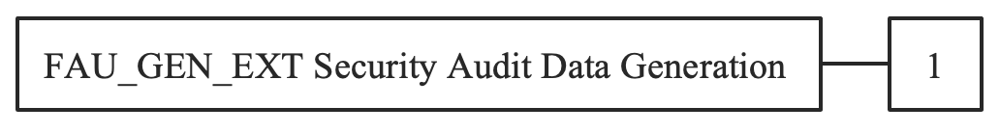

FAU_GEN_EXT.1 Security audit data shall be generated by all components in a distributed TOE

*Management: FAU_GEN_EXT.1*

The following actions could be considered for the management functions in FMT:

[loweralpha]
. The TSF shall have the ability to configure the cryptographic functionality.

*Audit: FAU_GEN_EXT.1*

The following actions should be auditable if FAU_GEN Security audit data generation is included in the PP/ST:

[loweralpha]
. No audit necessary.

=====  FAU_ GEN_EXT.1 Security Audit Data Generation for Distributed TOE Components

*FAU_GEN_EXT.1 Security Audit Data Generation*

Hierarchical to: No other components.

Dependencies: None.

*FAU_GEN_EXT.1.1*. The TSF shall be able to generate audit records for each TOE component. The audit records generated by the TSF of each TOE component shall *include the* subset of security relevant audit events which *can occur on the TOE component*.

==== Protected Audit Event Storage (FAU_STG_EXT)

*Family Behaviour*

This component defines the requirements for the TSF to be able to securely transmit audit data between the TOE and an external IT entity.

*Component levelling*

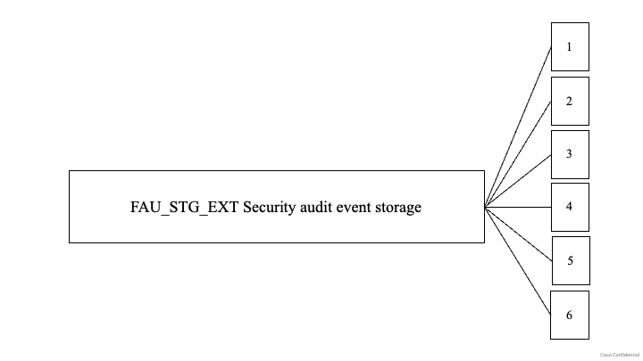

FAU_STG_EXT.1 Protected audit event storage requires the TSF to use a trusted channel implementing a secure protocol.

FAU_STG_EXT.2 Counting lost audit data requires the TSF to provide information about audit records affected when the audit log becomes full.

FAU_STG_EXT.3 Action in case of possible audit data loss requires the TSF to generate a warning before the audit trail exceeds the local storage capacity.

FAU_STG_EXT.4 Protected Local audit event storage for distributed TOEs requires the TSF to use a trusted channel to protect audit transfer to another TOE component.

FAU_STG_EXT.5 Protected Remote audit event storage for distributed TOEs requires the TSF to use a trusted channel to protect audit transfer to another TOE component.

*Management: FAU_STG_EXT.1, FAU_STG_EXT.2, FAU_STG_EXT.3, FAU_STG_EXT.4, FAU_STG_EXT.5*

The following actions could be considered for the management functions in FMT:

[loweralpha]
. The TSF shall have the ability to configure the cryptographic functionality.

*Audit: FAU_STG_EXT.1, FAU_STG_EXT.2, FAU_STG_EXT.3, FAU_STG_EXT.4. FAU_STG_EXT.5*

The following actions should be auditable if FAU_GEN Security audit data generation is included in the PP/ST:

[loweralpha]
. No audit necessary.

=====  FAU_ STG_EXT.1 Protected Audit Event Storage

*FAU_STG_EXT.1 Protected Audit Event Storage*

Hierarchical to: No other components.

Dependencies: FAU_GEN.1 Audit data generation, FTP_ITC.1 Inter-TSF Trusted Channel

*FAU_STG_EXT.1.1* The TSF shall be able to transmit the generated audit data to an external IT entity using a trusted channel according to FTP_ITC.1

*FAU_STG_EXT.1.2* The TSF shall be able to store generated audit data on the TOE itself. In addition [selection:

* _The TOE shall consist of a single standalone component that stores audit data locally,_
* _The TOE shall be a distributed TOE that stores audit data on the following TOE components: [assignment: identification of TOE components],_
* _The TOE shall be a distributed TOE with storage of audit data provided externally for the following TOE components: [assignment: list of TOE components that do not store audit data locally and the other TOE components to which they transmit their generated audit data]_.

*FAU_STG_EXT.1.3* The TSF shall [selection: _drop new audit data, overwrite previous audit records according to the following rule: [assignment: rule for overwriting previous audit records], [assignment: other action]_] when the local storage space for audit data is full.

=====  FAU_ STG_EXT.2 Counting Lost Audit Data

*FAU_STG_EXT.2 Counting Lost Audit Data*

Hierarchical to: No other components.

Dependencies: FAU_GEN.1 Audit data generation, FAU_STG_EXT.1 External Audit Trail Storage

*FAU_STG_EXT.2.1* The TSF shall provide information about the number of [selection: _dropped, overwritten, [assignment: other information]_] audit records in the case where the local storage has been filled and the TSF takes one of the actions defined in FAU_STG_EXT.1.3.

=====  FAU_ STG_EXT.3 Action in Case of Possible Audit Data Loss

*FAU_STG_EXT.3 Action in Case of Possible Audit Data Loss*

Hierarchical to: No other components.

Dependencies: FAU_GEN.1 Audit data generation

FAU_STG_EXT.1 External Audit Trail Storage

*FAU_STG_EXT.3.1/LocSpace* The TSF shall _generate a warning to inform the Administrator_ before the audit trail _exceeds the local audit trail storage capacity_.

=====  FAU_ STG_EXT.4 Protected Local Audit Event Storage for Distributed TOEs

*FAU_STG_EXT.4 Protected Audit Event Storage*

Hierarchical to: No other components.

Dependencies: FAU_GEN_EXT.1 Security Audit data generation for Distributed TOE Components

[FPT_ITT.1 Intra-TSF Trusted Channel or

FTP_ITC.1 Inter-TSF Trusted Channel]

*FAU_STG_EXT.4.1* The TSF of each TOE component which stores security audit data locally shall perform the following actions when the local storage space for audit data is full: _[assignment:_ _table of components and for each component its action chosen according to the following:_ [selection: _drop new audit data, overwrite previous audit records according to the following rule: [assignment: rule for overwriting previous audit records], [assignment: other action]_]].

=====  FAU_ STG_EXT.5 Protected Remote Audit Event Storage for Distributed TOEs

*FAU_STG_EXT.5 Protected Audit Event Storage*

Hierarchical to: No other components.

Dependencies: FAU_GEN_EXT.1 Security Audit data generation for Distributed TOE Components

[FPT_ITT.1 Intra-TSF Trusted Channel or

FTP_ITC.1 Inter-TSF Trusted Channel]

*FAU_STG_EXT.5.1* Each TOE component which does not store security audit data locally shall be able to buffer security audit data locally until it has been transferred to another TOE component that stores or forwards it. All transfer of audit records between TOE components shall use a protected channel according to _[selection: FPT_ITT.1, FTP_ITC.1]_.

=== Cryptographic Support (FCS)

==== Random Bit Generation (FCS_RBG_EXT)

=====  FCS_RBG_EXT.1 Random Bit Generation

*Family Behaviour*

Components in this family address the requirements for random bit/number generation. This is a new family defined for the FCS class.

*Component levelling*

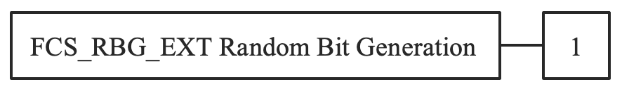

FCS_RBG_EXT.1 Random Bit Generation requires random bit generation to be performed in accordance with selected standards and seeded by an entropy source.

*Management: FCS_RBG_EXT.1*

The following actions could be considered for the management functions in FMT:

[loweralpha]
. There are no management activities foreseen

*Audit: FCS_RBG_EXT.1*

The following actions should be auditable if FAU_GEN Security audit data generation is included in the PP/ST:

[loweralpha]
. Minimal: failure of the randomization process

*FCS_RBG_EXT.1 Random Bit Generation*

Hierarchical to: No other components

Dependencies: No other components

*FCS_RBG_EXT.1.1* The TSF shall perform all deterministic random bit generation services in accordance with ISO/IEC 18031:2011 using [selection: _Hash_DRBG (any), HMAC_DRBG (any), CTR_DRBG (AES)_].

*FCS_RBG_EXT.1.2* The deterministic RBG shall be seeded by at least one entropy source that accumulates entropy from [selection: _[assignment: number of software-based sources] software-based noise source, [assignment: number of platform-based sources] platform-based noise source_] with a minimum of [selection: _128 bits, 192 bits, 256 bits_] of entropy at least equal to the greatest security strength, according to ISO/IEC 18031:2011 Table C.1 “Security Strength Table for Hash Functions”, of the keys and hashes that it will generate.

==== Cryptographic Protocols (FCS_DTLSC_EXT, FCS_DTLSS_EXT, FCS_HTTPS_EXT, FCS_IPSEC_EXT, FCS_NTP_EXT, FCS_SSHC_EXT, FCS_SSHS_EXT, FCS_TLSC_EXT, FCS_TLSS_EXT)

=====  FCS_DTLSC_EXT DTLS Client Protocol

*Family Behaviour*

The component in this family addresses the ability for a client to use DTLS to protect data between the client and a server using the DTLS protocol.

*Component levelling*

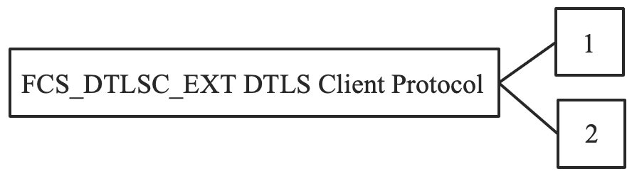

FCS_DTLSC_EXT.1 DTLS Client requires that the client side of DTLS be implemented as specified.

FCS_DTLSC_EXT.2 DTLS Client requires that the client side of the DTLS implementation include mutual authentication.

*Management: FCS_DTLSC_EXT.1, FCS_DTLSC_EXT.2*

The following actions could be considered for the management functions in FMT:

[loweralpha]
. There are no management activities foreseen.

*Audit: FCS_DTLSC_EXT.1, FCS_DTLSC_EXT.2*

The following actions should be considered for audit if FAU_GEN Security audit data generation is included in the PP/ST:

[loweralpha]
. Failure of DTLS session establishment
. DTLS session establishment
. DTLS session termination

*FCS_DTLSC_EXT.1 DTLS Client Protocol*

Hierarchical to: No other components

Dependencies: FCS_CKM. 1DataEncryption1 Cryptographic Key Generation

FCS_CKM.2 Cryptographic Key Establishment

FCS_COP.1/DataEncryption Cryptographic operation (AES Data encryption/decryption)

FCS_COP.1/SigGen1SigGen Cryptographic operation (Signature Generation and Verification)

FCS_COP.1/Hash Cryptographic operation (Hash Algorithm)

FCS_COP.1/KeyedHash Cryptographic operation (Keyed Hash Algorithm)

FCS_RBG_EXT.1 Random Bit Generation

FIA_X509_EXT.1 X.509 Certificate Validation

FIA_X509_EXT.2 X.509 Certificate Authentication

*FCS_DTLSC_EXT.1.1* The TSF shall implement [selection: _DTLS 1.2 (RFC 6347), DTLS 1.0 (RFC 4347)_] supporting the following ciphersuites:

* _[assignment: List of optional ciphersuites and reference to RFC in which each is defined]._

*FCS_DTLSC_EXT.1.2* The TSF shall verify that the presented identifier matches [selection: _the reference identifier per RFC 6125 section 6, IPv4 address in CN or SAN, IPv6 address in the CN or SAN, IPv4 address in SAN, IPv6 address in the SAN, the identifier per RFC 5280 Appendix A using [selection: id-at-commonName, id-at-countryName, id-at-dnQualifier, id-at-generationQualifier, id-at-givenName, id-at-initials, id-at-localityName, id-at-name, id-at-organizationalUnitName, id-at-organizationName, id-at-pseudonym, id-at-serialNumber, id-at-stateOrProvinceName, id-at-surname, id-at-title] and no other attribute types_].

*FCS_DTLSC_EXT.1.3* When establishing a trusted channel, by default the TSF shall not establish a trusted channel if the server certificate is invalid. The TSF shall also [selection:

* _Not implement any administrator override mechanism_
* _require administrator authorization to establish the connection if the TSF fails to [selection: match the reference identifier, validate certificate path, validate expiration date, determine the revocation status] of the presented server certificate_

].

*FCS_DTLSC_EXT.1.4* The TSF shall [selection: _not present the Supported Elliptic Curves/Supported Groups Extension, present the Supported Elliptic Curves/Supported Groups Extension with the following curves/groups: [selection: secp256r1, secp384r1, secp521r1, ffdhe2048, ffdhe3072, ffdhe4096, ffdhe6144, ffdhe8192] and no other curves/groups_] in the Client Hello.

*FCS_DTLSC_EXT.2 DTLS Client Support for Mutual Authentication*

Hierarchical to: No other components

Dependencies: FCS_CKM.1/DataEncryption Cryptographic Key Generation

FCS_CKM.2 Cryptographic Key Establishment

FCS_COP.1/DataEncryption Cryptographic operation (AES Data encryption/decryption)

FCS_COP.1/SigGen Cryptographic operation (Signature Generation and Verification)

FCS_COP.1/Hash Cryptographic operation (Hash Algorithm)

FCS_COP.1/KeyedHash Cryptographic operation (Keyed Hash Algorithm)

FCS_RBG_EXT.1 Random Bit Generation

FCS_DTLSC_EXT.1 DTLS Client Protocol

FIA_X509_EXT.1 X.509 Certificate Validation

FIA_X509_EXT.2 X.509 Certificate Authentication

*FCS_DTLSC_EXT.2.1* The TSF shall support mutual authentication using X.509v3 certificates.

*FCS_DTLSC_EXT.2.2* The TSF shall [selection: _terminate the DTLS session, silently discard the record_] if a message received contains an invalid MAC.

*FCS_DTLSC_EXT.2.3* The TSF shall detect and silently discard replayed messages for:

* DTLS records previously received;
* DTLS records too old to fit in the sliding window.

=====  FCS_DTLSS_EXT DTLS Server Protocol

*Family Behaviour*

The component in this family addresses the ability for a server to use DTLS to protect data between a client and the server using the DTLS protocol.

*Component levelling*

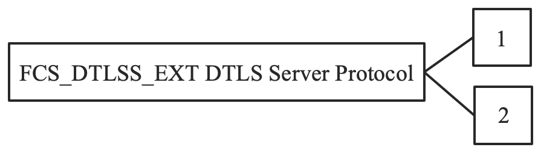

FCS_DTLSS_EXT.1 DTLS Server requires that the server side of TLS be implemented as specified.

FCS_DTLSS_EXT.2: DTLS Server requires that mutual authentication be included in the DTLS implementation.

*Management: FCS_DTLSS_EXT.1, FCS_DTLSS_EXT.2*

The following actions could be considered for the management functions in FMT:

[loweralpha]
. There are no management activities foreseen.

*Audit: FCS_DTLSS_EXT.1, FCS_DTLSS_EXT.2*

The following actions should be considered for audit if FAU_GEN Security audit data generation is included in the PP/ST:

[loweralpha]
. Failure of DTLS session establishment.
. DTLS session establishment
. DTLS session termination

*FCS_DTLSS_EXT.1 DTLS Server Protocol*

Hierarchical to: No other components

Dependencies: FCS_CKM.1 Cryptographic Key Generation

FCS_CKM.2 Cryptographic Key Establishment

FCS_COP.1//DataEncryption Cryptographic operation (AES Data encryption/decryption)

FCS_COP.1//SigGen Cryptographic operation (Signature Generation and Verification)

FCS_COP.1/Hash Cryptographic operation (Hash Algorithm)

FCS_COP.1/KeyedHash Cryptographic operation (Keyed Hash Algorithm)

FCS_RBG_EXT.1 Random Bit Generation

FIA_X509_EXT.1 X.509 Certificate Validation

FIA_X509_EXT.2 X.509 Certificate Authentication

*FCS_DTLSS_EXT.1.1* The TSF shall implement [selection: _DTLS 1.2 (RFC 6347), DTLS 1.0 (RFC 4347)_] supporting the following ciphersuites:

* _[assignment: List of optional ciphersuites and reference to RFC in which each is defined]_

*FCS_DTLSS_EXT.1.2* The TSF shall deny connections from clients requesting _[assignment: list of protocol versions]_.

*FCS_DTLSS_EXT.1.3* The TSF shall not proceed with a connection handshake attempt if the DTLS Client fails validation.

*FCS_DTLSS_EXT.1.4* The TSF shall perform key establishment for TLS using [selection: _RSA with key size [selection: 2048 bits, 3072 bits, 4096 bits], Diffie-Hellman parameters with size_ [selection__: 2048 bits, 3072 bits, 4096 bits, 6144 bits, 8192 bits], Diffie-Hellman groups__ [selection__: ffdhe2048, ffdhe3072, ffdhe4096, ffdhe6144, ffdhe8192, no other groups], ECDHE curves [selection: secp256r1, secp384r1, secp521r1] and no other curves__].

*FCS_DTLSS_EXT.1.5* The TSF shall [selection: _terminate the DTLS session, silently discard the record_] if a message received contains an invalid MAC.

*FCS_DTLSS_EXT.1.6* The TSF shall detect and silently discard replayed messages for:

* DTLS records previously received.
* DTLS Records too old to fit in the sliding window.

*FCS_DTLSS_EXT.1.7* The TSF shall support [selection: _no session resumption or session tickets, session resumption based on session IDs according to RFC 4346 (TLS1.1) or RFC 5246 (TLS1.2), session resumption based on session tickets according to RFC 5077_].

*FCS_DTLSS_EXT.2 DTLS Server Support for Mutual Authentication*

Hierarchical to: No other components

Dependencies: FCS_CKM.1 Cryptographic Key Generation

FCS_CKM.2 Cryptographic Key Establishment

FCS_COP.1/DataEncryption Cryptographic operation (AES Data encryption/decryption)

FCS_COP.1/SigGen Cryptographic operation (Signature Generation and Verification)

FCS_COP.1/Hash Cryptographic operation (Hash Algorithm)

FCS_COP.1/KeyedHash Cryptographic operation (Keyed Hash Algorithm)

FCS_RBG_EXT.1 Random Bit Generation

FCS_DTLSS_EXT.1 DTLS Server Protocol

*FCS_DTLSS_EXT.2.1* The TSF shall support mutual authentication of DTLS clients using X.509v3 certificates.

*FCS_DTLSS_EXT.2.2* When establishing a trusted channel, by default the TSF shall not establish a trusted channel if the client certificate is invalid. The TSF shall also [selection:

* {blank}
+

_Not implement any administrator override mechanism_

* _require administrator authorization to establish the connection if the TSF fails to_ [selection: _match the reference identifier, validate certificate path, validate expiration date, determine the revocation status] of the presented client certificate_

].

*FCS_DTLSS_EXT.2.3* The TSF shall not establish a trusted channel if the distinguished name (DN) or Subject Alternative Name (SAN) contained in a certificate does not match the expected identifier for the client.

===== FCS_HTTPS_EXT.1 HTTPS Protocol

*Family Behaviour*

Components in this family define the requirements for protecting remote management sessions between the TOE and a Security Administrator. This family describes how HTTPS will be implemented. This is a new family defined for the FCS Class.

*Component levelling*

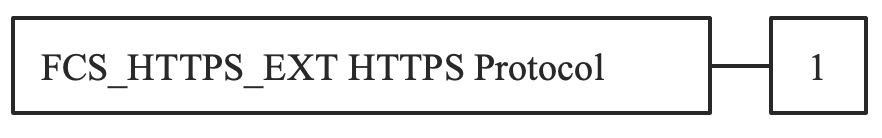

FCS_HTTPS_EXT.1 HTTPS requires that HTTPS be implemented according to RFC 2818 and supports TLS.

*Management: FCS_HTTPS_EXT.1*

The following actions could be considered for the management functions in FMT:

[loweralpha]
. There are no management activities foreseen.

*Audit: FCS_HTTPS_EXT.1*

The following actions should be auditable if FAU_GEN Security audit data generation is included in the PP/ST:

[loweralpha]
. There are no auditable events foreseen.

*FCS_HTTPS_EXT.1 HTTPS Protocol*

Hierarchical to: No other components

Dependencies: [FCS_TLSC_EXT.1 TLS Client Protocol, or +
FCS_TLSS_EXT.1 TLS Server Protocol]

*FCS_HTTPS_EXT.1.1* The TSF shall implement the HTTPS protocol that complies with RFC 2818.

*FCS_HTTPS_EXT.1.2* The TSF shall implement the HTTPS protocol using TLS.

*FCS_HTTPS_EXT.1.3* If a peer certificate is presented, the TSF shall [selection: _not establish the connection, request authorization to establish the connection, [assignment: other action]_] if the peer certificate is deemed invalid.

=====  FCS_IPSEC_EXT.1 IPsec Protocol

*Family Behaviour*

Components in this family address the requirements for protecting communications using IPsec.

*Component levelling*

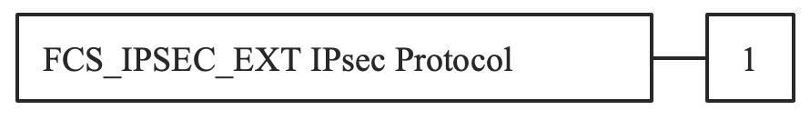

FCS_IPSEC_EXT.1 IPsec requires that IPsec be implemented as specified.

*Management: FCS_IPSEC_EXT.1*

The following actions could be considered for the management functions in FMT:

[loweralpha]
. Maintenance of SA lifetime configuration

*Audit: FCS_IPSEC_EXT.1*

The following actions should be considered for audit if FAU_GEN Security audit data generation is included in the PP/ST:

[loweralpha]
. Decisions to DISCARD, BYPASS, PROTECT network packets processed by the TOE.
. Failure to establish an IPsec SA
. IPsec SA establishment
. IPsec SA termination
. Negotiation “down” from an IKEv2 to IKEv1 exchange.

*FCS_IPSEC_EXT.1 Internet Protocol Security (IPsec) Communications*

Hierarchical to: No other components

Dependencies: FCS_CKM.1 Cryptographic Key Generation

FCS_CKM.2 Cryptographic Key Establishment

FCS_COP.1/DataEncryption Cryptographic operation (AES Data encryption/decryption)

FCS_COP.1/SigGen Cryptographic operation (Signature Generation and Verification)

FCS_COP.1/Hash Cryptographic operation (Hash Algorithm)

FCS_COP.1/KeyedHash Cryptographic operation (Keyed Hash Algorithm)

FCS_RBG_EXT.1 Random Bit Generation

*FCS_IPSEC_EXT.1.1* The TSF shall implement the IPsec architecture as specified in RFC 4301.

*FCS_IPSEC_EXT.1.2* The TSF shall have a nominal, final entry in the SPD that matches anything that is otherwise unmatched and discards it.

*FCS_IPSEC_EXT.1.3* The TSF shall implement [selection: _tunnel mode, transport mode_].

*FCS_IPSEC_EXT.1.4* The TSF shall implement the IPsec protocol ESP as defined by RFC 4303 using the cryptographic algorithms [selection: _AES-CBC-128 (RFC 3602), AES-CBC-192 (RFC 3602), AES-CBC-256 (RFC 3602), AES-GCM-128 (RFC 4106), AES-GCM-192 (RFC 4106), AES-GCM-256 (RFC 4106),_] together with a Secure Hash Algorithm (SHA)-based HMAC [selection: _HMAC-SHA-1, HMAC-SHA-256, HMAC-SHA-384, HMAC-SHA-512, no HMAC algorithm_].

*FCS_IPSEC_EXT.1.5* The TSF shall implement the protocol: [selection:

* _IKEv1, using Main Mode for Phase 1 exchanges, as defined in RFCs 2407, 2408, 2409, RFC 4109, [selection: no other RFCs for extended sequence numbers, RFC 4304 for extended sequence numbers], and [selection: no other RFCs for hash functions, RFC 4868 for hash functions];_
* _IKEv2 as defined in RFCs 5996 [selection: with no support for NAT traversal, with mandatory support for NAT traversal as specified in RFC 5996, section 2.23)_]_, and_ [selection: _no other RFCs for hash functions, RFC 4868 for hash functions]_].

*FCS_IPSEC_EXT.1.6* The TSF shall ensure the encrypted payload in the [selection: _IKEv1, IKEv2_] protocol uses the cryptographic algorithms [selection: _AES-CBC-128, AES_CBC-192 AES-CBC-256 (specified in RFC 3602), AES-GCM-128, AES-GCM-192, AES-GCM-256 (specified in RFC 5282)_].

*FCS_IPSEC_EXT.1.7* The TSF shall ensure that [selection:

* _IKEv1 Phase 1 SA lifetimes can be configured by a Security Administrator based on [selection:_
** _number of bytes;_
** _length of time, where the time values can be configured within [assignment: integer range including 24] hours;_

_];_

* _IKEv2 SA lifetimes can be configured by a Security Administrator based on [selection:_
** _number of bytes;_
** _length of time, where the time values can be configured within [assignment: integer range including 24] hours_

_]_

].

*FCS_IPSEC_EXT.1.8* The TSF shall ensure that [selection:

* _IKEv1 Phase 2 SA lifetimes can be configured by a Security Administrator based on_ [selection:
** _number of bytes;_
** _length of time, where the time values can be configured within [assignment: integer range including 8] hours;_

]_;_

* _IKEv2 Child SA lifetimes can be configured by a Security Administrator based on_ [selection:
** _number of bytes;_
** _length of time, where the time values can be configured within [assignment: integer range including 8] hours;_

]

].

*FCS_IPSEC_EXT.1.9* The TSF shall generate the secret value x used in the IKE Diffie-Hellman key exchange (“x” in g^x^ mod p) using the random bit generator specified in FCS_RBG_EXT.1, and having a length of at least _[assignment: (one or more) number(s) of bits that is at least twice the security strength of the negotiated Diffie-Hellman group_] bits.

*FCS_IPSEC_EXT.1.10* The TSF shall generate nonces used in [selection: _IKEv1, IKEv2_] exchanges of length [selection:

* _according to the security strength associated with the negotiated Diffie-Hellman group;_
* _at least 128 bits in size and at least half the output size of the negotiated pseudorandom function (PRF) hash_

].

*FCS_IPSEC_EXT.1.11* The TSF shall ensure that IKE protocols implement DH Group(s) [selection:

* _[selection: 14 (2048-bit MODP), 15 (3072-bit MODP), 16 (4096-bit MODP), 17 (6144-bit MODP), 18 (8192-bit MODP)] according to RFC 3526,_
* [selection__: 19 (256-bit Random ECP), 20 (384-bit Random ECP),__ _21 (521-bit Random ECP), 24 (2048-bit MODP with 256-bit POS)] according to RFC 5114._

_]._

*FCS_IPSEC_EXT.1.12* The TSF shall be able to ensure by default that the strength of the symmetric algorithm (in terms of the number of bits in the key) negotiated to protect the [selection: _IKEv1 Phase 1, IKEv2 IKE_SA_] connection is greater than or equal to the strength of the symmetric algorithm (in terms of the number of bits in the key) negotiated to protect the [selection: _IKEv1 Phase 2, IKEv2 CHILD_SA_] connection.

*FCS_IPSEC_EXT.1.13* The TSF shall ensure that all IKE protocols perform peer authentication using [selection: _RSA, ECDSA_] that use X.509v3 certificates that conform to RFC 4945 and [selection: _Pre-shared Keys, no other method_].

*FCS_IPSEC_EXT.1.14* The TSF shall only establish a trusted channel if the presented identifier in the received certificate matches the configured reference identifier, where the presented and reference identifiers are of the following fields and types: [selection: _SAN: IP address, SAN: Fully Qualified Domain Name (FQDN), SAN: user FQDN, CN: IP address, CN: Fully Qualified Domain Name (FQDN), CN: user FQDN, Distinguished Name (DN)]_ and [selection: _no other reference identifier type, [assignment: other supported reference identifier types_]].

=====  FCS_NTP_EXT.1 NTP Protocol

*Family Behaviour*

The component in this family addresses the ability for a TOE to protect NTP time synchronization traffic.

*Component levelling*

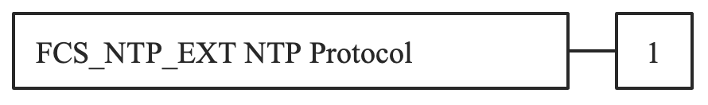

FCS_NTP_EXT.1 Requires NTP to be implemented as specified

*Management: FCS_NTP_EXT.1*

The following actions could be considered for the management functions in FMT:
[loweralpha]
. Ability to configure NTP

*Audit: FCS_NTP_EXT.1*

The following actions should be considered for audit if FAU_GEN Security audit data generation is included in the PP/ST:
[loweralpha]
. No audit requirements are specified.

*FCS_NTP_EXT.1 NTP Protocol*

Hierarchical to: No other components

Dependencies: FCS_COP.1 Cryptographic operation

\[FCS_DTLSC_EXT.1 DTLSC Client Protocol or FCS_IPSEC_EXT.1 IPsec Protocol]

*FCS_NTP_EXT.1.1* The TSF shall use only the following NTP version(s) [selection: _NTP v3 (RFC 1305), NTP v4 (RFC 5905)_].

*FCS_NTP_EXT.1.2* The TSF shall update its system time using [selection:

* Authentication using [selection: [.underline]#_SHA1, SHA256, SHA384, SHA512, AES-CBC-128, AES-CBC-256_]# as the message digest algorithm(s);
* [selection: _[.underline]#IPsec, DTLS#_] to provide trusted communication between itself and an NTP time source.

].

*FCS_NTP_EXT.1.3* The TSF shall not update NTP timestamp from broadcast and/or multicast addresses.

*FCS_NTP_EXT.1.4* The TSF shall support configuration of at least three (3) NTP time sources in the Operational Environment.

=====  FCS_SSHC_EXT.1 SSH Client

*Family Behaviour*

The component in this family addresses the ability for a client to use SSH to protect data between the client and a server using the SSH protocol.

*Component levelling*

image:extracted-media/media/FCS_SSHC_EXT.png[image,width=500,height=48]

FCS_SSHC_EXT.1 SSH Client requires that the client side of SSH be implemented as specified.

*Management: FCS_SSHC_EXT.1*

The following actions could be considered for the management functions in FMT:

[loweralpha]
. There are no management activities foreseen.

*Audit: FCS_SSHC_EXT.1*

The following actions should be considered for audit if FAU_GEN Security audit data generation is included in the PP/ST:

[loweralpha]
. Failure of SSH session establishment
. SSH session establishment
. SSH session termination

*FCS_SSHC_EXT.1 SSH Client Protocol*

Hierarchical to: No other components

Dependencies: FCS_CKM.1 Cryptographic Key Generation

FCS_CKM.2 Cryptographic Key Establishment

FCS_COP.1/DataEncryption Cryptographic operation (AES Data encryption/decryption)

FCS_COP.1/SigGen Cryptographic operation (Signature Generation and Verification)

FCS_COP.1/Hash Cryptographic operation (Hash Algorithm)

FCS_COP.1/KeyedHash Cryptographic operation (Keyed Hash Algorithm)

FCS_RBG_EXT.1 Random Bit Generation

*FCS_SSHC_EXT.1.1* The TSF shall implement the SSH protocol in accordance with: RFCs _4251, 4252, 4253, 4254,_ [selection: _4256, 4344, 5647, 5656, 6187, 6668, 8268, 8308 section 3.1, 8332_].

*FCS_SSHC_EXT.1.2* The TSF shall ensure that the SSH protocol implementation supports the following authentication methods as described in RFC 4252: public key-based, [selection: password-based, no other method].

*FCS_SSHC_EXT.1.3* The TSF shall ensure that, as described in RFC 4253, packets greater than _[assignment: number of bytes]_ bytes in an SSH transport connection are dropped.

*FCS_SSHC_EXT.1.4* The TSF shall ensure that the SSH transport implementation uses the following encryption algorithms and rejects all other encryption algorithms: [assignment: _list of encryption algorithms_].

*FCS_SSHC_EXT.1.5* The TSF shall ensure that the SSH public-key based authentication implementation uses [selection: _ssh-rsa, rsa-sha2-256, rsa-sha2-512, ecdsa-sha2-nistp256, x509v3-ssh-rsa, ecdsa-sha2-nistp384, ecdsa-sha2-nistp521, x509v3-ecdsa-sha2-nistp256, x509v3-ecdsa-sha2-nistp384, x509v3-ecdsa-sha2-nistp521, x509v3-rsa2048-sha256_] as its public key algorithm(s) and rejects all other public key algorithms

*FCS_SSHC_EXT.1.6* The TSF shall ensure that the SSH transport implementation uses _[assignment: list of data integrity MAC algorithms]_ as its data integrity MAC algorithm(s) and rejects all other MAC algorithm(s).

*FCS_SSHC_EXT.1.7* The TSF shall ensure that _[assignment: list of key exchange methods]_ are the only allowed key exchange methods used for the SSH protocol.

*FCS_SSHC_EXT.1.8* The _TSF shall ensure that within SSH connections, the same session keys are used for a threshold of no longer than one hour, and each encryption key is used to protect no more than one gigabyte of data. After any of the thresholds are reached, a rekey needs to be performed_.

*FCS_SSHC_EXT.1.9* The TSF shall ensure that the SSH client authenticates the identity of the SSH server using a local database associating each host name with its corresponding public key and [selection: _a list of trusted certification authorities, no other methods_] as described in RFC 4251 section 4.1.

=====  FCS_SSHS_EXT.1 SSH Server Protocol

*Family Behaviour*

The component in this family addresses the ability for a server to offer SSH to protect data between a client and the server using the SSH protocol.

*Component levelling*

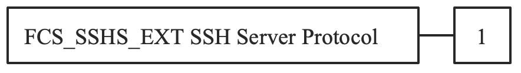

FCS_SSHS_EXT.1 SSH Server requires that the server side of SSH be implemented as specified.

*Management: FCS_SSHS_EXT.1*

The following actions could be considered for the management functions in FMT:

[loweralpha]
. There are no management activities foreseen.

*Audit: FCS_SSHS_EXT.1*

The following actions should be considered for audit if FAU_GEN Security audit data generation is included in the PP/ST:

[loweralpha]
. Failure of SSH session establishment
. SSH session establishment
. SSH session termination

*FCS_SSHS_EXT.1 SSH Server* *Protocol*

Hierarchical to: No other components

Dependencies: FCS_CKM.1Cryptographic Key Generation

FCS_CKM.2 Cryptographic Key Establishment

FCS_COP.1/DataEncryption Cryptographic operation (AES Data encryption/decryption)

FCS_COP.1/SigGen Cryptographic operation (Signature Generation and Verification)

FCS_COP.1/Hash Cryptographic operation (Hash Algorithm)

FCS_COP.1/KeyedHash Cryptographic operation (Keyed Hash Algorithm)

FCS_RBG_EXT.1 Random Bit Generation

*FCS_SSHS_EXT.1.1* The TSF shall implement the SSH protocol in accordance with: RFCs 4251, 4252, 4253, 4254, [selection: _4256, 4344, 5647, 5656, 6187, 6668, 8268, 8308_ section 3.1, 8332].

*FCS_SSHS_EXT.1.2* The TSF shall ensure that the SSH protocol implementation supports the following authentication methods as described in RFC 4252: public key-based, [selection: _password-based, no other method_].

*FCS_SSHS_EXT.1.3* The TSF shall ensure that, as described in RFC 4253, packets greater than _[assignment: number of bytes]_ bytes in an SSH transport connection are dropped.

*FCS_SSHS_EXT.1.4* The TSF shall ensure that the SSH transport implementation uses the following encryption algorithms and rejects all other encryption algorithms: _[assignment: encryption algorithms]_.

*FCS_SSHS_EXT.1.5* The TSF shall ensure that the SSH public-key based authentication implementation uses [selection: _ssh-rsa, rsa-sha2-256, rsa-sha2-512, ecdsa-sha2-nistp256, x509v3-ssh-rsa, ecdsa-sha2-nistp384, ecdsa-sha2-nistp521, x509v3-ecdsa-sha2-nistp256, x509v3-ecdsa-sha2-nistp384, x509v3-ecdsa-sha2-nistp521, x509v3-rsa2048-sha256_] as its public key algorithm(s) and rejects all other public key algorithms.

*FCS_SSHS_EXT.1.6* The TSF shall ensure that the SSH transport implementation uses _[assignment: list of MAC algorithms]_ as its MAC algorithm(s) and rejects all other MAC algorithm(s).

*FCS_SSHS_EXT.1.7* The TSF shall ensure that _[assignment: list of key exchange methods]_ are the only allowed key exchange methods used for the SSH protocol.

*FCS_SSHS_EXT.1.8* The _TSF shall ensure that within SSH connections, the same session keys are used for a threshold of no longer than one hour, and each encryption key is used to protect no more than one gigabyte of data. After any of the thresholds are reached, a rekey needs to be performed_.

=====  FCS_TLSC_EXT TLS Client Protocol

*Family Behaviour*

The component in this family addresses the ability for a client to use TLS to protect data between the client and a server using the TLS protocol.

*Component levelling*

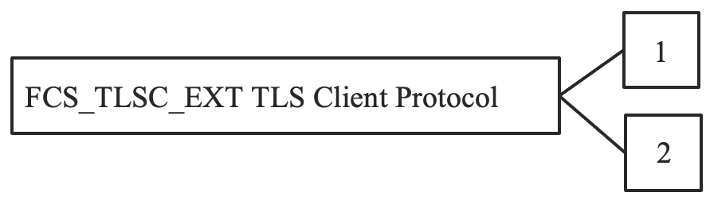

FCS_TLSC_EXT.1 TLS Client requires that the client side of TLS be implemented as specified.

FCS_TLSC_EXT.2 TLS Client requires that the client side of the TLS implementation include mutual authentication.

*Management: FCS_TLSC_EXT.1, FCS_TLSC_EXT.2*

The following actions could be considered for the management functions in FMT:

[loweralpha]
. There are no management activities foreseen.

*Audit: FCS_TLSC_EXT.1, FCS_TLSC_EXT.2*

The following actions should be considered for audit if FAU_GEN Security audit data generation is included in the PP/ST:

[loweralpha]
. Failure of TLS session establishment
. TLS session establishment
. TLS session termination

*FCS_TLSC_EXT.1 TLS Client Protocol without Mutual Authentication*

Hierarchical to: No other components

Dependencies: FCS_CKM. 1 Cryptographic Key Generation

FCS_CKM.2 Cryptographic Key Establishment

FCS_COP.1/DataEncryption Cryptographic operation (AES Data encryption/decryption)

FCS_COP.1/SigGen Cryptographic operation (Signature Generation and Verification)

FCS_COP.1/Hash Cryptographic operation (Hash Algorithm)

FCS_COP.1/KeyedHash Cryptographic operation (Keyed Hash Algorithm)

FCS_RBG_EXT.1 Random Bit Generation

FIA_X509_EXT.1 X.509 Certificate Validation

FIA_X509_EXT.2 X.509 Certificate Authentication

*FCS_TLSC_EXT.1.1* The TSF shall implement [selection: _TLS 1.2 (RFC 5246), TLS 1.1 (RFC 4346)_] and reject all other TLS and SSL versions. The TLS implementation will support the following ciphersuites:

* _[assignment: list of optional ciphersuites and reference to RFC in which each is defined]_ and no other ciphersuites__.__

*FCS_TLSC_EXT.1.2* The TSF shall verify that the presented identifier matches [selection: _the reference identifier per RFC 6125 section 6, IPv4 address in CN or SAN, IPv6 address in the CN or SAN, IPv4 address in SAN, IPv6 address in the SAN, the identifier per RFC 5280 Appendix A using [selection: id-at-commonName, id-at-countryName, id-at-dnQualifier, id-at-generationQualifier, id-at-givenName, id-at-initials, id-at-localityName, id-at-name, id-at-organizationalUnitName, id-at-organizationName, id-at-pseudonym, id-at-serialNumber, id-at-stateOrProvinceName, id-at-surname, id-at-title] and no other attribute types_].

*FCS_TLSC_EXT.1.3* When establishing a trusted channel, by default the TSF shall not establish a trusted channel if the server certificate is invalid. The TSF shall also [selection:

* _Not implement any administrator override mechanism_
* _require administrator authorization to establish the connection if the TSF fails to [selection: match the reference identifier, validate certificate path, validate expiration date, determine the revocation status] of the presented server certificate_

].

*FCS_TLSC_EXT.1.4* The TSF shall [selection: _not present the Supported Elliptic Curves/Supported Groups Extension, present the Supported Elliptic Curves/Supported Groups Extension with the following curves/groups: [selection: secp256r1, secp384r1, secp521r1, ffdhe2048, ffdhe3072, ffdhe4096, ffdhe6144, ffdhe8192] and no other curves/groups_] in the Client Hello.

*FCS_TLSC_EXT.2 TLS Client Support for Mutual Authentication*

Hierarchical to: No other components

Dependencies: FCS_CKM.1Cryptographic Key Generation

FCS_CKM.2 Cryptographic Key Establishment

FCS_COP.1/DataEncryption Cryptographic operation (AES Data encryption/decryption)

FCS_COP.1/SigGen Cryptographic operation (Signature Generation and Verification)

FCS_COP.1/Hash Cryptographic operation (Hash Algorithm)

FCS_COP.1/KeyedHash Cryptographic operation (Keyed Hash Algorithm)

FCS_RBG_EXT.1 Random Bit Generation

FCS_TLSC_EXT.1 TLS Client Protocol without mutual authentication

FIA_X509_EXT.1 X.509 Certificate Validation

FIA_X509_EXT.2 X.509 Certificate Authentication

*FCS_TLSC_EXT.2.1* The TSF shall support TLS communication with mutual authentication using X.509v3 certificates.

=====  FCS_TLSS_EXT TLS Server Protocol

*Family Behaviour*

The component in this family addresses the ability for a server to use TLS to protect data between a client and the server using the TLS protocol.

*Component levelling*

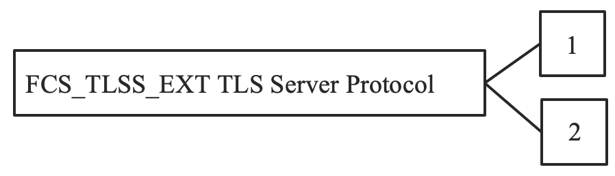

FCS_TLSS_EXT.1 TLS Server requires that the server side of TLS be implemented as specified.

FCS_TLSS_EXT.2: TLS Server requires the mutual authentication be included in the TLS implementation.

*Management: FCS_TLSS_EXT.1, FCS_TLSS_EXT.2*

The following actions could be considered for the management functions in FMT:

[loweralpha]
. There are no management activities foreseen.

*Audit: FCS_TLSS_EXT.1, FCS_TLSS_EXT.2*

The following actions should be considered for audit if FAU_GEN Security audit data generation is included in the PP/ST:

[loweralpha]
. Failure of TLS session establishment
. TLS session establishment
. TLS session termination

*FCS_TLSS_EXT.1 TLS Server Protocol without Mutual Authentication*

Hierarchical to: No other components

Dependencies: FCS_CKM.1 Cryptographic Key Generation

FCS_CKM.2 Cryptographic Key Establishment

FCS_COP.1/DataEncryption Cryptographic operation (AES Data encryption/decryption)

FCS_COP.1/SigGen Cryptographic operation (Signature Generation and Verification)

FCS_COP.1/Hash Cryptographic operation (Hash Algorithm)

FCS_COP.1/KeyedHash Cryptographic operation (Keyed Hash Algorithm)

FCS_RBG_EXT.1 Random Bit Generation

FIA_X509_EXT.1 X.509 Certificate Validation

FIA_X509_EXT.2 X.509 Certificate Authentication

*FCS_TLSS_EXT.1.1* The TSF shall implement [selection: _TLS 1.2 (RFC 5246), TLS 1.1 (RFC 4346)_] and reject all other TLS and SSL versions. The TLS implementation will support the following ciphersuites:

* _[assignment: list of optional ciphersuites and reference to RFC in which each is defined]_ and no other ciphersuites.

*FCS_TLSS_EXT.1.2* The TSF shall deny connections from clients requesting _SSL 2.0, SSL 3.0, TLS 1.0 and [selection: TLS 1.1, TLS 1.2, none]_.

*FCS_TLSS_EXT.1.3* The TSF shall perform key establishment for TLS using [selection: _RSA with key size [selection: 2048 bits, 3072 bits, 4096 bits], Diffie-Hellman parameters with size_ [selection__: 2048 bits, 3072 bits, 4096 bits, 6144 bits, 8192 bits], Diffie-Hellman groups__ [selection: _ffdhe2048, ffdhe3072, ffdhe4096, ffdhe6144, ffdhe8192, no other groups], ECDHE curves [selection: secp256r1, secp384r1, secp521r1] and no other curves_]].

*FCS_TLSS_EXT.1.4* The TSF shall support [selection: _no session resumption or session tickets, session resumption based on session IDs according to_ RFC 4346 _(TLS1.1) or_ RFC 5246 _(TLS1.2), session resumption based on session tickets according to_ RFC 5077].

*FCS_TLSS_EXT.2 TLS Server Support for Mutual Authentication*

Hierarchical to: No other components

Dependencies: FCS_CKM.1 Cryptographic Key Generation

FCS_CKM.2 Cryptographic Key Establishment

FCS_COP.1/DataEncryption Cryptographic operation (AES Data encryption/decryption)

FCS_COP.1/SigGen Cryptographic operation (Signature Generation and Verification)

FCS_COP.1/Hash Cryptographic operation (Hash Algorithm)

FCS_COP.1/KeyedHash Cryptographic operation (Keyed Hash Algorithm)

FCS_RBG_EXT.1 Random Bit Generation

FCS_TLSS_EXT.1 TLS Server Protocol without mutual authentication

FIA_X509_EXT.1 X.509 Certificate Validation

FIA_X509_EXT.2 X.509 Certificate Authentication

*FCS_TLSS_EXT.2.1* The TSF shall support TLS communication with mutual authentication of TLS clients using X.509v3 certificates.

*FCS_TLSS_EXT.2.2* When establishing a trusted channel, by default the TSF shall not establish a trusted channel if the client certificate is invalid. The TSF shall also [selection:

* _Not implement any administrator override mechanism_
* _require administrator authorization to establish the connection if the TSF fails to_ [selection: _match the reference identifier, validate certificate path, validate expiration date, determine the revocation status] of the presented client certificate_

].

*FCS_TLSS_EXT.2.3* The TSF shall not establish a trusted channel if the identifier contained in a certificate does not match an expected identifier for the client. If the identifier is a Fully Qualified Domain Name (FQDN), then the TSF shall match the identifiers according to RFC 6125, otherwise the TSF shall parse the identifier from the certificate and match the identifier against the expected identifier of the client as described in the TSS.

=== Identification and Authentication (FIA)

==== Password Management (FIA_PMG_EXT)

*Family Behaviour*

The TOE defines the attributes of passwords used by administrative users to ensure that strong passwords and passphrases can be chosen and maintained.

*Component levelling*

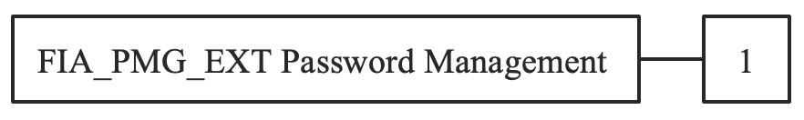

FIA_PMG_EXT.1 Password management requires the TSF to support passwords with varying composition requirements, minimum lengths, maximum lifetime, and similarity constraints.

*Management: FIA_PMG_EXT.1*

No management functions.

*Audit: FIA_PMG_EXT.1*

No specific audit requirements.

=====  FIA_PMG_EXT.1 Password Management

*FIA_PMG_EXT.1 Password Management*

Hierarchical to: No other components.

Dependencies: No other components.

*FIA_PMG_EXT.1.1* The TSF shall provide the following password management capabilities for administrative passwords:

[loweralpha]
. Passwords shall be able to be composed of any combination of upper and lower case letters, numbers, and the following special characters: [selection: _“!”, “@”, “#”, “$”, “%”, “^”, “&”, “*”, “(“, “)”, [assignment: other characters]_];
. Minimum password length shall _be configurable to between [assignment: minimum number of characters supported by the TOE] and [assignment: number of characters greater than or equal to 15] characters._

==== User Identification and Authentication (FIA_UIA_EXT)

*Family Behaviour*

The TSF allows certain specified actions before the non-TOE entity goes through the identification and authentication process.

*Component levelling*

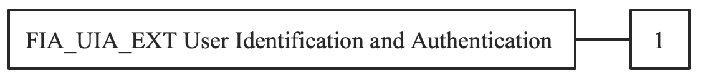

FIA_UIA_EXT.1 User Identification and Authentication requires Administrators (including remote Administrators) to be identified and authenticated by the TOE, providing assurance for that end of the communication path. It also ensures that every user is identified and authenticated before the TOE performs any mediated functions

*Management: FIA_UIA_EXT.1*

The following actions could be considered for the management functions in FMT:

[loweralpha]
. Ability to configure the list of TOE services available before an entity is identified and authenticated

*Audit: FIA_UIA_EXT.N*

The following actions should be auditable if FAU_GEN Security audit data generation is included in the PP/ST:

[loweralpha]
. All use of the identification and authentication mechanism
. Provided user identity, origin of the attempt (e.g. IP address)

=====  FIA_UIA_EXT.1 User Identification and Authentication

*FIA_UIA_EXT.1 User Identification and Authentication*

Hierarchical to: No other components.

Dependencies: FTA_TAB.1 Default TOE Access Banners

*FIA_UIA_EXT.1.1* The TSF shall allow the following actions prior to requiring the non-TOE entity to initiate the identification and authentication process:

* Display the warning banner in accordance with FTA_TAB.1;

* [selection: _no other actions, automated generation of cryptographic keys, [assignment: list of services, actions performed by the TSF in response to non-TOE requests]_].

*FIA_UIA_EXT.1.2* The TSF shall require each administrative user to be successfully identified and authenticated before allowing any other TSF-mediated actions on behalf of that administrative user.

==== User authentication (FIA_UAU_EXT)

*Family Behaviour*

Provides for a locally based administrative user authentication mechanism

*Component levelling*

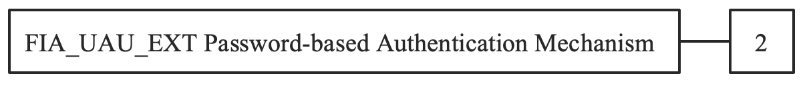

FIA_UAU_EXT.2 The password-based authentication mechanism provides administrative users a locally based authentication mechanism.

*Management: FIA_UAU_EXT.2*

The following actions could be considered for the management functions in FMT:

[loweralpha]
. None

*Audit: FIA_UAU_EXT.2*

The following actions should be auditable if FAU_GEN Security audit data generation is included in the PP/ST:

[loweralpha]
. Minimal: All use of the authentication mechanism

=====  FIA_UAU_EXT.2 Password-based Authentication Mechanism

*FIA_UAU_EXT.2 Password-based Authentication Mechanism*

Hierarchical to: No other components.

Dependencies: No other components.

*FIA_UAU_EXT.2.1* The TSF shall provide a local [selection: _password-based, SSH public key-based, certificate-based, [assignment: other authentication mechanism(s)]_] authentication mechanism to perform local administrative user authentication.

==== Authentication using X.509 certificates (FIA_X509_EXT)

*Family Behaviour*

This family defines the behaviour, management, and use of X.509 certificates for functions to be performed by the TSF. Components in this family require validation of certificates according to a specified set of rules, use of certificates for authentication for protocols and integrity verification, and the generation of certificate requests.

*Component levelling*

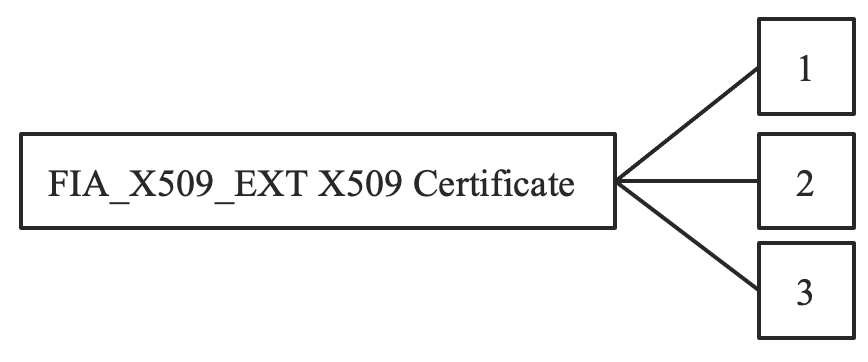

FIA_X509_EXT.1 X509 Certificate Validation, requires the TSF to check and validate certificates in accordance with the RFCs and rules specified in the component.

FIA_X509_EXT.2 X509 Certificate Authentication, requires the TSF to use certificates to authenticate peers in protocols that support certificates, as well as for integrity verification and potentially other functions that require certificates.

FIA_X509_EXT.3 X509 Certificate Requests, requires the TSF to be able to generate Certificate Request Messages and validate responses.

*Management: FIA_X509_EXT.1, FIA_X509_EXT.2, FIA_X509_EXT.3*

The following actions could be considered for the management functions in FMT:

[loweralpha]
. Remove imported X.509v3 certificates
. Approve import and removal of X.509v3 certificates
. Initiate certificate requests

*Audit: FIA_X509_EXT.1, FIA_X509_EXT.2, FIA_X509_EXT.3*

The following actions should be auditable if FAU_GEN Security audit data generation is included in the PP/ST:

[loweralpha]
. Minimal: No specific audit requirements are specified.

=====  FIA_X509_EXT.1 X.509 Certificate Validation

*FIA_X509_EXT.1 X.509 Certificate Validation*

Hierarchical to: No other components

Dependencies: FIA_X509_EXT.2 X.509 Certificate Authentication

*FIA_X509_EXT.1.1* The TSF shall validate certificates in accordance with the following rules:

* RFC 5280 certificate validation and certification path validation.
* The certification path must terminate with a trusted CA certificate designated as a trust anchor.
* The TSF shall validate a certification path by ensuring that all CA certificates in the certification path contain the basicConstraints extension with the CA flag set to TRUE.
* The TSF shall validate the revocation status of the certificate using [selection: _the Online Certificate Status Protocol (OCSP) as specified in RFC 6960, a Certificate Revocation List (CRL) as specified in RFC 5280 Section 6.3, Certificate Revocation List (CRL) as specified in RFC 5759 Section 5, no revocation method_]
* The TSF shall validate the extendedKeyUsage field according to the following rules: _[assignment: rules that govern contents of the extendedKeyUsage field that need to be verified]_.

*FIA_X509_EXT.1.2* The TSF shall only treat a certificate as a CA certificate if the basicConstraints extension is present and the CA flag is set to TRUE.

=====  FIA_X509_EXT.2 X509 Certificate Authentication

*FIA_X509_EXT.2 X.509 Certificate Authentication*

Hierarchical to: No other components

Dependencies: FIA_X509_EXT.1 X.509 Certificate Validation

*FIA_X509_EXT.2.1* The TSF shall use X.509v3 certificates as defined by RFC 5280 to support authentication for [selection__: DTLS, HTTPS, IPsec, TLS, SSH, [assignment: other protocols], no protocols__], and [selection: _code signing for system software updates [assignment: other uses], no additional uses_].

*FIA_X509_EXT.2.2* When the TSF cannot establish a connection to determine the validity of a certificate, the TSF shall [selection: _allow the Administrator to choose whether to accept the certificate in these cases, accept the certificate, not accept the certificate_].

===== FIA_X509_EXT.3 X.509 Certificate Requests

*FIA_X509_EXT.3 X.509 Certificate Requests*

Hierarchical to: No other components

Dependencies: FCS_CKM.1 Cryptographic Key Generation

FIA_X509_EXT.1 X.509 Certificate Validation

*FIA_X509_EXT.3.1* The TSF shall generate a Certificate Request as specified by RFC 2986 and be able to provide the following information in the request: public key and [selection: _device-specific information, Common Name, Organization, Organizational Unit, Country, [assignment: other information]_].

*FIA_X509_EXT.3.2* The TSF shall validate the chain of certificates from the Root CA upon receiving the CA Certificate Response.

=== Protection of the TSF (FPT)

==== Protection of TSF Data (FPT_SKP_EXT)

*Family Behaviour*

Components in this family address the requirements for managing and protecting TSF data, such as cryptographic keys. This is a new family modelled after the FPT_PTD Class.

*Component levelling*

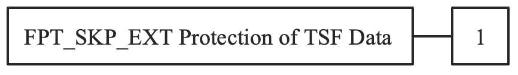

FPT_SKP_EXT.1 Protection of TSF Data (for reading all symmetric keys), requires preventing symmetric keys from being read by any user or subject. It is the only component of this family.

*Management: FPT_SKP_EXT.1*

The following actions could be considered for the management functions in FMT:

[loweralpha]
. There are no management activities foreseen.

*Audit: FPT_SKP_EXT.1*

The following actions should be auditable if FAU_GEN Security audit data generation is included in the PP/ST:

[loweralpha]
. There are no auditable events foreseen.

=====  FPT_SKP_EXT.1 Protection of TSF Data (for reading of all symmetric keys)

*FPT_SKP_EXT.1 Protection of TSF Data (for reading of all symmetric keys)*

Hierarchical to: No other components.

Dependencies: No other components.

*FPT_SKP_EXT.1.1* The TSF shall prevent reading of all pre-shared keys, symmetric keys, and private keys.

==== Protection of Administrator Passwords (FPT_APW_EXT)

=====  FPT_APW_EXT.1 Protection of Administrator Passwords

*Family Behaviour*

Components in this family ensure that the TSF will protect plaintext credential data such as passwords from unauthorized disclosure.

*Component levelling*

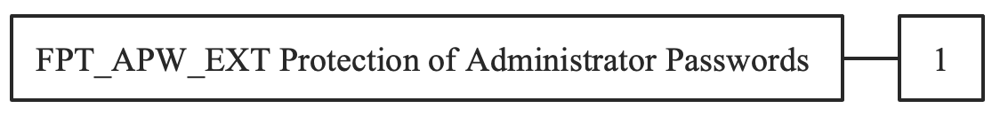

FPT_APW_EXT.1 Protection of Administrator passwords requires that the TSF prevent plaintext credential data from being read by any user or subject.

*Management: FPT_APW_EXT.1*

The following actions could be considered for the management functions in FMT:

[loweralpha]
. No management functions.

*Audit: FPT_APW_EXT.1*

The following actions should be auditable if FAU_GEN Security audit data generation is included in the PP/ST:

[loweralpha]
. No audit necessary.

*FPT_APW_EXT.1 Protection of Administrator Passwords*

Hierarchical to: No other components

Dependencies: No other components.

*FPT_APW_EXT.1.1* The TSF shall store administrative passwords in non-plaintext form.

*FPT_APW_EXT.1.2* The TSF shall prevent the reading of plaintext administrative passwords.

==== TSF Self-Test (FPT_TST_EXT)

=====  FPT_TST_EXT.1 TSF Testing

*Family Behaviour*

Components in this family address the requirements for self-testing the TSF for selected correct operation.

*Component levelling*

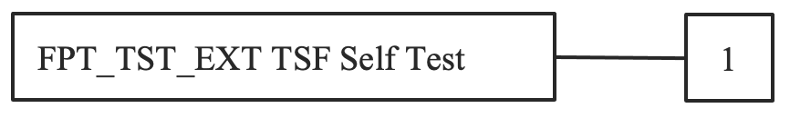

FPT_TST_EXT.1 TSF Self-Test requires a suite of self-tests to be run during initial start-up in order to demonstrate correct operation of the TSF.

*Management: FPT_TST_EXT.1*

The following actions could be considered for the management functions in FMT:

[loweralpha]
. No management functions.

*Audit: FPT_TST_EXT.1*

The following actions should be considered for audit if FAU_GEN Security audit data generation is included in the PP/ST:

[loweralpha]
. Indication that TSF self-test was completed
. Failure of self-test

*FPT_TST_EXT.1 TSF Testing*

Hierarchical to: No other components.

Dependencies: No other components.

*FPT_TST_EXT.1.1* The TSF shall run a suite of the following self-tests [selection: _during initial start-up (on power on), periodically during normal operation, at the request of the authorised user, at the conditions [assignment: conditions under which self-tests should occur]_] to demonstrate the correct operation of the TSF: _[assignment: list of self-tests run by the TSF_].

==== Trusted Update (FPT_TUD_EXT)

*Family Behaviour*

Components in this family address the requirements for updating the TOE firmware and/or software.

*Component levelling*

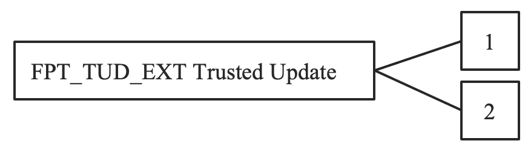

FPT_TUD_EXT.1 Trusted Update requires management tools be provided to update the TOE firmware and software, including the ability to verify the updates prior to installation.

FPT_TUD_EXT.2 Trusted update based on certificates applies when using certificates as part of trusted update and requires that the update does not install if a certificate is invalid.

*Management: FPT_TUD_EXT.1, FPT_TUD_EXT.2*

The following actions could be considered for the management functions in FMT:

[loweralpha]
. Ability to update the TOE and to verify the updates
. Ability to update the TOE and to verify the updates using the digital signature capability (FCS_COP.1/SigGen) and [selection: _no other functions, [assignment: other cryptographic functions (or other functions) used to support the update capability]_]
. Ability to update the TOE, and to verify the updates using [selection: _digital signature, published hash, no other mechanism_] capability prior to installing those updates

*Audit: FPT_TUD_EXT.1, FPT_TUD_EXT.2*

The following actions should be auditable if FAU_GEN Security audit data generation is included in the PP/ST:

[loweralpha]
. Initiation of the update process.
. Any failure to verify the integrity of the update

=====  FPT_TUD_EXT.1 Trusted Update

*FPT_TUD_EXT.1 Trusted Update*

Hierarchical to: No other components

Dependencies: FCS_COP.1/SigGen Cryptographic operation (for Cryptographic Signature and Verification), or FCS_COP.1/Hash Cryptographic operation (for cryptographic hashing)

*FPT_TUD_EXT.1.1* The TSF shall provide [assignment: _Administrators_] the ability to query the currently executing version of the TOE firmware/software and [selection: _the most recently installed version of the TOE firmware/software; no other TOE firmware/software version_].

*FPT_TUD_EXT.1.2* The TSF shall provide [assignment: _Administrators_] the ability to manually initiate updates to TOE firmware/software and [selection: _support automatic checking for updates, support automatic updates, no other update mechanism_].

*FPT_TUD_EXT.1.3* The TSF shall provide means to authenticate firmware/software updates to the TOE using a [selection: _X.509 certificate, digital signature, published hash_] prior to installing those updates.

=====  FPT_TUD_EXT.2 Trusted Update Based on Certificates

*FPT_TUD_EXT.2 Trusted Update Based on Certificates*

Hierarchical to: No other components

Dependencies: FPT_TUD_EXT.1

*FPT_TUD_EXT.2.1* The TSF shall check the validity of the code signing certificate before installing each update.

*FPT_TUD_EXT.2.2 If revocation information is not available for a certificate in the trust chain that is not a trusted certificate designated as a trust anchor, the TSF shall [selection: _not install the update, allow the Administrator to choose whether to accept the certificate in these cases_].*

*FPT_TUD_EXT.2.3* If the certificate is deemed invalid because the certificate has expired, the TSF shall [selection: _allow the Administrator to choose whether to install the update in these cases, not accept the certificate]._

*FPT_TUD_EXT.2.4* If the certificate is deemed invalid for reasons other than expiration or revocation information being unavailable, the TSF shall not install the update.

==== Time stamps (FPT_STM_EXT)

*Family Behaviour*

Components in this family extend FPT_STM requirements by describing the source of time used in timestamps.

*Component levelling*

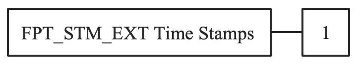

FPT_STM_EXT.1 Reliable Time Stamps is hierarchic to FPT_STM.1: it requires that the TSF provide reliable time stamps for TSF and identifies the source of the time used in those timestamps.

*Management: FPT_STM_EXT.1*

The following actions could be considered for the management functions in FMT:

[loweralpha]
. Management of the time
. Administrator setting of the time.

*Audit: FTA_SSL_EXT.1*

The following actions should be auditable if FAU_GEN Security audit data generation is included in the PP/ST:

[loweralpha]
. Discontinuous changes to the time.

===== FPT_STM_EXT.1 Reliable Time Stamps

*FPT_STM_EXT.1 Reliable Time Stamps*

Hierarchical to: No other components

Dependencies: No other components.

*FPT_STM_EXT.1.1* The TSF shall be able to provide reliable time stamps for its own use.

*FPT_STM_EXT.1.2* The TSF shall [selection: _allow the Security Administrator to set the time, synchronise time with an NTP server_].

=== TOE Access (FTA)

==== TSF-initiated Session Locking (FTA_SSL_EXT)

*Family Behaviour*

Components in this family address the requirements for TSF-initiated and user-initiated locking, unlocking, and termination of interactive sessions.

The extended FTA_SSL_EXT family is based on the FTA_SSL family.

*Component levelling*

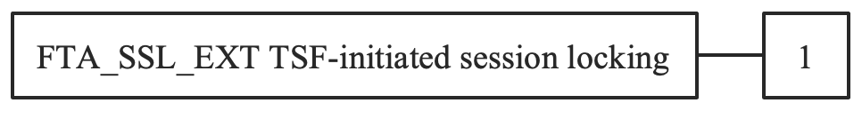

*FTA_SSL_EXT.1* TSF-initiated session locking, requires system initiated locking of an interactive session after a specified period of inactivity. It is the only component of this family.

*Management: FTA_SSL_EXT.1*

The following actions could be considered for the management functions in FMT:

[loweralpha]
. Specification of the time of user inactivity after which lock-out occurs for an individual user.

*Audit: FTA_SSL_EXT.1*

The following actions should be auditable if FAU_GEN Security audit data generation is included in the PP/ST:

[loweralpha]
. Any attempts at unlocking an interactive session.

=====  *FTA_SSL_EXT.1* TSF-initiated Session Locking

*FTA_SSL_EXT.1 TSF-initiated Session Locking*

Hierarchical to: No other components

Dependencies: FIA_UAU.1 Timing of authentication

*FTA_SSL_EXT.1.1* The TSF shall, for local interactive sessions, [selection:

* _lock the session - disable any activity of the Administrator’s data access/display devices other than unlocking the session, and requiring that the Administrator re-authenticate to the TSF prior to unlocking the session;_
* _terminate the session_]

after a Security Administrator-specified time period of inactivity.

=== Communication (FCO)

==== Communication Partner Control (FCO_CPC_EXT)

*Family Behaviour*

This family is used to define high-level constraints on the ways that partner IT entities communicate. For example, there may be constraints on when communication channels can be used, how they are established, and links to SFRs expressing lower-level security properties of the channels.

*Component levelling*

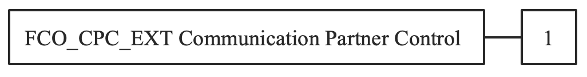

FCO_CPC_EXT.1 Component Registration Channel Definition, requires the TSF to support a registration channel for joining together components of a distributed TOE, and to ensure that the availability of this channel is under the control of an Administrator. It also requires statement of the type of channel used (allowing specification of further lower-level security requirements by reference to other SFRs).

*Management: FCO_CPC_EXT.1*

No separate management functions are required. Note that elements of the SFR already specify certain constraints on communication in order to ensure that the process of forming a distributed TOE is a controlled activity.

*Audit: FCO_CPC_EXT.1*

The following actions should be auditable if FCO_CPC_EXT.1 is included in the PP/ST:

[loweralpha]
. Enabling communications between a pair of components as in FCO_CPC_EXT.1.1 (including identities of the endpoints).
. Disabling communications between a pair of components as in FCO_CPC_EXT.1.3 (including identity of the endpoint that is disabled).

If the required types of channel in FCO_CPC_EXT.1.2 are specified by using other SFRs then the use of the registration channel may be sufficiently covered by the audit requirements on those SFRs: otherwise a separate audit requirement to audit the use of the channel should be identified for FCO_CPC_EXT.1.

===== *FCO_CPC_EXT.1* Component *Registration Channel Definition*

*FCO_CPC_EXT.1 Component Registration Channel Definition*

Hierarchical to: No other components.

Dependencies: No other components.

*FCO_CPC_EXT.1.1* The TSF shall require a Security Administrator to enable communications between any pair of TOE components before such communication can take place.*

*FCO_CPC_EXT.1.2* The TSF shall implement a registration process in which components establish and use a communications channel that uses [assignment: _list of different types of channel given in the form of a selection_]* for at least [assignment: _type of data for which the channel must be used_].

*FCO_CPC_EXT.1.3* The TSF shall enable a Security Administrator to disable communications between any pair of TOE components.*

==  Entropy Documentation and Assessment

This appendix describes the required supplementary information for each entropy source used by the TOE.

The documentation of the entropy source(s) should be detailed enough that, after reading, the evaluator will thoroughly understand the entropy source and why it can be relied upon to provide sufficient entropy. This documentation should include multiple detailed sections: design description, entropy justification, operating conditions, and health testing. This documentation is not required to be part of the TSS.

=== Design Description

Documentation shall include the design of each entropy source as a whole, including the interaction of all entropy source components. Any information that can be shared regarding the design should also be included for any third-party entropy sources that are included in the product.

The documentation will describe the operation of the entropy source to include how entropy is produced, and how unprocessed (raw) data can be obtained from within the entropy source for testing purposes. The documentation should walk through the entropy source design indicating where the entropy comes from, where the entropy output is passed next, any post-processing of the raw outputs (hash, XOR, etc.), if/where it is stored, and finally, how it is output from the entropy source. Any conditions placed on the process (e.g., blocking) should also be described in the entropy source design. Diagrams and examples are encouraged.

This design must also include a description of the content of the security boundary of the entropy source and a description of how the security boundary ensures that an adversary outside the boundary cannot affect the entropy rate.

If implemented, the design description shall include a description of how third-party applications can add entropy to the RBG. A description of any RBG state saving between power-off and power-on shall be included.

=== Entropy Justification

There should be a technical argument for where the unpredictability in the source comes from and why there is confidence in the entropy source delivering sufficient entropy for the uses made of the RBG output (by this particular TOE). This argument will include a description of the expected min-entropy rate (i.e. the minimum entropy (in bits) per bit or byte of source data) and explain that sufficient entropy is going into the TOE randomizer seeding process. This discussion will be part of a justification for why the entropy source can be relied upon to produce bits with entropy.

The amount of information necessary to justify the expected min-entropy rate depends on the type of entropy source included in the product.

For developer-provided entropy sources, in order to justify the min-entropy rate, it is expected that a large number of raw source bits will be collected, statistical tests will be performed, and the min-entropy rate determined from the statistical tests. While no particular statistical tests are required at this time, it is expected that some testing is necessary in order to determine the amount of min-entropy in each output.

For third-party provided entropy sources, in which the TOE developer has limited access to the design and raw entropy data of the source, the documentation will indicate an estimate of the amount of min-entropy obtained from this third-party source. It is acceptable for the developer to “assume” an amount of min-entropy, however, this assumption must be clearly stated in the documentation provided. In particular, the min-entropy estimate must be specified, and the assumption included in the ST.

Regardless of the type of entropy source, the justification will also include how the DRBG is initialized with the entropy stated in the ST, for example by verifying that the min-entropy rate is multiplied by the amount of source data used to seed the DRBG or that the rate of entropy expected based on the amount of source data is explicitly stated and compared to the statistical rate. If the amount of source data used to seed the DRBG is not clear or the calculated rate is not explicitly related to the seed, the documentation will not be considered complete.

The entropy justification shall not include any data added from any third-party application or from any state saving between restarts.

=== Operating Conditions

The entropy rate may be affected by conditions outside the control of the entropy source itself. For example, voltage, frequency, temperature, and elapsed time after power-on are just a few of the factors that may affect the operation of the entropy source. As such, documentation will also include the range of operating conditions under which the entropy source is expected to generate random data. Similarly, documentation shall describe the conditions under which the entropy source is no longer guaranteed to provide sufficient entropy. Methods used to detect failure or degradation of the source shall be included.

=== Health Testing

More specifically, all entropy source health tests and their rationale will be documented. This will include a description of the health tests, the rate and conditions under which each health test is performed (e.g., at start up, continuously, or on-demand), the expected results for each health test, TOE behaviour upon entropy source failure, and rationale indicating why each test is believed to be appropriate for detecting one or more failures in the entropy source.

== Rationales

=== SFR Dependencies Analysis

The dependencies between SFRs implemented by the TOE are addressed as follows.

[cols=",,",options="header",]
|===
|*SFR* |*Dependencies* |*Rationale Statement*
|FAU_GEN.1 |FPT_STM.1 |FPT_STM_EXT.1 included (which is hierarchic to FPT_STM.1)
|FAU_GEN.2 a|
FAU_GEN.1

FIA_UID.1

a|
*FAU_GEN.1* included

Satisfied by FIA_UIA_EXT.1, which specifies the relevant Administrator identification timing

|FAU_STG_EXT.1 a|
FAU_GEN.1

FTP_ITC.1

a|
*FAU_GEN.1* included

FTP_ITC**.1** included

|FCS_CKM.1 a|
FCS_CKM.2 *or* FCS_COP.1

FCS_CKM.4

a|
FCS_CKM.2 included

FCS_CKM.4 included

|FCS_CKM.2 a|
FTP_ITC.1 or FTP_ITC.2 or FCS_CKM.1

FCS_CKM.4

a|
FCS_CKM.1 included (also FTP_ITC.1 as a secure channel that could be used for import)

FCS_CKM.4 included

|FCS_CKM.4 |FTP_ITC.1 or FTP_ITC.2 or FCS_CKM.1 |FCS_CKM.1 included (also FTP_ITC.1 as a secure channel that could be used for import)
|FCS_COP.1/DataEncryption a|
FTP_ITC.1 or FTP_ITC.2 or FCS_CKM.1

FCS_CKM.4

a|
FCS_CKM.1 included (also FTP_ITC.1 as a secure channel that could be used for import)

FCS_CKM.4 included

|FCS_COP.1/SigGen a|
FTP_ITC.1 or FTP_ITC.2 or FCS_CKM.1

FCS_CKM.4

a|
FCS_CKM.1 included (also FTP_ITC.1 as a secure channel that could be used for import)

FCS_CKM.4 included

|FCS_COP.1/Hash a|
FTP_ITC.1 or FTP_ITC.2 or FCS_CKM.1

FCS_CKM.4

|This SFR specifies keyless hashing operations, so initialisation and destruction of keys are not relevant
|FCS_COP.1/KeyedHash a|
FTP_ITC.1 or FTP_ITC.2 or FCS_CKM.1

FCS_CKM.4

a|
FCS_CKM.1 included (also FTP_ITC.1 as a secure channel that could be used for import)

FCS_CKM.4 included

|FCS_RBG_EXT.1 |None |
|FIA_AFL.1 |FIA_UAU.1 |Satisfied by FIA_UIA_EXT.1, which specifies the relevant Administrator authentication
|FIA_PMG_EXT.1 |None |
|FIA_UIA_EXT.1 |FTA_TAB.1 |FTA_TAB.1 included
|FIA_UAU_EXT.2 |None |
|FIA_UAU.7 |FIA_UAU.1 |Satisfied by FIA_UIA_EXT.1, which specifies the relevant Administrator authentication
|FMT_MOF.1/ManualUpdate a|
FMT_SMR.1

FMT_SMF.1

a|
FMT_SMR.2 included

FMT_SMF.1 included

|FMT_MTD.1/CoreData a|
FMT_SMR.1

FMT_SMF.1

a|
FMT_SMR.2 included

FMT_SMF.1 included

|FMT_SMF.1 |None |
|FMT_SMR.2 |FIA_UID.1 |Satisfied by FIA_UIA_EXT.1, which specifies the relevant Administrator identification
|FPT_SKP_EXT.1 |None |
|FPT_APW_EXT.1 |None |
|FPT_TST_EXT.1 |None |
|FPT_TUD_EXT.1 |FCS_COP.1/SigGen or FCS_COP.1/Hash |FCS_COP.1/SigGen and FCS_COP.1/Hash included
|FPT_STM_EXT.1 |None |
|FTA_SSL_EXT.1 |FIA_UAU.1 |Satisfied by FIA_UIA_EXT.1, which specifies the relevant Administrator authentication
|FTA_SSL.3 |None |
|FTA_SSL.4 |None |
|FTA_TAB.1 |None |
|FTP_ITC.1 |None |
|FTP_TRP.1/Admin |None |
|===

[#_Toc456887395 .anchor]####Table 6: SFR Dependencies Rationale for Mandatory SFRs

[cols=",,",options="header",]
|===
|*SFR* |*Dependencies* |*Rationale Statement*
|FAU_STG.1 |FAU_STG.3 |FAU_STG_EXT.3/LocSpace included as optional SFR
|FAU_STG_EXT.2/LocSpace a|
FAU_GEN.1

FAU_STG_EXT.1

|FAU_GEN.1 & FAU_STG_EXT.1 included
|FAU_STG_EXT.3/LocSpace |FAU_STG.1 |FAU_STG.1 included as optional SFR
|FIA_X509_EXT.1/ITT |FIA_X509_EXT.2 |*_FIA_X509_EXT.2 (selection-based SFR) included_*
|FPT_ITT.1 |None |
|FTP_TRP.1/Join |None |
|FCO_CPC_EXT.1 |None |
|===

[#_Toc456887396 .anchor]####Table 7: SFR Dependencies Rationale for Optional SFRs

[cols=",,",options="header",]
|===
|*SFR* |*Dependencies* |*Rationale Statement*
|FAU_GEN_EXT.1 |None |
|FAU_STG_EXT.4 |FAU_GEN_EXT.1, [FPT_ITT.1 or FTP_ITC.1] a|
FAU_GEN_EXT.1 included

FPT_ITT.1 (optional SFR) and FTP_ITC.1 (mandatory SFR) included.

|FAU_STG_EXT.5 |FAU_GEN_EXT.1, [FPT_ITT.1 or FTP_ITC.1] a|
FAU_GEN_EXT.1 included

FPT_ITT.1 (optional SFR) and FTP_ITC.1 (mandatory SFR) included.

|FIA_X509_EXT.1/Rev |FIA_X509_EXT.2 |FIA_X509_EXT.2 *_(selection-based SFR)_* included
|FIA_X509_EXT.2 |FIA_X509_EXT.1 |FIA_X509_EXT.1 *_(selection-based SFR)_* included
|FIA_X509_EXT.3 a|
FCS_CKM.1

FIA_X509_EXT.1

a|
FCS_CKM.1 included (mandatory SFR)

FIA_X509_EXT.1 *_(selection-based SFR)_* included

|FCS_DTLSC_EXT.1 a|
FCS_CKM.1

FCS_CKM.2

FCS_COP.1/DataEncryption

FCS_COP.1/SigGen

FCS_COP.1/Hash

FCS_COP.1/KeyedHash

FCS_RBG_EXT.1

a|
FCS_CKM.1 included

FCS_CKM.2 included

FCS_COP.1/DataEncryption, FCS_COP.1/SigGen, FCS_COP.1/Hash, FCS_COP.1/KeyedHash included

FCS_RBG_EXT.1 included

|FCS_DTLSC_EXT.2 a|
FCS_CKM.1

FCS_CKM.2

FCS_COP.1/DataEncryption

FCS_COP.1/SigGen

FCS_COP.1/Hash

FCS_COP.1/KeyedHash

FCS_RBG_EXT.1

a|
FCS_CKM.1 included

FCS_CKM.2 included

FCS_COP.1/DataEncryption, FCS_COP.1/SigGen, FCS_COP.1/Hash, FCS_COP.1/KeyedHash included

FCS_RBG_EXT.1 included

|FCS_DTLSS_EXT.1 a|
FCS_CKM.1

FCS_CKM.2

FCS_COP.1/DataEncryption

FCS_COP.1/SigGen

FCS_COP.1/Hash

FCS_COP.1/KeyedHash

FCS_RBG_EXT.1

a|
FCS_CKM.1 included

FCS_CKM.2 included

FCS_COP.1/DataEncryption, FCS_COP.1/SigGen, FCS_COP.1/Hash, FCS_COP.1/KeyedHash included

FCS_RBG_EXT.1 included

|FCS_DTLSS_EXT.2 a|
FCS_CKM.1

FCS_CKM.2

FCS_COP.1/DataEncryption

FCS_COP.1/SigGen

FCS_COP.1/Hash

FCS_COP.1/KeyedHash

FCS_RBG_EXT.1

a|
FCS_CKM.1 included

FCS_CKM.2 included

FCS_COP.1/DataEncryption, FCS_COP.1/SigGen, FCS_COP.1/Hash, FCS_COP.1/KeyedHash included

FCS_RBG_EXT.1 included

|FCS_HTTPS_EXT.1 |FCS_TLSC_EXT.1 or FCS_TLSS_EXT.1 |FCS_TLSC_EXT.1 and FCS_TLSS_EXT.1 included as selection-based SFRs
|FCS_IPSEC_EXT.1 a|
FCS_CKM.1

FCS_CKM.2

FCS_COP.1/DataEncryption

FCS_COP.1/SigGen

FCS_COP.1/Hash

FCS_COP.1/KeyedHash

FCS_RBG_EXT.1

a|
FCS_CKM.1 included

FCS_CKM.2 included

FCS_COP.1/DataEncryption, FCS_COP.1/SigGen, FCS_COP.1/Hash, FCS_COP.1/KeyedHash included

FCS_RBG_EXT.1 included

|FCS_NTP_EXT.1 a|
FCS_COP.1

FCS_IPSEC_EXT.1

FCS_DTLSC_EXT.1

a|
FCS_COP.1/DataEncryption included

FCS_COP.1/Hash included

FCS_IPSEC_EXT.1 included

FCS_DTLSC_EXT.1 included

|FCS_SSHC_EXT.1 a|
FCS_CKM.1

FCS_CKM.2

FCS_COP.1/DataEncryption

FCS_COP.1/SigGen

FCS_COP.1/Hash

FCS_COP.1/KeyedHash

FCS_RBG_EXT.1

a|
FCS_CKM.1 included

FCS_CKM.2 included

FCS_COP.1/DataEncryption, FCS_COP.1/SigGen, FCS_COP.1/Hash, FCS_COP.1/KeyedHash included

FCS_RBG_EXT.1 included

|FCS_SSHS_EXT.1 a|
FCS_CKM.1

FCS_CKM.2

FCS_COP.1/DataEncryption

FCS_COP.1/SigGen

FCS_COP.1/Hash

FCS_COP.1/KeyedHash

FCS_RBG_EXT.1

a|
FCS_CKM.1 included

FCS_CKM.2 included

FCS_COP.1/DataEncryption, FCS_COP.1/SigGen, FCS_COP.1/Hash, FCS_COP.1/KeyedHash included

FCS_RBG_EXT.1 included

|FCS_TLSC_EXT.1 a|
FCS_CKM.1

FCS_CKM.2

FCS_COP.1/DataEncryption

FCS_COP.1/SigGen

FCS_COP.1/Hash

FCS_COP.1/KeyedHash

FCS_RBG_EXT.1

a|
FCS_CKM.1 included

FCS_CKM.2 included

FCS_COP.1/DataEncryption, FCS_COP.1/SigGen, FCS_COP.1/Hash, FCS_COP.1/KeyedHash included

FCS_RBG_EXT.1 included

|FCS_TLSC_EXT.2 a|
FCS_CKM.1

FCS_CKM.2

FCS_COP.1/DataEncryption

FCS_COP.1/SigGen

FCS_COP.1/Hash

FCS_COP.1/KeyedHash

FCS_RBG_EXT.1

a|
FCS_CKM.1 included

FCS_CKM.2 included

FCS_COP.1/DataEncryption, FCS_COP.1/SigGen, FCS_COP.1/Hash, FCS_COP.1/KeyedHash included

FCS_RBG_EXT.1 included

|FCS_TLSS_EXT.1 a|
FCS_CKM.1

FCS_CKM.2

FCS_COP.1/DataEncryption

FCS_COP.1/SigGen

FCS_COP.1/Hash

FCS_COP.1/KeyedHash

FCS_RBG_EXT.1

a|
FCS_CKM.1 included

FCS_CKM.2 included

FCS_COP.1/DataEncryption, FCS_COP.1/SigGen, FCS_COP.1/Hash, FCS_COP.1/KeyedHash included

FCS_RBG_EXT.1 included

|FCS_TLSS_EXT.2 a|
FCS_CKM.1

FCS_CKM.2

FCS_COP.1/DataEncryption

FCS_COP.1/SigGen

FCS_COP.1/Hash

FCS_COP.1/KeyedHash

FCS_RBG_EXT.1

a|
FCS_CKM.1 included

FCS_CKM.2 included

FCS_COP.1/DataEncryption, FCS_COP.1/SigGen, FCS_COP.1/Hash, FCS_COP.1/KeyedHash included

FCS_RBG_EXT.1 included

|FPT_TUD_EXT.2 |FPT_TUD_EXT.1 |FPT_TUD_EXT.1 included
|FMT_MOF.1/AutoUpdate a|
FMT_SMR.1

FMT_SMF.1

a|
FMT_SMR.2 included

FMT_SMF.1 included

|FMT_MOF.1/Service a|
FMT_SMR.1

FMT_SMF.1

a|
FMT_SMR.2 included

FMT_SMF.1 included

|FMT_MOF.1/Functions a|
FMT_SMR.1

FMT_SMF.1

a|
FMT_SMR.2 included

FMT_SMF.1 included

|FMT_MTD.1/CryptoKeys a|
FMT_SMR.1

FMT_SMF.1

a|
FMT_SMR.2 included

FMT_SMF.1 included

|===

[#_Toc27041928 .anchor]####Table 8: SFR Dependencies Rationale for Selection-Based SFRs

==  Glossary

[cols=",",]
|===
|*Term* |*Meaning*
|*Administrator* |See Security Administrator.
|*Assurance* |Grounds for confidence that a TOE meets the SFRs [CC1].
|*Security Administrator* |The terms “Administrator” “Security Administrator” and “User” are used interchangeably in this document at present and are used to represent a person that has authorized access to the TOE to perform configuration and management tasks. .
|*Target of Evaluation* |A set of software, firmware and/or hardware possibly accompanied by guidance. [CC1]
|*TOE Security Functionality (TSF)* |A set consisting of all hardware, software, and firmware of the TOE that must be relied upon for the correct enforcement of the SFRs. [CC1]
|*TSF Data* |Data for the operation of the TSF upon which the enforcement of the requirements relies.
|*User* |See Security Administrator
|===

See [CC1] for other Common Criteria abbreviations and terminology.

== Acronyms

[cols=",",options="header",]
|===
a|

*Acronym*

a|

*Meaning*

a|

*AEAD*

a|

Authenticated Encryption with Associated Data

a|

*AES*

a|

Advanced Encryption Standard

a|

*CA*

a|

Certificate Authority

a|

*CBC*

a|

Cipher Block Chaining

a|

*CRL*

a|

Certificate Revocation List

a|

*DH*

a|

Diffie-Hellman

a|

*DSA*

a|

Digital Signature Algorithm

a|

*DTLS*

a|

Datagram Transport Layer Security

a|

*ECDH*

a|

Elliptic Curve Diffie Hellman

a|

*ECDSA*

a|

Elliptic Curve Digital Signature Algorithm

a|

*EEPROM*

a|

Electrically Erasable Programmable Read-Only Memory

a|

*FIPS*

a|

Federal Information Processing Standards

a|

*GCM*

a|

Galois Counter Mode

a|

*HMAC*

a|

Keyed-Hash Message Authentication Code

a|

*HTTPS*

a|

HyperText Transfer Protocol Secure

a|

*IP*

a|

Internet Protocol

a|

*IPsec*

a|

Internet Protocol Security

a|

*ND*

a|

Network Device

a|

*NIST*

a|

National Institute of Standards and Technology

a|

*NTP*

a|

Network Time Protocol

a|

*OCSP*

a|

Online Certificate Status Protocol

a|

*pND*

a|

Physical Network Device

a|

*PP*

a|

Protection Profile

a|

*RBG*

a|

Random Bit Generator

a|

*RSA*

a|

Rivest Shamir Adleman Algorithm

a|

*SD*

a|

Supporting Document

a|

*SHA*

a|

Secure Hash Algorithm

a|

*SSH*

a|

Secure Shell

a|

*ST*

a|

Security Target

a|

*TLS*

a|

Transport Layer Security

a|

*TOE*

a|

Target of Evaluation

a|

*TSF*

a|

TOE Security Functionality

TSF = TOE for pND

TSF = TOE + VS for vND

a|

*TSS*

a|

TOE Summary Specification

a|

*VM*

a|

Virtual Machine

a|

*vND*

a|

Virtual Network Device

a|

*VPN*

a|

Virtual Private Network

a|

*VS*

a|

Virtualisation System

|===
