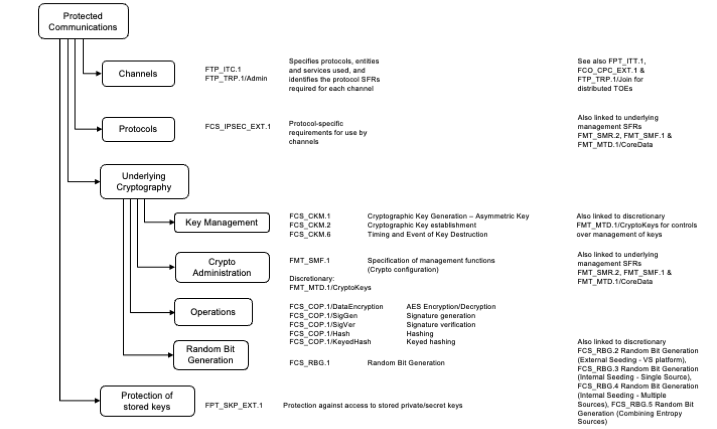
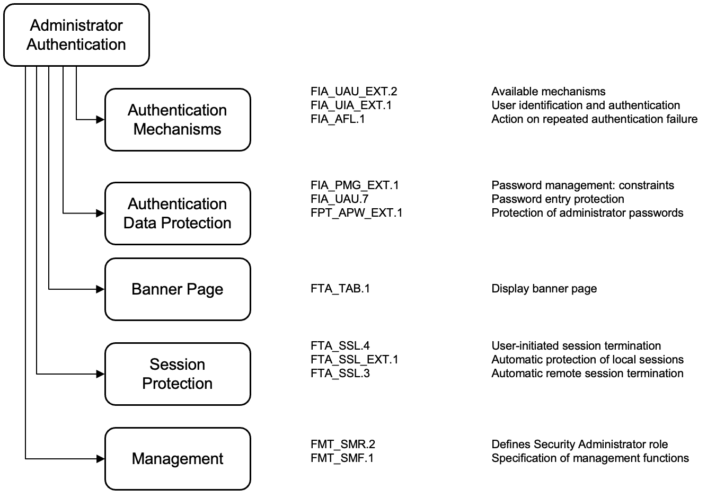
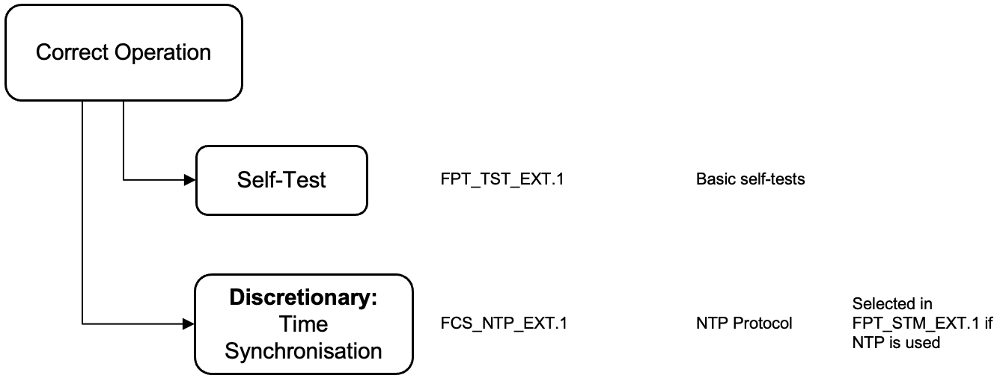
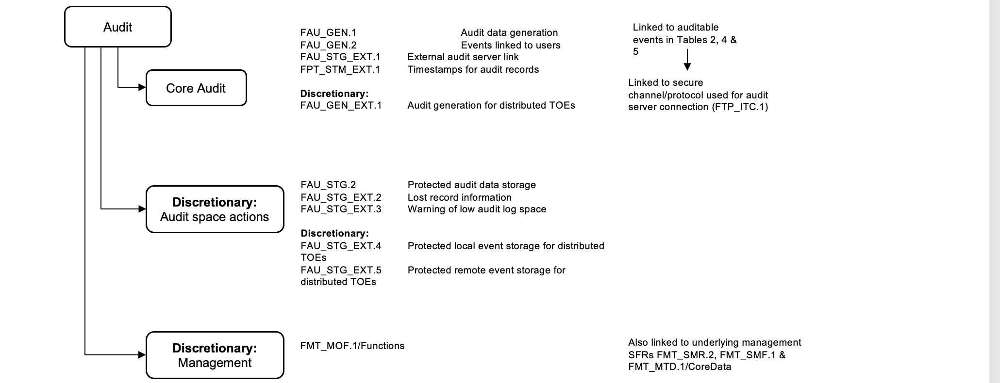
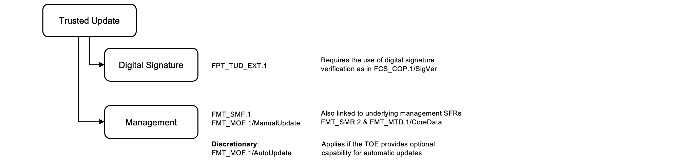
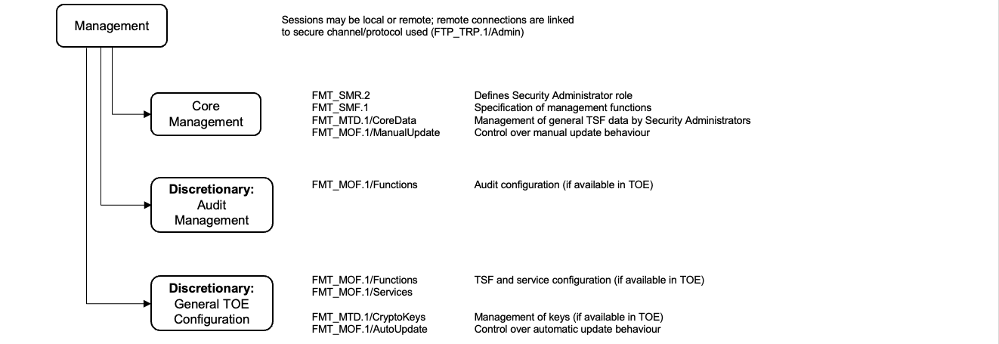
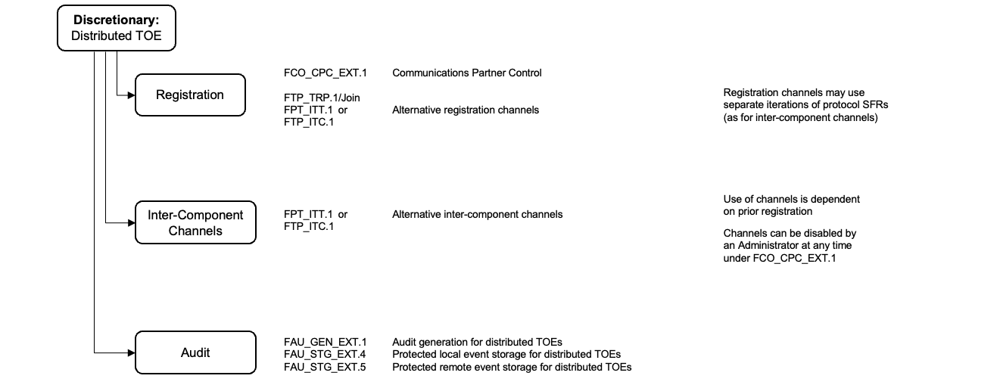
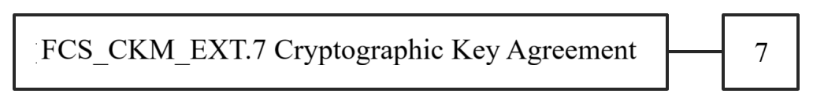
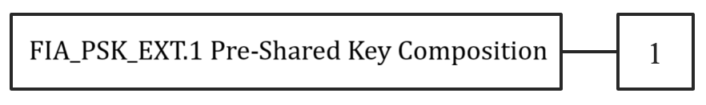

:toc:
:toclevels: 3
:toc-title!:
:toc-placement!:
:doctype: book
:data-uri:
:appendix-caption: Annex

= collaborative Protection Profile for Network Devices

Version: 4.0 +
Date: TBD-November-2025

== Acknowledgements

This collaborative Protection Profile (cPP) was developed by the Network Device international Technical Community (ND iTC) with representatives from industry, government agencies, Common Criteria Test Laboratories, and members of academia.

== Preface

=== Objectives of Document

This document presents the Common Criteria (CC) collaborative Protection Profile (cPP) to express the Security Functional Requirements (SFRs) and Security Assurance Requirements (SARs) for a Network Device (ND). The Evaluation Activities (EA) that specify the actions the evaluator performs to determine if a product satisfies the SFRs captured within this cPP are described in the Supporting Document (SD) [SD].

=== Scope of Document

The scope of the cPP within the development and evaluation process is described in the Common Criteria for Information Technology Security Evaluation [CC]. In particular, a cPP defines the IT security requirements of a generic type of TOE and specifies the functional and assurance security measures to be offered by that TOE to meet stated requirements [CC1, Section B.1].

=== Intended Readership

The target audiences of this cPP are developers, CC consumers, system integrators, evaluators and schemes.

Although the cPP and associated supporting document (SD) may contain minor editorial errors, cPPs are recognised as living documents and the iTCs are dedicated to ongoing updates and revisions. Please report any issues to the ND iTC.

=== Related Documents

**Common Criteria**footnote:[For details see http://www.commoncriteriaportal.org/]

[cols=",",]
|===
|[CC1] |Common Criteria for Information Technology Security Evaluation, +
Part 1: Introduction and general model, +
CCMB-2022-11-001, CC:2022 Revision 1, November 2022.
|[CC2] |Common Criteria for Information Technology Security Evaluation, +
Part 2: Security functional requirements, +
CCMB-2022-11-002, CC:2022 Revision 1, November 2022.
|[CC3] |Common Criteria for Information Technology Security Evaluation, +
Part 3: Security assurance requirements, +
CCMB-2022-11-003, CC:2022 Revision 1, November 2022.
|[CC4] |Common Criteria for Information Technology Security Evaluation, +
Part 4: Framework for the specification of evaluation methods and activities, +
CCMB-2022-11-004, CC:2022 Revision 1, November 2022.
|[CCE] |Common Criteria for Information Technology Security Evaluation, +
Errata and interpretation for CC:2022 (Release 1) and CEM:2022 (Release 1)
CCMB-002, Version 1.1, July 22, 2024.
|[CEM] |Common Methodology for Information Technology Security Evaluation, +
Evaluation methodology, +
CCMB-2022-11-006, CEM:2022, Revision 1, November 2022.
|[CC-SFRC] |Common Criteria for Information Technology Security Evaluation, +
Specification of Functional Requirements for Cryptography, +
CCDB-018, Version 1, 31 January, 2025.
|===

*Other Documents*

[cols=",",]
|===

|[SD] |Supporting Document - Evaluation Activities for Network Device cPP, Version 4.0

|===

=== Revision History

[cols=",,",options="header",]
|===
|*Version* |*Date* |*Description*
|4.0 | TBD-Nov-2025 | Released for use
|3.0e | 06-Dec-2023 | Released for use
|3.0 | 06-Apr-2023 | Incorporated comments received. Released for use
|2.2e | 23-Mar-2020 | Updated vND description. Released for use
|2.2 |20-Dec-2019 |Released for use
|2.1 |24-Sep-2018 |Released for use
|2.0 |5-May-2017 |Released for use
|1.1 | 21-Jul-2016 |Updated draft published for public review
|1.0 |27-Feb-2015 |Released for use
|0.4 |26-Jan-2015 |Incorporated comments received from the CCDB review
|0.3 |17-Oct-2014 |Draft version released to accompany CCDB review of Supporting Document.
|0.2 |13-Oct-2014 |Internal draft in response to public review comments, for iTC review
|0.1 |05-Sep-2014 |Draft published for public review
|===

*Table of Contents*

toc::[]

*List of Figures*

<<fig-1-vnd-case1,Figure 1: vND evaluated configuration Case 1>>

<<fig-2-vnd-case2,Figure 2: vND evaluated configuration Case 2>>

<<fig-3-generalized-model,Figure 3: Generalized Distributed TOE Model>>

<<fig-4-non-distributed,Figure 4: Non-distributed TOE use case>>

<<fig-5-basic-distributed,Figure 5: Basic distributed TOE use case>>

<<fig-6-mgmt-out-of-scope,Figure 6: Distributed TOE use case with Management Component out of scope>>

<<fig-7-mgmt-fulfil-cpp,Figure 7: Management Component required to fulfil cPP requirements>>

<<fig-8-dnd-mgmt-fulfil-cpp,Figure 8: Distributed Network Devices plus Management Component required to fulfil cPP requirements>>

<<fig-9-equivalency-extended,Figure 9: Distributed TOE extended through equivalency argument>>

<<fig-10-unsupported-enterprise,Figure 10: Unsupported Enterprise Management use case>>

<<fig-11-unsupported-multi-mgmt,Figure 11: Unsupported use case with Multiple Management Components>>

<<fig-12-registration-itt-itc,Figure 12: Distributed TOE registration using channel satisfying FPT_ITT.1 or FTP_ITC.1>>

<<fig-13-registration-trp-join,Figure 13: Distributed TOE registration using channel satisfying FTP_TRP.1/Join>>

<<fig-14-registration-no-channel,Figure 14: Distributed TOE registration without a registration channel>>

<<fig-15-joiner-options,Figure 15: Joiner enablement options for Distributed TOEs>>

<<fig-16-sfr-architecture,Figure 16: Protected Communications SFR Architecture>>

<<fig-17-auth-architecture,Figure 17: Administrator Authentication SFR Architecture>>

<<fig-18-correct-operation,Figure 18: Correct Operation SFR Architecture>>

<<fig-19-trusted-update-audit,Figure 19: Trusted Update and Audit SFR Architecture>>

<<fig-20-mgmt-architecture,Figure 20: Management SFR Architecture>>

<<fig-21-distributed-architecture,Figure 21: Distributed TOE SFR Architecture>>

*List of Tables*

<<table-1-sfr-distributed,Table 1: Security Functional Requirements for Distributed TOEs>>

<<table-2-sfr-and-audit,Table 2: Security Functional Requirements and Auditable Events>>

<<table-3-fcs-ckm11-akg,Table 3: Allowed choices for FCS_CKM.1.1/AKG>>

<<table-4-fcs-ckm71,Table 4: Allowed choices for FCS_CKM_EXT.7.1>>

<<table-5-fcs-cop11-siggen,Table 5: Allowed choices for FCS_COP.1.1/SigGen>>

<<table-6-fcs-cop11-sigver,Table 6: Allowed choices for FCS_COP.1.1/SigVer>>

<<table-7-fcs-cop11-keyedhash,Table 7: Allowed choices for FCS_COP.1.1/KeyedHash>>

<<table-8-fcs-rbg11,Table 8: Allowed choices for FCS_RBG.1.1>>

<<table-9-fmt-smf11,Table 9: FMT_SMF.1.1 Management Function Guidance>>

<<table-10-sar,Table 10: Security Assurance Requirements>>

<<table-11-optional-sfr-audit,Table 11: TOE Optional SFRs and Auditable Events>>

<<table-12-selection-sfr-audit,Table 12: Selection-Based SFRs and Auditable Events>>

<<table-13-fcs-cop1-aead,Table 13: Allowed choices for FCS_COP.1/AEAD>>

<<table-14-fcs-cop1-keyencap,Table 14: Allowed choices for FCS_COP.1/KeyEncap>>

<<table-15-fcs-cop1-keywrap,Table 15: Allowed choices for FCS_COP.1/KeyWrap>>

<<table-16-fcs-cop1-skc,Table 16: Allowed choices for FCS_COP.1/SKC>>

<<table-17-fcs-cop11-xof,Table 17: Allowed choices for FCS_COP.1.1/XOF>>

<<table-18-fcs-ckm71ext,Table 18: Allowed choices for FCS_CKM_EXT.7.1>>

<<table-19-deps-mandatory,Table 19: SFR Dependencies Rationale for Mandatory SFRs>>

<<table-20-deps-optional,Table 20: SFR Dependencies Rationale for Optional SFRs>>

<<table-21-deps-selection,Table 21: SFR Dependencies Rationale for Selection-Based SFRs>>

:sectnums: all
:sectnumlevels: 4

== PP Introduction

=== PP Reference Identification

PP Reference: collaborative Protection Profile for Network Devices

PP Version: 4.0 +
PP Date: TBD-November-2025

=== TOE Overview

This is a collaborative Protection Profile (cPP) whose Target of Evaluation (TOE) is a Network Device (ND). It provides a minimal set of security requirements expected by all Network Devices that target the mitigation of a set of defined threats. This baseline set of requirements will be built upon by future cPPs to provide an overall set of security solutions for networks up to carrier and enterprise scale. A Network Device in the context of this cPP is a device that is connected to a network and has an infrastructure role within that network. The TOE may be standalone or distributed, where a distributed TOE is one that requires multiple distinct components to operate as a logical whole in order to fulfil the requirements of this cPP (a more extensive description of distributed Network Device TOEs is given in Section 3).

When discussing an ND in this document, it refers to a Network Device or a component of a distributed Network Device unless it is expressly stated otherwise.

Under this cPP, NDs may be physical or virtualized. A physical Network Device (pND) consists of network device functionality implemented inside a physical chassis with physical network connections. The network device functionality may be implemented in either hardware or software or both. For pNDs, the TOE encompasses the entire device—including both the network device functionality and the physical chassis. There is no distinction between TOE and TOE Platform.

A virtual Network Device (vND) is a software implementation of network device functionality that runs inside a virtual machine (VM) on either general purpose or purpose-built hardware. The TOE consists of all software within the VM—in particular, the network device functionality and the operating system on which it runs. 

This cPP does not cover software-only NDs. We define software-only NDs as network device functionality implemented as an application or service running on an operating system. A software-only ND that runs on an operating system inside a VM does not qualify as a vND unless the operating system is considered part of the TOE.

The intent of this document is to define the baseline set of common security functionality expected by all Network Devices, regardless of their ultimate security purpose or any additional security functionality the device may employ. This baseline set includes securing any remote management path, providing identification and authentication services for both local and remote logins, auditing security-related events, cryptographically validating the source of any update, and offering some protection against common network-based attacks.

The aim is that any Network Device that meets this cPP will “behave well” on the network and can be trusted to do no harm. To accomplish this, the Network Device is expected to employ standards-based tunnelling protocols to include IPsec, (D)TLS, or SSH to protect the communication paths to external entities, and in the case of a distributed TOE, to protect the communications between the TOE components. For most of the allowed secure channel protocol selections it is also required that X.509 certificates be used for authentication purposes; use of certificates is supported as an option for code signing/digital signatures.

Additional security functionality that a Network Device may employ is outside the scope of this cPP, and such functionality will be specified in other device-type specific cPPs. Also, considered out of scope are virus and emailing scanning, intrusion detection/prevention capabilities and Network Address Translation (NAT) as a security function. It is expected that this cPP will be updated to expand the desired security functionality to increase resiliency, allow for varying implementations (such as software-only Network Devices), and keep current with technology enhancements. At this time, however, Exact Conformancefootnote:[Exact Conformance is defined in [CC1], Section E.4.] with the cPP is required, and no additional functionality will be evaluated.

In addition to a physical network device, this cPP supports two virtual network device configuration options.

==== vND only Evaluation Configuration Option

Case 1, illustrated in Figure 1, is where the TOE is represented by the vND alone. The evaluated configuration includes the vND and the virtualization System (VS) where the VS encompasses the virtual hardware abstraction, the hypervisor or virtual machine manager (VMM), all supporting software and the physical chassis.

[.text-center]
image:extracted-media/media/vnd_case_1.png[image,width=166,height=277] +
[[fig-1-vnd-case1]]_Figure 1: vND evaluated configuration Case 1_

To evaluate a vND-only TOE means:

The VS(s), which are considered part of the Operational Environment, must be specified, including compatible version(s).
The physical hardware, which is likewise considered part of the Operational Environment, must be described in terms of minimum requirements to run one instance of the TOE (e.g., CPU cores, RAM, disk space, NIC requirements).

==== vND as a pND Evaluation Configuration Option

Case 2, illustrated in Figure 2, is where the vND is evaluated as a pND.
[.text-center]
image:extracted-media/media/vnd_case_2.jpg[image,width=166,height=277]
[.text-center]
[[fig-2-vnd-case2]]Figure 2: vND evaluated configuration Case 2_

To evaluate a vND as a pND means that:

* The VS is considered part of the ND's software stack, and thus is part of the TOE and must satisfy the relevant SFRs (e.g., by treating hypervisor Administrators as Security Administrators).
* vNDs that can run on multiple VSs must be tested on each claimed VS unless the developer can successfully argue equivalence.
* The physical hardware is likewise included in the TOE (as in the example included above). Therefore, vNDs must also be tested for each claimed hardware platform unless the developer can successfully argue equivalence.
* There is only one vND instance for each physical hardware platform. The exception being a where components of the distributed TOE run inside more than one virtual machine (VM) on a single VS.
* There are no other guest VMs on the physical platform providing non-network device functionality.

=== TOE Use Cases

The essence of the requirements for Network Device TOEs is that the devices can be remotely managed in a secure manner and that any software updates applied are from a trusted source.

Examples of Network Devices that are covered by requirements in this cPP include physical and virtualized routers, firewalls, VPN gateways, IDSs, and switches. Where such devices include significant additional functionality with its own distinct security requirements, then a separate cPP may be created to be used for those devices, with that cPP containing a superset of the Network Device cPP requirements.

Examples of devices that connect to a network but are not included to be evaluated against this cPP include mobile devices and end-user workstations.

== CC Conformance

As defined by the references [CC1], [CC2], [CC3], [CC4], [CCE] and [CC-SFRC], this cPP:

* Conforms to the requirements of Common Criteria 2022, Revision 1 with errata and interpretations as of July 22, 2024.
* Is CC Part 2 extended, CC Part 3 conformant
* Does not claim conformance to any other PP.

This cPP satisfies the following Assurance Families: APE_CCL.1, APE_ECD.1, APE_INT.1, APE_OBJ.1, APE_REQ.1 and APE_SPD.1. +
This cPP follows the Direct Rationale approach.

=== Package Claims

The packages to which conformance can be claimed in conjunction with this cPP are:

- Functional Package for SSH Version 2.0 (PKG_SSH_V2.0) conformant
- Functional Package for Transport Layer Security (TLS) Version 2.1 (PKG_TLS_v2.1) conformant

- Functional Package for X.509 Version 1.0 (PKG_X509_v1.0) conformant

All cryptographic selections in the above packages must comply with the FCS_COP and FCS_CKM requirements of this cPP.

=== Conformance type
In order to be conformant to this cPP, a TOE must demonstrate Exact Conformance as defined in [CC1], Section E.4.

For this cPP, Exact Conformance means that the Security Target (ST) must contain all of the Security Functional Requirements in Section 6 (Mandatory Security Functional Requirements) and in Section 7 (Mandatory Security Assurance Requirements) of this cPP. No security requirements given in Section 6 or Section 7 of this cPP are allowed to be omitted. 

Optionally, security requirements from Annex A, Optional Security Requirements can be included in the ST.

Annex B, Selection-Based Security Requirements gives the selection-based security requirements of this cPP, some of which will be mandatory according to the selections made in other security requirements.

While iteration of SFRs from the cPP is allowed, no additional security requirements (from the [CC2], [CC-SFRC], [CC3], or definitions of extended components that are not already included in this cPP) are allowed to be included in the ST. 

The use of mandatory, optional and selection-based SFRs allows some customization when modeling the TOE. However, this does not work for the SPD in Section 4 and the security objectives in Section 5. Some parts in these sections are marked as "(applies to ... only)" (e.g., "(applies to distributed TOEs only)", "(applies to vNDs only)"). These parts only need to be included in the ST for TOEs that comply with the corresponding conditions (i.e., parts marked as "(applies to distributed TOEs only)" only need to be included in STs for distributed TOEs and shall be omitted otherwise).

=== Modules

The PP-Modules that are allowed to specify this cPP as a PP-Module base are specified in the 'Allowed-with' PP-Modules list at https://github.com/ND-iTC/Documents/blob/main/NDcPP_allowed_with_list.adoc.

=== Evaluation Methods
The supporting document, "Evaluation Activities for Network Device cPP" must be used in conjunction with [CEM] when performing evaluations of an ST specifying this Network Device cPP.
The supporting document defines the evaluation methods and activities for this cPP and has been developed in accordance with [CC4]. The supporting document can be found at https://github.com/ND-iTC/Documents.

== Introduction to Distributed TOEs

This cPP includes support for distributed Network Device TOEs. Network Devices can sometimes be composed of multiple components operating as a logical whole. This architecture can be found in products where a centralized management console is used to provide administration to remote components.

Distributed TOEs might consist of combinations of different and similar/same types of TOE components where 'type' refers to the intended use of a component inside the overall TOE. TOE component types could for example be sensors (e.g., for IDS components) or TOE components acting as central nodes managing other nodes.

There are a number of different architectures, but fundamentally, they are variations of the following model where the SFRs of this cPP can only be fulfilled if the two components are deployed and operate together.

[.text-center]
image:extracted-media/media/d_toe_1.png[image,width=376,height=143]
[.text-center]
[[fig-3-generalized-model]]_Figure 3: Generalized Distributed TOE Model_

Some Network Devices are designed to operate alongside a Management Component. A Network Device that operates in this manner but still satisfies all SFRs in the cPP without the Management Component will not be considered a distributed TOE. It will be certified according to this cPP without the Management Component.

[.text-center]
image:extracted-media/media/d_toe_2.png[image,width=352,height=136]
[.text-center]
[[fig-4-non-distributed]]_Figure 4: Non-distributed TOE use case_

=== Supported Distributed TOE Use Cases

The following discussion provides guidance over the supported distributed TOE use cases in this version of the cPP.

*Case 1: cPP requirements can only be fulfilled if several TOE components work together*

[.text-center]
image:extracted-media/media/d_toe_3.png[image,width=397,height=286]
[.text-center]
[[fig-5-basic-distributed]]_Figure 5: Basic distributed TOE use case_

The first and most basic use case is where multiple interconnected Network Device components need to operate together to fulfil the requirements of the cPP. To be considered a distributed TOE, a minimum of 2 interconnected components are required.

*Case 2: cPP requirements can be fulfilled without Management component.*

A Network Device may require more than one component in order to fulfil all of the requirements of the cPP. In addition to the components required to fulfil the cPP a Management Component may also be offered for use with the TOE. In this case, certification shall not include the Management Component. This situation is depicted in Figure 6.

[.text-center]
image:extracted-media/media/d_toe_4.png[image,width=347,height=277]
[.text-center]
[[fig-6-mgmt-out-of-scope]]_Figure 6: Distributed TOE use case with Management Component out of scope_

For the case depicted in Figure 6, the Management Component may be certified separately according to a different (c)PP.

*Case 3: cPP requirements cannot be fulfilled without Management Component*

A Network Device that requires the Management Component to satisfy all SFRs of the cPP shall be considered to be a distributed TOE and be certified according to this cPP together with the Management Component.

[.text-center]
image:extracted-media/media/d_toe_5.png[image,width=349,height=136]
[.text-center]
[[fig-7-mgmt-fulfil-cpp]]_Figure 7: Management Component required to fulfil cPP requirements_

A Management Component may also be considered part of the distributed TOE alongside multiple distributed Network Devices if it is required to fulfil all SFRs of this cPP.

[.text-center]
image:extracted-media/media/d_toe_6.png[image,width=349,height=276]
[.text-center]
[[fig-8-dnd-mgmt-fulfil-cpp]]_Figure 8: Distributed Network Devices plus Management Component required to fulfil cPP requirements_

Where several Network Devices are managed by one Management Component, the TOE may also be considered to be distributed but the focus of the certification should be restricted to the simplest combination of Network Device and Management Component. By the use of an equivalency argument, the combination of multiple Network Devices together with one Management Component can then be regarded as certified solution. The Supporting Document footnote:[SD, B.4] describes how to define the components of a distributed TOE in terms of a “minimum configuration” and allowance for iteration of equivalent components.

[.text-center]
image:extracted-media/media/d_toe_7.png[image,width=364,height=282]
[.text-center]
[[fig-9-equivalency-extended]]_Figure 9: Distributed TOE extended through equivalency argument_

In this model the individual Network Device components rely on functionality within the Management Component to fulfil the requirements of this cPP and therefore a direct relationship between Network Device components themselves is optional.

More than one Management Component may be used if it is for the sole purpose of redundancy.

=== Unsupported Distributed TOE Use Cases

The following discussion provides guidance for the distributed TOE use cases that are not supported by this version of the cPP.

*Case 4: cPP requirements depend on using Management Component shared with other components outside the distributed TOE*

[.text-center]
image:extracted-media/media/d_toe_8.png[image,width=388,height=389]
[.text-center]
[[fig-10-unsupported-enterprise]]_Figure 10: Unsupported Enterprise Management use case_

Although apparently similar to Use Case 3 above, in this case a single Management Component is shared between the distributed Network Device TOE and another distinct product (Figure 10 shows an example in which the other product is a Firewall device). In this case the Management Component is considered to be an “Enterprise Manager” (a central management component for different types of devices), and this use case is not supported by this version of the cPP. A similar situation would apply if any other Network Device TOE component was shared with another product.

*Case 5: cPP requirements cannot be fulfilled without multiple Management Components*

The case where one device, distributed TOE or combination of TOEs according to Case 3 above are managed by more than one Management Component (except for the purpose of redundancy) is not covered by this version of the cPP. This means that - except for the purpose of redundancy - a single Management Component cannot be partitioned into multiple internal, independent components.

[.text-center]
image:extracted-media/media/d_toe_9.png[image,width=346,height=275]
[.text-center]
[[fig-11-unsupported-multi-mgmt]]_Figure 11: Unsupported use case with Multiple Management Components_

=== Registration of Components of a Distributed TOE

When dealing with a distributed TOE, a number of separate components need to be brought together in the operational environment in order to create the TOE: this requires that trusted communications channels are set up between certain pairs of components (it is assumed that all components need to communicate with at least one other component, but not that all components need to communicate with all other components).

The underlying model for creation of the TOE is to have a ‘registration process’ in which components ‘join’ the TOE. The registration process starts with two components, one of which (the ‘joiner’) is about to join an existing TOE by registering with the other (the ‘gatekeeper’). The two components will use one or more specified authentication and communication channel options so that the components authenticate each other and protect any sensitive data that is transmitted during the registration process (e.g., a key might be sent by a 'gatekeeper' to the 'joiner' as a result of the registration). The following figures illustrate the three supported registration models. Figure 12 illustrates a distributed TOE registration approach which uses an instance of FPT_ITT.1 or FTP_ITC.1 to protect the registration exchange.

[.text-center]
image:extracted-media/media/d_toe_10.png[image,width=542,height=265]
[.text-center]
[[fig-12-registration-itt-itc]]_Figure 12: Distributed TOE registration using channel satisfying FPT_ITT.1 or FTP_ITC.1_

The second approach (Figure 13) utilises an alternative registration channel and supports use cases where the channel relies on environmental security constraints to provide the necessary protection of the registration exchange.

[.text-center]
image:extracted-media/media/d_toe_11.png[image,width=532,height=253]
[.text-center]
[[fig-13-registration-trp-join]]_Figure 13: Distributed TOE registration using channel satisfying FTP_TRP.1/Join_

The final approach (Figure 14) supports use cases where registration is performed manually through direct configuration of both the joiner and gatekeeper devices. Once configured, the two components establish an internal TSF channel that satisfies FPT_ITT.1 or FTP_ITC.1.

[.text-center]
image:extracted-media/media/d_toe_12.png[image,width=388,height=237]
[.text-center]
[[fig-14-registration-no-channel]]_Figure 14: Distributed TOE registration without a registration channel_

In each case, during the registration process, the Security Administrator must positively enable the joining components before they can act as part of the TSF. The following figure illustrates the approaches that this enablement step may take.

[.text-center]
image:extracted-media/media/d_toe_13.png[image,width=517,height=292]
[.text-center]
[[fig-15-joiner-options]]_Figure 15: Joiner enablement options for Distributed TOEs_

Note: In the case where no registration channel is required (i.e., the 'joiner' and 'gatekeeper' are directly configured (Figure 14)), enablement is implied as part of this direct configuration process.

After registration, the components will communicate between themselves using a normal SSH/TLS/DTLS/IPsec/HTTPS channel (which is specified in an ST as an instance of FTP_ITC.1 or FPT_ITT.1 in terms of Section 6 and Annex A). This channel for inter-component communications is specified at the top level with the (extended) SFR FCO_CPC_EXT.1 (see Section A.6.1) and is in addition to the other communication channels required for communication with entities outside the TOE (which are specified in an ST as instances of FTP_ITC.1 and FTP_TRP.1).

=== Allocation of Requirements in Distributed TOEs

For a distributed TOE, the security functional requirements in this cPP need to be met by the TOE as a whole, but not all SFRs will necessarily be implemented by all components. The following categories are defined in order to specify when each SFR must be implemented by a component:

* *All Components (“All”)* – All components that comprise the distributed TOE must independently satisfy the requirement.
* *At least one Component (“One”)* – This requirement must be fulfilled by at least one component within the distributed TOE.
* *Feature Dependent (“Feature Dependent”)* – These requirements will only be fulfilled where the feature is implemented by the distributed TOE component (Note: The requirement to meet the cPP as a whole requires that at least one component implements these requirements if they are specified in Section 6).

Table 1 specifies how each of the SFRs in this cPP must be met, using the categories above.

[cols=",,",options="header",]
|===
|*Requirement* |*Description* |*Distributed TOE SFR Allocation*
|FAU_GEN.1 |Audit Data Generation |All
|FAU_GEN.2 |User Identity Association |All
|FAU_GEN_EXT.1 |Security Audit Data Generation for Distributed TOE component |All
|FAU_SAR.1 |Audit Review |Feature Dependent
|FAU_STG_EXT.1 |Protected Audit Event Storage |All
|FAU_STG.2 |Protected audit data storage |Feature Dependent
|FAU_STG_EXT.2 |Counting Lost Audit Data |Feature Dependent
|FAU_STG_EXT.3 |Action in Case of Possible Audit Data Loss |Feature Dependent
|FAU_STG_EXT.4 |Protected Local Audit Event Storage for Distributed TOEs |Feature Dependent
|FAU_STG_EXT.5 |Protected Remote Audit Event Storage for Distributed TOEs |Feature Dependent
|FCO_CPC_EXT.1 |Component Registration Channel Definition |All
|FCS_CKM.1/AKG |Cryptographic Key Generation – Asymmetric Key |Onefootnote:[The overall TOE is required to support on-board key generation and (if the TOE uses X.509 certificates as in Annex B.4.1) RFC 2986 Certificate Request generation. If not all TOE components are supporting on- board key generation (and generation of certificate requests, where applicable), the TOE shall support distribution of keys to the TOE components that are not supporting key generation themselves. Depending on the life-cycle phase, either a secure registration channel shall be used for key distribution at the point where the component is joined to the TOE or an inter-component secure channel shall be used for key distribution post-registration.]
|FCS_CKM.6 |Timing and Event of Cryptographic Key Destruction |All
|FCS_CKM_EXT.7 |Cryptographic Key Agreement |All
|FCS_COP.1/DataEncryption |Cryptographic Operation (AES Data Encryption/Decryption) |All
|FCS_COP.1/SigGen |Cryptographic Operation - Signature Generation |One
|FCS_COP.1/SigVer |Cryptographic Operation - Signature Verification |All
|FCS_COP.1/CMAC |Cryptographic Operation (CMAC) |Feature Dependent
|FCS_COP.1/Hash |Cryptographic Operation - Hashing |All
|FCS_COP.1/KeyedHash |Cryptographic Operation - Keyed Hash |All
|FCS_CKM.2 |Cryptographic Key Distribution |Feature Dependent
|FCS_COP.1/KeyEncap |Cryptographic Operation - Key Encapsulation |Feature Dependent
|FCS_COP.1/KeyWrap |Cryptographic Operation - Key Wrapping |Feature Dependent
|FCS_COP.1/AEAD |Cryptographic Operation – Authenticated Encryption with Associated Data |All
|FCS_COP.1/SKC |Cryptographic Operation - Symmetric Key Cryptography |All
|FCS_IPSEC_EXT.1 |IPsec Protocol |Feature Dependent
|FCS_NTP_EXT.1 |NTP Protocol |Feature Dependent
|FCS_RBG.1 |Random Bit Generation (RBG) |All
|FCS_RBG.2 |Random Bit Generation (External Seeding - VS platform) | Feature Dependent
|FCS_RBG.3 |Random Bit Generation (Internal Seeding - Single Source) | Feature Dependent
|FCS_RBG.4 |Random Bit Generation (Internal Seeding - Multiple Sources) | Feature Dependent
|FCS_RBG.5 |Random Bit Generation (Combining Entropy Sources) |Feature Dependent
|FCS_COP.1/XOF |Cryptographic Operation - Extendable-Output Function | All
|FIA_AFL.1 |Authentication Failure Handling |One
|FIA_PMG_EXT.1 |Password Management |One
|FIA_UIA_EXT.1 |User Identification and Authentication |One
|FIA_UAU.7 |Protected Authentication Feedback |Feature Dependent
|FMT_MOF.1/AutoUpdate |Management of Security Functions Behaviour |Feature Dependent
|FMT_MOF.1/ManualUpdate |Management of Security Functions Behaviour |Feature Dependent
|FMT_MOF.1/Services |Management of Security Functions Behaviour |Feature Dependent
|FMT_MOF.1/Functions |Management of Security Functions Behaviour |Feature Dependent
|FMT_MTD.1/CoreData |Management of TSF Data |All
|FMT_MTD.1/CryptoKeys |Management of TSF Data |Feature Dependent
|FMT_SMF.1 |Specification of Management Functions |Feature Dependent
|FMT_SMR.2 |Restrictions on Security Roles |One
|FPT_SKP_EXT.1 |Protection of TSF Data (for reading of all symmetric keys) |All
|FPT_APW_EXT.1 |Protection of Administrator Passwords |Feature Dependent
|FPT_TST_EXT.1 |TSF Testing |All
|FPT_ITT.1 |Basic Internal TSF Data Transfer Protection |Feature Dependentfootnote:[To protect inter-TSF data transfer, FPT_ITT.1 or FTP_ITC.1 must be fulfilled by each distributed TOE component. This is in addition to an iteration of FTP_ITC.1 to protect communications with external entities.]
|FPT_STM_EXT.1 |Reliable Time Stamps |All
|FPT_TUD_EXT.1 |Trusted Update |All
|FPT_TUD_EXT.2 |Trusted Update Based on Certificates |Feature Dependent
|FTA_SSL.3 |TSF-initiated Termination |Feature Dependent
|FTA_SSL.4 |User-Initiated Termination |Feature Dependent
|FTA_SSL_EXT.1 |TSF-Initiated Session Locking |Feature Dependent
|FTA_TAB.1 |Default TOE Access Banner |One
|FTP_ITC.1 |Inter-TSF Trusted Channel |One
|FTP_TRP.1/Admin |Trusted Path |One
|FTP_TRP.1/Join |Trusted Path |Feature Dependent
|===

[[table-1-sfr-distributed]]_Table 1: Security Functional Requirements for Distributed TOEs_

The ST for a distributed TOE must include a mapping of SFRs to each of the components of the TOE. (Note: This deliverable is examined as part of the ASE_TSS.1 and AVA_VAN.1 Evaluation Activities as described in [SD, 5.1.2] and [SD, 5.6.1.1] respectively.) The ST for a distributed TOE may also introduce a ‘minimum configuration’ and identify components that may have instances added to an operational configuration without affecting the validity of the CC certification. [SD, B.4] describes Evaluation Activities relating to these equivalency aspects of a distributed TOE (and hence what is expected in the ST).

If an SSH channel is used for communication between the components, then the TSF shall be evaluated against the version of the Functional Package for Secure Shell referenced in Section 2.1. The SFR requirements in the functional package shall be considered "Feature Dependent" for the allocation of the SFRs for the Distributed TOE.

If a (D)TLS channel is used for communication between the components, then the TSF shall be evaluated against the version of the Functional Package for TLS referenced in Section 2.1. The SFR requirements in the functional package shall be considered "Feature Dependent" for the allocation of the SFRs for the Distributed TOE.

If communications between components relies on X.509 validation, then the TSF shall be evaluated against the version of the Functional Package for X.509 referenced in Section 2.1. The SFR requirements in the functional package shall be considered "Feature Dependent" for the allocation of the SFRs for the Distributed TOE. 

== Security Problem Definition

A Network Device has a network infrastructure role that it is designed to provide. In doing so, the Network Device communicates with other Network Devices and other network entities (i.e., entities not defined as Network Devices because they do not have an infrastructure role) over the network. At the same time, it must provide a minimal set of common security functionality expected by all Network Devices. The security problem to be addressed by a compliant Network Device is defined as this set of common security functionality that addresses the threats that are common to Network Devices, as opposed to those that might be targeting the specific functionality of a specific type of Network Device. The set of common security functionality addresses communication with the Network Device, both authorised and unauthorised, the ability to perform valid and secure updates, the ability to audit device activity, the ability to securely store and utilise device and Administrator credentials and data, and the ability to self-test critical device components for failures.

=== Threats

The threats for the Network Device are grouped according to functional areas of the device in the sections below. The description of each threat is then followed by a rationale describing how it is addressed by the SFRs in Section 6, Annex A, and Annex B.

==== Communications with the Network Device

A Network Device communicates with other Network Devices and other network entities. The endpoints of this communication can be geographically and logically distant and may pass through a variety of other systems. The intermediate systems may be untrusted, providing an opportunity for unauthorised communication with the Network Device or for authorised communication to be compromised. The security functionality of the Network Device must be able to protect any critical network traffic (administration traffic, authentication traffic, audit traffic, etc.). The communication with the Network Device falls into two categories: authorised communication and unauthorised communication.

Authorised communication includes network traffic allowable by policy destined to and originating from the Network Device as it was designed and intended. This includes critical network traffic, such as Network Device administration and communication with an authentication or audit logging server, which requires a secure channel to protect the communication. The security functionality of the Network Device includes the capability to ensure that only authorised communications are allowed and the capability to provide a secure channel for critical network traffic. Any other communication with the Network Device is considered unauthorised communication. (Network traffic traversing the Network Device but not ultimately destined for the device, e.g., packets that are being routed, are not considered to be ‘communications with the Network Device’ – reference A.NO_THRU_TRAFFIC_PROTECTION in Section 4.2.3.)

The primary threats to Network Device communications addressed in this cPP focus on an external, unauthorised entities attempting to access, modify, or otherwise disclose the critical network traffic. A poor choice of cryptographic algorithms or the use of non-standardized tunnelling protocols along with weak Administrator credentials, such as an easily guessable password or use of a default password, will allow a threat agent unauthorised access to the device. Weak or no cryptography provides little to no protection of the traffic allowing a threat agent to read, manipulate and/or control the critical data with little effort. Non-standardized tunnelling protocols not only limit the interoperability of the device but lack the assurance and confidence standardization provides through peer review.

===== T.UNAUTHORISED_ADMINISTRATOR_ACCESS

Threat agents may attempt to gain Administrator access to the Network Device by nefarious means such as masquerading as an Administrator to the device, masquerading as the device to an Administrator, replaying an administrative session (in its entirety, or selected portions), or performing man-in-the-middle attacks, which would provide access to the administrative session, or sessions between Network Devices. Successfully gaining Administrator access allows malicious actions that compromise the security functionality of the device and the network on which it resides.

SFR Rationale:

* The Administrator role is defined in FMT_SMR.2 and the relevant administration capabilities are defined in FMT_SMF.1 and FMT_MTD.1/CoreData, with optional additional capabilities in FMT_MOF.1/Services and FMT_MOF.1/Functions
* The actions allowed before authentication of an Administrator are constrained by FIA_UIA_EXT.1, and include the advisory notice and consent warning message displayed according to FTA_TAB.1
* The requirement for the Administrator authentication process is described in FIA_UIA_EXT.1
* Locking of Administrator sessions is ensured by FTA_SSL_EXT.1 (for local interactive sessions that can be locked) and FTA_SSL.3 (for remote interactive sessions).
* Termination of Administrator sessions is ensured by FTA_SSL.4 (for all interactive sessions) and by FTA_SSL_EXT.1 when the ST author selects session termination for local interactive sessions.
* The secure channel used for remote Administrator connections is specified in FTP_TRP.1/Admin
* Malicious actions carried out from an Administrator session are separately addressed by T.UNDETECTED_ACTIVITY.
* If the TOE provides remote administration using a password-based authentication mechanism, FIA_AFL.1 provides actions on reaching a threshold number of consecutive password failures.

===== T.WEAK_CRYPTOGRAPHY

Threat agents may exploit weak cryptographic algorithms or perform an exhaustive search against a weak cryptographic key to gain access to critical security parameters or manipulate TSF data. Flawed or deprecated cryptographic algorithms, insecure modes of operation, predictable pseudorandom numbers, and too-small key sizes might allow attackers to compromise secure communications, gain unauthorised access, or allow to intercept and decrypt sensitive data.

SFR Rationale:

* Requirements for key generation and key agreement are set in FCS_CKM.1/AKG and FCS_CKM_EXT.7 
* Requirements for use of cryptographic schemes are set in FCS_COP.1/DataEncryption, FCS_COP.1/SigGen, FCS_COP.1/SigVer, FCS_COP.1/CMAC, FCS_COP.1/Hash, and FCS_COP.1/KeyedHash
* Requirements for random bit generation to support key generation and secure protocols (see SFRs resulting from T.UNTRUSTED_COMMUNICATION_CHANNELS) are set in FCS_RBG.1
* Management of cryptographic functions is specified in FMT_SMF.1

===== T.UNTRUSTED_COMMUNICATION_CHANNELS

Threat agents may attempt to target Network Devices that do not use standardized secure tunnelling protocols to protect the critical network traffic. Attackers may take advantage of poorly designed protocols or poor key management to successfully perform man-in-the-middle attacks, replay attacks, etc. Successful attacks will result in loss of confidentiality and integrity of the critical network traffic, and potentially could lead to a compromise of the Network Device itself.

SFR Rationale:

* The general use of secure protocols for identified communication channels is described at the top level in FTP_ITC.1 and FTP_TRP.1/Admin; for distributed TOEs the requirements for inter-component communications are addressed by the requirements in FPT_ITT.1.
* Requirements for the use of secure communication protocols are set for allowed protocols in FCS_IPSEC_EXT.1, the Functional Package for SSH, and the Functional Package for TLS.
* Requirements for the use of secure communication protocols implemented by the packages specified in Section 2.1 may be found in the respective package's document.
* Optional and selection-based requirements for use of public key certificates to support secure protocols are defined in the Functional Package for X.509.

===== T.WEAK_AUTHENTICATION_ENDPOINTS

Threat agents may take advantage of secure protocols that use weak methods to authenticate the endpoints, e.g., a shared password that is guessable or transported as plaintext. The consequences are the same as a poorly designed protocol, the attacker could masquerade as the Administrator or another device, and the attacker could insert themselves into the network stream and perform a man-in-the-middle attack. The result is the critical network traffic is exposed and there could be a loss of confidentiality and integrity, and potentially the Network Device itself could be compromised.

SFR Rationale:

* The use of appropriate secure protocols to provide authentication of endpoints (as in the SFRs addressing T.UNTRUSTED_COMMUNICATION_CHANNELS) are ensured by the requirements in FTP_ITC.1 and FTP_TRP.1/Admin; for distributed TOEs, the authentication requirements for endpoints in inter-component communications are addressed by the requirements in FPT_ITT.1
* Additional possible special cases of secure authentication during registration of distributed TOE components are addressed by FCO_CPC_EXT.1 and FTP_TRP.1/Join.

==== Valid Updates

Updating Network Device software and firmware is necessary to ensure that the security functionality of the Network Device is maintained. The source and content of an update to be applied must be validated by cryptographic means; otherwise, an invalid source can write their own firmware or software updates that circumvents the security functionality of the Network Device. Methods of validating the source and content of a software or firmware update by cryptographic means typically involve cryptographic signature schemes where hashes of the updates are digitally signed.

Unpatched versions of software or firmware leave the Network Device susceptible to threat agents attempting to circumvent the security functionality using known vulnerabilities. Non-validated updates or updates validated using non-secure or weak cryptography leave the updated software or firmware vulnerable to threat agents attempting to modify the software or firmware to their advantage.

===== T.UPDATE_COMPROMISE

Threat agents may attempt to provide a compromised update of the software or firmware which undermines the security functionality of the device. Non-validated updates or updates validated using non-secure or weak cryptography leave the update firmware vulnerable to surreptitious alteration.

SFR Rationale:

* Requirements for protection of updates are set in FPT_TUD_EXT.1
* Additional optional use of certificate-based protection of signatures can be specified using FPT_TUD_EXT.2, supported by the X.509 certificate processing requirements in the Functional Package for X.509
* Requirements for management of updates are defined in FMT_SMF.1 and (for manual updates) in FMT_MOF.1/ManualUpdate, with optional requirements for automatic updates in FMT_MOF.1/AutoUpdate

==== Audited Activity

Auditing of Network Device activities is a valuable tool for Administrators to monitor the status of the device. It provides the means for Administrator accountability, security functionality activity reporting, reconstruction of events, and problem analysis. Processing performed in response to device activities may give indications of a failure or compromise of the security functionality. When indications of activity that impact the security functionality are not generated and monitored, it is possible for such activities to occur without Administrator awareness. Further, if records are not generated and retained, reconstruction of the network and the ability to understand the extent of any compromise could be negatively affected. Additional concerns are the protection of the audit data that is recorded from alteration or unauthorised deletion. This could occur within the TOE, or while the audit data is in transit to an external storage device.

Note: This cPP requires that the Network Device generate the audit data and have the capability to send the audit data to a trusted network entity (e.g., a syslog server).

===== T.UNDETECTED_ACTIVITY

Threat agents may attempt to access, change, and/or modify the security functionality of the Network Device without Administrator awareness. This could result in the attacker finding an avenue (e.g., misconfiguration, flaw in the product) to compromise the device and the Administrator would have no knowledge that the device has been compromised.

SFR Rationale:

* Requirements for basic auditing capabilities are specified in FAU_GEN.1 and FAU_GEN.2, with timestamps provided according to FPT_STM_EXT.1 and if applicable, protection of NTP channels in FCS_NTP_EXT.1.
* Requirements for protecting audit records stored on the TOE are specified in FAU_STG.2.
* Requirements for secure storage and transmission of local audit records to an external IT entity via a secure channel are specified in FAU_STG_EXT.1 and FAU_STG_EXT.4.
* Optional additional requirements for dealing with potential loss of locally stored audit records are specified in FAU_STG_EXT.2, FAU_STG_EXT.3, and FAU_STG_EXT.4.
* Optional additional requirements for viewing locally stored audit records are specified in FAU_SAR.1
* If (optionally) configuration of the audit functionality is provided by the TOE then this is specified in FMT_SMF.1 and confining this functionality to Security Administrators is required by FMT_MOF.1/Functions.

==== Administrator and Device Credentials and Data

A Network Device contains data and credentials which must be securely stored and must appropriately restrict access to authorised entities. Examples include the device firmware, software, configuration authentication credentials for secure channels, and Administrator credentials. Device and Administrator keys, key material, and authentication credentials need to be protected from unauthorised disclosure and modification. Furthermore, the security functionality of the device needs to require default authentication credentials, such as Administrator passwords, be changed.

Lack of secure storage and improper handling of credentials and data, such as unencrypted credentials inside configuration files or access to secure channel session keys, can allow an attacker to not only gain access to the Network Device, but also compromise the security of the network through seemingly authorised modifications to configuration or though man-in-the-middle attacks. These attacks allow an unauthorised entity to gain access and perform administrative functions using the Security Administrator’s credentials and to intercept all traffic as an authorised endpoint. This results in difficulty in detection of security compromise and in reconstruction of the network, potentially allowing continued unauthorised access to Administrator and device data.

===== T.SECURITY_FUNCTIONALITY_COMPROMISE

Threat agents may compromise credentials and device data enabling continued access to the Network Device and its critical data. The compromise of credentials includes replacing existing credentials with an attacker’s credentials, modifying existing credentials, or obtaining the Administrator or device credentials for use by the attacker. Threat agents may also be able to take advantage of weak administrative passwords to gain privileged access to the device.

SFR Rationale:

* Protection of secret/private keys against compromise is specified in FPT_SKP_EXT.1
* Secure destruction of keys is specified in FCS_CKM.6
* If (optionally) management of keys is provided by the TOE then this is specified in FMT_SMF.1 and confining this functionality to Security Administrators is required by FMT_MTD.1/CryptoKeys
* If optional local administration using a password-based authentication mechanism is provided by the TOE, FIA_UAU.7 provides protection of password entry by providing only obscured feedback at the local console.
* If the TOE provides password-based authentication mechanisms, requirements for password lengths and available characters are set in FIA_PMG_EXT.1. Requirements for secure storage of passwords are set in FPT_APW_EXT.1

==== Device Failure

Security mechanisms of the Network Device generally build up from roots of trust to more complex sets of mechanisms. Failures could result in a compromise to the security functionality of the device. A Network Device self-testing its security critical components ensures the reliability of the device’s security functionality.

===== T.SECURITY_FUNCTIONALITY_FAILURE

An external, unauthorised entity could make use of failed or compromised security functionality and might therefore subsequently use or abuse security functions without prior authentication to access, change or modify device data, critical network traffic or security functionality of the device.

SFR Rationale:

* Requirements for running self-test(s) are defined in FPT_TST_EXT.1

=== Assumptions

This section describes the assumptions made in identification of the threats and security requirements for Network Devices. The Network Device is not expected to provide assurance in any of these areas, and as a result, requirements are not included to mitigate the threats associated.

==== A.PHYSICAL_PROTECTION

The Network Device is assumed to be physically protected in its operational environment and not subject to physical attacks that compromise the security or interfere with the device’s physical interconnections and correct operation. This protection is assumed to be sufficient to protect the device and the data it contains. As a result, the cPP does not include any requirements on physical tamper protection or other physical attack mitigations. The cPP does not expect the product to defend against physical access to the device that allows unauthorised entities to extract data, bypass other controls, or otherwise manipulate the device. For vNDs, this assumption applies to the physical platform on which the VM runs.

{empty}[OE.PHYSICAL]

==== A.LIMITED_FUNCTIONALITY

The device is assumed to provide networking functionality as its core function. TOE administrators are assumed to treat the TOE as not being a general-purpose computing platform and will not attempt to install or execute any non-TOE software or enable functionality unrelated to the TOE’s networking purpose, regardless of whether the platform provides an interface that could technically permit such actions.

Note: For a virtual TOE evaluated as a pND, following Case 2 vNDs as specified in Section 1.2, the VS is considered part of the TOE with only one vND instance for each physical hardware platform. The exception being where components of a distributed TOE run inside more than one virtual machine (VM) on a single VS. In Case 2 vND, no non-TOE guest VMs are allowed on the platform.

{empty}[OE.NO_GENERAL_PURPOSE]

==== A.NO_THRU_TRAFFIC_PROTECTION

A standard/generic Network Device does not provide any assurance regarding the protection of traffic that traverses it. The intent is for the Network Device to protect data that originates on or is destined to the device itself, to include administrative data and audit data. 

Note: Traffic that is traversing the Network Device, destined for another network entity, is not covered by the ND cPP. Additional protection will be covered by cPPs and PP-Modules for particular types of Network Devices (e.g., firewall).

{empty}[OE.NO_THRU_TRAFFIC_PROTECTION]

==== A.TRUSTED_ADMINISTRATOR

The Security Administrator(s) for the Network Device are assumed to be trusted and to act in the best interest of security for the organization. This includes appropriate training, following policy, and adhering to guidance documentation. Administrators are trusted to ensure passwords/credentials have sufficient strength and entropy and to lack malicious intent when administering the device. The Network Device is not expected to be capable of defending against a malicious Administrator that actively works to bypass or compromise the security of the device.

For TOEs supporting X.509v3 certificate-based authentication, the Security Administrator(s) are expected to fully validate (e.g., offline verification) any CA certificate (root CA certificate or intermediate CA certificate) loaded into the TOE’s trust store (aka 'root store', ' trusted CA Key Store', or similar) as a trust anchor prior to use (e.g., offline verification).

{empty}[OE.TRUSTED_ADMIN]

==== A.REGULAR_UPDATES

The Network Device firmware and software is assumed to be updated by an Administrator on a regular basis in response to the release of product updates due to known vulnerabilities.

{empty}[OE.UPDATES]

==== A.ADMIN_CREDENTIALS_SECURE

The Administrator’s credentials (private keys) used to access the Network Device are protected by the platform on which they reside.

{empty}[OE.ADMIN_CREDENTIALS_SECURE]

==== A.COMPONENTS_RUNNING (applies to distributed TOEs only)

For distributed TOEs, it is assumed that the availability of all TOE components is checked as appropriate to reduce the risk of an undetected attack on (or failure of) one or more TOE components. It is also assumed that in addition to the availability of all components it is also checked as appropriate that the audit functionality is running properly on all TOE components.

{empty}[OE.COMPONENTS_RUNNING]

==== A.RESIDUAL_INFORMATION

The Administrator must ensure that there is no unauthorised access possible for sensitive residual information (e.g., cryptographic keys, keying material, PINs, passwords etc.) on networking equipment when the equipment is discarded or removed from its operational environment.

{empty}[OE.RESIDUAL_INFORMATION]

==== A.VS_TRUSTED_ADMINISTRATOR (applies to vNDs only)

The Security Administrators for the VS are assumed to be trusted and to act in the best interest of security for the organization. This includes not interfering with the correct operation of the device. The Network Device is not expected to be capable of defending against a malicious VS Administrator that actively works to bypass or compromise the security of the device.

{empty}[OE.TRUSTED_ADMIN]

==== A.VS_REGULAR_UPDATES (applies to vNDs only)

The VS software is assumed to be updated by the VS Administrator on a regular basis in response to the release of product updates due to known vulnerabilities.

{empty}[OE.UPDATES]

==== A.VS_ISOLATION (applies to vNDs only)

For vNDs, it is assumed that the VS implements and is configured to provide the necessary mechanisms to isolate resources of all VMs running on the same platform. Both virtual and physical resources require access control. It is assumed the VS enforces access control to all physical and virtual resources in support of isolation. In particular, it is assumed the VS implements mechanisms to isolate all resources associated with virtual networks and to limit a VM's access to only those virtual networks for which it has been configured. Furthermore, it is assumed that the VS adequately protects itself from software running inside VMs on the same platform.

{empty}[OE.VM_CONFIGURATION]

==== A.VS_CORRECT_CONFIGURATION (applies to vNDs only)

For vNDs, it is assumed that the VS and VMs are correctly configured to support ND functionality implemented in VMs.

{empty}[OE.VM_CONFIGURATION]

=== Organizational Security Policy

An organizational security policy is a set of rules, practices, and procedures imposed by an organization to address its security needs. The description of each policy is then followed by a rationale describing how it is addressed by the SFRs in Section 6, Annex A, and Annex B.

==== P.ACCESS_BANNER

The TOE shall display an initial banner describing restrictions of use, legal agreements, or any other appropriate information to which Administrators consent by accessing the TOE.

SFR Rationale:

* An advisory notice and consent warning message is required to be displayed by FTA_TAB.1

== Security Objectives

=== Security Objectives for the Operational Environment

The following subsections describe objectives for the Operational Environment.

==== OE.PHYSICAL

Physical security, commensurate with the value of the TOE and the data it contains, is provided by the environment.

==== OE.NO_GENERAL_PURPOSE

There are no general-purpose computing capabilities (e.g., compilers or user applications) available on the TOE, other than those services necessary for the operation, administration and support of the TOE. Note: For vNDs the TOE includes only the contents of its own VM, and does not include other VMs or the VS.

==== OE.NO_THRU_TRAFFIC_PROTECTION

The TOE does not provide any protection of traffic that traverses it. It is assumed that protection of this traffic will be covered by other security and assurance measures in the operational environment.

==== OE.TRUSTED_ADMIN

Security Administrators are trusted to follow and apply all guidance documentation in a trusted manner. For vNDs, this includes the VS Administrator responsible for configuring the VMs that implement ND functionality.

For TOEs supporting X.509v3 certificate-based authentication, the Security Administrator is assumed to monitor the revocation status of all certificates in the TOE's trust store and to remove any certificate from the TOE’s trust store in case such certificate can no longer be trusted.

==== OE.UPDATES

The TOE firmware and software are updated by an Administrator on a regular basis in response to the release of product updates due to known vulnerabilities.

==== OE.ADMIN_CREDENTIALS_SECURE

The Administrator’s credentials (private keys) used to access the TOE must be protected on any other platform on which they reside.

==== OE.COMPONENTS_RUNNING (applies to distributed TOEs only)

For distributed TOEs, the Security Administrator ensures that the availability of every TOE component is checked as appropriate to reduce the risk of an undetected attack on (or failure of) one or more TOE components. The Security Administrator also ensures that it is checked as appropriate for every TOE component that the audit functionality is running properly.

==== OE.RESIDUAL_INFORMATION

The Security Administrator ensures that there is no unauthorised access possible for sensitive residual information (e.g., cryptographic keys, keying material, PINs, passwords etc.) on networking equipment when the equipment is discarded or removed from its operational environment. For vNDs, this applies when the physical platform on which the VM runs is removed from its operational environment.

==== OE.VM_CONFIGURATION (applies to vNDs only)

For vNDs, the Security Administrator ensures that the VS and VMs are configured to

* reduce the attack surface of VMs as much as possible while supporting ND functionality (e.g., remove unnecessary virtual hardware, turn off unused inter-VM communications mechanisms), and
* correctly implement ND functionality (e.g., ensure virtual networking is properly configured to support network traffic, management channels, and audit reporting).

The VS should be operated in a manner that reduces the likelihood that vND operations are adversely affected by virtualization features such as cloning, save/restore, suspend/resume, and live migration.

If possible, the VS should be configured to make use of features that leverage the VS’s privileged position to provide additional security functionality. Such features could include malware detection through VM introspection, measured VM boot, or VM snapshot for forensic analysis.

== Mandatory Security Functional Requirements

The individual security functional requirements are specified in the sections below. 

In this section the mandatory SFRs that any conformant TOE must meet are presented. Based on selections made in these SFRs it will also be necessary to include some of the selection-based SFRs in Annex B. 

Additional optional SFRs may also be adopted from those listed in Annex A.

For a distributed TOE, the ST author should reference Table 1 for guidance on how each SFR should be met. The table details whether SFRs should be met by all TOE components, by at least one TOE component or whether they are dependent upon the feature being implemented by the TOE component. The ST for a distributed TOE must include a mapping of SFRs to each of the components of the TOE.

Note: This deliverable is examined as part of the ASE_TSS.1 and AVA_VAN.1 Evaluation Activities as described in [SD, 5.1.2] and [SD, 5.6.1.1] respectively.

The Evaluation Activities defined in [SD] describe actions that the evaluator will take in order to determine compliance of a particular TOE with the SFRs. The content of these Evaluation Activities will therefore provide more insight into deliverables required from TOE Developers.

=== Conventions

The conventions used in descriptions of the SFRs are as follows:

* Unaltered SFRs are stated in the form used in [CC2] or their extended component definition (ECD);
* Refinements made in the PP: the refinement text is indicated with *bold text* and +++<del>+++strikethroughs+++</del>+++;
* Selection wholly or partially completed in the PP: the selection values (i.e., the selection values adopted in the PP or the remaining selection values available for the ST) are indicated with +++<u>+++underlined text.+++</u>+++
+
e.g., ‘[selection: _disclosure, modification, loss of use_]’ in [CC2] or an ECD might become ‘+++<u>+++disclosure’+++</u>+++ (completion) or ‘[selection: +++<u>+++disclosure+++</u>+++, +++<u>+++modification+++</u>+++]’ (partial completion) in the PP;
* Assignment wholly or partially completed in the PP: indicated with _italicized text_;
* Assignment completed within a selection in the PP: the completed assignment text is indicated with _+++<u>+++italicized and underlined text+++</u>+++_
+

e.g., [selection: _change_default, query, modify,
delete, [assignment: other operations]_
]’ in [CC2] or an ECD might become ‘+++<u>+++change_default+++</u>+++, _+++<u>+++select_tag_’+++</u>+++ (completion of both selection and assignment) or ‘[selection: +++<u>+++change_default+++</u>+++, _+++<u>+++select_tag, select_value+++</u>+++_]’ (partial completion of selection, and completion of assignment) in the PP;

* Iteration: indicated by adding a string starting with ‘/’ (e.g., ‘FCS_COP.1/Hash’).

Extended SFRs are identified by having a label ‘EXT’ at the end of the SFR name.

Where compliance to RFCs is referred to in SFRs, this is intended to be demonstrated by completing the corresponding evaluation activities in [SD] for the relevant SFR.

=== SFR Architecture

Figure 16, Figure 17, Figure 18, Figure 19, Figure 20, and Figure 21 give a graphical presentation of the connections between the Security Functional Requirements in Sections 6.3-6.9, Annex A and Annex B, and the underlying functional areas and operations that the TOE provides. The diagrams provide a context for SFRs that relates to their use in the TOE, whereas other sections define the SFRs grouped by the abstract class and family groupings in [CC2].

In the diagrams, the SFRs from Annex B are both described as ‘Discretionary’, meaning that their inclusion in an ST will depend on the particular properties of a product. The SFRs from Annex B that are required by an ST are determined by the selections made in other SFRs. For example: FTP_ITC.1 and FTP_TRP.1/Admin (in Sections 6.9.1.1 and 6.9.2.1 respectively) each contain selections of a protocol to be used for the type of secure channel described by the SFR. The selection of the protocol(s) here determines which of the protocol-specific SFRs in Section B.4.1 are also required in the ST. SFRs in Annex A can be included in the ST if they are provided by the TOE, but are not mandatory in order for a TOE to claim conformance to this cPP.

[.text-center]

[.text-center]
[[fig-16-sfr-architecture]]_Figure 16: Protected Communications SFR Architecture_

[.text-center]

[.text-center]
[[fig-17-auth-architecture]]_Figure 17: Administrator Authentication SFR Architecture_

[.text-center]

[.text-center]
[[fig-18-correct-operation]]_Figure 18: Correct Operation SFR Architecture_

[.text-center]

[.text-center]

[.text-center]
[[fig-19-trusted-update-audit]]_Figure 19: Trusted Update and Audit SFR Architecture_
[.text-center]

[.text-center]
[[fig-20-mgmt-architecture]]_Figure 20: Management SFR Architecture_

[.text-center]

[.text-center]
[[fig-21-distributed-architecture]]_Figure 21: Distributed TOE SFR Architecture_

=== Security Audit (FAU)

==== Security audit data generation (FAU_GEN)

In order to ensure that information exists that allows Security Administrators to discover intentional and unintentional issues with the configuration and/or operation of the system, compliant TOEs have the capability of generating audit data targeted at detecting such activity. Auditing of administrative activities provides information that may be used to hasten corrective action should the system be configured incorrectly. Audit of select system events can provide an indication of failure of critical portions of the TOE (e.g., a cryptographic provider process not running) or anomalous activity (e.g., establishment of an administrative session at a suspicious time, repeated failures to establish sessions or authenticate to the system) of a suspicious nature.

In some instances, there may be a large amount of audit information produced that could overwhelm the TOE or Administrators in charge of reviewing the audit information. The TOE must be capable of sending audit information to an external trusted entity. This information must carry reliable timestamps, which will help order the information when sent to the external device.

Loss of communication with the audit server is problematic. While there are several potential mitigations to this threat, this cPP does not mandate that a specific action takes place; the degree to which this action preserves the audit information and still allows the TOE to meet its functionality responsibilities should drive decisions on the suitability of the TOE in a particular environment.

===== FAU_GEN.1 Audit data generation (Refinement)

*FAU_GEN.1 Audit data generation*

*FAU_GEN.1.1* The TSF shall be able to generate audit data of the following auditable events:
[loweralpha]
. Start-up and shut-down of the audit functions;
. All auditable events for the +++<u>+++not specified+++</u>+++ level of audit; and
. _All administrative actions comprising:_
* _Administrative login and logout (name of Administrator account shall be logged if individual accounts are required for Administrators)._
* _Changes to TSF data related to configuration changes (in addition to the information that a change occurred it shall be logged what has been changed)._
* _Generating/import of, changing, or deleting of cryptographic keys (in addition to the action itself a unique key name or key reference shall be logged)._
* _[selection: Resetting passwords (name of related Administrator account shall be logged), no other actions, [assignment: list of other uses of privileges]];_
. _Specifically defined auditable events listed in_ _Table 2_.

*_Application Note {counter:appnote_count}_*

_If the list of ‘administrative actions’ appears to be incomplete, the assignment in the selection should be used to list additional administrative actions which are audited._

_The requirement to audit the "Generating/import of, changing, or deleting of cryptographic keys" refers to all types of cryptographic keys which are intended to be used longer than for just one session (i.e., it does not refer to ephemeral keys/session keys). The requirement applies to all named changes independently from how they are invoked. A cryptographic key could be generated automatically during initial start-up without administrator intervention or through administrator intervention. This requirement also applies to the management of cryptographic keys by adding, replacing or removing trust anchors in the TOE's trust store. In all related cases the changes to cryptographic keys need to be audited together with a unique key name, key reference or unique identifier for the corresponding certificate._

_The ST author replaces the cross-reference to the table of audit events with an appropriate cross-reference for the ST._

_For distributed TOEs, each component must generate an audit record for each of the SFRs that it implements. If more than one TOE component is involved when an audit event is triggered, the event has to be audited on each component (e.g., rejection of a connection by one component while attempting to establish a secure communication channel between two components should result in an audit event being generated by both components). This is not limited to error cases but also includes events about successful actions like successful build up/tear down of a secure communication channel between TOE components._

*_Application Note {counter:appnote_count}_*

_The ST author can include other auditable events directly in the table; they are not limited to the list presented._

_The audit events that correspond to defined management functions are highly dependent on the FMT_SMF.1 selections. Therefore, there is only a generic requirement specified in Table 2 for FMT_SMF.1 ('All management activities of TSF data.') that is intended to cover all mandatory and selection-based management functions. If, for example, the ‘Ability to enable or disable automatic checking for updates or automatic updates’ is selected as part of FMT_SMF.1, all actions of enabling or disabling automatic checking for updates or automatic updates should be audited. Audit of management functions is intended to record both the issuing and the result of the command/administrative action. The corresponding audit event can be recorded as either a single audit record or multiple audit records. In cases where a management function could conceivably fail, such as updating the TOE, there must exist an audit record indicating the outcome, such as the successful completion of the update process._

_With respect to FAU_GEN.1.1, FMT_SMF.1 and FMT_MOF.1/Services the term ‘services’ refers to trusted path and trusted channel communications, on demand self-tests, trusted update and Administrator sessions (that exist under the trusted path) (e.g., netconf)._

*FAU_GEN.1.2* The TSF shall record within the audit data at least the following information:

[loweralpha]
. Date and time of the auditable event, type of event, subject identity +++<del>+++(if applicable)+++</del>+++, and the outcome (success or failure) of the event; and
. For each auditable event type, based on the auditable event definitions of the functional components included in the **c**PP, PP-Module, functional package or ST, _information specified in column three of_ _Table 2_.

*_Application Note {counter:appnote_count}_*

_The ST author replaces the cross-reference to the table of audit events with an appropriate cross-reference for the ST. If the TOE does not implement functionality that enables the administrator to configure local audit settings, then item FAU_STG_EXT.1 in Table 2 should be considered ‘trivially satisfied’ and the ST author should include an explanation that the local audit is not configurable in the TSS._

_The date and time information for any audit event should be recorded as part of each audit record to ensure the timing of the event can be unambiguously determined from the data contained in the audit record. The representation of date and time information recorded for each event needs to allow unambiguous determination of at least day, month and year information for the date and hours, minutes and second information for the time._

[cols=",,",options="header",]
|===
|*Requirement* |*Auditable Events* |*Additional Audit Data Contents*
|FAU_GEN.1 |None. |None.
|FAU_GEN.2 |None. |None.
|FAU_STG_EXT.1 |Configuration of local audit settings. |Identity of account making changes to the audit configuration.
|FCS_CKM.1/AKG |None. |None.
|FCS_CKM.6 |None. |None.
|FCS_CKM_EXT.7 |None. |None.
|FCS_COP.1/DataEncryption |None. |None.
|FCS_COP.1/SigGen |None. |None.
|FCS_COP.1/SigVer |None. |None.
|FCS_COP.1/Hash |None. |None.
|FCS_COP.1/KeyedHash |None. |None.
|FCS_RBG.1 |None. |None.
|FIA_UIA_EXT.1 |All use of identification and authentication mechanisms. |Origin of the attempt (e.g., IP address).
|FMT_MOF.1/ManualUpdate |Any attempt to initiate a manual update. |None.
|FMT_MTD.1/CoreData |None. |None.
|FMT_SMF.1 |All management activities of TSF data. |None.
|FMT_SMR.2 |None. |None.
|FPT_SKP_EXT.1 |None. |None.
|FPT_TST_EXT.1 |None. |None.
|FPT_TUD_EXT.1 |Initiation of update; result of the update attempt (success or failure). |None.
|FPT_STM_EXT.1 |Discontinuous changes to time - either Administrator actuated or changed via an automated process. (Note: No continuous changes to time need to be logged. See also application note on FPT_STM_EXT.1). |For discontinuous changes to time: The old and new values for the time. Origin of the attempt to change time for success and failure (e.g., IP address).
|FTA_SSL.3 |The termination of a remote session by the session locking mechanism. |None.
|FTA_SSL.4 |The termination of an interactive session. |None.
|FTA_TAB.1 |None. |None.
|FTP_ITC.1 a|
* Initiation of the trusted channel.
* Termination of the trusted channel.
* Failure of the trusted channel functions.

a|
* None.
* None.
* Reason for failure.
|FTP_TRP.1/Admin a|
* Initiation of the trusted path.
* Termination of the trusted path.
* Failure of the trusted path functions.

a|
* None.
* None.
* Reason for failure.
|===

[[table-2-sfr-and-audit]]_Table 2: Security Functional Requirements and Auditable Events_

*_Application Note {counter:appnote_count}_*

_Additional audit events will apply to the TOE depending on the optional and selection-based requirements adopted from Annex A, Annex B, PP-Module(s), and functional package(s). For all SFRs included in the ST, the ST must include the relevant additional auditable events specified in Table 11 for optional SFRs, Table 12 for selection-based SFRs, the claimed PP-Module(s), and the claimed functional package(s). All audit events defined in Table 2 have to be included in the ST as they are mandatory._

===== FAU_GEN.2 User identity association

*FAU_GEN.2 User identity association*

*FAU_GEN.2.1* For audit events resulting from actions of identified users, the TSF shall be able to associate each auditable event with the identity of the user that caused the event.

*_Application Note {counter:appnote_count}_*

_Where an auditable event is triggered by another component, the component that records the event must associate the event with the identity of the initiating component that caused the event (applies to distributed TOEs only)._

==== Security audit data storage (Extended – FAU_STG_EXT)

A Network Device TOE is not expected to take responsibility for all audit storage itself. Although it is required to store data locally at the time of generation, and to take some appropriate action if this local storage capacity is exceeded, the TOE is also required to be able to establish a secure link to an external audit server to enable external audit trail storage.

===== FAU_STG_EXT.1 Protected Audit Event Storage

*FAU_STG_EXT.1 Protected Audit Event Storage*

*FAU_STG_EXT.1.1* The TSF shall be able to transmit the generated audit data to an external IT entity using a trusted channel according to FTP_ITC.1.

*_Application Note {counter:appnote_count}_*

_For selecting the option of transmission of generated audit data to an external IT entity the TOE relies on a non-TOE audit server for storage and review of audit records. The storage of these audit records and the ability to allow the Administrator to review these audit records is provided by the operational environment in that case. Since the external audit server is not part of the TOE, there are no requirements on it except the capabilities for FTP_ITC.1 transport for audit data. No requirements are placed upon the format or underlying protocol of the audit data being transferred. The TOE must be capable of being configured to transfer audit data to an external IT entity without Administrator intervention. Manual transfer would not meet the requirements. Transmission could be done in real-time or periodically. If the transmission is not done in real-time then the TSS describes what event stimulates the transmission to be made and what range of frequencies the TOE supports for making transfers of audit data to the audit server, the TSS also suggests typical acceptable frequencies for the transfer._

_For distributed TOEs, each component must be able to export audit data across a protected channel external (FTP_ITC.1) or intercomponent (FPT_ITT.1 or FTP_ITC.1) as appropriate. At least one component of the TOE must be able to export audit records via FTP_ITC.1 such that all TOE audit records can be exported to an external IT entity._

_An ‘external IT entity’ (physical or virtualized) is another device or computer on the network in which the TOE no longer has access to the audit records. This can be a physical or virtualized entity._

*FAU_STG_EXT.1.2* The TSF shall be able to store generated audit data on the TOE itself. In addition [selection:

* _The TOE shall consist of a single standalone component that stores audit data locally,_
* _The TOE shall be a distributed TOE that stores audit data on the following TOE components: [assignment: identification of TOE components],_
* _The TOE shall be a distributed TOE with storage of audit data provided externally for the following TOE components: [assignment: list of TOE components that do not store audit data locally and the other TOE components to which they transmit their generated audit data]_.

*_Application Note {counter:appnote_count}_*

_If the TOE is a standalone TOE (i.e., not a distributed TOE) the option 'The TOE should consist of a single standalone component that stores audit data locally' must be selected._

_If the TOE is a distributed TOE, the option 'The TOE should be a distributed TOE that stores audit data on the following TOE components: [assignment: identification of TOE components]' must be selected and the TOE components which store audit data locally must be listed in the assignment. Since all TOEs are required to provide functions to store audit data locally this option needs to be selected for all distributed TOEs. In addition, FAU_GEN_EXT.1 and FAU_STG_EXT.4 must be claimed in the ST. If the distributed TOE consists only of components which are storing audit data locally, it is sufficient to select only the option 'The TOE should be a distributed TOE that stores audit data on the following TOE components: [assignment: identification of TOE components]' and add FAU_GEN_EXT.1 and FAU_STG_EXT.4._

_If the TOE is a distributed TOE and some TOE components are not storing audit data locally, the option 'The TOE should be a distributed TOE with storage of audit data provided externally for the following TOE components: [assignment: list of TOE components that do not store audit data locally and the other TOE components to which they transmit their generated audit data]' must be selected in addition to the option 'The TOE should be a distributed TOE that stores audit data on the following TOE components: [assignment: identification of TOE components]'. In that case FAU_STG_EXT.5 must be claimed in the ST in addition to FAU_GEN_EXT.1 and FAU_STG_EXT.4. For the option 'The TOE should be a distributed TOE with storage of audit data provided externally for the following TOE components: [assignment: list of TOE components that do not store audit data locally and the other TOE components to which they transmit their generated audit data]' the TOE components that do not store audit data locally should be mapped to the TOE components to which they transmit their generated audit data._

_For distributed TOEs, this SFR can be fulfilled either by every TOE component storing its own security audit data locally or by one or more TOE components storing audit data locally and other TOE components which are not storing audit information locally sending security audit data to other TOE components for local storage. For the transfer of security audit data between TOE components a protected channel according to FTP_ITC.1 or FPT_ITT.1 must be used. The TSS describes which TOE components store security audit data locally and which TOE components do not store security audit data locally. For the latter, the TSS describes which other TOE component the audit data is stored locally._

_For pNDs, ‘on the TOE itself’ or ‘locally’ means on storage inside or directly attached to the ND chassis and accessible by the networking functionality._

_For vNDs, local storage is any storage accessible by TOE software. In a virtualized environment, ‘local’ storage is under the control of the VS and may be physically located on the local host, but it could also be located on a network drive or storage array._

*FAU_STG_EXT.1.3* The TSF shall maintain a [_selection: log file, database, buffer, [assignment: other local logging method]_] of audit records in the event that an interruption of communication with the remote audit server occurs.

*FAU_STG_EXT.1.4* The TSF shall be able to store [_selection: persistent, non-persistent_] audit records locally with a minimum storage size of [_assignment: number of records and/or file/buffer size(s)_].

*_Application Note {counter:appnote_count}_*

_Persistent logging is defined as any record(s) that is retained through power off, power failure, or reboot. This requirement allows for the TSF to implement logging either persistent log records or non-persistent log records that may be cleared on reboot of the TOE._

*FAU_STG_EXT.1.5* The TSF shall [_selection: drop new audit data, overwrite previous audit records according to the following rule: [assignment: rule for overwriting previous audit records], [assignment: other action]_] when the local storage space for audit data is full.

*_Application Note {counter:appnote_count}_*

_The ST author may use the "other action" assignment to describe other measurable behaviour (e.g., frequency of log file rotation based on size and/or age of log files)._

_For distributed TOEs, each component is not required to store generated audit data locally, but the overall TOE needs to be able to store audit data locally. Each component must at least provide the ability to temporarily buffer audit information locally to ensure that audit records are preserved in case of network connectivity issues. Buffering audit information locally, does not necessarily involve non-volatile memory: audit information could be buffered in volatile memory. However, the local storage of audit information in the sense of FAU_STG_EXT.1.5 needs to be done in non-volatile memory. For every component which performs local storage of audit information, the behaviour when local storage is exhausted needs to be described. For every component which is buffering audit information instead of storing audit information locally itself, it needs to be described what happens in case the buffer space is exhausted._

*FAU_STG_EXT.1.6* The TSF shall provide the following mechanisms for administrative access to locally stored audit records [_selection: none, manual export, ability to view locally_].

*_Application Note {counter:appnote_count}_*

_If "ability to view locally" is selected in FAU_STG_EXT.1.6, then FAU_SAR.1 from Annex B must be included in the ST._

=== Cryptographic Support (FCS)

This section defines cryptographic requirements that underlie the other security properties of the TOE, covering key generation and random bit generation, key agreement methods, key destruction, and the various types of cryptographic operation to provide AES encryption/decryption, signature generation and verification, hash generation, and keyed hash generation.

These SFRs support the implementation of the selection-based protocol-level SFRs in Annex B.

==== Cryptographic Key Management (FCS_CKM)

===== FCS_CKM.1/AKG Cryptographic Key Generation – Asymmetric Key

*FCS_CKM.1/AKG Cryptographic Key Generation – Asymmetric Key*

*FCS_CKM.1.1/AKG* The TSF shall generate *asymmetric* cryptographic keys in accordance with a specified cryptographic key generation algorithm: [selection: _cryptographic key generation algorithm_] and specified cryptographic *algorithm parameters* +++<del>+++key sizes+++</del>+++ [selection: _cryptographic algorithm parameters_] that meet the following: [selection: _list of standards_].

The following table provides the allowed choices for completion of the selection operations of FCS_CKM.1.1/AKG.

[cols=",,,",options="header",]
|===
|*Identifier* |*Cryptographic Key Generation Algorithm* |*Cryptographic Algorithm Parameters* |*List of Standards*
|RSA|RSA|Modulus of size [selection: _2048, 3072, 4096, 6144, 8192_] bits |NIST FIPS PUB 186-5 (Section A.1.1)
|ECC-ERB|ECC-ERB - Extra Random Bits|Elliptic Curve [selection: _P-256, P-384, P-521_] |NIST FIPS PUB 186-5 (Section A.2.1), NIST SP 800-186 (Section 3) [NIST Curves]

|ECC-RS|ECC-RS - Rejection Sampling|Elliptic Curve [selection: _P-256, P-384, P-521_] |NIST FIPS PUB 186-5 (Section A.2.2), NIST SP 800-186 (Section 3) [NIST Curves]

|FFC-ERB|FFC-ERB - Extra Random Bits a|Static domain parameters approved for [selection:

* _IKE Groups [selection:  MODP-2048, MODP-3072, MODP-4096, MODP-6144, MODP-8192_], 

* _TLS Groups [selection:  ffdhe-2048, ffdhe-3072, ffdhe-4096, ffdhe-6144, ffdhe-8192_]]|NIST SP 800-56A Revision 3 (Section 5.6.1.1.3), [selection: _RFC 3526_ [IKE groups], _RFC 7919_ [TLS groups]
]

|FFC-RS|FFC-RS - Extra Random Bits a|Static domain parameters approved for [selection:

* _IKE Groups [selection:  MODP-2048, MODP-3072, MODP-4096, MODP-6144, MODP-8192_], 

* _TLS Groups [selection: ffdhe-2048, ffdhe-3072, ffdhe-4096, ffdhe-6144, ffdhe-8192_]]|NIST SP 800-56A Revision 3 (Section 5.6.1.1.3), [selection: _RFC 3526_ [IKE groups], _RFC 7919_ [TLS groups]
]

|LMS|LMS a|private key size [selection:

* _192 bits with [selection: SHA-256/192, SHAKE256/192_],
* _256 bits with [selection: SHA-256, SHAKE256_]
]

Winternitz parameter = [selection: _1, 2, 4, 8_],

Tree height = [selection: _5, 10, 15, 20, 25_]|RFC 8554 [LMS], NIST SP 800-208 [parameters] 

|XMSS|XMSS a|private key size [selection:

* _192 bits with [selection: SHA-256/192, SHAKE256/192_]
* _256 bits with [selection: SHA-256, SHAKE256_]
]

Tree height = [selection: _10, 16, 20_]|RFC 8391 [XMSS], NIST SP 800-208 [parameters] 

|ML-KEM|ML-KEM|Parameter set = ML-KEM-1024|NIST FIPS PUB 203
|ML-DSA|ML-DSA|Parameter set = ML-DSA-87|NIST FIPS PUB 204
|===

[[table-3-fcs-ckm11-akg]]_Table 3: Allowed choices for FCS_CKM.1.1/AKG_

*_Application Note {counter:appnote_count}_*

_The ST author selects all key generation algorithms used for key agreement (including generation of ephemeral keys) and device authentication._

_For RSA the choice of the modulus implies the resulting key sizes of the public and private keys generated using the specified standard methods._

_When generating ECC keys pairs for key agreement and if “ECDH” is claimed in FCS_CKM_EXT.7, then “ECC–ERB” or “ECC–RS” must be claimed. The sizes of the private key, which is a scalar, and the public key, which is a point on the elliptic curve, are determined by the choice of the curve._

_For Finite Field Cryptography (FFC), “FFC-ERB” or “FFC–RS” may be claimed only for generating private and public keys when “DH” is claimed in FCS_CKM_EXT.7._

_The MODP Diffie-Hellman groups do not necessarily adhere to the protocol restrictions specified as IKE groups.  MODP Diffie-Hellman groups may also be used in other protocols such as TLS 1.2._

_When generating ECC key pairs for digital signature generation and if “ECDSA” is claimed in FCS_COP.1/SigGen, then “ECC–ERB” or “ECC–RS” must be claimed. The sizes of the private key, which is a scalar, and the public key, which is a point on the elliptic curve, are determined by the choice of the curve._ 

_When key generation is used for device authentication, other than non-X.509 SSH authentication algorithm, the public key is expected to be associated with an X.509v3 certificate._

===== FCS_CKM.6 Timing and Event of Cryptographic Key Destruction

*FCS_CKM.6 Timing and Event of Cryptographic Key Destruction*

*FCS_CKM.6.1* The TSF shall destroy _plaintext cryptographic keys (including keying material)_ when [selection: _no longer needed, [assignment: other circumstances for key or keying material destruction_]].

*_Application Note {counter:appnote_count}_*

_The TOE will have mechanisms to destroy keys, including intermediate keys and key material, by using an approved method as specified in FCS_CKM.6.2. Examples of keys include intermediate keys, leaf keys, encryption keys, and signing keys. Key material includes seeds, authentication secrets, passwords, PINs, and other secret values used to derive keys._

_This SFR does not apply to the public component of asymmetric key pairs or to keys that are permitted to remain stored, such as device identification keys._

*FCS_CKM.6.2* The TSF shall destroy *plaintext* cryptographic keys and keying material specified by FCS_CKM.6.1 in accordance with a specified cryptographic key destruction method [selection:

. _For volatile storage, the destruction shall be executed by a [selection:_
.. _single overwrite consisting of [selection:_
... _a pseudo-random pattern using the TSF’s RBG (as specified in FCS_RBG.1),_
... _zeros,_
... _ones,_
... _a new value of a key,_
... [assignment: _some value that does not contain any CSP]],_
.. _removal of power to the memory,_
.. _removal of all references to the key directly followed by a request for garbage collection];_
. _For non-volatile storage [selection:_
.. _that consists of an invocation of an interface provided by a part of the TSF, the destruction shall be executed by: [selection:_
... _logically addressing the storage location of the key and performing a [selection: single, [assignment: number of passes]-pass] overwrite consisting of [selection: a pseudo-random pattern using the TSF’s RBG (as specified in FCS_RBG.1), zeroes, ones, a new value of the key, [assignment: a static or dynamic value that does not contain any CSP]];_
... _instructing a part of the TSF to destroy the abstraction that represents the key]_
.. _that employs a wear-leveling algorithm, the destruction shall be executed by a [selection:_
... _single overwrite consisting of [selection: zeroes, ones, pseudo-random pattern, a new value of a key of the same size, [assignment: some value that does not contain any CSP]],_
... _block erase];_
.. _that does not employ a wear-leveling algorithm, the destruction shall be executed by a [selection:_
... _[selection: single, [assignment: ST author defined multi-pass]] overwrite consisting of [selection: zeros, ones, pseudo-random pattern, a_ _new value of a key of the same size, [assignment: some value that does not contain any CSP]] followed by a read-verify. If the read-verification_ _of the overwritten data fails, the process shall be repeated up to [assignment: number of times to attempt overwrite] times, whereupon an error_
_is returned._
... _block erase]_

] that meets the following: [_no standard_].

*_Application Note {counter:appnote_count}_*

_In the case of volatile memory, the selection “removal of all references to the key directly followed by a request for garbage collection” is used in a situation where the TSF cannot address the specific physical memory locations holding the data to be erased and therefore relies on addressing logical addresses (which frees the relevant physical addresses holding the old data) and then requesting the platform to ensure that the data in the physical addresses is no longer available for reading (i.e., the “garbage collection” referred to in the SFR text)._

_In parts of the selections where keys are identified as being destroyed by “a part of the TSF”, the TSS identifies the relevant part and the interface involved. The interface referenced in the requirement could take different forms for different TOEs, the most likely of which is an application programming interface to an OS kernel. There may be various levels of abstraction visible. For instance, in a given implementation the application may have access to the file system details and may be able to logically address specific memory locations. In another implementation the application may simply have a handle to a resource and can only ask another part of the TSF such as the interpreter or OS to delete the resource._

_Where different key destruction methods are used for different keys and/or different destruction situations then the different methods and the keys/situations they apply to are described in the TSS (and the ST may use separate iterations of the SFR to aid clarity). The TSS describes all relevant keys used in the implementation of SFRs, including cases where the keys are stored in a non-plaintext form. In the case of non-plaintext storage, the encryption method and relevant key-encrypting-key are identified in the TSS._

_The selection for destruction of data in non-volatile memory includes block erase as an option, and this option applies only to flash memory. A block erase does not require a read verify, since the mappings of logical addresses to the erased memory locations are erased, as well as the data itself._

_Some selections allow the assignment of “some value that does not contain any CSP.” This means that the TOE uses some specified data not drawn from an RBG meeting FCS_RBG requirements, and not being any of the values listed as other selection options. The point of the phrase “does not contain any CSP” is to ensure that the overwritten data is carefully selected, and not taken from a general pool that might contain data that itself requires confidentiality protection._

===== FCS_CKM_EXT.7 Cryptographic Key Agreement

*FCS_CKM_EXT.7 Cryptographic Key Agreement*

*FCS_CKM_EXT.7.1* The TSF shall derive shared cryptographic keys with input from multiple parties in accordance with specified cryptographic key agreement algorithms [selection: _cryptographic algorithm_] and specified cryptographic parameters [selection: _cryptographic parameters_] that meet the following: [selection: _list of standards_] 

The following table provides the allowed choices for completion of the selection operations of FCS_CKM_EXT.7.1.

[cols=",,,",options="header",]
|===
|*Identifier* |*Cryptographic Key Generation Algorithm* |*Cryptographic Algorithm Parameters* |*List of Standards*

|DH|Finite Field Cryptography Diffie-Hellman a|Static domain parameters approved for [selection:

* _IKE Groups [selection:  MODP-2048, MODP-3072, MODP-4096, MODP-6144, MODP-8192_],

* _TLS Groups [selection:  ffdhe-2048, ffdhe-3072, ffdhe-4096, ffdhe-6144, ffdhe-8192_]]|NIST SP 800-56A Revision 3 (Section 5.7.1.1), [selection: _RFC 3526_ [IKE groups], _RFC 7919_ [TLS groups]]

|ECDH|Elliptic Curve Diffie-Hellman |Elliptic Curve [selection: _P-256, P-384, P-521_] |NIST SP 800-56A Revision 3 (Section 5.7.1.2) [ECDH],

NIST SP 800-186 (Section 3.2.1) [NIST Curves]
|===

[[table-4-fcs-ckm71]]_Table 4: Allowed choices for FCS_CKM_EXT.7.1_

*_Application Note {counter:appnote_count}_*

_This requirement specifies key transport schemes.  Key agreement schemes refer to cases in which two or more parties want to establish a single key between them, and all parties contribute to the entropy of the agreed-upon key._

_The ST author selects all key agreement schemes used for the selected cryptographic protocols._

_The elliptic curves used for the key agreement scheme correlate with the curves specified in FCS_CKM.1.1/AKG._

_The static domain parameters approved for the finite field-based key agreement scheme are specified by the key generation according to FCS_CKM.1.1/AKG._

_For Key Transport, see FCS_CKM.2 in Annex A._

==== Cryptographic Operation (FCS_COP)

===== FCS_COP.1 Cryptographic Operation

*FCS_COP.1/DataEncryption Cryptographic Operation (AES Data Encryption/ Decryption)*

*FCS_COP.1.1/DataEncryption* The TSF shall perform _encryption/decryption_ in accordance with a specified cryptographic algorithm _AES_ *operating in* [selection: 

* _CBC mode as defined in FCS_COP.1/SKC_,

* _CTR mode as defined in FCS_COP.1/SKC_,

* _XTS mode as defined in FCS_COP.1/SKC_,

* _CCM mode as defined in FCS_COP.1/AEAD_,

* _GCM mode as defined in FCS_COP.1/AEAD_

].

*_Application Note {counter:appnote_count}_*

_The ST author selects the mode or modes in which AES operates._ 

_If CBC mode, CTR mode, or XTS mode is selected then FCS_COP.1/SKC from Annex B must be included._ 

_If CCM mode or GCM mode is selected then FCS_COP.1/AEAD from Annex B must be included._

*FCS_COP.1/SigGen Cryptographic Operation - Signature Generation* 

*FCS_COP.1.1/SigGen* The TSF shall perform _digital signature generation_ in accordance with a specified cryptographic algorithm [selection: _cryptographic algorithm_] and cryptographic key sizes [selection: _cryptographic key sizes_] that meet the following: [selection: _list of standards_].

The following table provides the allowed choices for completion of the selection operations of FCS_COP.1.1/SigGen.

[cols=",,",options="header",]
|===
|*Cryptographic Algorithm* |*Cryptographic Algorithm Parameters* |*List of Standards*
|RSASSA-PKCS1-v1_5|Modulus of size [selection: _2048, 3072, 4096, 6144, 8192_] bits and hash [selection: _SHA-256, SHA-384, SHA-512_] |RFC 8017 (Section 8.2) [PKCS #1 v2.2], FIPS PUB 186-5 (Section 5.4) [RSASSA-PKCS1-v1_5]
|RSASSA-PSS|Modulus of size [selection: _2048, 3072, 4096, 6144, 8192_] bits and hash [selection: _SHA-256, SHA-384, SHA-512_], Salt Length (_sLen_) such that [_assignment: 0 ≤ sLen ≤ hLen (Hash Output Length_)] and Mask Generation Function = MGF1] |RFC 8017 (Section 8.1) [PKCS#1 v2.2], FIPS PUB 186-5 (Section 5.4) [RSASSA-PSS]
|ECDSA|Elliptic Curve [selection: _P-256, P-384, P-521_], per-message secret number generation [selection: _extra random bits, rejection sampling, deterministic_] and hash function using [selection: _SHA-256, SHA-384, SHA-512_]|[selection: _ISO/IEC 14888-3:2018 (Subclause 6.6), FIPS PUB 186-5 (Sections 6.3.1, 6.4.1]_][ECDSA], 

NIST SP-800 186 (Section 4) [NIST Curves] 
|Module-Lattice-Based Digital Signature Algorithm|ML-DSA-87|NIST FIPS PUB 204 (Section 5.2)
|===

[[table-5-fcs-cop11-siggen]]_Table 5: Allowed choices for FCS_COP.1.1/SigGen_

*_Application Note {counter:appnote_count}_*

_The ST author should choose the cryptographic algorithms, parameters, and standards implemented to perform digital signature generation. For the algorithm chosen, the ST author should make the appropriate assignments/selections to specify the parameters that are implemented for that algorithm._

*FCS_COP.1/SigVer Cryptographic Operation - Signature Verification* 

*FCS_COP.1.1/SigVer* The TSF shall perform _digital signature verification_ in accordance with a specified cryptographic algorithm [selection: _cryptographic algorithm_] and cryptographic key sizes [selection: _cryptographic key sizes_] that meet the following: [selection: _list of standards_].

The following table provides the allowed choices for completion of the selection operations of FCS_COP.1.1/SigVer.

[cols=",,",options="header",]
|===
|*Cryptographic Algorithm* |*Cryptographic Algorithm Parameters* |*List of Standards*
|RSASSA-PKCS1-v1_5|Modulus of size [selection: _2048, 3072, 4096, 6144, 8192_] bits and hash [selection: _SHA-256, SHA-384, SHA-512_]|RFC 8017 (Section 8.2) [PKCS #1 v2.2], FIPS PUB 186-5 (Section 5.4) [RSASSA-PKCS1-v1_5]
|RSASSA-PSS|Modulus of size [selection: _2048, 3072, 4096, 6144, 8192_] bits and hash [selection: _SHA-256, SHA-384, SHA-512_]|RFC 8017 (Section 8.1) [PKCS#1 v2.2], FIPS PUB 186-5 (Section 5.4) [RSASSA-PSS]
|ECDSA|Elliptic Curve [selection: _P-256, P-384, P-521_] using hash [selection: _SHA-256, SHA-384, SHA-512_] |[selection: _ISO/IEC 14888-3:2018 (Subclause 6.6), FIPS PUB 186-5 (Section 6.4.2)]_[ECDSA]

NIST SP-800 186 (Section 4) [NIST Curves] 

|LMS a|private key size [selection:

* _192 bits with [selection: SHA-256/192, SHAKE256/192_]
* _256 bits with [selection: SHA-256, SHAKE256_]
]

Winternitz parameter = [selection: _1, 2, 4, 8_]

Tree height = [selection: _5, 10, 15, 20, 25_]|RFC 8554 [LMS], NIST SP 800-208 [parameters] 
|XMSS a|private key size [selection:

* _192 bits with [selection: SHA-256/192, SHAKE256/192_]
* _256 bits with [selection: SHA-256, SHAKE256_]
]

Tree height = [selection: _10, 16, 20_]|RFC 8391 [XMSS], NIST SP 800-208 [parameters] 
|ML-DSA|ML-DSA-87|NIST FIPS PUB 204 (Section 5.3)
|===

[[table-6-fcs-cop11-sigver]]_Table 6: Allowed choices for FCS_COP.1.1/SigVer_

*_Application Note {counter:appnote_count}_*

_The ST Author should choose the algorithm implemented to perform verification of digital signatures. For the algorithm chosen, the ST Author should make the appropriate assignments/selections to specify the parameters that are implemented for that algorithm. In particular, if ECDSA is selected as one of the signature algorithms, the key size specified must match the selection for the curve used in the algorithm._

_If LMS or XMSS is selected, then FCS_COP.1/XOF from Annex B must be included._ 

*FCS_COP.1/Hash Cryptographic Operation - Hashing*

*FCS_COP.1.1/Hash* The TSF shall perform _cryptographic hashing_ in accordance with a specified cryptographic algorithm [selection: _SHA-256, SHA-384, SHA-512, SHA3-256, SHA3-384, SHA3-512_] that meets the following: [selection: _ISO/IEC 10118-3:2018 [SHA, SHA3], FIPS PUB 180-4 [SHA], FIPS PUB 202 [SHA3]_].

*_Application Note {counter:appnote_count}_*

_The hash function selection should have an output length that is the same or greater than the security strength of the algorithm used for signature generation. For example, the TOE should choose SHA-384 for 3072-bit RSA, 4096-bit RSA, or ECC with P-384; and SHA-512 for ECC with P-521. The ST author selects the standard based on the algorithms selected. For FCS_COP.1.1/Hash, SHA3 hashes may be used only for image signing or boot integrity verification._ 

*FCS_COP.1/KeyedHash Cryptographic Operation - Keyed Hash*

*FCS_COP.1.1/KeyedHash* The TSF shall perform _keyed hash message authentication_ in accordance with a specified cryptographic algorithm [selection: _keyed hash algorithm, implicit_] and cryptographic key sizes [selection: _cryptographic key sizes_] that meet the following: [selection: _list of standards_].

The following table provides the allowed choices for completion of the selection operations of FCS_COP.1.1/KeyedHash.

[cols=",,",options="header",]
|===
|*Keyed Hash Algorithm* |*Cryptographic Key Sizes* |*List of Standards*
|HMAC-SHA-256|256 bits |[selection: _ISO/IEC 9797-2:2021 (Section 7 “MAC Algorithm 2”), FIPS PUB 198-1_]
|HMAC-SHA-384|[selection: _384 (ISO, FIPS), 256 (FIPS)_] bits|[selection: _ISO/IEC 9797-2:2021 (Section 7 “MAC Algorithm 2”), FIPS PUB 198-1_]
|HMAC-SHA-512|[selection: _512 (ISO, FIPS), 384 (FIPS), 256 (FIPS)_] bits|[selection: _ISO/IEC 9797-2:2021 (Section 7 “MAC Algorithm 2”), FIPS PUB 198-1_]
|===

[[table-7-fcs-cop11-keyedhash]]_Table 7: Allowed choices for FCS_COP.1.1/KeyedHash

*_Application Note {counter:appnote_count}_*

_The HMAC minimum key sizes in the table are specified in ISO/IEC 9797-2:2021, which requires that the minimum key size be equal to the digest size. The FIPS standard specifies no minimum or maximum key sizes, so if FIPS PUB 198-1 is selected, larger or smaller key sizes may be used. This is indicted by the parenthesized annotations in the Cryptographic Key Sizes column.  Select 'implicit' in cases where keyed-hash message authentication is done implicitly (e.g., SSH using AES in GCM mode)._

==== Random Bit Generation (RBG)

===== FCS_RBG.1 Random Bit Generation

*FCS_RBG.1 Random Bit Generation*

*FCS_RBG.1.1* The TSF shall perform deterministic random bit generation services using [selection: _DRBG algorithm_] in accordance with [selection: _list of standards_] after initialization.

The following table provides the allowed choices for completion of the selection operations of FCS_RBG.1.1.

[cols=",,",options="header",]
|===
|*Identifier* |*DRBG Algorithm* |*List of Standards*
|HASH_DRBG|Hash_DRBG with [selection: SHA-256, SHA-384, SHA-512, SHA3-256, SHA3-384, SHA3-512] |[selection: ISO/IEC 18031: 2025 (Section C.2.2), NIST SP 800-90A Revision 1 Section 10.1.1]
|HMAC_DRBG|HMAC_DRBG with [selection: SHA-256, SHA-384, SHA-512, SHA3-256, SHA3-384, SHA3-512] |[selection: ISO/IEC 18031: 2025 (Section C.2.3), NIST SP800-90A Revision 1 Section 10.1.2]
|CTR_DRBG|CTR_DRBG with [selection: AES-128, AES-192, AES-256] |[selection: ISO/IEC 18031: 2025 (Section C.3.2), NIST SP800-90A Revision 1 Section 10.2.1]
|===

[[table-8-fcs-rbg11]]_Table 8: Allowed choices for FCS_RBG.1.1_

*FCS_RBG.1.2* The TSF shall use a [selection: TSF entropy source [assignment: _name of entropy source_], *multiple TSF entropy sources [assignment: _name of entropy sources_]*, TSF interface for seeding] for initialized seeding.

*_Application Note {counter:appnote_count}_*

_For the selection in this requirement, the ST author selects "TSF entropy source" if a single entropy source is used as input to the DRBG. The ST author selects "multiple TSF entropy sources" if a seed is formed from a combination of two or more entropy sources within the TOE boundary. If the TSF implements two or more separate DRBGs that are seeded in separate manners, this SFR should be iterated for each DRBG. If multiple distinct entropy sources exist such that each DRBG only uses one of them, then each iteration would select "TSF entropy source"; "multiple TSF entropy sources" is only selected if a single DRBG uses multiple entropy sources for its seed. The ST author selects "TSF interface for seeding" if entropy source data is generated outside the TOE boundary._ 

_If "TSF entropy source" is selected in FCS_RBG.1.2, FCS_RBG.3 must be claimed from Annex B._

_If "multiple TSF entropy sources" is selected in FCS_RBG.1.2, FCS_RBG.4 and FCS_RBG.5 must be claimed from Annex B._

_If "TSF interface for seeding" is selected in FCS_RBG.1.2, FCS_RBG.2 must be claimed from Annex B._

*FCS_RBG.1.3* The TSF shall update the DRBG state by [selection: reseeding, uninstantiating and re-instantiating] using a [selection: TSF entropy source [assignment: _name of entropy source_], *multiple TSF entropy sources [assignment: _name of entropy sources_]*, TSF interface for obtaining entropy [assignment: _name of the interface_]] in the following situations: [selection:

* never,
* on demand,
* on the condition: [assignment: _condition_],
* after [assignment: _time_]]
in accordance with [assignment: _list of standards_].

*_Application Note {counter:appnote_count}_*

_If a reseeding is selected in the first selection of FCS_RBG.1.2 and something other than “never” is selected in the third selection of FCS_RBG.1.3, but reseeding is not feasible, the TSF will uninstantiate RBGs, rather than produce output that is of insufficient quality. The listed standards should specify the reseed interval and procedure for uninstantiating and reseeding. The remaining selection allows the PP Author to require application-specific conditions for reseeding._
 
_“Uninstantiate” means that the internal state of the DRBG is no longer available for use. In the second selection of FCS_RBG.1.3, “on demand” means that a TOE presents an interface to reseed as a TSFI (e.g., an API call). The interface causes the DRBG to reseed at the request of an authorised user, either with an internal source, an external source, or from input provided through the TSFI (e.g., the API call)._

_The list of standards selected in the last assignment should be consistent with the standards selected in FCS_RBG.1.1_

=== Identification and Authentication (FIA)

In order to provide a trusted means for Administrators to interact with the TOE, the TOE provides an identification and authentication mechanism.

==== User Identification and Authentication (Extended – FIA_UIA_EXT)

===== FIA_UIA_EXT.1 User identification and authentication

*FIA_UIA_EXT.1 User identification and authentication*

*FIA_UIA_EXT.1.1* The TSF shall allow the following actions prior to requiring the non-TOE entity to initiate the identification and authentication process:

* Display the warning banner in accordance with FTA_TAB.1;
* [selection: _no other actions, automated generation of cryptographic keys, [assignment: list of services, actions performed by the TSF in response to non-TOE requests]_].

*FIA_UIA_EXT.1.2* The TSF shall require each administrative user to be successfully identified and authenticated before allowing any other TSF-mediated actions on behalf of that administrative user.

*_Application Note {counter:appnote_count}_*

_This requirement applies to Administrators and external IT entities of services available from the TOE directly, and not services available by connecting through the TOE. While it should be the case that few or no services are available to external entities prior to identification and authentication, if there are some available (perhaps ICMP echo) these should be listed in the assignment statement; if automated generation of cryptographic keys is supported without administrator authentication, the option "automated generation of cryptographic keys" should be selected; otherwise, the option “no other actions” should be selected._

*FIA_UIA_EXT.1.3* The TSF shall provide the following remote authentication mechanisms [selection: _Web GUI password, SSH password, SSH public key, X.509 certificate_] and [selection: _no other mechanism, external authentication server_]. The TSF shall provide the following local authentication mechanisms:[selection: _none, password-based, [assignment: other authentication mechanism]_].

*_Application Note {counter:appnote_count}_*

_An authentication process consists of two basic steps: identification step (presenting the claimed attribute value (e.g., a user identifier) to the authentication subsystem); verification step (presenting or generating authentication information (e.g., a value signed with a private key) that acts as evidence to prove the binding between the attribute and that for which it is claimed)._

_Remote authentication is when a user associated with the Security Administrator role remotely communicates with the TOE for the purpose of security management over a cryptographic protocol specified in FTP_TRP.1/Admin. Local authentication mechanisms are defined as those that occur at a local administrative interface using a console. If no local authentication mechanism is supported by the TOE, the ST author should select "none" from the final selection. See Application Note 26 for examples of compliant local administrative interfaces._

_Local administration is defined as administration using a dedicated physical interface that (from the TOE’s point of view) is directly connected to the device(s) the administrator interacts with and therefore falls under the physical protection (OE.PHYSICAL). Any administrator choice to extend a local console so it is remotely accessible (e.g., console server or remote KVM) is outside the scope of the NDcPP. The following are examples of compliant local administrative interfaces:_

[loweralpha]
. _RS-232 terminal._
. _Peripherals (e.g., keyboard, monitor, mouse)._

_The TOE must support at least one authentication mechanism where the verification step is processed locally, as such “external authentication server” should not be the only available authentication method._

_The ST author selects the authentication mechanisms necessary to support remote administration. If "Web GUI password" or "SSH password" is selected for remote authentication mechanism the ST author specifies an appropriate cryptographic protocol in FTP_TRP.1/Admin (e.g., "HTTPS" or "SSH") and includes FIA_AFL.1, FIA_PMG_EXT.1, FPT_APW_EXT.1 from Annex B._

_If integration with an external X.500 Directory is supported and enabled, the "external authentication server" must be selected and an appropriate cryptographic protocol with each "authentication server" must be selected in FTP_ITC.1. Since the identity verification step is performed remotely, FIA_AFL.1, FIA_PMG_EXT.1, FPT_APW_EXT.1 requirements are not enforced by the TOE and therefore are not applicable to the “external authentication server” selection._

*FIA_UIA_EXT.1.4* The TSF shall authenticate any administrative user's claimed identity according to each authentication mechanism specified in FIA_UIA_EXT.1.3.

*_Application Note {counter:appnote_count}_*

_According to the application note for FMT_SMR.2, for distributed TOEs at least one TOE component has to support the authentication of Security Administrators according to FIA_UIA_EXT.1.3 and FIA_UIA_EXT.1.4 but not necessarily all TOE components. In case not all TOE components support this way of authentication for Security Administrators the TSS must describe how Security Administrators are authenticated and identified._

=== Security Management (FMT)

Management functions required in this section describe required capabilities to support a Security Administrator role and basic set of security management functions dealing with management of configurable aspects included in other SFRs (FMT_SMF.1), general management of TSF data (FMT_MTD.1/CoreData) and enabling TOE updates (FMT_MOF.1/ManualUpdate).

For distributed TOEs, security management of TOE components could be realized for every TOE component directly or through other TOE components. The TSS shall describe which management SFRs and management functions apply to each TOE component (applies only to distributed TOEs).

These core management requirements are supplemented by selection-based requirements in Section B.6, according to the TOE capabilities.

==== Management of functions in TSF (FMT_MOF)

===== FMT_MOF.1/ManualUpdate Management of security functions behaviour

*FMT_MOF.1/ManualUpdate Management of security functions behaviour*

*FMT_MOF.1.1/ManualUpdate* The TSF shall restrict the ability to +++<u>+++enable+++</u>+++ the functions _to perform manual updates_ to _Security Administrators_.

*_Application Note {counter:appnote_count}_*

_FMT_MOF.1/ManualUpdate restricts the initiation of manual updates to Security Administrators._

==== Management of TSF data (FMT_MTD)

===== FMT_MTD.1/CoreData Management of TSF data

*FMT_MTD.1/CoreData Management of TSF data*

*FMT_MTD.1.1/CoreData* The TSF shall restrict the ability to _+++<u>+++manage+++</u>+++_ the _TSF data_ to _Security Administrators_.

*_Application Note {counter:appnote_count}_*

_The word ‘manage’ includes but is not limited to create, initialize, view, change default, modify, delete, clear, and append. This SFR includes also the resetting of administrative passwords by the Security Administrator. The identifier ‘CoreData’ has been added here to separate this iteration of FMT_MTD.1 from the optional iteration of FMT_MTD.1 defined in Annex A.4.2.1 (FMT_MTD.1/CryptoKeys)._

==== Specification of Management Functions (FMT_SMF)

===== FMT_SMF.1 Specification of management functions

*FMT_SMF.1 Specification of management functions*

*FMT_SMF.1.1* The TSF shall be capable of performing the following management functions:

* _Ability to administer the TOE remotely;_
* _Ability to configure the access banner;_
* _Ability to configure the remote session inactivity time before session termination;_
* _Ability to update the TOE, and to verify the updates using_ +++<u>+++digital signature+++</u>+++ _capability prior to installing those updates;_
* [selection:
** _Ability to start and stop services;_
** _Ability to configure local audit behaviour (e.g. changes to storage locations for audit; changes to behaviour when local audit storage space is full; changes to local audit storage
size)_;
** _Ability to modify the behaviour of the transmission of audit data to an external IT entity_;
** _Ability to configure the list of TOE-provided services available before an entity is identified and authenticated, as specified in FIA_UIA_EXT.1_;
** _Ability to manage the cryptographic keys;_
** _Ability to configure the cryptographic functionality;_
** _Ability to configure thresholds for SSH rekeying;_
** _Ability to configure the lifetime for IPsec SAs;_
** _Ability to configure the list of supported (D)TLS ciphers;_
** _Ability to configure the interaction between TOE components;_
** _Ability to enable or disable automatic checking for updates or automatic updates;_
** _Ability to re-enable an Administrator account;_
** _Ability to set the time which is used for time-stamps;_
** _Ability to configure NTP;_
** _Ability to configure the reference identifier for the peer;_
** _Ability to manage the TOE's trust store and designate X509.v3 certificates as trust anchors;_
** _Ability to generate Certificate Signing Request (CSR) and process CA certificate response;_
** _Ability to administer the TOE locally;_
** _Ability to configure the local session inactivity time before session termination or locking;_
** _Ability to configure the authentication failure parameters for FIA_AFL.1;_
** _Ability to manage the trusted public keys database;_
** _Ability to manage the public key or certificate used to validate the digital update;_
** _No other capabilities_].

*_Application Note {counter:appnote_count}_*

[cols="35%,65%",options="header"]
|===
| FMT_SMF.1.1 Management Function
| Management Function Guidance

| _Ability to administer the TOE remotely_
| _The TOE must provide functionality for remote administration. Local administration is optional. This cPP does not mandate a specific security management function to be available either through the local administration interface, the remote administration interface or both. Remote administrative sessions are specified in FTP_TRP.1/Admin._

| _Ability to configure the access banner_
| _The TOE must provide functionality to configure the access banner for FTA_TAB.1 and the session inactivity time(s) for FTA_SSL.3 and (if included) FTA_SSL_EXT.1, though an access banner is only required for each interactive (human-computer) interface (HCI), not for any programmatic interface [application programming interface (API), e.g., REST API]._

| _Ability to configure the remote session inactivity time before session termination_
| _The TOE must provide functionality to configure the access banner for FTA_TAB.1 and the session inactivity time(s) for FTA_SSL.3 and (if included) FTA_SSL_EXT.1, though an access banner is only required for each interactive (human-computer) interface (HCI), not for any programmatic interface [application programming interface (API), e.g., REST API]._

| _Ability to update the TOE, and to verify the updates using digital signature capability prior to installing those updates_
| _The option “Ability to update the TOE, and to verify the updates using digital signature capability prior to installing those updates” includes the relevant management functions from FMT_MOF.1/ManualUpdate and FPT_TUD_EXT.1. Based on selections in FPT_TUD_EXT.1.2, FMT_MOF.1/AutoUpdate must be included if the option “Ability to enable or disable automatic checking for updates or automatic updates” is included in the ST._

| _Ability to start and stop services_
| _The selection "Ability to start and stop services" should be included in the ST if the TOE supports starting and stopping services of the TOE. If this selection is included in the ST, FMT_MOF.1/Services must be claimed in the ST._

| _Ability to configure local audit behaviour (e.g., changes to storage locations for audit; changes to behaviour when local audit storage space is full; changes to local audit storage size)_
| _The selection “Ability to configure local audit behaviour” includes the relevant management functions from FMT_MOF.1/Services and FMT_MOF.1/Functions, (for all of these SFRs that are included in the ST) and is intended to cover security relevant configuration options (if any) to the audit behaviour (like changes to the behaviour when the local audit storage space is full). The option "Ability to modify the behaviour of the transmission of audit data to an external IT entity" is intended to cover the management functionalities related to the transmission of local audit information to an external IT entity._

| _Ability to modify the behaviour of the transmission of audit data to an external IT entity_
| _The option "Ability to modify the behaviour of the transmission of audit data to an external IT entity" is intended to cover the management functionalities related to the transmission of local audit information to an external IT entity._

| _Ability to configure the list of TOE-provided services available before an entity is identified and authenticated, as specified in FIA_UIA_EXT.1_
| _The selection "Ability to configure the list of TOE-provided services available before an entity is identified and authenticated, as specified in FIA_UIA_EXT.1" should be included in the ST if the TOE supports configuration of the list of TOE-provided services which are available before any entity is identified and authenticated. The term 'list' refers to the resulting list of available services as a result of the configuration activities. The configuration activity itself does not necessarily have to be modification of a list but could be any type of activation and deactivation procedure._

| _Ability to manage the cryptographic keys_
| _The selection "Ability to manage the cryptographic keys" should be included in the ST if the TOE supports management of cryptographic keys (e.g., generation of cryptographic keys). If this selection is included in the ST, FMT_MTD.1/CryptoKeys must be claimed in the ST._

| _Ability to configure the cryptographic functionality_
| _For distributed TOEs, that implement a registration channel (as described in FCO_CPC_EXT.1.2), the ST author uses the selection “Ability to configure the cryptographic functionality” in this SFR, and its corresponding mapping in the TSS, to describe the configuration of any cryptographic aspects of the registration channel that can be modified by the operational environment in order to improve the channel security (reference the description of the content of Preparative Procedures in [SD, 3.4.1])._

| _Ability to configure thresholds for SSH rekeying_
| _The selection "Ability to configure thresholds for SSH rekeying" may only be selected if SSH is selected within FTP_ITC.1, FTP_TRP.1 or FPT_ITT.1. This only applies if the TOE claims conformance to the Functional Package for SSH and the rekey threshold is configurable._

| _Ability to configure the lifetime for IPsec SAs_
| _The selection “Ability to configure lifetime for IPsec SAs” must be included in the ST if the TOE supports secure communication via IPsec and the FCS_IPSEC_EXT.1 requirements are included in the ST. The configuration of the lifetime for IPsec SAs needs to be in line with the selection in FCS_IPSEC_EXT.1.7._

| _Ability to configure the list of supported (D)TLS ciphers_
| _The selection "Ability to configure the list of supported (D)TLS ciphers" must be included in the ST if the TOE implements TLS or DTLS and the supported ciphersuites are configurable. This only applies if the TOE claims conformance to the Functional Package for TLS, and only if such a configuration option exists._

| _Ability to configure the interaction between TOE components_
| _For distributed TOEs, the interaction between TOE components will be configurable (see FCO_CPC_EXT.1). Therefore, the ST author includes the selection "Ability to configure the interaction between TOE components" for distributed TOEs. A simple example would be the change of communication protocol according to FPT_ITT.1. Another example would be changing the management of a TOE component from direct remote administration to remote administration through another TOE component. A more complex use case would be if the realization of an SFR is achieved through two or more TOE components and the responsibilities between the two or more components could be modified._

| _Ability to enable or disable automatic checking for updates or automatic updates_
| _Based on selections in FPT_TUD_EXT.1.2, FMT_MOF.1/AutoUpdate must be included if the option “Ability to enable or disable automatic checking for updates or automatic updates” is included in the ST._

| _Ability to re-enable an Administrator account_
| _If the TOE offers the ability for a remote Administrator account to be disabled in line with FIA_AFL.1 then the ST author must select the option “Ability to re-enable an Administrator account” to allow the account to be re-enabled by a local Administrator._

| _Ability to set the time which is used for time-stamps_
| _The selection “Ability to set the time which is used for time-stamps” should be included in the ST if the TOE allows the Administrator to set the time of the device which is then used in time stamps. This option should not be selected if the TOE does not allow manual time setting but only relies on synchronization with external time sources like NTP servers._

| _Ability to configure NTP_
| _The selection “Ability to configure NTP” should be included in the ST if the TOE uses NTP for timestamp configuration. If selected, FCS_NTP_EXT.1 must be included in the ST as well._

| _Ability to configure the reference identifier for the peer_
| _The selection “Ability to configure the reference identifier for the peer” should be included in the ST if the TOE allows the Administrator to specify the expected identity of a remote peer when establishing secure communications using a protocol included in the ST. For TOEs that support only IP address and FQDN identifier types, configuration of the reference identifier may be the same as configuration of the peer’s name for the purposes of connection._

| _Ability to manage the TOE’s trust store and designate X509.v3 certificates as trust anchors_
| _The selection “Ability to manage the TOE’s trust store and designate X509.v3 certificates as trust anchors" should be included in the ST if the TOE supports management and configuration of the TOE’s trust store. This means the TOE supports X.509v3 certificates for some security functions. This only applies if the TOE claims conformance to the Functional Package for X.509._

| _Ability to generate Certificate Signing Request (CSR) and process CA certificate response_
| _The selection "Ability to generate Certificate Signing Request (CSR) and process CA certificate response" must be included in the ST if the TOE implements Certificate Request or Enrollment Request processes. This only applies if the TOE claims conformance to the Functional Package for X.509, and only when FIA_X509_EXT.3 from the functional package is claimed._

| _Ability to administer the TOE locally_
| _The TOE must provide functionality for remote administration. Local administration is optional. This cPP does not mandate a specific security management function to be available either through the local administration interface, the remote administration interface or both. Remote administrative sessions are specified in FTP_TRP.1/Admin._

| _Ability to configure the local session inactivity time before session termination or locking_
| _The TOE must provide functionality to configure the access banner for FTA_TAB.1 and the session inactivity time(s) for FTA_SSL.3 and (if included) FTA_SSL_EXT.1, though an access banner is only required for each interactive (human-computer) interface (HCI), not for any programmatic interface [application programming interface (API), e.g., REST API]._

| _Ability to configure the authentication failure parameters for FIA_AFL.1_
| _This management function enables administrators to configure parameters related to authentication failure, such as the threshold for unsuccessful login attempts and the actions the TOE takes when that threshold is reached (e.g., account lockout, notification, or timed delays)._

| _Ability to manage the trusted public keys database_
| _If the TOE offers ability for a remote authorised IT entities or authorised remote Administrators to connect via an interface secured with SSH, then the ST author must select the option “Ability to manage the trusted public keys database” to account for management of public key authentication. It is acceptable for this management function to be implemented as part of general TOE management functionality or as a standalone management function._

| _Ability to manage the public key or certificate used to validate the digital update_
| _If the TOE offers the ability to modify the public key used to validate the digital update, then the ST author must select the option “Ability to manage the public key or certificate used to validate the digital update”. There is no requirement to implement this as a standalone management function, it is acceptable for this management function to be implemented as part of the trusted update (FPT_TUD_EXT.1) functionality._

| _No other capabilities_
| _If the TOE offers the ability for the Security Administrator to configure the audit behaviour, configure the services available prior to identification or authentication, or if any of the cryptographic functionality on the TOE can be configured, or if the ST is describing a distributed TOE, then the ST author makes the appropriate choice or choices in the second selection, otherwise select the option "No other capabilities" (in the latter case the selection may alternatively be left blank in the ST)._
|===

[[table-9-fmt-smf11]]_Table 9: FMT_SMF.1.1 Management Function Guidance_

_With respect to FAU_GEN.1.1, FMT_SMF.1 and FMT_MOF.1/Services the term ‘services’ refers to trusted path and trusted channel communications, on demand self-tests, trusted update and Administrator sessions (that exist under the trusted path) (e.g., netconf)._

==== Security management roles (FMT_SMR)

===== FMT_SMR.2 Restrictions on security roles

*FMT_SMR.2 Restrictions on security roles*

*FMT_SMR.2.1* The TSF shall maintain the roles:

* _Security Administrator_.

*FMT_SMR.2.2* The TSF shall be able to associate users with roles.

*FMT_SMR.2.3* The TSF shall ensure that the conditions

* _The Security Administrator role shall be able to administer the TOE remotely_

are satisfied.

*_Application Note {counter:appnote_count}_*

_FMT_SMR.2.3 requires that a Security Administrator be able to administer the TOE through a remote mechanism. See Application Note 23 for the definition of remote administration._

_For distributed TOEs, not every TOE component is required to implement its own user management to fulfil this SFR. At least one component has to support authentication and identification of Security Administrators according to FIA_UIA_EXT.1. For the other TOE components authentication as Security Administrator can be realized through the use of a trusted channel (either according to FTP_ITC.1 or FPT_ITT.1) from a component that supports the authentication of Security Administrators according to FIA_UIA_EXT.1. The identification of users according to FIA_UIA_EXT.1.2 and the association of users with roles according to FMT_SMR.2.2 is done through the components that support the authentication of Security Administrators according to FIA_UIA_EXT.1.4. TOE components that authenticate Security Administrators through the use of a trusted channel are not required to support local administration of the component._

_A single user associated with the Security Administrator role does not necessarily have to be able to perform all security management functions defined in FMT_SMF.1 and does not necessarily have to able to perform local administration. All users associated with the Security Administrator role together need to be able to perform all security management functions defined in FMT_SMF.1 (mandatory and selected ones) and need to be able to perform remote administration._

_This implies that a user that can perform only a single security management function defined in FMT_SMF.1 needs to be regarded as Security Administrator of the TOE._

=== Protection of the TSF (FPT)

This section defines requirements for the TOE to protect critical security data such as keys and passwords, to provide self-tests that monitor continued correct operation of the TOE (including detection of failures of firmware or software integrity), and to provide trusted methods for updates to the TOE firmware/software. In addition, the TOE is required to provide reliable timestamps in order to support accurate audit recording under the FAU_GEN family.

==== Protection of TSF data (Extended – FPT_SKP_EXT)

===== FPT_SKP_EXT.1 Protection of TSF data (for reading of all symmetric keys)

*FPT_SKP_EXT.1 Protection of TSF data (for reading of all symmetric keys)*

*FPT_SKP_EXT.1.1* The TSF shall prevent reading of all pre-shared keys, symmetric keys, and private keys.

*_Application Note {counter:appnote_count}_*

_The intent of this requirement is for the device to protect keys, key material, and authentication credentials from unauthorised disclosure. This data should only be accessed for the purposes of their assigned security functionality, and there is no need for them to be displayed/accessed at any other time. This requirement does not prevent the device from providing indication that these exist, are in use, or are still valid. It does, however, restrict the reading of the values outright._ 

==== Time stamps (Extended – FPT_STM_EXT))

===== FPT_STM_EXT.1 Reliable time stamps

*FPT_STM_EXT.1 Reliable time stamps*

*FPT_STM_EXT.1.1* The TSF shall be able to provide reliable time stamps for its own use.

*FPT_STM_EXT.1.2* The TSF shall [selection: _allow the Security Administrator to set the time, synchronise time with an NTP server, obtain time from the underlying virtualization system_].

*_Application Note {counter:appnote_count}_*

_Reliable time stamps are expected to be used with other TSF, e.g., for the generation of audit data that enables the Security Administrator to investigate incidents by checking the order of events and determining the actual local time when events occurred. The required level of accuracy is determined by the Administrator._

_The TOE depends on time and date information that may be provided by a local real-time clock managed by the Security Administrator, obtained from one or more NTP servers, or received from the underlying virtualization system. The corresponding option(s) are selected in FPT_STM_EXT.1.2. Automatic synchronization with an NTP server is recommended but not required. When the TOE communicates with an NTP server, the inclusion of FCS_NTP_EXT.1 in the ST is expected. The ST author describes in the TSS how the TOE receives external time and date information and how this information is maintained.
For a Case 1 vND, the virtualization system can act as an external time source. For a Case 2 vND, the virtualization system is part of the TOE, so the time is typically set by a Security Administrator or synchronized with an NTP server._

_The term “reliable time stamps” refers to the strict use of the provided time and date information and to the logging of all discontinuous changes to the time settings, including information about the old and new time values. With this information, the real time for all audit data can be determined. All discontinuous time changes, whether initiated by an Administrator or an automated process, are expected to be audited. No audit is needed when time is changed through kernel or system facilities—such as daytime (3)—that do not introduce discontinuities._

_For distributed TOEs, the Security Administrator is expected to maintain synchronization between the time settings of different TOE components. All components should either remain synchronized (for example, by internal synchronization or by using a common NTP source) or have a known and documented offset for each component pair, including those synchronized to different time zones._

==== TSF testing (Extended – FPT_TST_EXT)

In order to detect some number of failures of underlying security mechanisms used by the TSF, the TSF will perform self-tests. The extent of this self-testing is left to the product developer, but a more comprehensive set of self-tests should result in a more trustworthy platform on which to develop enterprise architecture.

===== FPT_TST_EXT.1 TSF testing (Extended)

*FPT_TST_EXT.1 TSF testing*

*FPT_TST_EXT.1.1* The TSF shall run a suite of the following self-tests:

* _During initial start-up (on power on) to verify the integrity of the TOE firmware and software;_
* _Prior to providing any cryptographic service and [selection: at no other time, on-demand, continuously, [assignment: conditions under which self-tests should occur]] to verify correct operation of cryptographic implementation necessary to fulfil the TSF;_
* [selection: _no other, start-up, on-demand, continuous, at the conditions [assignment: conditions under which self-tests should occur]] self-tests [assignment: ‘list an identifier for each self-test that is additional to those identified in the first two bullet points’]._

to demonstrate the correct operation of the TSF.

*_Application Note {counter:appnote_count}_*

_For the third bullet point, the following restriction applies: If, and only if 'no other' is selected in the selection, 'none' may be used in the second assignment._

_Non-distributed TOEs may internally consist of several components that contribute to enforcing SFRs. Self-testing should cover all components that contribute to enforcing SFRs and verification of integrity should cover all software that contributes to enforcing SFRs on all components._

_For distributed TOEs, all TOE components have to perform self-tests. This does not necessarily mean that each TOE component has to carry out the same self-tests._

*FPT_TST_EXT.1.2* The TSF shall respond to [selection: _all failures, [assignment: list of failures detected by self-tests_]] by [selection: _entering a maintenance mode, rebooting, [assignment: other methods to enter a secure state_]].

*_Application Note {counter:appnote_count}_*

_For failed self-tests related to enforcing SFRs as defined in FPT_TST_EXT.1.1, the reaction of the TOE to each failure is described in the ST. FPT_TST_EXT.1.2 supports two modeling approaches. In the first, the TOE reacts in the same way to all self-test failures that enforce SFRs by selecting “all failures” in the first selection and identifying the corresponding reaction in the second selection. In the second approach, the TOE may define different reactions for specific self-test failures by listing the failures in the first selection and the associated reactions in the second. In this latter case, the ST should clearly identify which self-test failure corresponds to each defined TOE behaviour._

==== Trusted update (FPT_TUD_EXT)

Failure by the Security Administrator to verify that updates to the system can be trusted may lead to compromise of the entire system. To establish trust in the source of the updates, the system can provide cryptographic mechanisms and procedures to procure the update, check the update cryptographically through the TOE-provided digital signature mechanism, and install the update on the system. While there is no requirement that this process be completely automated, guidance documentation will detail any procedures that must be performed manually, as well as the manner in which the Administrator ensures that the signature on the update is valid.

===== FPT_TUD_EXT.1 Trusted update

*FPT_TUD_EXT.1 Trusted update*

*FPT_TUD_EXT.1.1* The TSF shall provide _Security Administrators_ the ability to query the currently executing version of the TOE firmware/software and [selection: _the most recently installed version of the TOE firmware/software; no other TOE firmware/software version_].

*_Application Note {counter:appnote_count}_*

_If a trusted update can be installed on the TOE with a delayed activation the version of both the currently executing image and the installed but inactive image must be provided. In this case the option “the most recently installed version of the TOE firmware/software” must be chosen from the selection in FPT_TUD_EXT.1.1. If all trusted updates become active as part of the installation process, only the currently executing version needs to be provided. In this case the option “no other TOE firmware/software version” should be chosen from the selection in FPT_TUD_EXT.1.1._

_For a distributed TOE, the method of determining the installed versions on each component of the TOE is described in the operational guidance._

*FPT_TUD_EXT.1.2* The TSF shall provide _Security Administrators_ the ability to manually initiate updates to TOE firmware/software and [selection: _support automatic checking for updates, support automatic updates, no other update mechanism_].

*_Application Note {counter:appnote_count}_*

_The selection in FPT_TUD_EXT.1.2 distinguishes the support of automatic checking for updates and support of automatic updates. The first option refers to a TOE that checks whether a new update is available, communicates this to the Administrator (e.g., through a message during an administrative session, through log files) but requires some action by the Administrator to actually perform the update. The second option refers to a TOE that checks for updates and automatically installs them upon availability. If the TOE checks and automatically installs the update, then FMT_MOF.1/AutoUpdate should be included._

*FPT_TUD_EXT.1.3* The TSF shall provide means to authenticate firmware/software updates to the TOE using a [selection: _X.509 certificate, digital signature_] prior to installing those updates.

*_Application Note {counter:appnote_count}_*

_The ST author selects “X.509 certificate” when the TOE uses X.509 certificates in a manner compliant with the certificate validation requirements in the Functional Package for X.509. The digital signature algorithm must be one of the algorithms specified in FCS_COP.1/SigVer._

_The ST author selects ‘digital signature’ for all other digital mechanisms (e.g., X.509 certificates that do not meet the certificate validation requirements in the Functional Package for X.509, GPG, raw public key). The digital algorithm must be one of the algorithms specified in FCS_COP.1/SigVer._

_The TOE itself must perform the verification of the update signature, regardless of whether the update is authenticated using an X.509 certificate or another digital signature mechanism._

_For distributed TOEs, all TOE components must support Trusted Update. The verification of the signature on the update should be done by each TOE component itself (signature verification)._

_Updating a distributed TOE might lead to the situation where different TOE components are running different software versions. Depending on the differences between the different software versions the impact of a mixture of different software versions might be no problem at all or critical to the proper functioning of the TOE. The TSS must detail the mechanisms that support the continuous proper functioning of the TOE during trusted update of distributed TOEs._

_If “X.509 certificate” is selected, certificates are validated in accordance with the Functional Package for X.509. Additionally, FPT_TUD_EXT.2 must be included in the ST._

_‘Update’ in the context of this SFR refers to the process of replacing a non-volatile (NV), system resident software component with another. The former is referred to as the NV image, and the latter is the update image. While the update image is typically newer than the NV image, this is not a requirement. There are legitimate cases where the system owner may want to rollback a component to an older version (e.g., when the component manufacturer releases a faulty update, or when the system relies on an undocumented feature no longer present in the update). Likewise, the owner may want to update with the same version as the NV image to recover from faulty storage._

_All discrete firmware and software elements (e.g., applications, drivers, and kernel) of the TSF need to be protected, (i.e., they should be digitally signed by the corresponding manufacturer and subsequently verified by the mechanism performing the update)._

=== TOE access (FTA)

This section specifies requirements associated with security of administrative sessions carried out on the TOE. In particular, remote sessions are monitored for inactivity and either locked or terminated when a threshold time period is reached. If the TOE supports local administration the ST author includes FTA_SSL_EXT.1 from Annex B and local sessionsfootnote:[Refer to Application Note 23 for the definition of local and remote sessions.] must also monitored for inactivity and either locked or terminated when a threshold time period is reached. Administrators must also be able to positively terminate their own interactive sessions and must have an advisory notice displayed at the start of each session.

==== Session locking and termination (FTA_SSL)

===== FTA_SSL.3 TSF-initiated termination (Refinement)

*FTA_SSL.3 TSF-initiated termination*

*FTA_SSL.3.1:* The TSF shall terminate *a remote* interactive session after a _Security Administrator-configurable time interval of session inactivity_.

*_Application Note {counter:appnote_count}_*

_An interactive session governed by this SFR is a session in which an authenticated state is achieved and then preserved across multiple commands. By contrast, if authentication accompanies each individual command (without preservation of the same authenticated state) then this is not considered an interactive session._

===== FTA_SSL.4 User-initiated Termination 

*FTA_SSL.4 User-initiated termination*

*FTA_SSL.4.1:* The TSF shall allow Administrator-initiated termination of the Administrator’s own interactive session.

==== TOE access banners (FTA_TAB)

===== FTA_TAB.1 Default TOE access banners (Refinement)

*FTA_TAB.1 Default TOE access banners*

*FTA_TAB.1.1:* Before establishing an *Administrative* user session the _TSF_ shall display *a* *Security Administrator-specified advisory notice and consent warning regarding use of the TOE* message.

*_Application Note {counter:appnote_count}_*

_This requirement is intended to apply to interactive sessions between a human administrator and a TOE. IT entities establishing connections or programmatic connections (e.g., remote procedure calls over a network) are not required to be covered by this requirement._

=== Trusted path/channels (FTP)

To address the issues concerning transmitting sensitive data to and from the TOE, compliant TOEs will provide encryption for these communication paths between themselves and the endpoint. These channels are implemented using one (or more) of five standard protocols: IPsec, TLS, DTLS, HTTPS, and SSH. These protocols are specified by RFCs that offer a variety of implementation choices. Requirements have been imposed on some of these choices (particularly those for cryptographic primitives) to provide interoperability and resistance to cryptographic attack.

In addition to providing protection from disclosure (and detection of modification) for the communications, each of the protocols described (IPsec, SSH, TLS, DTLS and HTTPS) offer two-way authentication of each endpoint in a cryptographically secure manner, meaning that even if there was a malicious attacker between the two endpoints, any attempt to represent themselves to either endpoint of the communications path as the other communicating party would be detected.

==== Trusted channel (FTP_ITC)

===== FTP_ITC.1 Inter-TSF trusted channel (Refinement)

*FTP_ITC.1 Inter-TSF trusted channel*

*FTP_ITC.1.1* The TSF shall *be capable of using [selection: _IPsec, SSH as defined in the Functional Package for SSH, TLS as defined in the Functional Package for TLS, DTLS as defined in the Functional Package for TLS, HTTPS_] to* provide a *trusted* communication channel between itself and +++<del>+++another trusted IT product+++</del>+++ *authorised IT entities supporting the following capabilities: audit server, [selection: _authentication server, [assignment: other capabilities], no other capabilities_]* that is logically distinct from other communication channels and provides assured identification of its end points and protection of the channel data from +++<del>+++modification or+++</del>+++ disclosure *and detection of modification of the channel data*.

*FTP_ITC.1.2* The TSF shall permit [selection: _the TSF, +++<del>+++another trusted IT product,+++</del>+++ *the authorised IT entities_*] to initiate communication via the trusted channel.

*FTP_ITC.1.3* The TSF shall initiate communication via the trusted channel for _[assignment: list of *services for which the TSF is able to initiate communications*]_.

*_Application Note {counter:appnote_count}_*

_The intent of the above requirement is to provide a means by which a cryptographic protocol may be used to protect external communications with authorised IT entities that the TOE interacts with to perform its functions. The TOE uses at least one of the listed protocols for communications with the server that collects the audit information. If it communicates with an authentication server (e.g., RADIUS), then the ST author chooses “authentication server” in FTP_ITC.1.1 and this connection must be capable of being protected by one of the listed protocols. If other authorised IT entities are protected, the ST author makes the appropriate assignments (for those entities) and selections (for the protocols that are used to protect those connections). The ST author selects the mechanism or mechanisms supported by the TOE, and then ensures that the detailed protocol requirements in Annex B corresponding to their selection are included in the ST._

_While there are no requirements on the party initiating the communication, the ST author lists in the assignment for FTP_ITC.1.3 the services for which the TOE can initiate the communication with the authorised IT entity._

_The requirement implies that not only are communications protected when they are initially established, but also on resumption after an outage. It may be the case that some part of the TOE setup involves manually setting up tunnels to protect other communication, and if after an outage the TOE attempts to re-establish the communication automatically with (the necessary) manual intervention, there may be a window created where an attacker might be able to gain critical information or compromise a connection._

_Where X.509 certificates are used to authenticate remote endpoints in support of an FTP_ITC.1 channel, relevant SFR claims from the Functional Package for X.509 must be used. This requires support for attributes such as certificate revocation status and intermediate CAs._

_If the TOE claims FCS_TLSS_EXT.2 (TLS Server Support for Mutual Authentication) from the Functional Package for TLS and the TOE passes presented identifiers of clients used for client authentication to a directory server for comparison, then the connection to the directory server used to verify presented identifiers of TLS clients needs to be protected by a trusted channel (i.e., FTP_ITC.1). If a trusted channel is used for the integrity protection for communication between the TOE and a directory server, then the directory server must be added to the assignment for other capabilities in FTP_ITC.1. Note: The directory server is only expected to handle the comparison of the presented identifier but not to perform full X.509 certificate validation on behalf of the TOE._

_See Section B.4.1 for additional requirements._

_If "TLS" or "DTLS" is selected, then the TSF is validated against the applicable requirements of the Functional Package for TLS._

_If "SSH" is selected, then the TSF is validated against the applicable requirements of the Functional Package for SSH._

==== Trusted path (FTP_TRP)

===== FTP_TRP.1/Admin Trusted path (Refinement)

*FTP_TRP.1/Admin Trusted path*

*FTP_TRP.1.1/Admin* The TSF shall *be capable of using [selection: _IPsec, SSH as defined in the Functional Package for SSH, TLS as defined in the Functional Package for TLS, DTLS as defined in the Functional Package for TLS, HTTPS_] to* provide a communication path between itself and *authorised* +++<u>+++remote+++</u>+++ *Administrators* +++<del>+++users+++</del>+++ that is logically distinct from other communication paths and provides assured identification of its endpoints and protection of the communicated data from +++<u>+++disclosure+++</u>+++ *and provides detection of modification of the channel data.*

*FTP_TRP.1.2/Admin* The TSF shall permit +++<u>+++remote *Administrators* +++<del>+++users+++</del>+++ +++</u>+++to initiate communication via the trusted path.

*FTP_TRP.1.3/Admin* The TSF shall require the use of the trusted path for _+++<u>+++initial *Administrator* authentication and all remote administration actions+++</u>+++_.

*_Application Note {counter:appnote_count}_*

_This requirement ensures that authorised remote Administrators initiate all communication with the TOE via a human-interactive trusted path, and that all communication with the TOE by remote Administrators is performed over this path. The data passed in this trusted communication channel is encrypted as defined by the protocol chosen in the first selection. The ST author selects the mechanism or mechanisms supported by the TOE, and then ensures that the detailed protocol requirements in Annex B corresponding to their selection, or the protocol requirements of the packages specified in Section 2.1 are included in the ST. Where X.509 certificates are used to authenticate authorised Administrators, FIA_X509_EXT.1 in the Functional Package for X.509 is to be used (which requires checking certificate revocation, implementing a trust store, and supporting a certificate chain)._

_See Section B.4.1 for additional requirements._

_If "TLS" or "DTLS" is selected, then the TSF is validated against the applicable requirements of the Functional Package for TLS._

_If "SSH" is selected, then the TSF is evaluated against the applicable requirements of the Functional Package for SSH._

== Mandatory Security Assurance Requirements

This cPP identifies the Security Assurance Requirements (SARs) to frame the extent to which the evaluator assesses the documentation applicable for the evaluation and performs independent testing.

This section lists the set of SARs from CC part 3 that are required in evaluations against this cPP. Individual Evaluation Activities to be performed are specified in [SD].

The general model for evaluation of TOEs against STs written to conform to this cPP is as follows: after the ST has been approved for evaluation, the IT Security Evaluation Facility (ITSEF) will obtain the TOE, supporting environmental IT (if required), and the guidance documentation for the TOE. The ITSEF is expected to perform actions mandated by the Common Evaluation Methodology (CEM) for the ASE and ALC SARs. The ITSEF also performs the Evaluation Activities contained within the SD, which are intended to be an interpretation of the other CEM assurance requirements as they apply to the specific technology instantiated in the TOE. The Evaluation Activities that are captured in [SD] also provide clarification as to what the developer needs to provide to demonstrate the TOE is compliant with the cPP.

The TOE security assurance requirements are identified in Table 11.

[cols=",",]
|===
|*Assurance Class* |*Assurance Components*
|Security Target (ASE) |Conformance claims (ASE_CCL.1)
| |Extended components definition (ASE_ECD.1)
| |ST introduction (ASE_INT.1)
| |Security objectives for the operational environment (ASE_OBJ.1)
| |Stated security requirements (ASE_REQ.1)
| |Security Problem Definition (ASE_SPD.1)
| |TOE summary specification (ASE_TSS.1)
|Development (ADV) |Basic functional specification (ADV_FSP.1)
|Guidance Documents (AGD) |Operational user guidance (AGD_OPE.1)
| |Preparative procedures (AGD_PRE.1)
|Life Cycle Support (ALC) |Labelling of the TOE (ALC_CMC.1)
| |TOE CM coverage (ALC_CMS.1)
|Tests (ATE) |Independent testing – conformance (ATE_IND.1)
|Vulnerability Assessment (AVA) |Vulnerability survey (AVA_VAN.1)
|===

[[table-10-sar]]_Table 10: Security Assurance Requirements_

=== ASE: Security Target

The ST is evaluated as per ASE activities defined in the CEM. In addition, there may be Evaluation Activities specified within [SD] that call for necessary descriptions to be included in the TSS that are specific to the TOE technology type.

Annex D provides a description of the information expected to be provided regarding the quality of entropy in the random bit generator.

*ASE_TSS.1.1C Refinement:* The TOE summary specification shall describe how the TOE meets each SFR. *In the case of entropy analysis, the TSS is used in conjunction with required supplementary information on Entropy.*

The requirements for exact conformance of the Security Target are described in Section 2.

=== ADV: Development

The design information about the TOE is contained in the guidance documentation available to the end user as well as the TSS portion of the ST, and any required supplementary information required by this cPP that is not to be made public.

==== Basic functional specification (ADV_FSP.1)

The functional specification describes the TOE Security Functions Interfaces (TSFIs). It is not necessary to have a formal or complete specification of these interfaces. Additionally, because TOEs conforming to this cPP will necessarily have interfaces to the Operational Environment that are not directly invokable by TOE administrators, there is little point specifying that such interfaces be described in and of themselves since only indirect testing of such interfaces may be possible. For this cPP, the Evaluation Activities for this family focus on understanding the interfaces presented in the TSS in response to the functional requirements and the interfaces presented in the AGD documentation. No dedicated “functional specification” documentation is necessary to satisfy the Evaluation Activities specified in [SD]. The Security Target, AGD documentation, supplementary information, or combination of thereof constitutes “functional specification” documentation. This documentation must contain the description of all security-relevant interfaces.

The Evaluation Activities in [SD] are associated with the applicable SFRs; since these are directly associated with the SFRs, the tracing in element ADV_FSP.1.2D is implicitly already done and no additional documentation is necessary.

=== AGD: Guidance documentation

The guidance documents will be provided with the ST. Guidance must include a description of how the IT personnel verifies that the Operational Environment can fulfil its role for the security functionality. The documentation should be in an informal style and readable by the IT personnel.

Guidance must be provided for every operational environment that the product supports as claimed in the ST. This guidance includes:

* instructions to successfully install the TSF in that environment; and
* instructions to manage the security of the TSF as a product and as a component of the larger operational environment; and
* instructions to provide a protected administrative capability.

Guidance pertaining to particular security functionality must also be provided; requirements on such guidance are contained in the Evaluation Activities specified in [SD].

==== Operational user guidance (AGD_OPE.1)

The operational user guidance does not have to be contained in a single document. Guidance to users, Administrators and application developers can be spread among documents or web pages.

The developer should review the Evaluation Activities contained in [SD] to ascertain the specifics of the guidance that the evaluator will be checking for. This will provide the necessary information for the preparation of acceptable guidance.

==== Preparative procedures (AGD_PRE.1)

As with the operational guidance, the developer should look to the Evaluation Activities to determine the required content with respect to preparative procedures.

It is noted that specific requirements for Preparative procedures are defined in [SD] for distributed TOEs as part of the Evaluation Activities for FCO_CPC_EXT.1 and FTP_TRP.1/Join.

=== Class ALC: Life-cycle support

At the assurance level provided for TOEs conformant to this cPP, life-cycle support is limited to end-user-visible aspects of the life-cycle, rather than an examination of the TOE developer’s development and configuration management process. This is not meant to diminish the critical role that a developer’s practices play in contributing to the overall trustworthiness of a product; rather, it is a reflection on the information to be made available for evaluation at this assurance level. Optional ALC requirements for flaw remediation are defined in A.8.

==== Labelling of the TOE (ALC_CMC.1)

This component is targeted at identifying the TOE such that it can be distinguished from other products or versions from the same developer and can be easily specified when being procured by an end user. A label could consist of a ‘hard label’ (e.g., stamped into the metal, paper label) or a ‘soft label’ (e.g., electronically presented when queried).

The evaluator performs the CEM work units associated with ALC_CMC.1.

==== TOE CM coverage (ALC_CMS.1)

Given the scope of the TOE and its associated evaluation evidence requirements, the evaluator performs the CEM work units associated with ALC_CMS.1.

=== Class ATE: Tests

Testing is specified for functional aspects of the system as well as aspects that take advantage of design or implementation weaknesses. The former is done through the ATE_IND family, while the latter is through the AVA_VAN family. For this cPP, testing is based on advertised functionality and interfaces with dependency on the availability of design information. One of the primary outputs of the evaluation process is the test report as specified in the following requirements.

==== Independent testing – Conformance (ATE_IND.1)

Testing is performed to confirm the functionality described in the TSS as well as the guidance documentation (includes “evaluated configuration” instructions). The Evaluation Activities in [SD] identify the specific testing activities necessary to verify compliance with the SFRs. The evaluator produces a test report documenting the plan for and results of testing, as well as coverage arguments focused on the platform/TOE combinations that are claiming conformance to this cPP.

=== Class AVA: Vulnerability assessment

The iTC is expected to survey open sources to discover what vulnerabilities have been discovered in these types of products and provide that content into the AVA_VAN discussion. In most cases, these vulnerabilities will require sophistication beyond that of a basic attacker. This information will be used in the development of future protection profiles.

==== Vulnerability survey (AVA_VAN.1)

[SD, Annex A] provides a guide to the evaluator in performing a vulnerability survey.

[appendix]
== Optional Security Requirements

As indicated in the introduction to this cPP, the baseline requirements (those that must be performed by the TOE) are contained in the body of this cPP. Additionally, there are two other types of requirements specified in Appendices A and B.

The first type (in this Annex) comprises requirements that can be included in the ST but are not mandatory for a TOE to claim conformance to this cPP. The second type (in Annex B) comprises requirements based on selections in other SFRs from the cPP: if certain selections are made, then additional requirements in that Annex will need to be included in the body of the ST (e.g., cryptographic protocols selected in a trusted channel requirement).

If a TOE fulfils any of the optional requirements, the developer is encouraged to add the related functionality to the ST. Therefore, in the application notes of this section the wording "This option should be chosen..." is repeatedly used. But it also is used to emphasize that this option should only be chosen if the TOE provides the related functionality and that it is not necessary to implement the related functionality to be compliant to the cPP. ST authors are free to choose none, some or all SFRs defined in this section. Just the fact that a product supports a certain functionality does not mandate to add any SFR or SAR defined in this section.

=== Audit Events for Optional SFRs

[cols=",,",options="header",]
|===
|*Requirement* |*Auditable Events* |*Additional Audit Data Contents*
|FAU_STG.2 |None. |None.
|FAU_STG_EXT.2 |None. |None.
|FAU_STG_EXT.3 |Low storage space for audit data. |None.
|FCS_CKM.2 |None. |None.
|FCO_CPC_EXT.1 a|
* Enabling communications between a pair of components.
* Disabling communications between a pair of components.
|Identities of the endpoint pairs enabled or disabled.

|FPT_ITT.1 a|
* Initiation of the trusted channel.
* Termination of the trusted channel.
* Failure of the trusted channel functions.
|Identification of the initiator and target of failed trusted channels establishment attempt.
|FTP_TRP.1/Join a|
* Initiation of the trusted path.
* Termination of the trusted path.
* Failure of the trusted path functions.
|None.
|===

[[table-11-optional-sfr-audit]]_Table 11: TOE Optional SFRs and Auditable Events_

*_Application Note {counter:appnote_count}_*

_Audit events related to failures of certain functions should include sufficient information to inform the Security Administrator about the type of error. The level of detail that must be provided should enable the Security Administrator to diagnose and fix issues based on the information provided in audit records. In simple scenarios with only one underlying root cause, a single error message may be sufficient. Alternatively, scenarios where there are multiple possible failure conditions may require more detailed reporting to determine the one that applies to the TOE's incorrect behaviour. The NDcPP only specifies a general guidance on the subject to avoid specifying requirements which are not implementation independent._

=== Security audit (FAU)

==== Protected audit data storage (FAU_STG.2 and Extended – FAU_STG_EXT)

The local storage space for audit data of a Network Device is limited, and if the local storage space is exceeded then audit data might be lost. A security Administrator might be interested in the number of dropped, overwritten, etc. audit records. This number might serve as an indication if a severe problem has occurred after the storage space was exceeded that continuously generated audit data. Therefore, FAU_STG_EXT.2 and FAU_STG_EXT.3 are defined to express these optional capabilities of a Network Device.

===== FAU_STG.2 Protected audit data storage

*FAU_STG.2 Protected audit data storage*

*FAU_STG.2.1* The TSF shall protect the stored audit data in the audit trail from unauthorised deletion.

*FAU_STG.2.2* The TSF shall be able to +++<u>+++prevent+++</u>+++ unauthorised modifications to the stored audit data in the audit trail.

===== FAU_STG_EXT.2 Counting Lost Audit Data

*FAU_STG_EXT.2 Counting Lost Audit Data*

*FAU_STG_EXT.2.1* The TSF shall provide information about the number of [selection: _dropped, overwritten, [assignment: other information]_] audit records in the case where the local storage has been filled and the TSF takes one of the actions defined in FAU_STG_EXT.1.5.

*_Application Note {counter:appnote_count}_*

_This option should be chosen if the TOE supports this functionality._

_In case the local storage for audit records is cleared by the Administrator, the counters associated with the selection in the SFR should be reset to their initial value (most likely to 0). The guidance documentation should contain a warning for the Administrator about the loss of audit data when he clears the local storage for audit records._

_For distributed TOEs, each component that implements counting of lost audit data has to provide a mechanism for Administrator access to, and management of, this information._

_If FAU_STG_EXT.2 is added to the ST, the ST has to make clear any situations in which lost audit data is not counted._

===== FAU_STG_EXT.3 Action in Case of Possible Audit Data Loss

*FAU_STG_EXT.3 Action in Case of Possible Audit Data Loss*

*FAU_STG_EXT.3.1* The TSF shall generate a warning to inform the Administrator before the audit trail exceeds the local audit trail storage capacity.

*_Application Note {counter:appnote_count}_*

_This option should be chosen if the TOE generates a warning to inform the Administrator before the local storage space for audit data is used up. This SFR only applies to local storage of audit information._

_It has to be ensured that the warning message required by FAU_STG_EXT.3.1 can be communicated to the Administrator. The communication should be done via the audit log itself because it cannot be guaranteed that an administrative session is active at the time the event occurs._

_The warning should inform the Administrator when the local space to store audit data is used up and/or the TOE will lose audit data due to insufficient local space._

_For distributed TOEs, that implement displaying a warning when local storage space for audit data is exhausted, it has to be described which TOE components support this feature (not necessarily all TOE components have to support this feature if selected for the overall TOE). Each component that supports this feature must either generate a warning itself or through another component._

_If FAU_STG_EXT.3 is added to the ST, the ST has to make clear any situations in which audit records might be “invisibly lost”._

=== Cryptographic Support (FCS)

==== FCS_CKM.2 Cryptographic Key Distribution

*FCS_CKM.2 Cryptographic Key Distribution*

*FCS_CKM.2.1* The TSF shall *perform* cryptographic *key establishment* in accordance with a specified cryptographic key *establishment* method: [selection: _key encapsulation, key wrapping, encrypted channels_] that meets the following: _none_. 

*_Application Note {counter:appnote_count}_*

_This requirement specifies key transport schemes.  For key agreement see FCS_CKM_EXT.7._ 
_Key transport schemes refer to cases in which one party has a key to share with another party. Key encapsulation is used when ML-KEM is used as the method of key establishment. Key wrapping and encrypted channels are used in support of wireless LAN communications.  Key wrapping is also used in support of MACsec._  

_If “key encapsulation” is selected, FCS_COP.1/KeyEncap from Annex B must be claimed, which specifies the relevant list of standards._

_If “key wrapping” is selected, FCS_COP.1/KeyWrap from Annex B must be claimed, which specifies the relevant list of standards._

=== Identification and Authentication (FIA)

==== Authentication using X.509 certificates (Extended)

Please see Annex B.4.1 for a comprehensive description of the applicability and usage of the X.509 Functional Package.

=== Protection of the TSF (FPT)

==== Internal TOE TSF data transfer (FPT_ITT)

===== FPT_ITT.1 Basic internal TSF data transfer protection (Refinement)

*FPT_ITT.1 Basic internal TSF data transfer protection*

*FPT_ITT.1.1* The TSF shall protect TSF data from +++<u>+++disclosure *and detect its modification*+++</u>+++ when it is transmitted between separate parts of the TOE *through the use of [selection: _IPsec, SSH as defined in the Functional Package for SSH, TLS as defined in the Functional Package for TLS, DTLS as defined in the Functional Package for TLS, HTTPS_]*.

*_Application Note {counter:appnote_count}_*

_This requirement is only applicable to distributed TOEs and ensures that all communications between components of the distributed TOE are protected through the use of an encrypted communications channel. The data passed in this trusted communication channel are encrypted as defined by the protocol chosen in the selection. The ST author should identify the channels and protocols used by each pair of communicating components in a distributed TOE, iterating this SFR as appropriate._

_This channel may also be used as the registration channel for the registration process, as described in Section 3.3 and FCO_CPC_EXT.1.2._

_If "TLS" or "DTLS" is selected, then the TSF is validated against the applicable requirements of the Functional Package for TLS. Additionally, the reference identifier established for the server (FCS_DTLSC_EXT.1.5 or FCS_TLSC_EXT.1.5 in the Functional Package for TLS) may be established through a “gatekeeper” discovery process. The TSS should describe the discovery process and highlight how the reference identifier is supplied to the “joining” component._

_If "SSH" is selected, then the TSF is validated against the applicable requirements of the Functional Package for SSH._

_See Section B.4.1 for additional requirements._

=== Trusted path/channels (FTP)

==== Trusted path (FTP_TRP)

===== FTP_TRP.1/Join Trusted path (Refinement)

This iteration of FTP_TRP.1 is defined as one of the options selectable for distributed TOE component registration in FCO_CPC_EXT.1 (Section A.6.1).

*FTP_TRP.1/Join Trusted path*

*FTP_TRP.1.1/Join* The TSF shall provide a communication path between itself and *a joining component* +++<del>+++[selection: remote, local] users+++</del>+++ that is logically distinct from other communication paths and provides assured identification of *[selection: _the TSF endpoint, both joining component and TSF endpoint_]* +++<del>+++its endpoints+++</del>+++ and protection of the communicated data from +++<u>+++modification *and* \[selection: _disclosure, no other mechanisms_]+++</u>+++.

*FTP_TRP.1.2/Join* The TSF shall permit [selection: _the TSF, *the joining component*, +++<del>+++local users, remote users_+++</del>+++] to initiate communication via the trusted path.

*FTP_TRP.1.3/Join* The TSF shall require the use of the trusted path for +++<u>+++_joining components to the TSF under environmental constraints identified in [assignment: reference to operational guidance]_+++</u>+++.

*_Application Note {counter:appnote_count}_*

_This SFR implements one of the types of channel identified in the main selection for FCO_CPC_EXT.1.2. The “joining component” in FTP_TRP.1/Join is the IT entity that is attempting to join the distributed TOE by using the registration process._

_The effect of this SFR is to require the ability for components to communicate in a secure manner while the distributed TSF is being created (or when adding components to an existing distributed TSF). When creating the TSF from the initial pair of components, either of these components may be identified as the TSF for the purposes of satisfying the meaning of ‘TSF’ in this SFR._

_The selection at the end of FTP_TRP.1.1/Join recognises that in some cases confidentiality (i.e., protection of the data from disclosure) may not be provided by the channel. The ST author distinguishes in the TSS whether in this case the TOE relies on the environment to provide confidentiality (as part of the constraints referenced in FTP_TRP.1.3/Join) or whether the registration data exchanged does not require confidentiality (in which case this assertion must be justified). If ‘no other mechanisms’ is selected, the ST author may omit this phrase in the completed SFR text to improve readability._

_The assignment in FTP_TRP.1.3/Join ensures that the ST highlights any specific details needed to protect the registration environment._

_Note: When the ST uses FTP_TRP.1/Join for the registration channel then this channel cannot be reused as the normal inter-component communication channel (the latter channel must meet FTP_ITC.1 or FPT_ITT.1)._

_The trusted path used for joining might utilise X.509 certificates; however, there are no required X.509 SFRs associated with this trusted path as there are many ways the security of the joining path could be provided. It is up to the ST author to describe how the security of this trusted path is implemented; whether the security relies on X.509 SFRs, environmental constraints from FTP_TRP.1.3/Join, and/or some other method._

_See Section B.4.1 for additional requirements._

_Specific requirements for Preparative Procedures relating to FTP_TRP.1/Join are defined in the Evaluation Activities in [SD]._

=== Communication (FCO)

==== Communication partner control (FCO_CPC_EXT)

The SFR in this section defines the top-level requirement for control over the way in which components are joined together under the control of a Security Administrator to create the distributed TOE (reference Section 3.3). The SFR makes use of references to other SFRs to define the lower-level characteristics of the types of channel that may be used in the registration process.

===== *FCO_CPC_EXT.1 Component registration channel definition*

*FCO_CPC_EXT.1 Component registration channel definition*

*FCO_CPC_EXT.1.1* The TSF shall require a Security Administrator to enable communications between any pair of TOE components before such communication can take place.

*FCO_CPC_EXT.1.2* The TSF shall implement a registration process in which components establish and use a communications channel that uses [assignment: _list of different types of channel given in the form of a selection_] for at least [assignment: _type of data for which the channel must be used_].

*FCO_CPC_EXT.1.3* The TSF shall enable a Security Administrator to disable communications between any pair of TOE components.

*_Application Note {counter:appnote_count}_*

_This SFR is only applicable if the TOE is distributed and therefore has multiple components that need to communicate via an internal TSF channel. When creating the TSF from the initial pair of components, either of these components may be identified as the TSF for the purposes of satisfying the meaning of ‘TSF’ in this SFR._

_The intention of this requirement is to ensure that there is a registration process that includes a positive enablement step by an Administrator before components joining a distributed TOE can communicate with the other components of the TOE and before the new component can act as part of the TSF. The registration process may itself involve communication with the joining component: many Network Devices use a bespoke process for this, and the security requirements for the ‘registration communication’ are then defined in FCO_CPC_EXT.1.2. Use of this ‘registration communication’ channel is not deemed inconsistent with the requirement of FCO_CPC_EXT.1.1 (i.e., the registration channel can be used before the enablement step, but only in order to complete the registration process)._

_The channel selection (for the registration channel) in FCO_CPC_EXT.1.2 is essentially a choice between the use of a normal secure channel that is equivalent to a channel used to communicate with external IT entities (FTP_ITC.1) or existing TOE components (FPT_ITT.1), or else a separate type of channel that is specific to registration (FTP_TRP.1/Join). If the TOE does not require a communications channel for registration (e.g., because the registration is achieved entirely by configuration actions by an Administrator at each of the components) then the main selection in FCO_CPC_EXT.1.2 is completed with the ‘No channel’ option._

_If the ST author selects the FTP_ITC.1/FPT_ITT.1 channel type in the main selection in FCO_CPC_EXT.1.2 then the TSS identifies the relevant SFR iteration that specifies the channel used. If the ST author selects the FTP_TRP.1/Join channel type, then the TOE Summary Specification (possibly with support from the operational guidance) describes details of the channel and the mechanisms that it uses (and describes how the registration process ensures that the channel can only be used by the intended joiner and gatekeeper). Note: The FTP_TRP.1/Join channel type may require support from security measures in the operational environment (see the definition of FTP_TRP.1/Join for details)._

_If the ST author selects the FTP_ITC.1/FPT_ITT.1 channel type in the main selection in FCO_CPC_EXT.1.2 then the ST identifies the registration channel as a separate iteration of FTP_ITC.1 or FPT_ITT.1 and gives the iteration identifier (e.g., “FPT_ITT.1/Join”) in an ST Application Note for FCO_CPC_EXT.1._

_Note: The channel set up and used for registration may be adopted as a continuing internal communication channel (i.e., between different TOE components) provided that the channel meets the requirements of FTP_ITC.1 or FPT_ITT.1. Otherwise, the registration channel is closed after use and a separate channel is used for the internal communications._

_Specific requirements for Preparative Procedures relating to FCO_CPC_EXT.1 are defined in the Evaluation Activities in [SD]._

=== Optional Security Assurance Requirements for Flaw Remediation (ALC_FLR)

If the ST author decides to add ALC_FLR to the ST, only one out of the following SAR components shall be selected.

==== Basic flaw remediation (ALC_FLR.1) (optional)

This component is targeted at the flaw remediation procedures applied by the developer to ensure that all reported security flaws in each release of the TOE are tracked and corrected. The evaluator performs the CEM work units associated with ALC_FLR.1.

==== Flaw reporting procedures (ALC_FLR.2) (optional)

This component is targeted at the flaw remediation procedures applied by the developer to ensure that all reported security flaws in each release of the TOE are tracked and corrected. In addition, the developer's flaw remediation guidance is analysed to ensure that users are aware how to correctly report security flaws to the developer. The evaluator performs the CEM work units associated with ALC_FLR.2.

==== Systematic flaw remediation (ALC_FLR.3) (optional)

This component is targeted at the flaw remediation procedures applied by the developer to ensure that all reported security flaws in each release of the TOE are tracked and corrected. In addition, the developer's flaw remediation guidance is analysed to ensure that users are aware how to correctly report security flaws to the developer. Flaw remediation procedures of the developer need to describe how users can register to receive flaw reports and corrections. The procedures also need to ensure timely responses to reports of security flaws and automatic distribution of security flaw reports. The evaluator performs the CEM work units associated with ALC_FLR.3.

[appendix]
== Selection-Based Security Requirements

As indicated in the introduction to this cPP, the baseline requirements (those that must be performed by the TOE or its underlying platform) are contained in the body of this cPP. There are additional requirements based on selections in the body of the cPP: if certain selections are made, then additional requirements below will need to be included.

=== Audit Events for Selection-Based SFRs

[cols=",,",options="header",]
|===
|*Requirement* |*Auditable Events* |*Additional Audit Data Contents*
|FAU_SAR.1 |None. |None.
|FAU_GEN_EXT.1 |None. |None.
|FAU_STG_EXT.4 |None.|None.
|FAU_STG_EXT.5 |None. |None.
|FCS_COP.1/AEAD |None. |None.
|FCS_COP.1/KeyEncap |None. |None.
|FCS_COP.1/KeyWrap |None. |None.
|FCS_COP.1/SKC |None. |None.
|FCS_COP.1/CMAC |None. |None.
|FCS_RBG.2 |None. |None.
|FCS_RBG.3 |None. |None.
|FCS_RBG.4 |None. |None.
|FCS_RBG.5 |None. |None.
|FCS_COP.1/XOF |None. |None.
|FCS_IPSEC_EXT.1 |Failure to establish an IPsec SA. |Reason for failure.
|FCS_NTP_EXT.1 a|
* Configuration of a new time server.
* Removal of configured time server.
|Identity if new/removed time server.
|FIA_AFL.1 |Unsuccessful login attempts limit is met or exceeded. |Origin of the attempt (e.g., IP address).
|FIA_PMG_EXT.1 |None. |None.
|FIA_PSK_EXT.1 |None. |None.
|FIA_UAU.7 |None. |None.
|FMT_MOF.1/Services |None. |None.
|FMT_MTD.1/CryptoKeys |None. |None.
|FMT_MOF.1/AutoUpdate |None. |None.
|FMT_MOF.1/Functions |None. |None.
|FPT_APW_EXT.1 |None. |None.
|FPT_TUD_EXT.2 |Failure of update. |Reason for failure (including identifier of invalid certificate).
|FTA_SSL_EXT.1 (if “lock the session” is selected) |Any attempts at unlocking of an interactive session. |None.
|FTA_SSL_EXT.1 (if “terminate the session” is selected) |The termination of a local session by the session lock. |None.
|===

[[table-12-selection-sfr-audit]]_Table 12: Selection-Based SFRs and Auditable Events_

*_Application Note {counter:appnote_count}_*

_Audit events related to failures of certain functions should include sufficient information to inform the Security Administrator about the type of error. The level of detail that must be provided should enable the Security Administrator to diagnose and fix issues based on the information provided in audit records. In simple scenarios with only one underlying root cause, a single error message may be sufficient. Alternatively, scenarios where there are multiple possible failure conditions may require more detailed reporting to determine the one that applies to the TOE's incorrect behaviour. The NDcPP only specifies a general guidance on the subject to avoid specifying requirements which are not implementation independent._

_SSH is not a required component of this cPP. If a TOE implements SSH and the ST author selects SSH in FTP_ITC.1.1, FTP_TRP.1.1/Admin, or FPT_ITT.1.1, the ST should include the auditable events for any relevant SFR claims from the Functional Package for SSH._

_TLS is not a required component of this cPP. If a TOE implements TLS or DTLS and the ST author selects TLS or DTLS in FTP_ITC.1.1, FTP_TRP.1.1/Admin, or FPT_ITT.1.1, the ST should include the auditable events for any relevant SFR claims from the Functional Package for TLS._

_X.509 is not a required component of this cPP. If a TOE implements a trusted protocol or integrity verification mechanism that requires the TSF to validate X.509 certificates or to use X.509 certificates to assert its own identity, the ST should include applicable auditable events for any relevant SFR claims from the Functional Package for X.509._

=== Security audit (FAU)

==== FAU_SAR.1 Audit Review

This is a selection-based SFR, to be included in the ST if "ability to view locally" is selected in FAU_STG_EXT.1.6

*FAU_SAR.1 Audit Review*

*FAU_SAR.1.1* The TSF shall provide the _Security Administrator_ with the capability to read _all audited events and record contents_ from the audit data. 

*FAU_SAR.1.2* The TSF shall provide the audit data in a manner suitable for the _Security Administrator_ to interpret the information.

==== Security audit generation (Extended - FAU_GEN_EXT)

===== FAU_GEN_EXT.1 Security audit generation for distributed TOE component

This SFR needs to be added to the ST for evaluation of distributed TOEs and needs to be fulfilled in addition to the general SFRs on Security audit generation for all types of TOEs (distributed, non-distributed).

The TSF, understood here as the entire distributed system, has to satisfy all mandatory audit generation requirements. However, it is acceptable to not generate a certain type of audit records on a TOE component if this TOE component does not implement a specific subset of the TSF. For example, if some distributed component does not support direct administrative login, there is no need to demonstrate generation of audit records showing direct administrative login on this component.

*FAU_GEN_EXT.1 Security audit generation*

*FAU_GEN_EXT.1.1* The TSF shall be able to generate audit records for each TOE component. The audit records generated by the TSF of each TOE component shall *include the* subset of security relevant audit events which *can occur on the TOE component*.

*_Application Note {counter:appnote_count}_*

_The TOE must be able to generate audit records for each TOE component. Some TOE components of a distributed TOE might not implement the complete TSF of the overall TOE but only a subset of the TSF. The audit records for each TOE component need to cover all security relevant audit events according to the subset of the TSF implemented by this particular TOE component but not necessarily all security relevant audit events according to the TSF of the overall TOE. If a security-relevant event can occur on multiple TOE components, it needs to cause generation of an audit record uniquely identifying the component associated with the event. The ST author should identify for each TOE component which of the overall required audit events defined in FAU_GEN.1.1 are logged. The ST author may decide to do this by providing a corresponding table. The information provided needs to be in agreement with Table 1. The overall TOE needs to cover all auditable events listed in Table 2 (and Table 11, Table 12, the claimed PP-Module(s), and the claimed functional package(s) as applicable to the overall TOE)._

==== Security audit event storage (Extended - FAU_STG_EXT)

===== FAU_STG_EXT.4 Protected Local Audit Event Storage for Distributed TOEs

This SFR needs to be added to the ST for evaluation of distributed TOEs which contain TOE components that are storing audit data locally. This SFR needs to be fulfilled in addition to the general SFRs on Protected Audit Event Storage for all types of TOEs (distributed, non-distributed).

*FAU_STG_EXT.4 Protected Local Audit Event Storage for Distributed TOEs*

*FAU_STG_EXT.4.1* The TSF of each TOE component which stores security audit data locally shall perform the following actions when the local storage space for audit data is full: [_assignment: table of components and for each component its action chosen according to the following: [selection: drop new audit data, overwrite previous audit records according to the following rule: [assignment: rule for overwriting previous audit records], [assignment: other action]_]].

*_Application Note {counter:appnote_count}_*

_If a component of a distributed TOE collects data from other components and then forwards it to another component or external IT entity (reference FAU_STG_EXT.1.1) then the operations in this SFR must be performed in a way to cover the storage space action(s) for all of the audit data that the TOE collects (i.e., not just for the data generated by the collecting component for itself)._

_It is acceptable for a TOE component to store audit information in multiple places (e.g., for redundancy), whether locally in the TOE component itself and in another TOE component, or in more than one other TOE component._

_TOE components are not required to monitor or audit connectivity or network outages between TOE components. This aspect is covered by the assumption A.COMPONENTS_RUNNING_

===== FAU_STG_EXT.5 Protected Remote Audit Event Storage for Distributed TOEs

This SFR needs to be added to the ST for evaluation of distributed TOEs which contain TOE components that aren't storing audit data locally but are sending it to another TOE component for storage. This SFR needs to be fulfilled in addition to the general SFRs on Protected Audit Event Storage for all types of TOEs (distributed, non-distributed).

*FAU_STG_EXT.5 Protected Remote Audit Event Storage for Distributed TOEs*

*FAU_STG_EXT.5.1* Each TOE component which does not store security audit data locally shall be able to buffer security audit data locally until it has been transferred to another TOE component that stores or forwards it. All transfer of audit records between TOE components shall use a protected channel according to [selection: _FPT_ITT.1, FTP_ITC.1_].

*_Application Note {counter:appnote_count}_*

_If a component of a distributed TOE collects data from other components and then forwards it to another component or external IT entity (cf. FAU_STG_EXT.1.1) then the operations in this SFR must be performed in a way to cover the storage space action(s) for all of the audit data that the TOE collects (i.e. not just for the data generated by the collecting component for itself)._

_It is acceptable for a TOE component to store audit information in multiple places (e.g., for redundancy), whether locally in the TOE component itself and in another TOE component, or in more than one other TOE component._

_TOE components are not required to monitor or audit connectivity or network outages between TOE components. This aspect is covered by the assumption A.COMPONENTS_RUNNING._

=== Cryptographic Support (FCS)

==== FCS_COP.1/AEAD Cryptographic Operation – Authenticated Encryption with Associated Data

This is a selection-based SFR, to be included in the ST if CCM mode or GCM mode are selected in FCS_COP.1/DataEncryption.

*FCS_COP.1/AEAD Cryptographic Operation – Authenticated Encryption with Associated Data*

*FCS_COP.1.1/AEAD* The TSF shall perform _authenticated encryption with associated data_ in accordance with a specified cryptographic algorithm [selection: _cryptographic algorithm_] and cryptographic key sizes [selection: _cryptographic key sizes_] that meet the following: [selection: _list of standards_] 

The following table provides the allowed choices for completion of the selection operations of FCS_COP.1/AEAD. 

[cols=",,,",options="header",]
|===
|*Identifier* |*Cryptographic Algorithm* |*Cryptographic Algorithm Parameters* |*List of Standards*
|AES-CCM|AES in CCM mode with unpredictable, non-repeating nonce, minimum size of 64 bits|[selection: _128, 256_] bits |[selection: _ISO/IEC 18033-3:2010 (Subclause 5.2), FIPS PUB 197_] [AES]

[selection: _ISO/IEC 19772:2020 (Clause 7), NIST SP 800-38C_] [CCM] 

|AES-GCM|AES in GCM mode with non-repeating IVs using [selection: _deterministic, RBG-based_], IV construction; the tag must be of length [selection: _96, 104, 112, 120, 128_] bits. |[selection: _128, 256_] bits |[selection: _ISO/IEC 18033-3:2010 (Subclause 5.2), FIPS PUB 197_] [AES]

[selection: _ISO/IEC 19772:2020 (Clause 10), NIST SP 800-38D_] [GCM] 

|===

[[table-13-fcs-cop1-aead]]_Table 13: Allowed choices for FCS_COP.1/AEAD_

*_Application Note {counter:appnote_count}_*

_The ST author should choose the cryptographic algorithms in which AES operates, parameters, and standards implemented to perform symmetric-key authenticated encryption/decryption._

==== FCS_COP.1/KeyEncap Cryptographic Operation - Key Encapsulation

This is a selection-based SFR, to be included in the ST if “key encapsulation” is selected in FCS_CKM.2.1.

*FCS_COP.1/KeyEncap Cryptographic Operation - Key Encapsulation*

*FCS_COP.1.1/KeyEncap* The TSF shall perform _key encapsulation_ in accordance with a specified cryptographic algorithm [selection: _cryptographic algorithm_] and cryptographic key sizes [selection: _cryptographic key sizes_] that meet the following: [selection: _List of standards_]

The following table provides the allowed choices for completion of the selection operations of FCS_COP.1/KeyEncap. 

[cols=",,,",options="header",]
|===
|*Identifier* |*Cryptographic Algorithm* |*Cryptographic Algorithm Parameters* |*List of Standards*
|ML-KEM|ML-KEM|Parameter set = ML-KEM-1024 |NIST FIPS 203
|===

[[table-14-fcs-cop1-keyencap]]_Table 14: Allowed choices for FCS_COP.1/KeyEncap_

*_Application Note {counter:appnote_count}_*

_The only anticipated use of key encapsulation is the use of ML-KEM as part of key establishment for trusted communication._

==== FCS_COP.1/KeyWrap Cryptographic Operation - Key Wrapping

This is a selection-based SFR, to be included in the ST if “key wrapping” is selected in FCS_CKM.2.1.

*FCS_COP.1/KeyWrap Cryptographic Operation - Key Wrapping*

*FCS_COP.1.1/KeyWrap* The TSF shall perform _key wrapping_ in accordance with a specified cryptographic algorithm [selection: _cryptographic algorithm_] and cryptographic key sizes [selection: _cryptographic key sizes_] that meet the following: [selection: _list of standards_] 

The following table provides the allowed choices for completion of the selection operations of FCS_COP.1/KeyWrap. 

[cols=",,,",options="header",]
|===
|*Identifier* |*Cryptographic Algorithm* |*Cryptographic Algorithm Parameters* |*List of Standards*
|AES-KW|AES in KW mode|256 bits |[selection: _ISO/IEC 18033-3:2010 (Subclause 5.2), FIPS PUB 197_] [AES]

[selection: _ISO/IEC 19772:2020 (clause 6), NIST SP 800-38F (Section 6.2)_] [KW mode]

|AES-KWP|AES in KWP mode|256 bits |[selection: _ISO/IEC 18033-3:2010 (Subclause 5.2), FIPS PUB 197_] [AES]
NIST SP 800-38F (Section 6.3) [KWP mode]

|AES-CCM|AES in CCM mode with unpredictable, non-repeating nonce, minimum size of 64 bits|256 bits |[selection: _ISO/IEC 18033-3:2010 (Subclause 5.2), FIPS PUB 197_] [AES]
[selection: _ISO/IEC 19772:2020 (clause 7), NIST SP 800-38C CCM_]

|AES-GCM|AES in GCM mode with non-repeating IVs using [selection: _deterministic, RBG-based_], IV construction; the tag must be of length [selection: _96, 104, 112, 120, 128_] bits. |256 bits|[selection: _ISO/IEC 18033-3:2010 (Subclause 5.2), FIPS PUB 197_] [AES]
[selection: _ISO/IEC 19772:2020 (clause 10), NIST SP 800-38D GCM_]

|===

[[table-15-fcs-cop1-keywrap]]_Table 15: Allowed choices for FCS_COP.1/KeyWrap_

*_Application Note {counter:appnote_count}_*

_NIST SP 800-57 Part 1 Revision 5, Section 5.6.2 specifies that the size of key used to protect the key being transported should be at least the security strength of the key it is protecting._

==== FCS_COP.1/SKC Cryptographic Operation - Symmetric Key Cryptography

This is a selection-based SFR, to be included in the ST if CBC mode, CTR mode, or XTS mode are selected in FCS_COP.1/DataEncryption.

*FCS_COP.1/SKC Cryptographic Operation - Symmetric Key Cryptography*

*FCS_COP.1.1/SKC* The TSF shall perform _symmetric-key encryption/decryption_ in accordance with a specified cryptographic algorithm [selection: _cryptographic algorithm_] and cryptographic key sizes [selection: _cryptographic key sizes_] that meet the following: [selection: _list of standards_] 

The following table provides the allowed choices for completion of the selection operations of FCS_COP.1/SKC. 

[cols=",,,",options="header",]
|===
|*Identifier* |*Cryptographic Algorithm* |*Cryptographic Algorithm Parameters* |*List of Standards*
|AES-CBC|AES in CBC mode with non-repeating and unpredictable IVs|[selection: _128, 256_] bits |[selection: _ISO/IEC 18033-3:2010 (Subclause 5.2), FIPS PUB 197_] [AES]

[selection: _ISO/IEC 10116:2017 (Clause 7), NIST SP 800-38A_] [CBC] 

|AES-CTR|AES in CTR mode with a non-repeating initial counter and with no repeated use of counter values across multiple messages with the same secret key |[selection: _128, 256_] bits |[selection: _ISO/IEC 18033-3:2010 (Subclause 5.2), FIPS PUB 197_] [AES]

[selection: _ISO/IEC 10116:2017 (Clause 10), NIST SP 800-38A_] [CTR] 

|XTS-AES|AES in XTS mode with unique tweak values that are consecutive non-negative integers starting at an arbitrary non-negative integer|[selection: _256, 512_] bits |[selection: _ISO/IEC 18033-3:2010 (Subclause 5.2), FIPS PUB 197_] [AES]

[selection: _IEEE Std. 1619-2018, NIST SP 800-38E_] [XTS] 

|===

[[table-16-fcs-cop1-skc]]_Table 16: Allowed choices for FCS_COP.1/SKC_

*_Application Note {counter:appnote_count}_*

_The ST author should choose the cryptographic algorithms in which AES operates, parameters, and standards implemented to perform symmetric-key encryption/decryption without built-in authentication._

==== FCS_COP.1/CMAC Cryptographic Operation - CMAC

This is a selection-based SFR, to be included in the ST if “AES-CMAC-128 (RFC 8573)” is selected for authenticating NTP packets in FCS_NTP_EXT.1.2.

*FCS_COP.1/CMAC Cryptographic Operation - CMAC*

*FCS_COP.1.1/CMAC* The TSF shall perform _CMAC_ in accordance with a specified cryptographic algorithm _AES using CMAC mode_ and cryptographic key sizes _128 bits_ that meet the following: [selection: _ISO/IEC 9797-1:2011 subclause 7.6 (CMAC) and ISO/IEC 18033-3:2010 subclause 5.2 (AES), NIST SP 800-38B (CMAC) and NIST FIPS 197 (AES)_].

==== FCS_RBG.2 Random Bit Generation (External Seeding - VS platform)

This component is included if "TSF interface for seeding" is selected in FCS_RBG.1.2

*FCS_RBG.2 Random Bit Generation (External Seeding - VS platform)*

*FCS_RBG.2.1* The TSF shall be able to accept a minimum input of [assignment: _minimum input length greater than zero_] from a TSF interface for obtaining entropy.

*_Application Note {counter:appnote_count}_*

_This requirement is claimed when a TOE uses one or more external sources of entropy to initialize or reseed a DRBG that is outside the TOE boundary. Seeding a DRBG is the same as initializing a DRBG.  In the case of a network device this would only occur with a vND where the entropy source is provided by the underlying virtualization System (VS) platform. The ST author ensures that the assignment is completed with the minimum length of the input sufficient to initialize or reseed a DRBG._

_The TSF interface for the purpose of seeding here is the interface used to gather entropy for initializing or reseed._

==== FCS_RBG.3 Random Bit Generation (Internal Seeding - Single Source)

This component is included if "TSF entropy source" is selected in FCS_RBG.1.2

*FCS_RBG.3 Random Bit Generation (Internal Seeding - Single Source)*

*FCS_RBG.3.1* The TSF shall be able to seed the DRBG using a [selection, choose one of: TSF _software-based entropy source, TSF hardware-based entropy source_] [assignment: _name of entropy source_] with [assignment: _number of bits_] bits of min-entropy.

*_Application Note {counter:appnote_count}_*

_This requirement is claimed when a TOE uses a singe internal source of entropy to initialize or reseed a DRBG that is within the TOE boundary. Seeding a DRBG is the same as initializing a DRBG._

_Hardware-based noise sources are entropy sources whose primary function is noise generation, such as ring oscillators, diodes, and thermal noise. While a TOE may use software to collect the noise from these hardware sources, these are not software-based._

_Software-based noise sources generate noise as a byproduct of their normal operation. Examples of software-based noise sources can be user or system-based events such as reading the least significant bits from an event timer, etc._

_The TOE collects enough input from the internal noise source such that the total measured entropy of the input is sufficient to initialize or reseed a DRBG. The ST author ensures that the assignment is completed with the number of bits of the input sufficient to initialize or reseed a DRBG._ 

==== FCS_RBG.4 Random Bit Generation (Internal Seeding - Multiple Sources)

This component is included if "multiple TSF entropy sources" is selected in FCS_RBG.1.2

*FCS_RBG.4 Random Bit Generation (Internal Seeding - Multiple Sources)*

*FCS_RBG.4.1* The TSF shall be able to seed the DRBG using [selection: [_assignment: number_] TSF software-based entropy source(s), [assignment: _number_] TSF hardware-based entropy source(s)].

*_Application Note {counter:appnote_count}_*

_This requirement is claimed when a TOE uses two or more internal sources of entropy to initialize or reseed a DRBG. Seeding a DRBG is the same as initializing a DRBG.  FCS_RBG.5 defines the mechanism by which these sources are combined to ensure sufficient minimum entropy._ 

==== FCS_RBG.5 Random Bit Generation (Combining Entropy Sources)

This component is included if "multiple TSF entropy sources" is selected in FCS_RBG.1.2

*FCS_RBG.5 Random Bit Generation (Combining Entropy Sources)*

*FCS_RBG.5.1* TSF shall [selection: _hash, concatenate and hash, XOR, input into a linear feedback shift register, [assignment: combining operation]]_ [selection: _output from TSF entropy source(s), input from TSF interface(s) for obtaining entropy_] resulting in a minimum of [assignment: _number of bits_] bits of min-entropy to create the entropy input into the derivation function as defined in [selection: _ISO/IEC 18031:2011, NIST SP 800-90A Revision 1_]. 

*_Application Note {counter:appnote_count}_*

_This requirement is claimed when a TOE combines two or more sources of entropy to initialize or reseed a DRBG. Seeding a DRBG is the same as initializing a DRBG. The ST author ensures that the assignment is completed with the number of bits of the combined entropy sufficient to initialize or reseed a DRBG._

_One can apply NIST SP 800-90B (or AIS-31) statistical tests against internal noise sources (a.k.a. raw entropy) to confirm the min-entropy of the noise sources either in aggregate or individually. One should not apply NIST SP 800-90B (or AIS-31) statistical tests against external noise sources since the TOE is unable to enforce entropy requirements or conditioning requirements against external sources of entropy. However, the TSS may include estimates for min-entropy from external sources that contribute to the overall entropy requirements for the DRBG._

==== FCS_COP.1/XOF Cryptographic Operation - Extendable-Output Function

This is a selection-based SFR, to be included in the ST only if LMS or XMSS is claimed in FCS_COP.1/SigVer

*FCS_COP.1/XOF Cryptographic Operation - Extendable-Output Function*

*FCS_COP.1.1/XOF* The TSF shall perform _extendable-output function_ in accordance with a specified cryptographic algorithm [selection: _cryptographic algorithm_] and [selection: _parameters_] that meet the following: [selection: _list of standards_].

The following table provides the allowed choices for completion of the selection operations of FCS_COP.1.1/XOF.

[cols=",,",options="header",]
|===
|*Cryptographic Algorithm* |*Parameters* |*List of Standards*
|SHAKE |Functions = [SHAKE128, SHAKE256]  |NIST FIPS PUB 202 (Section 6.2)
|===

[[table-17-fcs-cop11-xof]]_Table 17: Allowed choices for FCS_COP.1.1/XOF_

*_Application Note {counter:appnote_count}_*

_Since LMS and XMSS use both SHAKE128 and SHAKE256 internally, claiming and testing of both Functions is mandatory._

==== Cryptographic Protocols (Extended – FCS_DTLSC_EXT, FCS_DTLSS_EXT, FCS_IPSEC_EXT, FCS_NTP_EXT, FCS_TLSC_EXT, FCS_TLSS_EXT)

===== FCS_DTLSC_EXT and FCS_DTLSS_EXT DTLS Protocol

Datagram TLS (DTLS) is not a required component of the NDcPP. If a TOE implements DTLS, a corresponding selection in FTP_ITC.1, FTP_TRP.1/Admin, or FPT_ITT.1 should be made to define what the DTLS protocol is implemented to protect. If a corresponding option to support DTLS has been selected in at least one of the SFRs named above, the corresponding selection-based DTLS-related SFRs should be added to the ST from the Functional Package for TLS. 

The decision whether to include the support for protocol-level mutual authentication in the scope of the evaluation is regarded as part of the TOE boundary definition. These SFRs can be included in a conforming ST at the discretion of the ST author, even if the conformance statement of the cPP requires exact conformance. It is not mandatory to implement mutually authenticated DTLS in order to conform to this cPP. Similarly, this cPP does not mandate or prohibit any other selections that are defined in the Functional Package for TLS.

A TOE may act as the client, the server, or both in DTLS sessions. The requirement has been separated into DTLS Client (FCS_DTLSC_EXT) and DTLS Server (FCS_DTLSS_EXT) requirements to allow for these differences.

To ensure audit requirements are properly met, a DTLS receiver may need to monitor the DTLS connection state at the application layer. When no data is received from a DTLS connection for a long time (where the application decides what ‘long’ means), the receiver should send a close_notify alert message and close the connection.

If the TOE acts as the server during the claimed DTLS sessions, the ST author should claim the corresponding FCS_DTLSS_EXT requirements. In this case the TOE needs to claim at least the FCS_DTLSS_EXT.1. If the TOE acts as DTLS server and in addition also supports mutual authentication, the FCS_DTLSS_EXT.2 need to be claimed in addition. If the TOE acts as both a client and server during the claimed DTLS sessions, the ST author should claim the corresponding FCS_DTLSC_EXT and FCS_DTLSS_EXT requirements.

===== FCS_IPSEC_EXT.1 IPsec Protocol

The endpoints of Network Device communication can be geographically and logically distant and may pass through a variety of other potentially untrusted systems. The security functionality of the Network Device must be able to protect any critical network traffic (administration traffic, authentication traffic, audit traffic, etc.). One way to provide a mutually authenticated communication channel between the Network Device and an external IT entity is to implement IPsec.

IPsec is not a required component of this cPP. If a TOE implements IPsec, a corresponding selection in FTP_ITC.1, FPT_ITT.1 and/or FTP_TRP.1/Admin should have been made that defines what the IPsec protocol is implemented to protect.

IPsec is a peer-to-peer protocol and as such does not need to be separated into client and server requirements.

*FCS_IPSEC_EXT.1 IPsec Protocol*

*FCS_IPSEC_EXT.1.1* The TSF shall implement the IPsec architecture as specified in RFC 4301.

*_Application Note {counter:appnote_count}_*

_RFC 4301 calls for an IPsec implementation to protect IP traffic through the use of a Security Policy Database (SPD). The SPD is used to define how IP packets are to be handled: PROTECT the packet (e.g., encrypt the packet), BYPASS the IPsec services (e.g., no encryption), or DISCARD the packet (e.g., drop the packet). The SPD can be implemented in various ways, including router access control lists, firewall rulesets, a ‘traditional’ SPD, etc. Regardless of the implementation details, there is a notion of a ‘rule’ that a packet is ‘matched’ against and a resulting action that takes place._

_While there must be a means to order the rules, a general approach to ordering is not mandated, as long as the SPD can distinguish the IP packets and apply the rules accordingly. There may be multiple SPDs (one for each network interface), but this is not required._

*FCS_IPSEC_EXT.1.2* The TSF shall have a nominal, final entry in the SPD that matches anything that is otherwise unmatched and discards it.

*FCS_IPSEC_EXT.1.3* The TSF shall implement [selection: _tunnel mode, transport mode_].

*_Application Note {counter:appnote_count}_*

_The ST author selects the supported modes of operation for IPsec._

*FCS_IPSEC_EXT.1.4* The TSF shall implement the IPsec protocol ESP as defined by RFC 4303 using the cryptographic algorithms [selection: _AES-CBC-128 (RFC 3602), AES-CBC-192 (RFC 3602), AES-CBC-256 (RFC 3602), AES-GCM-128 (RFC 4106), AES-GCM-192 (RFC 4106), AES-GCM-256 (RFC 4106)_] together with a Secure Hash Algorithm (SHA)-based HMAC [selection: _HMAC-SHA-256, HMAC-SHA-384, HMAC-SHA-512, no HMAC algorithm_].

*_Application Note {counter:appnote_count}_*

_When an AES-CBC algorithm is selected, at least one SHA-based HMAC must also be chosen. If only an AES-GCM algorithm is selected, then a SHA-based HMAC is not required since AES-GCM satisfies both confidentiality and integrity functions. IPsec may utilise a truncated version of the SHA-based HMAC functions contained in the selections. Where a truncated output is utilised, it should be highlighted in the TSS._

*FCS_IPSEC_EXT.1.5* The TSF shall implement the protocol: [selection:

* _IKEv1, using Main Mode for Phase 1 exchanges, as defined in RFCs 2407, 2408, 2409, RFC 4109, [selection: no other RFCs for extended sequence numbers, RFC 4304 for extended sequence numbers], and [selection: no other RFCs for hash functions, RFC 4868 for hash functions]_

* _IKEv2 as defined in RFC 7296 [selection: with no support for NAT traversal, with mandatory support for NAT traversal as specified in RFC 7296, Section 2.23], and [selection: no other RFCs for hash functions, RFC 4868 for hash functions]_

].

*_Application Note {counter:appnote_count}_*

_If the TOE implements SHA-2 hash algorithms for IKEv1 or IKEv2, the ST author selects RFC 4868. If the TOE implements the use of truncated SHA-based HMACs as described in RFC 4868, they should be highlighted in the TSS._

*FCS_IPSEC_EXT.1.6* The TSF shall ensure the encrypted payload in the [selection: _IKEv1, IKEv2_] protocol uses the cryptographic algorithms [selection: _AES-CBC-128, AES-CBC-192, AES-CBC-256 (specified in RFC 3602), AES-GCM-128, AES-GCM-192, AES-GCM-256 (specified in RFC 5282)_].

*_Application Note {counter:appnote_count}_*

_AES-GCM-128, AES-GCM-192 and AES-GCM-256 may only be selected if IKEv2 is also selected, as there is no RFC defining AES-GCM for IKEv1._

*FCS_IPSEC_EXT.1.7* The TSF shall ensure that [selection:

* _IKEv1 Phase 1 SA lifetimes can be configured by a Security Administrator based on_ [selection:
** _number of bytes;_
** _length of time, where the time values can be configured between [assignment: minimum
configurable rekey time] and [assignment: maximum configurable rekey time_];

];

* _IKEv2 SA lifetimes can be configured by a Security Administrator based on_ [selection:

** _number of bytes;_
** _length of time, where the time values can be configured between [assignment: minimum
configurable rekey time] and [assignment: maximum configurable rekey time_]

_]_

].

*_Application Note {counter:appnote_count}_*

_The ST author chooses either the IKEv1 requirements or IKEv2 requirements (or both, depending on the selection in FCS_IPSEC_EXT.1.5). The ST author chooses either volume-based lifetimes or time-based lifetimes (or a combination). The range between the minimum and maximum rekeys time must include a rekey time that causes a rekey to occur at or slightly before 24 hours. The exact values supported may vary by TOE implementation. Some TOEs might require the administrators to ensure rekeying prior to the desired time (e.g., configure a time value of 23h 59min to ensure the actual rekey is performed no later than 24h), while other TOEs might automatically ensure rekeying is performed prior to the configured time._

_This requirement must be accomplished by providing Security Administrator-configurable lifetimes. Hardcoded limits do not meet this requirement._

*FCS_IPSEC_EXT.1.8* The TSF shall ensure that [selection:

* _IKEv1 Phase 2 SA lifetimes can be configured by a Security Administrator based on_ [selection:
** _number of bytes;_
** _length of time, where the time values can be configured between [assignment: minimum
configurable rekey time] and [assignment: maximum configurable rekey time];_

];

* _IKEv2 Child SA lifetimes can be configured by a Security Administrator based on_ [selection:
** _number of bytes;_
** _length of time, where the time values can be configured between [assignment: minimum
configurable rekey time] and [assignment: maximum configurable rekey time]_

_]_

].

*_Application Note {counter:appnote_count}_*

_The ST author chooses either the IKEv1 requirements or IKEv2 requirements (or both, depending on the selection in FCS_IPSEC_EXT.1.5). The ST author chooses either volume-based lifetimes or time-based lifetimes (or a combination). The range between the minimum and maximum rekeys time must include a rekey time that causes a rekey to occur at or slightly before 8 hours. The exact values supported may vary by TOE implementation. Some TOEs might require the administrators to ensure rekeying prior to the desired time (e.g., configure a time value of 7h 59min to ensure the actual rekey is performed no later than 8h), while other TOEs might automatically ensure rekeying is performed
prior to the configured time._

_This requirement must be accomplished by providing Security Administrator-configurable lifetimes. Hardcoded limits do not meet this requirement._

*FCS_IPSEC_EXT.1.9* The TSF shall generate the secret value x used in the IKE Diffie-Hellman key exchange (“x” in g^x mod p) using the random bit generator specified in FCS_RBG.1, and having a length of at least [assignment: _(one or more) number(s) of bits that is at least twice the security strength of the negotiated Diffie-Hellman group_] bits.

*_Application Note {counter:appnote_count}_*

_For DH groups 19 and 20, the ‘x’ value is the point multiplier for the generator point G._

_Since the implementation may allow different Diffie-Hellman groups to be negotiated for use in forming the SAs, the assignment in FCS_IPSEC_EXT.1.9 may contain multiple values. For each DH group supported, the ST author consults Table 2 in NIST SP 800-57 “Recommendation for Key Management –Part 1: General” to determine the security strength (‘bits of security’) associated with the DH group. Each unique value is then used to fill in the assignment for this element. For example, suppose the implementation supports DH group 14 (2048-bit MODP) and group 20 (ECDH using NIST curve P-384). From Table 2, the bits of security value for group 14 is 112, and for group 20 is 192._

*FCS_IPSEC_EXT.1.10* The TSF shall generate nonces used in [selection: _IKEv1, IKEv2_] protocol exchanges of length [selection:

* _according to the security strength associated with the negotiated Diffie-Hellman group;_

* _at least 128 bits in size and at least half the output size of the negotiated pseudorandom function (PRF) hash_

].

*_Application Note {counter:appnote_count}_*

_This SFR is for the IKEv1 (phase 1 and phase 2) and IKEv2 (IKE_AUTH and CREATE_CHILD_SA) protocol
exchanges._

_The ST author must select the second option for nonce lengths if IKEv2 is selected (as this is mandated in RFC 7296). The ST author may select either option for IKEv1._

_The security strengths of DH groups are defined in NIST SP 800-57._

_Because nonces may be exchanged before the DH group is negotiated, the nonce used should be large enough to support all TOE-chosen proposals in the exchange._

*FCS_IPSEC_EXT.1.11* The TSF shall ensure that IKE protocols implement DH Group(s) [selection:

* [selection: _14 (2048-bit MODP), 15 (3072-bit MODP), 16 (4096-bit MODP), 17 (6144-bit MODP), 18 (8192-bit MODP)] according to RFC 3526,_

* [selection: _19 (256-bit Random ECP), 20 (384-bit Random ECP),_ _21 (521-bit Random ECP)] according to RFC 5114._

].

*_Application Note {counter:appnote_count}_*

_The selections are used to specify additional DH groups supported. This applies to IKEv1 and IKEv2 exchanges._

*FCS_IPSEC_EXT.1.12* The TSF shall be able to ensure that the strength of the symmetric algorithm (in terms of the number of bits in the key) negotiated to protect the [selection: _IKEv1 Phase 1, IKEv2 IKE_SA_] connection is greater than or equal to the strength of the symmetric algorithm (in terms of the number of bits in the key) negotiated to protect the [selection: _IKEv1 Phase 2, IKEv2 CHILD_SA_] connection.

*_Application Note {counter:appnote_count}_*

_The ST author chooses either or both of the IKE selections based on what is implemented by the TOE. Obviously, the IKE version(s) chosen should be consistent not only in this element, but with other choices for other elements in this component. While it is acceptable for this capability to be configurable, the default configuration in the evaluated configuration (either ‘out of the box’ or by configuration guidance in the AGD documentation) must enable this functionality._

*FCS_IPSEC_EXT.1.13* The TSF shall ensure that all IKE protocols perform peer authentication using [selection: _RSA, ECDSA_] that use X.509v3 certificates that conform to RFC 4945 and [selection: _Pre-shared Keys that conform to RFC 8784, no other method_].

*_Application Note {counter:appnote_count}_*

_At least one public-key-based Peer Authentication method is required in order to conform to this cPP; one or more of the public key schemes is chosen by the ST author to reflect what is implemented. The ST author also ensures that appropriate FCS requirements reflecting the algorithms used (and key generation capabilities, if provided) are listed to support those methods. Note: The TSS will elaborate on the way in which these algorithms are to be used (for example, RFC 2409 specifies three authentication methods using public keys; each one supported will be described in the TSS)._

_If the selection “Pre-shared Keys that conform to RFC 8784” is chosen, the selection-based requirement FIA_PSK_EXT.1 in Annex B must be claimed._

*FCS_IPSEC_EXT.1.14* The TSF shall only establish a trusted channel if the presented identifier in the received certificate matches the configured reference identifier, where the presented and reference identifiers are of the following fields and types: [selection: _SAN: IP address, SAN: Fully Qualified Domain Name (FQDN), SAN: user FQDN, CN: IP address, CN: Fully Qualified Domain Name (FQDN), CN: user FQDN, Distinguished Name (DN)_] and [selection: _no other reference identifier type, [assignment: other supported reference identifier types]_].

*_Application Note {counter:appnote_count}_*

_When using RSA or ECDSA certificates for peer authentication, the reference and presented identifiers take the form of either a DN, IP address, FQDN or user FQDN. The reference identifier is the identifier the TOE expects to receive from the peer during IKE authentication. The presented identifier is the identifier that is contained within the peer certificate body. The ST author should select the presented and reference identifier types supported and may optionally assign additional supported identifier types in the second selection. Excluding the DN identifier type (which is necessarily the Subject DN in the peer certificate), the TOE may support the identifier in either the Common Name or Subject Alternative Name (SAN) or both._

_The critical requirement of X.509 identifiers is the ability to bind the public key uniquely to an identity. This can be achieved by using strongly-typed identifiers or controlling the CA and certificate issuance. One recommended method for identity verification is supporting the use of the Subject Alternative Name (SAN) extension using DNS names, URI names, or Service Names. However, the support for a SAN extension is optional as long as identifier uniqueness can be achieved by other means._

_Supported peer certificate algorithms are the same as FCS_IPSEC_EXT.1.13_

===== FCS_NTP_EXT NTP Protocol

This is a selection-based SFR, to be included in the ST if “synchronise time with an NTP Server” is selected within FPT_STM_EXT.1.2.

This SFR is not applicable if the TOE cannot be configured to operate as an NTP time recipient (client or peer), even if the TOE can operate as an NTP time source (server or peer) for non-TOE entities. Such communications could potentially be listed as a capability within FTP_ITC.1.

*FCS_NTP_EXT.1 NTP Protocol*

*FCS_NTP_EXT.1.1* The TSF shall use only the following NTP version(s) [selection: _NTP v3 (RFC 1305), NTP v4 (RFC 5905)_].

*FCS_NTP_EXT.1.2* The TSF shall update its system time using [selection:

* Authentication using [selection: _SHA256, SHA384, SHA512, AES-CMAC-128 (RFC 8573), AES-CBC-128, AES-CBC-256_] as the message digest algorithm(s);
* [selection: _IPsec, DTLS as defined in the Functional Package for TLS_] to provide trusted communication between itself and an NTP time source.

].

*FCS_NTP_EXT.1.3* The TSF shall not update NTP timestamp from broadcast and/or multicast addresses.

*FCS_NTP_EXT.1.4* The TSF shall support configuration of at least three (3) NTP time sources in the Operational Environment.

*_Application Note {counter:appnote_count}_*

_The TOE has to support configuration of at least three time sources though it is not mandated that the TOE is configured to always use at least three time sources._

===== FCS_TLSC_EXT and FCS_TLSS_EXT TLS Protocol

TLS is not a required component of this cPP. If a TOE implements TLS, a corresponding selection in FPT_ITT.1, FTP_ITC.1, or FTP_TRP.1/Admin should be made to define what the TLS protocol is implemented to protect. If a corresponding option to support TLS has been selected in at least one of the SFRs named above, the corresponding selection-based TLS-related SFRs should be added to the ST from the Functional Package for TLS. 

The decision whether to include the support for protocol-level mutual authentication in the scope of the evaluation is regarded as part of the TOE boundary definition. These SFRs can be included in a conforming ST at the discretion of the ST author, even if the conformance statement of the cPP requires exact conformance. It is not mandatory to implement mutually authenticated TLS in order to conform to this cPP. Similarly, this cPP does not mandate or prohibit any other selections that are defined in the Functional Package for TLS.

A TOE may act as the client, the server, or both in TLS sessions. The requirement has been separated into TLS Client (FCS_TLSC_EXT) and TLS Server (FCS_TLSS_EXT) requirements to allow for these differences.

=== Identification and authentication (FIA)

==== Authentication using X.509 certificates (Extended)

Support for X.509 certificates is required if the TSF implements IPsec, TLS, or DTLS communications in FPT_ITT.1, FTP_ITC.1, or FTP_TRP.1/Admin (FPT_TRP.1/Join is a special case covered in Annex A.5.1.1), or if the TSF implements SSH in a manner where X.509 certificates are used for authentication. X.509 support is also required if the TSF uses X.509 certificates as an integrity mechanism for software updates (i.e., when FPT_TUD_EXT.2 is claimed).

The Functional Package for X.509 defines selections for the capability to assert identities and to verify identities in its mandatory SFR, FIA_XCU_EXT.1. The ST author selects "verify" in cases where the TOE is presented a certificate from an external entity that is using it to validate its identity (e.g., if the TOE is a TLS client, the TOE is a TLS server that requires mutual authentication, the TOE implements IPsec, the TOE uses code signing certificates to validate software or firmware updates). The ST author selects "assert" in cases where the TOE presents a certificate to an external entity (e.g., if the TOE is a TLS server, the TOE is a TLS client where the server requires mutual authentication, the TOE implements IPsec, or the TOE implements SSH and uses X.509 to validate the server). 

In all cases, the relevant SFR dependencies in the Functional Package for X.509 are claimed. For certificate verification, this includes FIA_X509_EXT.1 and FIA_X509_EXT.2. For certificate assertion, this includes FIA_XCU_EXT.2 (and FIA_X509_EXT.3 in cases where the TOE's certificate is obtained from an external CA rather than acting as its own CA). TLS requirements are addressed through the NIAP Functional Package for TLS.

Generally, the validation of a X.509v3 leaf certificate comprises of several steps:

* A certificate Revocation Check refers to the process of determining the current revocation status of an otherwise structurally valid certificate. This must be performed every time a certificate is used for authentication. This check must be performed for each certificate in the chain up to, but not including, the trust anchor. This means that intermediate CA certificates that are not trust anchors, and the leaf certificate must be checked. It is not mandatory to check the revocation status of any CA certificate designated a trust anchor, however if such check is performed it must be handled consistently with how other certificates are checked.
* An expiration check must be performed. This check must be conducted for each certificate in the chain, up to and including the trust anchor.
* The continuity of the chain must be checked, showing that the signature on each certificate that is presented to the TOE is valid and the chain terminates at the trust anchor.
* The presence of relevant extensions in each certificate in the chain such as the extendedKeyUsage parameters of the leaf certificate must correspond to SFR-relevant functionality. For example, a peer acting as a web server should have TLS Web Server Authentication listed as an extendedKeyUsage parameter of its X.509v3 certificate. It should be checked that the relevant extensions in each certificate in the chain, such as the extendedKeyUsage parameters of the leaf certificate, correspond to the SFR-relevant functionality they are used with.

When certificate validation is claimed for communication with external entities, the following restrictions are applied to the Functional Package for X.509: 

* Iteration naming: For consistency, use the iteration "/Rev" for SFR claims related to validating X.509 certificates presented by the operational environment, and use "/ITT" for SFR claims related to validating X.509 certificates presented by another component of a distributed TOE. Both the validation of X.509 certificates requested from an external CA and verification of external entities using X.509 certificates should be included in the appropriate FIA_X509_EXT.1 iteration. If both "assert" and "verify" related behaviour are included in an FIA_X509_EXT.1 iteration, the behaviour should be disambiguated in the TSS.
* All FIA_X509_EXT requirements: In [selection: invoke platform-provided functionality, implement], must select "implement".
* FIA_X509_EXT.1.1: Either an unlimited maximum path length must be selected or a maximum path length of three or greater must be claimed, unless the certificate is used for FPT_ITT.1 communications, in which case a path length of two is permissible (i.e., certificates used between components of a distributed TOE do not require support for intermediate CAs). 
* FIA_X509_EXT.1.1: Revocation Checking related to validating X.509 certificates presented to the TOE and issued by an external CA: At least one of CRL or OCSP (except local OCSP responder; the selection of "local OCSP responder" is not allowed) must be supported for revocation checking. If "cached CRL" is selected, the TOE must refresh the CRL cache from a network source without administrator interaction. This applies to certificates presented by both a non-TOE entity and another component of a distributed TOE.
* FIA_X509_EXT.1.1: Revocation Checking related to validating X.509 certificates presented by another component of a distributed TOE and issued by an embedded CA: At least one of CRL, OCSP, Based on validity period, or Direct association with Certificate Authority must be supported for revocation checking. The TOE must perform revocation checking without administrator interaction.
* FIA_X509_EXT.1.1: Revocation Checking of the X.509 certificate the TOE presents to an external entity: Any method of revocation checking may be selected, including the selection of "Administrative notification of revocation."
* FIA_X509_EXT.1.2: When specifying processing of the extensions, must select "basicConstraints" and "extendedKeyUsage".
* FIA_XCU_EXT.2.1:
** When the TOE verifies X.509 certificates (“verify” case), the TOE is not required to generate CSRs.
** When the TOE asserts its identity using an X.509 certificate (“assert” case), the TOE shall request certificates from an external CA for communications with external entities, and may obtain certificates from an embedded CA for communications between components of a distributed TOE (e.g., during component registration or FPT_ITT.1 exchanges).
** If an embedded CA is used, the ST and TSS should describe whether issuance is performed automatically over a secure channel or manually by an administrator, to maintain consistency with selections in FCO_CPC_EXT.1 and FTP_TRP.1.3/Join.

If the TOE implements mutual authentication or acts as a server, there is no expectation of performing any checks on TOE’s own leaf certificate or certificate chain during authentication. Note: This does not change revocation checking requirements on certificates presented to the TOE, even if the same certificate(s) used by the TOE are also presented to the TOE.

==== Authentication Failure Handling (FIA_AFL)
If the TOE provides remote administration using a password-based authentication mechanism, FIA_AFL.1 specifies actions upon reaching the number of successive unsuccessful authentication attempts.

===== FIA_AFL.1 Authentication failure handling (Refinement)

*FIA_AFL.1 Authentication failure handling*

*FIA_AFL.1.1* The TSF shall detect when +++<u>+++an Administrator configurable positive integer within _[assignment: range of acceptable values]_+++</u>+++ unsuccessful authentication attempts occur related to _Administrators attempting to authenticate remotely using a password_.

*FIA_AFL.1.2* When the defined number of unsuccessful authentication attempts has been +++<u>+++met+++</u>+++, the TSF shall [selection: _prevent the offending Administrator from successfully establishing a remote session using any authentication method that involves a password until_ _[assignment: action to unlock] is taken by an Administrator; prevent the offending Administrator from successfully establishing a remote session using any authentication method that involves a password until an Administrator defined time period has elapsed]_.

*_Application Note {counter:appnote_count}_*

_This requirement applies to a defined number of successive unsuccessful remote password-based authentication attempts and does not apply to local Administrative access, since it does not make sense to lock a local Administrator’s account in this fashion. Compliant TOEs may optionally include cryptographic authentication failures and/or local authentication failures in the number of unsuccessful authentication attempts. This could be addressed by (for example) requiring a separate account for local Administrators or having the authentication mechanism implementation distinguish local and remote login attempts. The ‘action’ taken by a local Administrator is implementation specific and would be defined in the Administrator guidance (for example, lockout reset, or password reset). The ST author chooses one or both of the selections for handling of authentication failures depending on how the TOE has implemented this handler._

_The TSS describes how the TOE ensures that authentication failures by remote Administrators cannot
lead to a situation where no Administrator access is available, either permanently or temporarily (e.g.,
by providing local logon which is not subject to blocking, or by allowing a reboot to clear the lockout
status and restore administrator access). The Operational Guidance describes, and identifies the importance of, any actions that are required in order to ensure that Administrator access will always be maintained, even if remote administration is made permanently or temporarily unavailable due to blocking of accounts as a result of FIA_AFL.1._

==== Protected authentication feedback (FIA_UAU)
If the TOE provides a password-based local authentication mechanism, passwords must be obscured during logon at the local console to avoid attacks where an attacker might observe a password being typed by an Administrator.

===== FIA_UAU.7 Protected authentication feedback

*FIA_UAU.7 Protected authentication feedback (Refinement)*

*FIA_UAU.7.1* The TSF shall provide only _obscured feedback_ to the *administrative* user while the authentication is in progress *at the local console*.

*_Application Note {counter:appnote_count}_*

_‘Obscured feedback’ implies the TSF does not produce a visible display of any authentication data entered by an administrator (such as the echoing of a password), although an obscured indication of progress may be provided (such as an asterisk for each character). It also implies that the TSF does not return any information during the authentication process to the administrator that may provide any indication of the authentication data._

==== Password Management (Extended – FIA_PMG_EXT)
If the TOE provides a password-based authentication mechanism the Administrator must have the capability to compose a strong password and have mechanisms in place so that the password must be changed regularly.

===== FIA_PMG_EXT.1 Password management

*FIA_PMG_EXT.1 Password management*

*FIA_PMG_EXT.1.1* The TSF shall provide the following password management capabilities for administrative passwords:

[loweralpha]
. Passwords shall be able to be composed of any combination of upper and lower case letters, numbers and the following special characters: [selection: _"!", "@", "#", "$", "%", "^", "&", "*", "(", ")", [assignment: other characters]_];
. Minimum password length shall be _configurable to between [assignment: minimum number of characters supported by the TOE] and [assignment: number of characters greater than or equal to 15] characters._

*_Application Note {counter:appnote_count}_*

_The ST author selects the special characters that are supported by the TOE. They may optionally list additional special characters supported using the assignment. "Administrative passwords" refers to passwords used by Administrators at the local console, over protocols that support passwords, such as SSH and HTTPS, or to grant configuration data that supports other SFRs in the Security Target._

_The second assignment should be configured with the largest minimum password length the Security Administrator can configure._

==== Pre-Shared Key Composition (Extended - FIA_PSK_EXT)

The TOE may support pre-shared keys for use in the IPsec protocol that conform to RFC 8784.

*FIA_PSK_EXT.1 Pre-Shared Key Composition*

*FIA_PSK_EXT.1.1* The TSF shall be able to use pre-shared keys that conform to RFC 8784 for IPsec.

*FIA_PSK_EXT.1.2* The TSF shall be able to [selection: _accept externally generated pre-shared keys, generate 256 bit-based pre-shared keys via FCS_RBG.1._]

*_Application Note {counter:appnote_count}_*

_Generated PSKs are expected to be shared between components via an out-of-band mechanism._

=== Protection of the TSF (FPT)
If the TOE provides a password-based authentication mechanism there must be no interface provided for specifically reading the password or password file such that the passwords are displayed in plain text.

==== Protection of administrator passwords (Extended – FPT_APW_EXT)

===== FPT_APW_EXT.1 Protection of administrator passwords

*FPT_APW_EXT.1 Protection of administrator passwords*

*FPT_APW_EXT.1.1* The TSF shall store administrative passwords in non-plaintext form.

*FPT_APW_EXT.1.2* The TSF shall prevent the reading of plaintext administrative passwords.

*_Application Note {counter:appnote_count}_*

_The intent of the requirement is that raw password authentication data of Security Administrators is not stored in the clear, and that no Administrator is able to read the plaintext password of a Security Administrator through “normal” interfaces. An all-powerful Administrator could directly read memory to capture a password but is trusted not to do so. Passwords should be obscured during entry on the local console in accordance with FIA_UAU.7._

_Although this is out-of-scope of this cPP, it is strongly advised to protect all authentication data of the device the same way and/or with similar strength as administrative passwords to reduce the risk of attacks like privilege escalation, etc._

==== Trusted update (FPT_TUD_EXT)

===== FPT_TUD_EXT.2 Trusted update based on certificates

*FPT_TUD_EXT.2 Trusted update based on certificates*

*FPT_TUD_EXT.2.1* The TSF shall check the validity of the code signing certificate before installing each update.

*FPT_TUD_EXT.2.2* If revocation information is not available for a certificate in the trust chain that is not a trusted certificate designated as a trust anchor, the TSF shall [selection: _not install the update, allow the Administrator to choose whether to accept the certificate in these cases_].

*FPT_TUD_EXT.2.3* If the certificate is deemed invalid because the certificate has expired, the TSF shall [selection: _allow the Administrator to choose whether to install the update in these cases, not accept the certificate]._

*FPT_TUD_EXT.2.4* If the certificate is deemed invalid for reasons other than expiration or revocation information being unavailable, the TSF shall not install the update.

*_Application Note {counter:appnote_count}_*

_This component must be included in the ST if “X.509 digital signature mechanism” is selected in FPT_TUD_EXT.1.3._

_Validity is determined in accordance with FIA_X509_EXT.1. in the Functional Package for X.509_

_It is acceptable to provide a manual method for an administrator to provide revocation information (e.g., CRL upload) in addition to retrieving revocation information automatically in accordance with FIA_X509_EXT.1 and FIA_X509_EXT.2 in the Functional Package for X.509. It is expected that current updates are signed using current (not expired) certificates that will be valid at least until the next expected update. However, an administrator may desire to install previous updates that are signed by expired certificates. To_ _indicate support for this practice, the author of the ST selects whether the certificate will be accepted, rejected, or the choice is left to the Administrator to accept or reject the certificate._

=== Security management (FMT)

==== Management of functions in TSF (FMT_MOF)

===== FMT_MOF.1/Services Management of security functions behaviour

*FMT_MOF.1/Services Management of security functions behaviour* (Refined)

*FMT_MOF.1.1/Services* The TSF shall restrict the ability to *start and stop* +++<del>+++the functions+++</del>+++ *services* to _Security Administrators_.

*_Application Note {counter:appnote_count}_*

_FMT_MOF.1/Services should only be chosen if the Security Administrator has the ability to start and stop services and the corresponding option has been selected in FMT_SMF.1._

_In FMT_MOF.1.1/Services 'enable and disable' have been refined to 'start and stop' and 'the functions: [assignment: list of functions]' has been refined to 'services'._

_With respect to FAU_GEN.1.1, FMT_SMF.1 and FMT_MOF.1/Services the term ‘services’ refers to trusted path and trusted channel communications, on demand self-tests, trusted update and Administrator sessions (that exist under the trusted path) (e.g., netconf)._

===== FMT_MOF.1/AutoUpdate Management of security functions behaviour

*FMT_MOF.1/AutoUpdate Management of security functions behaviour*

*FMT_MOF.1.1/AutoUpdate* The TSF shall restrict the ability to [selection: _enable, disable]_ the functions [selection: _automatic checking for updates, automatic update_] to _Security Administrators_.

*_Application Note {counter:appnote_count}_*

_FMT_MOF.1/AutoUpdate is only applicable and should be included if the TOE supports automatic checking for updates and/or automatic updates and allows them to be enabled and disabled. Enable and disable of automatic checking for updates and/or automatic updates is restricted to Security Administrators. The option “automatic update” may only be selected if digital signatures are used to validate the trusted update._

===== FMT_MOF.1/Functions Management of security functions behaviour

*FMT_MOF.1/Functions Management of security functions behaviour*

*FMT_MOF.1.1/Functions* The TSF shall restrict the ability to [selection: _determine the behaviour of, modify the behaviour of]_ the functions [selection: _transmission of audit data to an external IT entity, handling of audit data, audit functionality when Local Audit Storage Space is full_] to _Security Administrators_.

*_Application Note {counter:appnote_count}_*

_FMT_MOF.1/Functions should be chosen if one or more of the following scenarios apply:_

* _If the transmission protocol for transmission of audit data to an external IT entity as defined in FAU_STG_EXT.1.1 is configurable, “transmission of audit data to an external IT entity” should be chosen._

* _If the handling of audit data is configurable, “handling of audit data” must be chosen. The term “handling of audit data” refers to any administratively configurable selection or assignments in any FAU_STG_EXT.x SFR._
* _If the behaviour of the audit functionality is configurable when Local Audit Storage Space is full, “audit functionality when Local Audit Storage Space is full” must be chosen._

_The first selection for ‘determine the behaviour of’ and ‘modify the behaviour of’ should be done as appropriate. It might be necessary to have different selections for the first selection depending on the second selection (e.g., “handling of audit data” might require “determine the behaviour of” and “modify the behaviour of” for the first selection on the one hand and “audit functionality when Local Audit Storage Space is full” might require “modify the behaviour of” only). In that case_ _FMT_MOF.1/Functions should be iterated with increasing number appended (i.e., FMT_MOF.1/Functions1, FMT_MOF.1/Functions2, etc.)._

==== Management of TSF data (FMT_MTD)

===== FMT_MTD.1/CryptoKeys Management of TSF data

*FMT_MTD.1/CryptoKeys Management of TSF data*

*FMT_MTD.1.1/CryptoKeys* The TSF shall restrict the ability to _+++<u>+++manage+++</u>+++_ the _cryptographic keys_ to _Security Administrators_.

*_Application Note {counter:appnote_count}_*

_FMT_MTD.1.1/CryptoKeys restricts management of cryptographic keys to Security Administrators. It should be included if cryptographic keys can be managed (e.g., modified, deleted or generated/imported) by the Security Administrator. The identifier ‘CryptoKeys’ has been added here to separate this iteration of FMT_MTD.1 from the mandatory iteration of FMT_MTD.1 defined in Section 6.6.2.1 (FMT_MTD.1/CoreData)._

=== TOE Access (FTA)

==== TSF-initiated Session Locking (Extended – FTA_SSL_EXT)
If the TOE provides the Security Administrator the ability to administer the TOE locally, session locking or termination must be implemented to mitigate the risk of an account being used illegitimately.

===== FTA_SSL_EXT.1 TSF-initiated Session Locking

*FTA_SSL_EXT.1 TSF-initiated session locking*

*FTA_SSL_EXT.1.1* The TSF shall, for local interactive sessions, [selection:

* _lock the session - disable any activity of the Administrator’s data access/display devices other than unlocking the session, and requiring that the Administrator re-authenticate to the TSF prior to unlocking the session;_
* _terminate the session_]

after a Security Administrator-specified time period of inactivity.

*_Application Note {counter:appnote_count}_*

_An interactive session governed by this SFR is a session in which an authenticated state is achieved and then preserved across multiple commands. By contrast, if authentication accompanies each individual command (without preservation of the same authenticated state) then this is not considered an interactive session._

[appendix]
== Extended Component Definitions

This Annex contains the definitions for the extended requirements that are used in the cPP, including those used in Appendices A and B.

(Note: Formatting conventions for selections and assignments in this Annex are those in [CC2].)

=== Security audit (FAU)

==== Security audit generation (FAU_GEN_EXT)

*Family Behaviour*

This component defines the requirements for components in a distributed TOE to generate security audit data. This is a new family defined for the FAU class.

*Component Levelling*

image:extracted-media/media/FAU_GEN_EXT.png[image,width=500,height=48]

FAU_GEN_EXT.1 Security audit data shall be generated by all components in a distributed TOE

*Management: FAU_GEN_EXT.1*

The following actions could be considered for the management functions in FMT:

[loweralpha]
. The TSF shall have the ability to configure the cryptographic functionality.

*Audit: FAU_GEN_EXT.1*

The following actions should be auditable if FAU_GEN Security audit generation is included in the PP/ST:

[loweralpha]
. There are no auditable events foreseen.

===== FAU_GEN_EXT.1 Security audit generation for Distributed TOE Components

*FAU_GEN_EXT.1 Security audit generation*

Hierarchical to: No other components

Dependencies: None.

*FAU_GEN_EXT.1.1* The TSF shall be able to generate audit records for each TOE component. The audit records generated by the TSF of each TOE component shall *include the* subset of security relevant audit events which *can occur on the TOE component*.

==== Protected Audit Event Storage (FAU_STG_EXT)

*Family Behaviour*

This component defines the requirements for the TSF to be able to securely transmit audit data between the TOE and an external IT entity. This is a new family defined for the FAU class.

*Component Levelling*

image:extracted-media/media/FAU_STG_EXT.png[image,width=400,height=163]

FAU_STG_EXT.1 Protected audit event storage requires the TSF to use a trusted channel implementing a secure protocol.

FAU_STG_EXT.2 Counting lost audit data requires the TSF to provide information about audit records affected when the audit log becomes full.

FAU_STG_EXT.3 Action in case of possible audit data loss requires the TSF to generate a warning before the audit trail exceeds the local storage capacity.

FAU_STG_EXT.4 Protected local audit event storage for distributed TOEs requires the TSF to use a trusted channel to protect audit transfer to another TOE component.

FAU_STG_EXT.5 Protected remote audit event storage for distributed TOEs requires the TSF to use a trusted channel to protect audit transfer to another TOE component.

*Management: FAU_STG_EXT.1, FAU_STG_EXT.2, FAU_STG_EXT.3, FAU_STG_EXT.4, FAU_STG_EXT.5*

The following actions could be considered for the management functions in FMT:

[loweralpha]
. The TSF shall have the ability to configure the cryptographic functionality.

*Audit: FAU_STG_EXT.1, FAU_STG_EXT.2, FAU_STG_EXT.3, FAU_STG_EXT.4. FAU_STG_EXT.5*

The following actions should be auditable for FAU_GEN Security audit data generation and if FAU_GEN_EXT is included in the PP/ST:

[loweralpha]
. There are no auditable events foreseen.

===== FAU_STG_EXT.1 Protected Audit Event Storage

*FAU_STG_EXT.1 Protected Audit Event Storage*

Hierarchical to: No other components

Dependencies:

* FAU_GEN.1 Audit data generation
* FTP_ITC.1 Inter-TSF Trusted Channel

*FAU_STG_EXT.1.1* The TSF shall be able to transmit the generated audit data to an external IT entity using a trusted channel according to FTP_ITC.1.

*FAU_STG_EXT.1.2* The TSF shall be able to store generated audit data on the TOE itself. In addition [selection:

* _The TOE shall consist of a single standalone component that stores audit data locally,_
* _The TOE shall be a distributed TOE that stores audit data on the following TOE components: [assignment: identification of TOE components],_
* _The TOE shall be a distributed TOE with storage of audit data provided externally for the following TOE components: [assignment: list of TOE components that do not store audit data locally and the other TOE components to which they transmit their generated audit data]_.

*FAU_STG_EXT.1.3* The TSF shall maintain a [_selection: log file, database, buffer, [assignment: other local logging method]_] of audit records in the event that an interruption of communication with the remote audit server occurs.

*FAU_STG_EXT.1.4* The TSF shall be able to store [_selection: persistent, non-persistent_] audit records locally with a minimum storage size of [_assignment: number of records and/or file/buffer size(s)_].

*FAU_STG_EXT.1.5* The TSF shall [_selection: drop new audit data, overwrite previous audit records according to the following rule: [assignment: rule for overwriting previous audit records], [assignment: other action]_] when the local storage space for audit data is full.

*FAU_STG_EXT.1.6* The TSF shall provide the following mechanisms for administrative access to locally stored audit records [_selection: none, manual export, ability to view locally_].

===== FAU_STG_EXT.2 Counting Lost Audit Data

*FAU_STG_EXT.2 Counting Lost Audit Data*

Hierarchical to: No other components

Dependencies:

* FAU_GEN.1 Audit data generation
* FAU_STG_EXT.1 Protected Audit Event Storage

*FAU_STG_EXT.2.1* The TSF shall provide information about the number of [selection: _dropped, overwritten, [assignment: other information]_] audit records in the case where the local storage has been filled and the TSF takes one of the actions defined in FAU_STG_EXT.1.5.

===== FAU_STG_EXT.3 Action in Case of Possible Audit Data Loss

*FAU_STG_EXT.3 Action in Case of Possible Audit Data Loss*

Hierarchical to: No other components

Dependencies:

* FAU_GEN.1 Audit data generation
* FAU_STG_EXT.1 Protected Audit Event Storage

*FAU_STG_EXT.3.1* The TSF shall generate a warning to inform the Administrator before the audit trail exceeds the local audit trail storage capacity.

===== FAU_STG_EXT.4 Protected Local Audit Event Storage for Distributed TOEs

*FAU_STG_EXT.4 Protected Local Audit Event Storage for Distributed TOEs*

Hierarchical to: No other components

Dependencies:

* FAU_GEN_EXT.1 Security Audit data generation for Distributed TOE Components
* [FPT_ITT.1 Intra-TSF Trusted Channel or FTP_ITC.1 Inter-TSF Trusted Channel]

*FAU_STG_EXT.4.1* The TSF of each TOE component which stores security audit data locally shall perform the following actions when the local storage space for audit data is full: [_assignment: table of components and for each component its action chosen according to the following: [selection: drop new audit data, overwrite previous audit records according to the following rule: [assignment: rule for overwriting previous audit records], [assignment: other action]_]].

===== FAU_STG_EXT.5 Protected Remote Audit Event Storage for Distributed TOEs

*FAU_STG_EXT.5 Protected Remote Audit Event Storage for Distributed TOEs*

Hierarchical to: No other components

Dependencies:

* FAU_GEN_EXT.1 Security Audit data generation for Distributed TOE Components
* [FPT_ITT.1 Intra-TSF Trusted Channel or FTP_ITC.1 Inter-TSF Trusted Channel]

*FAU_STG_EXT.5.1* Each TOE component which does not store security audit data locally shall be able to buffer security audit data locally until it has been transferred to another TOE component that stores or forwards it. All transfer of audit records between TOE components shall use a protected channel according to [selection: _FPT_ITT.1, FTP_ITC.1_].

=== Cryptographic Support (FCS)

==== Cryptographic protocols (FCS_CKM_EXT, FCS_IPSEC_EXT, FCS_NTP_EXT)

==== FCS_CKM_EXT.7 Cryptographic Key Agreement

*Family Behaviour*

This family defines requirements for management of cryptographic keys using mechanisms beyond what are specified in CC Part 2. 

*Component Levelling*

FCS_CKM_EXT.7, Cryptographic Key Agreement, requires that cryptographic key agreement be performed in accordance with specified standards.

*Management: FCS_CKM_EXT.7*

There are no management activities foreseen.

*Audit: FCS_CKM_EXT.7*

The following actions should be auditable if FAU_GEN Security audit data generation is included in the PP, PP-Module, functional package or ST:

minimal: Success and failure of the activity;
basic: The object attribute(s), and object value(s) excluding any sensitive information.

===== FCS_CKM_EXT.7 Cryptographic Key Agreement

*FCS_CKM_EXT.7 Cryptographic Key Agreement*

Hierarchical to: No other components

Dependencies: 

* [FDP_ITC.1 Import of user data without security attributes, or 
* FDP_ITC.2 Import of user data with security attributes, or 
* FCS_CKM.1/AKG Cryptographic key generation, or 
* FCS_CKM.5 Cryptographic key derivation, or 
* FCS_CKM_EXT.8 Password-based key derivation], 
* [FCS_CKM.2 Cryptographic key distribution, or 
* FCS_COP.1 Cryptographic operation] 
* FCS_CKM.6 Timing and event of cryptographic key destruction 
* [FCS_COP.1/CMAC CMAC, or 
* FCS_COP.1/Hash Hashing, or 
* FCS_COP.1/KeyedHash Keyed Hashing, or 
* FCS_COP.1/SKC Symmetric Key Cryptography, or 
* FCS_COP.1/AEAD Authenticated Encryption with Associated Data] 

*FCS_CKM_EXT.7 Cryptographic Key Agreement*

*FCS_CKM_EXT.7.1* The TSF shall derive shared cryptographic keys with input from multiple parties in accordance with specified cryptographic key agreement algorithms [selection: _cryptographic algorithm_] and specified cryptographic parameters [selection: _cryptographic parameters_] that meet the following: [selection: _list of standards_] 

The following table provides the allowed choices for completion of the selection operations of FCS_CKM_EXT.7.1.

[cols=",,,",options="header",]
|===
|*Identifier* |*Cryptographic Key Generation Algorithm* |*Cryptographic Algorithm Parameters* |*List of Standards*

|DH|Finite Field Cryptography Diffie-Hellman a|Static domain parameters approved for [selection:

* _IKE Groups [selection:  MODP-2048, MODP-3072, MODP-4096, MODP-6144, MODP-8192_],

* _TLS Groups [selection:  ffdhe-2048, ffdhe-3072, ffdhe-4096, ffdhe-6144, ffdhe-8192_]]|NIST SP 800-56A Revision 3 (Section 5.7.1.1), [selection: _RFC 3526_ [IKE groups], _RFC 7919_ [TLS groups]]

|ECDH|Elliptic Curve Diffie-Hellman |Elliptic Curve [selection: _P-256, P-384, P-521_] |NIST SP 800-56A Revision 3 (Section 5.7.1.2) [ECDH],

NIST SP 800-186 (Section 3.2.1) [NIST Curves]

|===

[[table-18-fcs-ckm71ext]]_Table 18: Allowed choices for FCS_CKM_EXT.7.1_

===== FCS_IPSEC_EXT.1 IPsec Protocol

*Family Behaviour*

Components in this family address the requirements for protecting communications using IPsec. This is a new family defined for the FCS class.

*Component Levelling*

image:extracted-media/media/FCS_IPSEC_EXT.png[image,width=500,height=48]

FCS_IPSEC_EXT.1 IPsec Protocol requires that IPsec be implemented as specified.

*Management: FCS_IPSEC_EXT.1*

The following actions could be considered for the management functions in FMT:

[loweralpha]
. Maintenance of SA lifetime configuration

*Audit: FCS_IPSEC_EXT.1*

The following actions should be considered for audit if FAU_GEN Security audit generation is included in the PP/ST:

[loweralpha]
. Decisions to DISCARD, BYPASS, PROTECT network packets processed by the TOE
. Failure to establish an IPsec SA
. IPsec SA establishment
. IPsec SA termination
. Negotiation “down” from an IKEv2 to IKEv1 exchange.

*FCS_IPSEC_EXT.1 Internet Protocol Security (IPsec) Communications*

Hierarchical to: No other components

Dependencies:

* FCS_CKM.1/AKG Cryptographic Key Generation - Asymmetric Key
* FCS_CKM.2 Cryptographic Key Distribution
* FCS_COP.1/DataEncryption Cryptographic operation (AES Data encryption/decryption)
* FCS_COP.1/SigGen Cryptographic Operation - Signature Generation
* FCS_COP.1/SigVer Cryptographic Operation - Signature Verification
* FCS_COP.1/Hash Cryptographic Operation - Hashing
* FCS_COP.1/KeyedHash Cryptographic Operation - Keyed Hash
* FCS_RBG.1 Random Bit Generation (RBG)
* FIA_X509_EXT.1 X.509 Certificate Validation
* FIA_X509_EXT.2 X.509 Certificate Authentication
* FIA_X509_EXT.3 X.509 Certificate Requests

*FCS_IPSEC_EXT.1.1* The TSF shall implement the IPsec architecture as specified in RFC 4301.

*FCS_IPSEC_EXT.1.2* The TSF shall have a nominal, final entry in the SPD that matches anything that is otherwise unmatched and discards it.

*FCS_IPSEC_EXT.1.3* The TSF shall implement [selection: _tunnel mode, transport mode_].

*FCS_IPSEC_EXT.1.4* The TSF shall implement the IPsec protocol ESP as defined by RFC 4303 using the cryptographic algorithms [selection: _AES-CBC-128 (RFC 3602), AES-CBC-192 (RFC 3602), AES-CBC-256 (RFC 3602), AES-GCM-128 (RFC 4106), AES-GCM-192 (RFC 4106), AES-GCM-256 (RFC 4106)_] together with a Secure Hash Algorithm (SHA)-based HMAC [selection: _HMAC-SHA-256, HMAC-SHA-384, HMAC-SHA-512, no HMAC algorithm_].

*FCS_IPSEC_EXT.1.5* The TSF shall implement the protocol: [selection:

* _IKEv1, using Main Mode for Phase 1 exchanges, as defined in RFCs 2407, 2408, 2409, RFC 4109, [selection: no other RFCs for extended sequence numbers, RFC 4304 for extended sequence numbers], and [selection: no other RFCs for hash functions, RFC 4868 for hash functions]_

* _IKEv2 as defined in RFC 7296 [selection: with no support for NAT traversal, with mandatory support for NAT traversal as specified in RFC 7296, Section 2.23], and [selection: no other RFCs for hash functions, RFC 4868 for hash functions]_

*FCS_IPSEC_EXT.1.6* The TSF shall ensure the encrypted payload in the [selection: _IKEv1, IKEv2_] protocol uses the cryptographic algorithms [selection: _AES-CBC-128, AES-CBC-192, AES-CBC-256 (specified in RFC 3602), AES-GCM-128, AES-GCM-192, AES-GCM-256 (specified in RFC 5282)_].

*FCS_IPSEC_EXT.1.7* The TSF shall ensure that [selection:

* _IKEv1 Phase 1 SA lifetimes can be configured by a Security Administrator based on_ [selection:
** _number of bytes;_
** _length of time, where the time values can be configured between [assignment: minimum
configurable rekey time] and [assignment: maximum configurable rekey time_];

];

* _IKEv2 SA lifetimes can be configured by a Security Administrator based on_ [selection:

** _number of bytes;_
** _length of time, where the time values can be configured between [assignment: minimum
configurable rekey time] and [assignment: maximum configurable rekey time_]

_]_

].

*FCS_IPSEC_EXT.1.8* The TSF shall ensure that [selection:

* _IKEv1 Phase 2 SA lifetimes can be configured by a Security Administrator based on_ [selection:
** _number of bytes;_
** _length of time, where the time values can be configured between [assignment: minimum
configurable rekey time] and [assignment: maximum configurable rekey time];_

];

* _IKEv2 Child SA lifetimes can be configured by a Security Administrator based on_ [selection:
** _number of bytes;_
** _length of time, where the time values can be configured between [assignment: minimum
configurable rekey time] and [assignment: maximum configurable rekey time]_

_]_

].

*FCS_IPSEC_EXT.1.9* The TSF shall generate the secret value x used in the IKE Diffie-Hellman key exchange (“x” in g^x mod p) using the random bit generator specified in FCS_RBG.1, and having a length of at least [assignment: _(one or more) number(s) of bits that is at least twice the security strength of the negotiated Diffie-Hellman group_] bits.

*FCS_IPSEC_EXT.1.10* The TSF shall generate nonces used in [selection: _IKEv1, IKEv2_] protocol exchanges of length [selection:

* _according to the security strength associated with the negotiated Diffie-Hellman group;_

* _at least 128 bits in size and at least half the output size of the negotiated pseudorandom function (PRF) hash_

].

*FCS_IPSEC_EXT.1.11* The TSF shall ensure that IKE protocols implement DH Group(s) [selection:

* [selection: _14 (2048-bit MODP), 15 (3072-bit MODP), 16 (4096-bit MODP), 17 (6144-bit MODP), 18 (8192-bit MODP)] according to RFC 3526,_

* [selection: _19 (256-bit Random ECP), 20 (384-bit Random ECP),_ _21 (521-bit Random ECP)] according to RFC 5114._

].

*FCS_IPSEC_EXT.1.12* The TSF shall be able to ensure that the strength of the symmetric algorithm (in terms of the number of bits in the key) negotiated to protect the [selection: _IKEv1 Phase 1, IKEv2 IKE_SA_] connection is greater than or equal to the strength of the symmetric algorithm (in terms of the number of bits in the key) negotiated to protect the [selection: _IKEv1 Phase 2, IKEv2 CHILD_SA_] connection.

*FCS_IPSEC_EXT.1.13* The TSF shall ensure that all IKE protocols perform peer authentication using [selection: _RSA, ECDSA_] that use X.509v3 certificates that conform to RFC 4945 and [selection: _Pre-shared Keys that conform to RFC 8784, no other method_].

*FCS_IPSEC_EXT.1.14* The TSF shall only establish a trusted channel if the presented identifier in the received certificate matches the configured reference identifier, where the presented and reference identifiers are of the following fields and types: [selection: _SAN: IP address, SAN: Fully Qualified Domain Name (FQDN), SAN: user FQDN, CN: IP address, CN: Fully Qualified Domain Name (FQDN), CN: user FQDN, Distinguished Name (DN)_] and [selection: _no other reference identifier type, [assignment: other supported reference identifier types]_].

===== FCS_NTP_EXT.1 NTP Protocol

*Family Behaviour*

The component in this family addresses the ability for a TOE to protect NTP time synchronization traffic. This is a new family defined for the FCS class.

*Component Levelling*

image:extracted-media/media/FCS_NTP_EXT.png[image,width=500,height=48]

FCS_NTP_EXT.1 NTP Protocol requires NTP to be implemented as specified

*Management: FCS_NTP_EXT.1*

The following actions could be considered for the management functions in FMT:
[loweralpha]
. Ability to configure NTP

*Audit: FCS_NTP_EXT.1*

The following actions should be considered for audit if FAU_GEN Security audit generation is included in the PP/ST:
[loweralpha]
. There are no auditable events foreseen.

*FCS_NTP_EXT.1 NTP Protocol*

Hierarchical to: No other components

Dependencies:

* FCS_COP.1 Cryptographic operation

*FCS_NTP_EXT.1.1* The TSF shall use only the following NTP version(s) [selection: _NTP v3 (RFC 1305), NTP v4 (RFC 5905)_].

*FCS_NTP_EXT.1.2* The TSF shall update its system time using [selection:

* Authentication using [selection: _SHA256, SHA384, SHA512, AES-CMAC-128 (RFC 8573), AES-CBC-128, AES-CBC-256_] as the message digest algorithm(s);
* [selection: _IPsec, DTLS as defined in the Functional Package for TLS_] to provide trusted communication between itself and an NTP time source.

].

*FCS_NTP_EXT.1.3* The TSF shall not update NTP timestamp from broadcast and/or multicast addresses.

*FCS_NTP_EXT.1.4* The TSF shall support configuration of at least three (3) NTP time sources in the Operational Environment.

=== Identification and authentication (FIA)

==== Password management (FIA_PMG_EXT)

*Family Behaviour*

The TOE defines the attributes of passwords used by administrative users to ensure that strong passwords and passphrases can be chosen and maintained. This is a new family defined for the FIA class.

*Component Levelling*

image:extracted-media/media/FIA_PMG_EXT.png[image,width=500,height=48]

FIA_PMG_EXT.1 Password management requires the TSF to support passwords with varying composition requirements, minimum lengths, maximum lifetime, and similarity constraints.

*Management: FIA_PMG_EXT.1*

There are no management activities foreseen.

*Audit: FIA_PMG_EXT.1*

There are no auditable events foreseen.

===== FIA_PMG_EXT.1 Password management

*FIA_PMG_EXT.1 Password management*

Hierarchical to: No other components

Dependencies: No other components

*FIA_PMG_EXT.1.1* The TSF shall provide the following password management capabilities for administrative passwords:

[loweralpha]
. Passwords shall be able to be composed of any combination of upper and lower case letters, numbers and the following special characters: [selection: _"!", "@", "#", "$", "%", "^", "&", "*", "(", ")", [assignment: other characters]_];
. Minimum password length shall be _configurable to between [assignment: minimum number of characters supported by the TOE] and [assignment: number of characters greater than or equal to 15] characters._

==== Pre-Shared Key Composition (FIA_PSK_EXT)

*Family Behaviour*

Components in this family describe the requirements for pre-shared keys when implementing IPsec. 

*Component Levelling*

FIA_PSK_EXT.1 defines the use and composition of pre-shared keys used for IPsec. 

*Management: FIA_PSK_EXT.1*

There are no management activities foreseen.

*Audit: FIA_PSK_EXT.1*

There are no auditable events foreseen.

===== FIA_PSK_EXT.1 Pre-Shared Key Composition

*FIA_PSK_EXT.1 Pre-Shared Key Composition*

Hierarchical to: No other components

Dependencies: No other components

*FIA_PSK_EXT.1.1* The TSF shall be able to use pre-shared keys that conform to RFC 8784 for IPsec.

*FIA_PSK_EXT.1.2* The TSF shall be able to [selection: _accept externally generated pre-shared keys, generate 256 bit-based pre-shared keys via FCS_RBG.1._]

==== User identification and authentication (FIA_UIA_EXT)

*Family Behaviour*

The TSF allows certain specified actions before the non-TOE entity goes through the identification and authentication process. This is a new family defined for the FIA class.

*Component Levelling*

image:extracted-media/media/FIA_UIA_EXT.png[image,width=500,height=48]

FIA_UIA_EXT.1 User identification and authentication requires Administrators (including remote Administrators) to be identified and authenticated by the TOE, providing assurance for that end of the communication path. It also ensures that every user is identified and authenticated before the TOE performs any mediated functions.

*Management: FIA_UIA_EXT.1*

The following actions could be considered for the management functions in FMT:

[loweralpha]
. Ability to configure the list of TOE services available before an entity is identified and authenticated

*Audit: FIA_UIA_EXT.1*

The following actions should be auditable if FAU_GEN Security audit generation is included in the PP/ST:

[loweralpha]
. All use of the identification and authentication mechanism
. Provided user identity, origin of the attempt (e.g., IP address)

===== FIA_UIA_EXT.1 User identification and authentication

*FIA_UIA_EXT.1 User identification and authentication*

Hierarchical to: No other components

Dependencies: FTA_TAB.1 Default TOE access banners

*FIA_UIA_EXT.1.1* The TSF shall allow the following actions prior to requiring the non-TOE entity to initiate the identification and authentication process:

* Display the warning banner in accordance with FTA_TAB.1;

* [selection: _no other actions, automated generation of cryptographic keys, [assignment: list of services, actions performed by the TSF in response to non-TOE requests]_].

*FIA_UIA_EXT.1.2* The TSF shall require each administrative user to be successfully identified and authenticated before allowing any other TSF-mediated actions on behalf of that administrative user.

*FIA_UIA_EXT.1.3* The TSF shall provide the following remote authentication mechanisms [selection: _Web GUI password, SSH password, SSH public key, X.509 certificate_] and [selection: _no other mechanism, external authentication server_]. The TSF shall provide the following local authentication mechanisms:[selection: _none, password-based, [assignment: other authentication mechanism]_].

*FIA_UIA_EXT.1.4* The TSF shall authenticate any administrative user's claimed identity according to each authentication mechanism specified in FIA_UIA_EXT.1.3.

=== Protection of the TSF (FPT)

==== Protection of TSF data (FPT_SKP_EXT)

*Family Behaviour*

Components in this family address the requirements for managing and protecting TSF data, such as cryptographic keys. This is a new family modeled after the FPT_PTD Class.

*Component Levelling*

image:extracted-media/media/FPT_SKP_EXT.png[image,width=500,height=48]

FPT_SKP_EXT.1 Protection of TSF data (for reading all symmetric keys), requires preventing symmetric keys from being read by any user or subject. It is the only component of this family.

*Management: FPT_SKP_EXT.1*

There are no management activities foreseen.

*Audit: FPT_SKP_EXT.1*

The following actions should be auditable if FAU_GEN Security audit generation is included in the PP/ST:

[loweralpha]
. There are no auditable events foreseen.

===== FPT_SKP_EXT.1 Protection of TSF data (for reading of all symmetric keys)

*FPT_SKP_EXT.1 Protection of TSF data (for reading of all symmetric keys)*

Hierarchical to: No other components

Dependencies: No other components

*FPT_SKP_EXT.1.1* The TSF shall prevent reading of all pre-shared keys, symmetric keys, and private keys.

==== Protection of Administrator passwords (FPT_APW_EXT)

===== FPT_APW_EXT.1 Protection of Administrator passwords

*Family Behaviour*

Components in this family ensure that the TSF will protect plaintext credential data such as passwords from unauthorised disclosure. This is a new family defined for the FPT class.

*Component Levelling*

image:extracted-media/media/FPT_APW_EXT.png[image,width=500,height=48]

FPT_APW_EXT.1 Protection of Administrator passwords requires that the TSF prevent plaintext credential data from being read by any user or subject.

*Management: FPT_APW_EXT.1*

There are no management activities foreseen.

*Audit: FPT_APW_EXT.1*

The following actions should be auditable if FAU_GEN Security audit generation is included in the PP/ST:

[loweralpha]
. There are no auditable events foreseen.

*FPT_APW_EXT.1 Protection of Administrator passwords*

Hierarchical to: No other components

Dependencies: No other components

*FPT_APW_EXT.1.1* The TSF shall store administrative passwords in non-plaintext form.

*FPT_APW_EXT.1.2* The TSF shall prevent the reading of plaintext administrative passwords.

==== TSF Self-test (FPT_TST_EXT)

===== FPT_TST_EXT.1 TSF testing

*Family Behaviour*

Components in this family address the requirements for self-testing the TSF for selected correct operation. This is a new family defined for the FPT class.

*Component Levelling*

image:extracted-media/media/FPT_TST_EXT.png[image,width=500,height=48]

FPT_TST_EXT.1 TSF Self-test requires a suite of self-tests to be run during initial start-up in order to demonstrate correct operation of the TSF.

*Management: FPT_TST_EXT.1*

There are no management activities foreseen.

*Audit: FPT_TST_EXT.1*

The following actions should be considered for audit if FAU_GEN Security audit generation is included in the PP/ST:

[loweralpha]
. Indication that TSF self-test was completed
. Failure of self-test

*FPT_TST_EXT.1 TSF testing*

Hierarchical to: No other components

Dependencies: No other components

*FPT_TST_EXT.1.1* The TSF shall run a suite of the following self-tests:

* _During initial start-up (on power on) to verify the integrity of the TOE firmware and software;_
* _Prior to providing any cryptographic service and [selection: at no other time, on-demand, continuously, [assignment: conditions under which self-tests should occur]] to verify correct operation of cryptographic implementation necessary to fulfil the TSF;_
* [selection: _no other, start-up, on-demand, continuous, at the conditions [assignment: conditions under which self-tests should occur]] self-tests [assignment: ‘list an identifier for each self-test that is additional to those identified in the first two bullet points’]._

to demonstrate the correct operation of the TSF.

*FPT_TST_EXT.1.2* The TSF shall respond to [selection: _all failures, [assignment: list of failures detected by self-tests_]] by [selection: _entering a maintenance mode, rebooting, [assignment: other methods to enter a secure state_]].

==== Trusted update (FPT_TUD_EXT)

*Family Behaviour*

Components in this family address the requirements for updating the TOE firmware and/or software. This is a new family defined for the FPT class.

*Component Levelling*

image:extracted-media/media/FPT_TUD_EXT.png[image,width=440,height=78]

FPT_TUD_EXT.1 Trusted Update requires management tools be provided to update the TOE firmware and software, including the ability to verify the updates prior to installation.

FPT_TUD_EXT.2 Trusted update based on certificates applies when using certificates as part of trusted update and requires that the update does not install if a certificate is invalid.

*Management: FPT_TUD_EXT.1, FPT_TUD_EXT.2*

The following actions could be considered for the management functions in FMT:

[loweralpha]
. Ability to update the TOE and to verify the updates
. Ability to update the TOE and to verify the updates using the digital signature capability (FCS_COP.1/SigVer) and [selection: _no other functions, [assignment: other cryptographic functions (or other functions) used to support the update capability]_]
. Ability to update the TOE, and to verify the updates using [selection: _digital signature, no other mechanism_] capability prior to installing those updates

*Audit: FPT_TUD_EXT.1, FPT_TUD_EXT.2*

The following actions should be auditable if FAU_GEN Security audit generation is included in the PP/ST:

[loweralpha]
. Initiation of the update process
. Any failure to verify the integrity of the update

===== FPT_TUD_EXT.1 Trusted update

*FPT_TUD_EXT.1 Trusted update*

Hierarchical to: No other components

Dependencies: FCS_COP.1/SigVer Cryptographic operation (for Cryptographic Signature and Verification), or FCS_COP.1/Hash Cryptographic operation (for cryptographic hashing)

*FPT_TUD_EXT.1.1* The TSF shall provide _Security Administrators_ the ability to query the currently executing version of the TOE firmware/software and [selection: _the most recently installed version of the TOE firmware/software; no other TOE firmware/software version_].

*FPT_TUD_EXT.1.2* The TSF shall provide _Security Administrators_ the ability to manually initiate updates to TOE firmware/software and [selection: _support automatic checking for updates, support automatic updates, no other update mechanism_].

*FPT_TUD_EXT.1.3* The TSF shall provide means to authenticate firmware/software updates to the TOE using a [selection: _X.509 certificate, digital signature_] prior to installing those updates.

===== FPT_TUD_EXT.2 Trusted update based on certificates

*FPT_TUD_EXT.2 Trusted update based on certificates*

Hierarchical to: No other components

Dependencies: FPT_TUD_EXT.1 Trusted update

*FPT_TUD_EXT.2.1* The TSF shall check the validity of the code signing certificate before installing each update.

*FPT_TUD_EXT.2.2* If revocation information is not available for a certificate in the trust chain that is not a trusted certificate designated as a trust anchor, the TSF shall [selection: _not install the update, allow the Administrator to choose whether to accept the certificate in these cases_].

*FPT_TUD_EXT.2.3* If the certificate is deemed invalid because the certificate has expired, the TSF shall [selection: _allow the Administrator to choose whether to install the update in these cases, not accept the certificate]._

*FPT_TUD_EXT.2.4* If the certificate is deemed invalid for reasons other than expiration or revocation information being unavailable, the TSF shall not install the update.

==== Time stamps (FPT_STM_EXT)

*Family Behaviour*

Components in this family extend FPT_STM requirements by describing the source of time used in timestamps. This is a new family defined for the FPT class.

*Component Levelling*

image:extracted-media/media/FPT_STM_EXT.png[image,width=500,height=48]

FPT_STM_EXT.1 Reliable time stamps requires that the TSF provide reliable time stamps for TSF and identifies the source of the time used in those timestamps.

*Management: FPT_STM_EXT.1*

The following actions could be considered for the management functions in FMT:

[loweralpha]
. Management of the time
. Administrator setting of the time

*Audit: FPT_STM_EXT.1*

The following actions should be auditable if FAU_GEN Security audit generation is included in the PP/ST:

[loweralpha]
. Discontinuous changes to the time

===== FPT_STM_EXT.1 Reliable time stamps

*FPT_STM_EXT.1 Reliable time stamps*

Hierarchical to: No other components

Dependencies: No other components

*FPT_STM_EXT.1.1* The TSF shall be able to provide reliable time stamps for its own use.

*FPT_STM_EXT.1.2* The TSF shall [selection: _allow the Security Administrator to set the time, synchronise time with an NTP server, obtain time from the underlying virtualization system_].

=== TOE access (FTA)

==== TSF-initiated session locking (FTA_SSL_EXT)

*Family Behaviour*

Components in this family address the requirements for TSF-initiated and user-initiated locking, unlocking, and termination of interactive sessions. The extended FTA_SSL_EXT family is based on the FTA_SSL family.

*Component Levelling*

image:extracted-media/media/FTA_SSL_EXT.png[image,width=500,height=48]

*FTA_SSL_EXT.1* TSF-initiated session locking, requires system initiated locking of an interactive session after a specified period of inactivity. It is the only component of this family.

*Management: FTA_SSL_EXT.1*

The following actions could be considered for the management functions in FMT:

[loweralpha]
. Specification of the time of user inactivity after which lock-out occurs for an individual user.

*Audit: FTA_SSL_EXT.1*

The following actions should be auditable if FAU_GEN Security audit generation is included in the PP/ST:

[loweralpha]
. Any attempts at unlocking an interactive session.

===== *FTA_SSL_EXT.1* TSF-initiated session locking

*FTA_SSL_EXT.1 TSF-initiated session locking*

Hierarchical to: No other components

Dependencies: FIA_UAU.1 Timing of authentication

*FTA_SSL_EXT.1.1* The TSF shall, for local interactive sessions, [selection:

* _lock the session - disable any activity of the Administrator’s data access/display devices other than unlocking the session, and requiring that the Administrator re-authenticate to the TSF prior to unlocking the session;_
* _terminate the session_]

after a Security Administrator-specified time period of inactivity.

=== Communication (FCO)

==== Communication partner control (FCO_CPC_EXT)

*Family Behaviour*

This family is used to define high-level constraints on the ways that partner IT entities communicate. For example, there may be constraints on when communication channels can be used, how they are established, and links to SFRs expressing lower-level security properties of the channels. This is a new family defined for the FCO class.

*Component Levelling*

image:extracted-media/media/FCO_CPC_EXT.png[image,width=500,height=48]

FCO_CPC_EXT.1 Component registration channel definition, requires the TSF to support a registration channel for joining together components of a distributed TOE, and to ensure that the availability of this channel is under the control of an Administrator. It also requires statement of the type of channel used (allowing specification of further lower-level security requirements by reference to other SFRs).

*Management: FCO_CPC_EXT.1*

There are no management activities foreseen. 

Note: Elements of the SFR already specify certain constraints on communication in order to ensure that the process of forming a distributed TOE is a controlled activity.

*Audit: FCO_CPC_EXT.1*

The following actions should be auditable if FCO_CPC_EXT.1 is included in the PP/ST:

[loweralpha]
. Enabling communications between a pair of components as in FCO_CPC_EXT.1.1 (including identities of the endpoints).
. Disabling communications between a pair of components as in FCO_CPC_EXT.1.3 (including identity of the endpoint that is disabled).

If the required types of channel in FCO_CPC_EXT.1.2 are specified by using other SFRs then the use of the registration channel may be sufficiently covered by the audit requirements on those SFRs, otherwise a separate audit requirement to audit the use of the channel should be identified for FCO_CPC_EXT.1.

===== *FCO_CPC_EXT.1* Component *Registration channel definition*

*FCO_CPC_EXT.1 Component registration channel definition*

Hierarchical to: No other components

Dependencies: No other components

*FCO_CPC_EXT.1.1* The TSF shall require a Security Administrator to enable communications between any pair of TOE components before such communication can take place.

*FCO_CPC_EXT.1.2* The TSF shall implement a registration process in which components establish and use a communications channel that uses [assignment: _list of different types of channel given in the form of a selection_] for at least [assignment: _type of data for which the channel must be used_].

*FCO_CPC_EXT.1.3* The TSF shall enable a Security Administrator to disable communications between any pair of TOE components.

[appendix]
== Entropy Documentation and Assessment

This Annex describes the required supplementary information for each entropy source used by the TOE.

The documentation of the entropy source(s) should be detailed enough that, after reading, the evaluator will thoroughly understand the entropy source and why it can be relied upon to provide sufficient entropy. This documentation should include multiple detailed sections: design description, entropy justification, operating conditions, and health testing. This documentation is not required to be part of the TSS.

=== Design Description

Documentation shall include the design of each entropy source as a whole, including the interaction of all entropy source components. Any information that can be shared regarding the design should also be included for any third-party entropy sources that are included in the product.

The documentation shall describe how unprocessed (raw) data was obtained for the analysis. This description shall be sufficiently detailed to explain at what point in the entropy source model the data was collected and what effects, if any, the process of data collection had on the overall entropy generation rate. The documentation should walk through the entropy source design indicating where the entropy comes from, where the entropy output is passed next, any post-processing of the raw outputs (hash, XOR, etc.), if/where it is stored and finally, how it is output from the entropy source. Any conditions placed on the process (e.g., blocking) should also be described in the entropy source design. Diagrams and examples are encouraged.

This design must also include a description of the content of the security boundary of the entropy source and a description of how the security boundary ensures that an adversary outside the boundary cannot affect the entropy rate.

If implemented, the design description shall include a description of how third-party applications can add entropy to the RBG. A description of any RBG state saving between power-off and power-on shall be included.

=== Entropy Justification

There should be a technical argument for where the unpredictability in the source comes from and why there is confidence in the entropy source delivering sufficient entropy for the uses made of the RBG output (by this particular TOE). This argument will include a description of the expected min-entropy rate (i.e., the minimum entropy (in bits) per bit or byte of source data) and explain that sufficient entropy is going into the TOE randomizer seeding process. This discussion will be part of a justification for why the entropy source can be relied upon to produce bits with entropy.

The amount of information necessary to justify the expected min-entropy rate depends on the type of entropy source included in the product.

For developer-provided entropy sources, in order to justify the min-entropy rate, it is expected that a large number of raw source bits will be collected, statistical tests will be performed, and the min-entropy rate determined from the statistical tests. While no particular statistical tests are required at this time, it is expected that some testing is necessary in order to determine the amount of min-entropy in each output.

For third-party provided entropy sources, in which the TOE developer has limited access to the design and raw entropy data of the source, the documentation will indicate an estimate of the amount of min-entropy obtained from this third-party source. It is acceptable to claim initialization of the DRBG with seed material (providing an amount of min-entropy) that has been validated through an accepted entropy validation process (for example, an Entropy Source Validation (ESV) certificate). In the validation process it shall be ensured that each validated entropy source operates in the appropriate operational environment. If the entropy source has undergone such a validation process (e.g., ESV), no further entropy testing is required. In all other cases, the amount of min-entropy shall be determined during evaluation.

Regardless of the type of entropy source, the justification will also include how the DRBG is initialized with the entropy stated in the ST, for example by verifying that the min-entropy rate is multiplied by the amount of source data used to seed the DRBG or that the rate of entropy expected based on the amount of source data is explicitly stated and compared to the statistical rate. If the amount of source data used to seed the DRBG is not clear or the calculated rate is not explicitly related to the seed, the documentation will not be considered complete.

The entropy justification shall not include any data added from any third-party application or from any state saving between restarts.

=== Operating Conditions

The entropy rate may be affected by conditions outside the control of the entropy source itself. For example, voltage, frequency, temperature, and elapsed time after power-on are just a few of the factors that may affect the operation of the entropy source. As such, documentation will also include the range of operating conditions under which the entropy source is expected to generate random data. Similarly, documentation shall describe the conditions under which the entropy source is no longer guaranteed to provide sufficient entropy. Methods used to detect failure or degradation of the source shall be included.

=== Health Testing

More specifically, all entropy source health tests and their rationale will be documented. This will include a description of the health tests, the rate and conditions under which each health test is performed (e.g., at start up, continuously, or on-demand), the expected results for each health test, TOE behaviour upon entropy source failure, and rationale indicating why each test is believed to be appropriate for detecting one or more failures in the entropy source.

[appendix]
== Rationales

=== SFR Dependencies Analysis

The dependencies between SFRs implemented by the TOE are addressed as follows.

[cols=",,",options="header",]
|===
|*SFR* |*Dependencies* |*Rationale Statement*
|FAU_GEN.1 |FPT_STM.1 |Satisfied by FPT_STM_EXT.1 which includes the requirement for reliable timestamps 
|FAU_GEN.2 a|
FAU_GEN.1

FIA_UID.1

a|
FAU_GEN.1 included

Satisfied by FIA_UIA_EXT.1, which specifies the relevant Administrator identification timing

|FAU_STG_EXT.1 a|
FAU_GEN.1

FTP_ITC.1

a|
FAU_GEN.1 included

FTP_ITC.1 included

|FCS_CKM.1/AKG a|
FCS_CKM.2 or FCS_CKM.5 or FCS_COP.1

FCS_RBG.1 or FCS_RNG.1

FCS_CKM.6

a|
FCS_CKM.2 included

FCS_COP.1 included

FCS_RBG.1 included

FCS_CKM.6 included

|FCS_CKM.6 |FDP_ITC.1 or FDP_ITC.2 or FCS_CKM.1/AKG or FCS_CKM_EXT.3 or FCS_CKM.5 or FCS_CKM_EXT.7 or FCS_CKM_EXT.8 |
FCS_CKM.1/AKG included

FCS_CKM_EXT.7 included

|FCS_CKM_EXT.7 | FDP_ITC.1 or FDP_ITC.2 or FCS_CKM.1/AKG or FCS_CKM.5 or FCS_CKM_EXT.8 

FCS_CKM.2 or FCS_COP.1 

FCS_CKM.6 

FCS_COP.1/AEAD or FCS_COP.1/CMAC or FCS_COP.1/Hash or FCS_COP.1/KeyedHash or FCS_COP.1/SKC |

FCS_CKM.1/AKG included

FCS_CKM.2 included

FCS_COP.1 included

FCS_CKM.6 included

FCS_COP.1/AEAD included 

FCS_COP.1/Hash included 

FCS_COP.1/KeyedHash included

FCS_COP.1/SKC included

|FCS_COP.1/DataEncryption a|
FDP_ITC.1 or FDP_ITC.2 or FCS_CKM.1/AKG or FCS_CKM.5 or FCS_CKM_EXT.7 or FCS_CKM_EXT.8 

FCS_CKM.6

a|
FCS_CKM.1/AKG included

FCS_CKM_EXT.7 included

FCS_CKM.6 included

|FCS_COP.1/SigGen a|
FDP_ITC.1 or FDP_ITC.2 or FCS_CKM.1/AKG

FCS_COP.1/Hash or FCS_COP.1/XOF 

FCS_CKM.6 

a|
FCS_CKM.1/AKG included

FCS_COP.1/Hash included

FCS_COP.1/XOF included

FCS_CKM.6 included

|FCS_COP.1/SigVer a|
FDP_ITC.1 or FDP_ITC.2 or FCS_CKM.1/AKG

FCS_COP.1/Hash or FCS_COP.1/XOF 

FCS_CKM.6 

a|
FCS_CKM.1/AKG included

FCS_COP.1/Hash included

FCS_COP.1/XOF included

FCS_CKM.6 included

|FCS_COP.1/Hash |None |

|FCS_COP.1/KeyedHash a|
FDP_ITC.1 or FDP_ITC.2 or FCS_CKM.1/AKG or FCS_CKM.5 or FCS_CKM_EXT.7 or FCS_CKM_EXT.8 

FCS_CKM.6

FCS_COP.1/Hash or FCS_COP.1/XOF

a|
FCS_CKM.1/AKG included

FCS_CKM_EXT.7 included

FCS_CKM.6 included

FCS_COP.1/Hash included

FCS_COP.1/XOF included

|FCS_RBG.1 a|

FCS_RBG.2 or FCS_RBG.3 

FCS_COP.1/Hash

FCS_COP.1/SKC 

FPT_TST.1 

a|
FCS_RBG.2 included

FCS_RBG.3 included

FCS_COP.1/Hash included

FCS_COP.1/SKC included

FPT_TST_EXT.1 included, which extends FPT_TST.1 with additional requirements for cryptographic self-tests and failure response.

|FIA_UIA_EXT.1 |FTA_TAB.1 |FTA_TAB.1 included

|FMT_MOF.1/ManualUpdate a|
FMT_SMR.1

FMT_SMF.1

a|
FMT_SMR.2 included

FMT_SMF.1 included

|FMT_MTD.1/CoreData a|
FMT_SMR.1

FMT_SMF.1

a|
FMT_SMR.2 included

FMT_SMF.1 included

|FMT_SMF.1 |None |
|FMT_SMR.2 |FIA_UID.1 |Satisfied by FIA_UIA_EXT.1, which specifies the relevant Administrator identification
|FPT_SKP_EXT.1 |None |
|FPT_TST_EXT.1 |None |
|FPT_TUD_EXT.1 |FCS_COP.1/SigVer or FCS_COP.1/Hash |FCS_COP.1/SigVer and FCS_COP.1/Hash included
|FPT_STM_EXT.1 |None |
|FTA_SSL.3 |None |
|FTA_SSL.4 |None |
|FTA_TAB.1 |None |
|FTP_ITC.1 |None |
|FTP_TRP.1/Admin |None |
|===

[[table-19-deps-mandatory]]_Table 19: SFR Dependencies Rationale for Mandatory SFRs_

[cols=",,",options="header",]
|===
|*SFR* |*Dependencies* |*Rationale Statement*
|FAU_STG.2 |FAU_GEN.1 |FAU_GEN.1 included
|FAU_STG_EXT.2 a|
FAU_GEN.1

FAU_STG_EXT.1

|FAU_GEN.1 and FAU_STG_EXT.1 included
|FAU_STG_EXT.3 |FAU_GEN.1

FAU_STG_EXT.1|FAU_GEN.1 and FAU_STG_EXT.1 included

|FCS_CKM.2 a|
FDP_ITC.1 or FDP_ITC.2 or FCS_CKM.1/AKG or FCS_CKM.5 or FCS_CKM_EXT.8 or FCS_CKM_EXT.3

FCS_CKM.3

FCS_CKM.6

FCS_COP.1/KeyEncap, or FCS_COP.1/KeyWrap

a|
FCS_CKM.1/AKG included  
FCS_CKM.6 included  
FCS_COP.1/KeyEncap included

|FCS_COP.1/KeyEncap a|
FDP_ITC.1 or FDP_ITC.2 or FCS_CKM.1/AKG or FCS_CKM.5 or FCS_CKM_EXT.7 or FCS_CKM_EXT.8 

FCS_CKM.6 

a|
FCS_CKM.1/AKG included

FCS_CKM_EXT.7 included

FCS_CKM.6 included

|FCS_COP.1/KeyWrap a|
FDP_ITC.1 or FDP_ITC.2 or FCS_CKM.1/AKG or FCS_CKM.5 or FCS_CKM_EXT.7 or FCS_CKM_EXT.8 

FCS_CKM.6 

FCS_COP.1/SKC

a|
FCS_CKM.1/AKG included

FCS_CKM_EXT.7 included

FCS_CKM.6 included

FCS_COP.1/SKC included

|FPT_ITT.1 |None |
|FTP_TRP.1/Join |None |
|FCO_CPC_EXT.1 |None |

|===

[[table-20-deps-optional]]_Table 20: SFR Dependencies Rationale for Optional SFRs_

[cols=",,",options="header",]
|===
|*SFR* |*Dependencies* |*Rationale Statement*
|FAU_GEN_EXT.1 |None |
|FAU_SAR.1 |FAU_GEN.1 | FAU_GEN.1 include
|FAU_STG_EXT.4 |FAU_GEN_EXT.1, [FPT_ITT.1 or FTP_ITC.1] a|
FAU_GEN_EXT.1 included

FPT_ITT.1 (optional SFR) and FTP_ITC.1 (mandatory SFR) included.

|FAU_STG_EXT.5 |FAU_GEN_EXT.1, [FPT_ITT.1 or FTP_ITC.1] a|
FAU_GEN_EXT.1 included

FPT_ITT.1 (optional SFR) and FTP_ITC.1 (mandatory SFR) included.

|FCS_COP.1/AEAD a|
FDP_ITC.1 or FDP_ITC.2 or FCS_CKM.1/AKG or FCS_CKM.5 or FCS_CKM_EXT.7 or FCS_CKM_EXT.8 

FCS_CKM.6 

a|
FCS_CKM.1/AKG included

FCS_CKM_EXT.7 included

FCS_CKM.6 included

|FCS_COP.1/SKC a|
FDP_ITC.1 or FDP_ITC.2 or FCS_CKM.1/AKG or FCS_CKM.5 or FCS_CKM_EXT.7 or FCS_CKM_EXT.8 

FCS_CKM.6 

a|
FCS_CKM.1/AKG included

FCS_CKM_EXT.7 included

FCS_CKM.6 included

|FCS_COP.1/CMAC a|
FDP_ITC.1 or FDP_ITC.2 or FCS_CKM.1/AKG or FCS_CKM.5 or FCS_CKM_EXT.7 or FCS_CKM_EXT.8 

FCS_CKM.6 

a|
FCS_CKM.1/AKG included

FCS_CKM_EXT.7 included

FCS_CKM.6 included

|FCS_RBG.2 a|
FCS_RBG.1

a|
FCS_RBG.1 included

|FCS_RBG.3 a|
FCS_RBG.1

FCS_RBG.5

a|
FCS_RBG.1 included

FCS_RBG.5 included

|FCS_RBG.4 a|
FCS_RBG.1

FCS_RBG.5
a|
FCS_RBG.1 included

FCS_RBG.5 included

|FCS_RBG.5 a|
FCS_RBG.1

FCS_RBG.2 or FCS_RBG.3 or FCS_RBG.4
a|
FCS_RBG.1 included

FCS_RBG.2 included

FCS_RBG.3 included

FCS_RBG.4 included

|FCS_COP.1/XOF a|
FDP_ITC.1 or FDP_ITC.2 or FCS_CKM.1/AKG or FCS_CKM.5 
a|
FCS_CKM.1/AKG included

|FCS_IPSEC_EXT.1 a|
FCS_CKM.1/AKG

FCS_CKM.2

FCS_COP.1/DataEncryption

FCS_COP.1/SigGen

FCS_COP.1/SigVer

FCS_COP.1/Hash

FCS_COP.1/KeyedHash

FCS_RBG.1

a|
FCS_CKM.1/AKG included

FCS_CKM.2 included

FCS_COP.1/DataEncryption

FCS_COP.1/SigGen

FCS_COP.1/SigVer

FCS_COP.1/Hash

FCS_COP.1/KeyedHash included

FCS_RBG.1 included

|FCS_NTP_EXT.1 a|
FCS_COP.1

a|
FCS_COP.1 included

|FCS_COP.1/CMAC a|

FDP_ITC.1 or FDP_ITC.2 or FCS_CKM.1/AKG

FCS_CKM.6

a|
FCS_CKM.1/AKG included

FCS_CKM.6 included

|FIA_AFL.1 |FIA_UAU.1 |Satisfied by FIA_UIA_EXT.1, which specifies the relevant Administrator authentication
|FIA_UAU.7 |FIA_UAU.1 |Satisfied by FIA_UIA_EXT.1, which specifies the relevant Administrator authentication
|FIA_PMG_EXT.1 |None |
|FIA_PSK_EXT.1 |None |
|FPT_APW_EXT.1 |None |
|FPT_TUD_EXT.2 |FPT_TUD_EXT.1 |FPT_TUD_EXT.1 included
|FMT_MOF.1/AutoUpdate a|
FMT_SMR.1

FMT_SMF.1

a|
FMT_SMR.2 included

FMT_SMF.1 included

|FMT_MOF.1/Services a|
FMT_SMR.1

FMT_SMF.1

a|
FMT_SMR.2 included

FMT_SMF.1 included

|FMT_MOF.1/Functions a|
FMT_SMR.1

FMT_SMF.1

a|
FMT_SMR.2 included

FMT_SMF.1 included

|FMT_MTD.1/CryptoKeys a|
FMT_SMR.1

FMT_SMF.1

a|
FMT_SMR.2 included

FMT_SMF.1 included
|FTA_SSL_EXT.1 |FIA_UAU.1 |Satisfied by FIA_UIA_EXT.1, which specifies the relevant Administrator authentication

|===

[[table-21-deps-selection]]_Table 21: SFR Dependencies Rationale for Selection-Based SFRs_

==  Glossary

[cols=",",]
|===

|*Term* |*Meaning*

|*Administrator* |See Security Administrator.

|*Assurance* |Grounds for confidence that a TOE meets the SFRs [CC1].

|*IKE groups* |Internet Key Exchange Diffie-Hellman groups. Specifically refers to the MODP (Modular Exponential) groups defined in RFC 3526 (e.g., MODP-2048, MODP-3072) used for key agreement in IKE/IPsec protocols.

|*NIST Curves* |NIST-approved elliptic curves specified in NIST SP 800-186. Refers to the P-256, P-384, and P-521 curves defined in FIPS 186-5 for elliptic curve cryptography.

|*PKCS #1 v2.2* |Public-Key Cryptography Standards #1 version 2.2. RSA cryptography standard published as RFC 8017, specifying RSA encryption and signature schemes.

|*RSASSA-PKCS1-v1_5* |RSA Signature Scheme with Appendix using PKCS1 v1.5 padding. A digital signature scheme specified in RFC 8017 Section 8.2 and FIPS 186-5 Section 5.4.

|*RSASSA-PSS* |RSA Signature Scheme with Appendix using Probabilistic Signature Scheme. A digital signature scheme specified in RFC 8017 Section 8.1 and FIPS 186-5 Section 5.4.

|*Security Administrator* |The terms “Administrator” and “Security Administrator” are used interchangeably in this document at present and are used to represent a person that has authorised access to the TOE to perform configuration and management tasks.

|*Target of Evaluation* |A set of software, firmware and/or hardware possibly accompanied by guidance. [CC1]

|*TLS groups* |Transport Layer Security Diffie-Hellman groups. Specifically refers to the ffdhe (finite field Diffie-Hellman ephemeral) groups defined in RFC 7919 (e.g., ffdhe-2048, ffdhe-3072) used for key agreement in TLS protocols.

|*TOE Security Functionality (TSF)* |A set consisting of all hardware, software, and firmware of the TOE that must be relied upon for the correct enforcement of the SFRs. [CC1]

|*TSF Data* |Data for the operation of the TOE upon which the enforcement of the requirements relies (e.g., SFR-relevant configuration data and SFR-relevant audit data).

|*Virtual Machine (VM)* | A virtualized hardware environment in which an operating system may execute.

|*Virtual Machine Manager (VMM)* |A collection of software components responsible for enabling VMs to function as expected by the software executing within them. Generally, the VMM consists of a Hypervisor, Service VMs, and other components of the VS, such as virtual devices, binary translation systems, and physical device drivers. It manages concurrent execution of all VMs and virtualizes platform resources as needed.

|*Virtualization System (VS)* |A software product that enables multiple independent computing systems to execute on the same physical hardware platform without interference from one another. For the purposes of this document, the VS consists of a Virtual Machine Manager (VMM), Virtual Machine abstractions, a management subsystem, and other components.
|===

See [CC1] for other Common Criteria abbreviations and terminology.

== Acronyms

[cols=",",options="header",]
|===
a|*Acronym*
a|*Meaning*

a|*AEAD*
a|Authenticated Encryption with Associated Data

a|*AES*
a|Advanced Encryption Standard

a|*AGD*
a|Assurance: Guidance Documents

a|*AKG*
a|Asymmetric Key Generation

a|*API*
a|Application Programming Interface

a|*CA*
a|Certificate Authority

a|*CBC*
a|Cipher Block Chaining

a|*CCM*
a|Counter with CBC-MAC

a|*CMAC*
a|Cipher-based Message Authentication Code

a|*CN*
a|Common Name

a|*cPP*
a|collaborative Protection Profile

a|*CRL*
a|Certificate Revocation List

a|*CTR*
a|Counter (mode)

a|*DH*
a|Diffie-Hellman

a|*DN*
a|Distinguished Name

a|*DRBG*
a|Deterministic Random Bit Generator

a|*DSA*
a|Digital Signature Algorithm

a|*DTLS*
a|Datagram Transport Layer Security

a|*ECC*
a|Elliptic Curve Cryptography

a|*ECDH*
a|Elliptic Curve Diffie Hellman

a|*ECDH*
a|Elliptic Curve Diffie Hellman

a|*ECDSA*
a|Elliptic Curve Digital Signature Algorithm

a|*EEPROM*
a|Electrically Erasable Programmable Read-Only Memory

a|*FQDN*
a|Fully Qualified Domain Name

a|*FIPS*
a|Federal Information Processing Standards

a|*GCM*
a|Galois Counter Mode

a|*HMAC*
a|Keyed-Hash Message Authentication Code

a|*HTTPS*
a|Hypertext Transfer Protocol Secure

a|*IKE*
a|Internet Key Exchange

a|*iTC*
a|International Technical Community

a|*IV*
a|Initialization Vector

a|*IP*
a|Internet Protocol

a|*IPsec*
a|Internet Protocol Security

a|*ITSEF*
a|IT Security Evaluation Facility

a|*LMS*
a|Leighton-Micali Signature

a|*MAC*
a|Message Authentication Code

a|*MD*
a|Message Digest

a|*ML-DSA*
a|Module-Lattice-Based Digital Signature Algorithm

a|*ML-KEM*
a|Module-Lattice-Based Key Encapsulation Mechanism

a|*MODP*
a|Modular Exponential (Diffie-Hellman group type)

a|*ND*
a|Network Device

a|*NIAP*
a|National Information Assurance Partnership

a|*NIST*
a|National Institute of Standards and Technology

a|*NTP*
a|Network Time Protocol

a|*OE*
a|Operational Environment

a|*OCSP*
a|Online Certificate Status Protocol

a|*pND*
a|Physical Network Device

a|*PP*
a|Protection Profile

a|*SA*
a|Security Association (IPsec)

a|*SAN*
a|Subject Alternative Name

a|*SAR*
a|Security Assurance Requirement

a|*RBG*
a|Random Bit Generator

a|*RSA*
a|Rivest Shamir Adleman Algorithm

a|*SD*
a|Supporting Document

a|*SFR*
a|Security Functional Requirement

a|*SKC*
a|Symmetric Key Cryptography

a|*SPD*
a|Security Policy Database

a|*SHA*
a|Secure Hash Algorithm

a|*SSH*
a|Secure Shell

a|*ST*
a|Security Target

a|*TLS*
a|Transport Layer Security

a|*TOE*
a|Target of Evaluation

a|*TSF*
a|TOE Security Functionality

a|*TSFI*
a|SF Interface

a|*TSS*
a|TOE Summary Specification

a|*VM*
a|Virtual Machine

a|*vND*
a|Virtual Network Device

a|*VPN*
a|Virtual Private Network

a|*VS*
a|virtualization System

a|*XMSS*
a|eXtended Merkle Signature Scheme

a|*XOF*
a|eXtendable Output Function

a|*XTS*
a|XEX-based Tweaked-codebook mode with ciphertext Stealing
|===